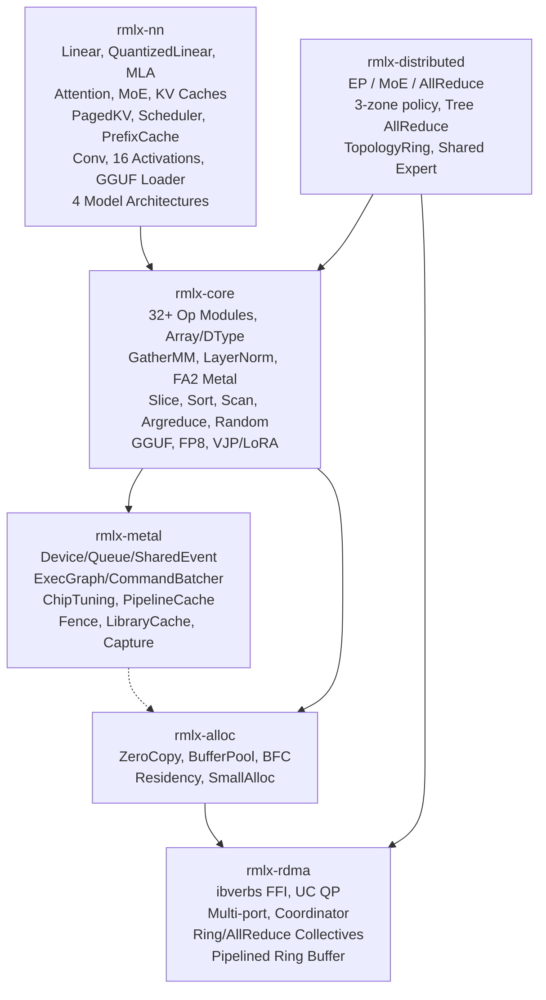

# RMLX

**Rust ML runtime for Apple Silicon -- zero-copy GPU inference with 77x decode speedup (5.1% gap to MLX)**

[](https://github.com/0xDaizz/RMLX/actions/workflows/ci.yml)
[](LICENSE)
[](https://www.rust-lang.org/)
[]()
[]()

> 한국어 문서: [docs/README_ko.md](docs/README_ko.md)

---

RMLX reimplements the core Metal GPU compute pipeline of Apple's [MLX](https://github.com/ml-explore/mlx) framework **entirely in Rust**. Phase KO optimizes the decode path to just 9 dispatches across 4 encoders, achieving **1,411us per layer (77x speedup)** from the 109,215us baseline -- only **5.1% behind MLX's compiled forward** (1,342us). Key techniques: merged QKV/gate\_up weight projections, batched SDPA decode with slab KV cache, single-encoder dispatch with memory barriers, and BM=8 GEMV with dynamic tile selection. A full-crate audit (Phases 0-2) resolved 76 remediation items across all 6 crates. Phases 3-6 added serving infrastructure, BFC allocator, ChipTuning, 5 new core ops, 16 activations, MLA/SlidingWindow, AWQ/GPTQ/K-quant, prefix cache, chunked prefill, 4 model architectures, tree allreduce, and topology-aware CLI.

## ✨ Why RMLX?

| Feature | RMLX | MLX | CUDA |
|---------|:----:|:---:|:----:|
| Unified Memory (zero-copy) | ✅ | ✅ | ❌ |
| Expert Parallelism (EP) | ✅ (3-zone auto) | ❌ | ⚠️ DeepSpeed |
| Zero-copy RDMA | ✅ | ❌ | ❌ |
| MTLSharedEvent sync | ✅ | ❌ | ➖ |
| ExecGraph CB batching | ✅ | ❌ | ⚠️ CUDA Graphs |
| Single Rust binary | ✅ | ❌ | ❌ |
| Flash Attention 2 | ✅ | ✅ | ✅ |
| GatherMM | ✅ | ✅ | ✅ |
| QuantizedLinear | ✅ | ✅ | ✅ |
| MLA (Multi-Latent Attention) | ✅ | ❌ | ⚠️ |
| Sliding Window Attention | ✅ | ✅ | ✅ |
| GGUF Model Loading | ✅ | ✅ | ✅ |
| 9-dispatch decode (77×) | ✅ | ➖ lazy eval | ➖ |

## 🎯 Benchmark Results

Measured on Apple Silicon, single transformer layer:

| Path | Latency | Speedup |
|------|---------|---------|
| Baseline (per-op sync) | 109,215 us | 1x |
| ExecGraph (5 CB) | 2,735 us | 40x |
| Single-CB (44 enc) | 2,049 us | 53x |
| 9-Dispatch (4 enc) | 1,411 us | **77x** |
| MLX compiled | 1,342 us | — |
| Gap to MLX | 69 us | **5.1%** |

## 🛠️ Feature Matrix

### Implemented (76 audit items resolved)

**Compute Ops (32+ op modules)**
- **Core ops** -- matmul, softmax, rms\_norm, rope, gemv, quantized GEMM, binary, reduce, copy, indexing
- **Attention** -- SDPA/Flash Attention 2 (D≤256, decode fast path, causal mask, bf16), FlashAttention-2 Metal kernel (tiled online softmax, f32 head_dim=128), SDPA backward
- **Activations** -- SiLU, SwiGLU, GELU (approx + fast), unary ops (exp, log, sqrt, abs, neg, tanh, sigmoid, erf, ceil, floor, round, sign, reciprocal)
- **Normalization** -- RMS norm, LayerNorm (with affine parameters)
- **Quantization** -- quantized GEMM (Q4/Q8), FP8 dequant/quant (E4M3/E5M2), AWQ/GPTQ INT4 unpacking
- **Matrix ops** -- GatherMM (batched gather-matmul), concat, select (index select)
- **Convolution** -- Conv1d/Conv2d with padding, stride, dilation, groups; tiled convolution
- **Slice/Sort/Scan** -- multi-dim slice (up to 8D), bitonic sort/argsort (up to 2048 elements), parallel prefix scan (cumsum/cumprod)
- **Argreduce** -- argmin/argmax reduction along any axis with SIMD reductions
- **Random** -- Philox 4x32-10 PRNG: uniform() and normal() with deterministic seeding
- **Autodiff** -- VJP GPU-accelerated backward pass

**Neural Network Layers**
- **Linear** -- standard + QuantizedLinear (4-bit/8-bit with group quantization)
- **Attention** -- Multi-Head, GQA, MLA (Multi-Latent Attention for DeepSeek-V3)
- **Normalization** -- LayerNorm layer wrapper
- **Activations** -- SiLU, GELU, SwiGLU, Mish, QuickGELU, ReLU, LeakyReLU, ELU, SELU, Swish, HardSwish, HardSigmoid, Softplus, Softsign, GLU (16 activations)
- **MoE** -- Expert Parallelism with shared expert support, EP integration, GPU routing, ExpertGroup (grouped GEMM), MoePipeline (TBO/SBO overlap)
- **Sliding Window Attention** -- configurable window size for efficient long-context inference
- **KV cache** -- static, rotating (circular buffer), batch (per-sequence), quantized (q4/q8 compressed), paged (vLLM-style block manager with copy-on-write)
- **Convolution** -- Conv1d/Conv2d neural network layer wrappers
- **GGUF loading** -- end-to-end model loading from GGUF files with tensor mapping, K-quant type mapping (Q2K-Q6K)
- **AWQ/GPTQ/K-quant** -- AwqLinear (INT4 row-major), GptqLinear (INT4 column-major), KQuantType/KQuantConfig
- **Prefix cache** -- radix-tree prefix cache for KV block reuse with LRU eviction
- **Chunked prefill** -- max\_prefill\_chunk config, interleaved decode during long prefills

**Infrastructure**
- **ExecGraph pipeline** -- command buffer batching with 92.3% CB reduction
- **9-dispatch decode path** -- merged weight projections, batched SDPA decode with slab KV cache, single-encoder + memory barriers (4 encoders for 9 dispatches), BM=8 GEMV with dynamic tile selection
- **FP8 support** -- Float8E4M3 / Float8E5M2 dtypes with dequant/quant kernels
- **GGUF format** -- binary parser for llama.cpp GGUF v2/v3 model files
- **4 full model architectures** -- LlamaModel, Qwen2Model, DeepSeekV3Model (MLA+MoE), MixtralModel (SlidingWindow+MoE)
- **Expert Parallelism** -- EP dispatch/combine with 3-zone auto backend (CPU/Metal/RDMA), 7 MoE Metal kernels, SparseGuard overflow monitoring, 6-phase EP optimization (GPU top-k routing, grouped expert GEMM, v3 protocol, TBO/SBO overlap, FP8 wire, ICB sparse + slab ring)
- **Continuous batching** -- memory-aware scheduler with prefill/decode phases, request queue
- **Dynamic shapes** -- max-size pre-allocation with variable dispatch
- **MTLSharedEvent** -- non-blocking GPU-CPU synchronization
- **Metal infrastructure** -- fence manager, library cache, MSL version detection, autorelease pool, capture manager, managed buffers
- **RDMA framework** -- ibverbs FFI, UC QP, multi-port Thunderbolt 5, ring/allreduce/allgather collectives (f16/bf16/f32), connection manager, coordinator, pipelined ring buffer (N-slot overlapping send/recv/reduce)
- **Zero-copy allocator** -- `posix_memalign` + `newBufferWithBytesNoCopy` + `ibv_reg_mr`, residency management, small allocation fast-path, BFC allocator (block splitting + coalescing)
- **ChipTuning** -- per-generation GPU tuning for M1/M2/M3/M4 Apple Silicon
- **DiskPipelineCache** -- sha2-hashed persistent pipeline binary cache at `~/.cache/rmlx/pipelines/`
- **Fused RMSNorm** -- fused `rms_norm_residual_add` kernel combining residual add + RMSNorm in single dispatch
- **Tree allreduce** -- binary tree allreduce (O(log N) rounds), auto selection (tree <1MB / ring >=1MB), TopologyRing (greedy nearest-unvisited from hop matrix)
- **Topology-aware CLI** -- TB5/TB4 discovery via system\_profiler, `--backend auto` default, topology-aware backend selection (RDMA > TB5 > TB4 > TCP)
- **Dual queue pipeline** -- separate compute and transfer command queues
- **VJP / LoRA** -- autodiff and parameter-efficient fine-tuning primitives

## 🏗️ Architecture



## 🚀 Quick Start

```bash
# Clone
git clone https://github.com/0xDaizz/RMLX.git
cd rmlx

# Build the entire workspace
cargo build --workspace

# Run all tests (1298)
cargo test --workspace

# Format and lint check
cargo fmt --all --check
cargo clippy --workspace -- -D warnings
```

> Requires macOS 14+ on Apple Silicon. See [Prerequisites](docs/getting-started/prerequisites.md) for details.

Distributed 2-node RDMA runbook (minimal):

```bash
# cargo install --path crates/rmlx-cli   (one-time)
rmlx config --hosts node1,node2 --backend rdma --over thunderbolt --output rmlx-hosts.json --verbose
rmlx launch --backend rdma --hostfile rmlx-hosts.json -- ibv_devices
```

## 📁 Project Structure

```
rmlx/                           # 7 crates, 1298 tests
├── crates/
│   ├── rmlx-metal/             # Metal GPU abstraction (ExecGraph, CommandBatcher, Fence, Capture)
│   ├── rmlx-alloc/             # Zero-copy memory allocator (Residency, SmallAlloc)
│   ├── rmlx-rdma/              # RDMA communication (ibverbs FFI, Coordinator, Collectives, Pipelined Ring)
│   ├── rmlx-core/              # Compute engine (32+ op modules, formats, graph, autodiff)
│   ├── rmlx-distributed/       # Distributed primitives (EP, MoE, Tree AllReduce, TopologyRing)
│   ├── rmlx-nn/                # Neural network layers (4 models, MoE, MLA, 16 activations, PrefixCache, GGUF)
│   └── rmlx-cli/               # Native CLI tooling (rmlx launch, rmlx config, topology discovery, auto backend)
├── shaders/                    # Metal shader sources
├── tests/                      # Integration tests
├── benches/                    # Criterion benchmarks
└── examples/                   # Usage examples
```

## 📊 Stats

| Metric | Value |
|--------|-------|
| Crates | 7 |
| Tests | 1,298 |
| Op modules | 32+ |
| NN activations | 16 |
| Model architectures | 4 (LlamaModel, Qwen2Model, DeepSeekV3Model, MixtralModel) |
| Implementation phases | 9 + S1-S5 + EP-1~EP-6 + Phase 3 (P3-1~P3-8) + Phase 4 (P4-1~P4-12) + Phase 5 + Phase KO |
| Audit items resolved | 76 (Phase 0 + 1 + 2 full-crate audit) |

## 📚 Documentation

Full documentation: **[docs/README.md](docs/README.md)**

- [Architecture Overview](docs/architecture/overview.md)
- [Crate Structure](docs/architecture/crate-structure.md)
- [Design Decisions](docs/architecture/design-decisions.md)
- [Getting Started](docs/getting-started/prerequisites.md)
- [Implementation Roadmap](docs/roadmap/phases.md)
- [GPU Pipeline & ExecGraph](docs/gpu-pipeline.md)
- [RMLX vs MLX vs CUDA Comparison](docs/comparison.md)

## 📄 License

Licensed under the MIT license: [LICENSE](LICENSE) (<http://opensource.org/licenses/MIT>).
