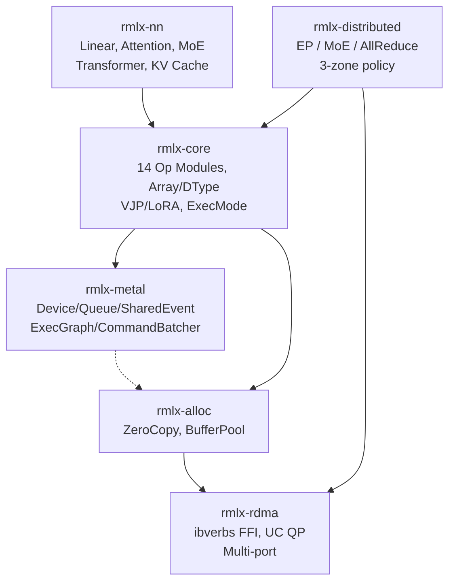

# RMLX

**Rust ML runtime for Apple Silicon -- zero-copy GPU inference with 16.15x CPU-minimal speedup**

[](https://github.com/0xDaizz/RMLX/actions/workflows/ci.yml)
[](LICENSE)
[](https://www.rust-lang.org/)
[]()
[]()

> 한국어 문서: [docs/README_ko.md](docs/README_ko.md)

---

RMLX reimplements the core Metal GPU compute pipeline of Apple's [MLX](https://github.com/ml-explore/mlx) framework **entirely in Rust**. The ExecGraph pipeline batches 65 command buffers down to 5 per transformer layer, achieving a **16.15x speedup** (110.4ms to 6.8ms) with full numerical parity (max\_diff=6.4e-6).

## ✨ Why RMLX?

| Feature | RMLX | MLX | CUDA |
|---------|:----:|:---:|:----:|
| Unified Memory (zero-copy) | yes | yes | no |
| Zero-copy RDMA | yes | no | no |
| MTLSharedEvent sync | yes | no | n/a |
| ExecGraph CB batching | yes | no | CUDA Graphs |
| Single Rust binary | yes | no | no |
| Flash Attention | planned | yes | yes |

## 🎯 Benchmark Results

Measured on Apple Silicon, single transformer layer, Phase 9B-opt complete:

| Metric | Baseline | ExecGraph | Improvement |
|--------|----------|-----------|-------------|
| Latency / layer | 110.4 ms | 6.8 ms | **16.15x** speedup |
| Command buffers / layer | 65 | 5 | 92.3% reduction |
| CPU-GPU syncs | ~65 | ~1 | 98.5% reduction |
| Numerical parity | -- | -- | max\_diff=6.4e-6 |

## 🛠️ Feature Matrix

### Implemented

- **14 op modules** -- matmul, softmax, rms\_norm, rope, gemv, quantized, binary, reduce, copy, indexing, sdpa, silu, swiglu, embedding
- **ExecGraph pipeline** -- command buffer batching with 92.3% CB reduction
- **SDPA (Scaled Dot-Product Attention)** -- fused kernel, not full Flash Attention 2
- **SiLU / SwiGLU** -- fused activations
- **KV cache** -- static pre-allocated cache
- **4 model architectures** -- LLaMA, Qwen, DeepSeek-V3, Mixtral
- **MTLSharedEvent** -- non-blocking GPU-CPU synchronization
- **RDMA framework** -- ibverbs FFI, UC QP, multi-port Thunderbolt 5
- **Zero-copy allocator** -- `posix_memalign` + `newBufferWithBytesNoCopy` + `ibv_reg_mr`
- **Dual queue pipeline** -- separate compute and transfer command queues
- **VJP / LoRA** -- autodiff and parameter-efficient fine-tuning primitives

### Planned

- Flash Attention 2
- Advanced Quantization (AWQ, GPTQ)
- Python API

## 🏗️ Architecture



## 🚀 Quick Start

```bash
# Clone
git clone https://github.com/0xDaizz/RMLX.git
cd rmlx

# Build the entire workspace
cargo build --workspace

# Run all tests (339+)
cargo test --workspace

# Format and lint check
cargo fmt --all --check
cargo clippy --workspace -- -D warnings
```

> Requires macOS 14+ on Apple Silicon. See [Prerequisites](docs/getting-started/prerequisites.md) for details.

## 📁 Project Structure

```
rmlx/                           # 6 crates, 339+ tests
├── crates/
│   ├── rmlx-metal/             # Metal GPU abstraction (ExecGraph, CommandBatcher)
│   ├── rmlx-alloc/             # Zero-copy memory allocator
│   ├── rmlx-rdma/              # RDMA communication (ibverbs FFI)
│   ├── rmlx-core/              # Compute engine (14 op modules, graph, autodiff)
│   ├── rmlx-distributed/       # Distributed primitives (EP, MoE)
│   └── rmlx-nn/                # Neural network layers (Transformer, MoE)
├── shaders/                    # Metal shader sources
├── tests/                      # Integration tests
├── benches/                    # Criterion benchmarks
└── examples/                   # Usage examples
```

## 📊 Stats

| Metric | Value |
|--------|-------|
| Crates | 6 |
| Tests | 339+ |
| Op modules | 14 |
| Model architectures | 4 (LLaMA, Qwen, DeepSeek-V3, Mixtral) |
| Implementation phases | 9 (Phase 0 -- 9B-opt complete) |

## ⚠️ Current Limitations

- **No Flash Attention** -- fused SDPA exists but not full Flash Attention 2
- **Single-node only** -- RDMA framework exists but multi-node inference is not yet integrated
- **No Python API** -- Rust-only interface
- **TB5 bandwidth** -- limited to 16 GB/s vs NVLink 600 GB/s

## 📚 Documentation

Full documentation: **[docs/README.md](docs/README.md)**

- [Architecture Overview](docs/architecture/overview.md)
- [Crate Structure](docs/architecture/crate-structure.md)
- [Design Decisions](docs/architecture/design-decisions.md)
- [Getting Started](docs/getting-started/prerequisites.md)
- [Implementation Roadmap](docs/roadmap/phases.md)
- [GPU Pipeline & ExecGraph](docs/gpu-pipeline.md)
- [RMLX vs MLX vs CUDA Comparison](docs/comparison.md)

## 📄 License

Licensed under either of:

- Apache License, Version 2.0 ([LICENSE-APACHE](LICENSE-APACHE) or <http://www.apache.org/licenses/LICENSE-2.0>)
- MIT license ([LICENSE-MIT](LICENSE-MIT) or <http://opensource.org/licenses/MIT>)

at your option.
