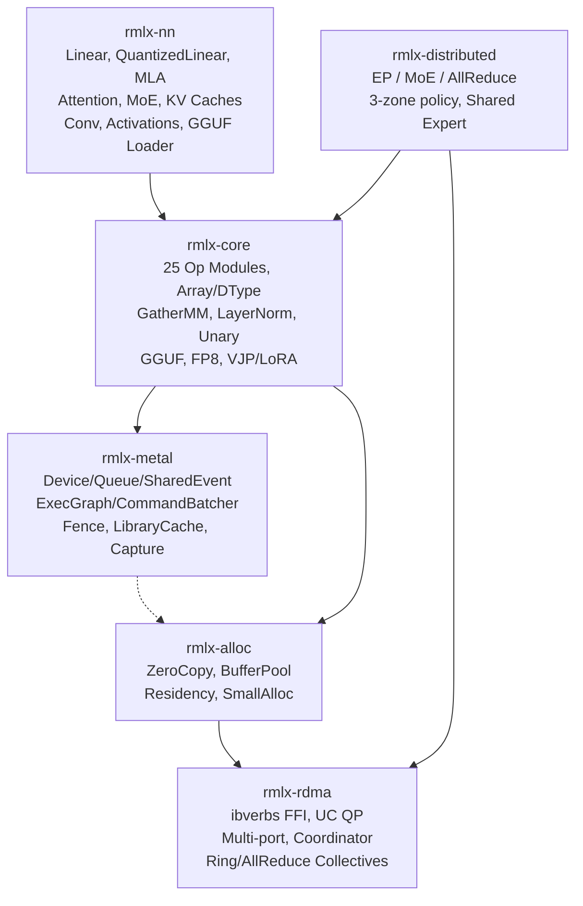

# RMLX

**Rust ML runtime for Apple Silicon -- zero-copy GPU inference with 17.4x CPU-minimal speedup**

[](https://github.com/0xDaizz/RMLX/actions/workflows/ci.yml)
[](LICENSE)
[](https://www.rust-lang.org/)
[]()
[]()

> 한국어 문서: [docs/README_ko.md](docs/README_ko.md)

---

RMLX reimplements the core Metal GPU compute pipeline of Apple's [MLX](https://github.com/ml-explore/mlx) framework **entirely in Rust**. The ExecGraph pipeline batches 65 command buffers down to 5 per transformer layer, achieving a **17.4x speedup** (~112ms to ~6.4ms) with full numerical parity (max\_diff=6.4e-6). A full-crate audit (Phases 0, 1, 2) has been completed with 76 remediation items resolved across all 6 crates.

## ✨ Why RMLX?

| Feature | RMLX | MLX | CUDA |
|---------|:----:|:---:|:----:|
| Unified Memory (zero-copy) | yes | yes | no |
| Expert Parallelism (EP) | yes (3-zone auto) | no | DeepSpeed-MoE |
| Zero-copy RDMA | yes | no | no |
| MTLSharedEvent sync | yes | no | n/a |
| ExecGraph CB batching | yes | no | CUDA Graphs |
| Single Rust binary | yes | no | no |
| Flash Attention 2 | yes | yes | yes |
| GatherMM | yes | yes | yes |
| LayerNorm | yes | yes | yes |
| QuantizedLinear | yes | yes | yes |
| MLA (Multi-Latent Attention) | yes | no | partial |
| Sliding Window Attention | yes | yes | yes |
| GGUF Model Loading | yes | yes | yes |

## 🎯 Benchmark Results

Measured on Apple Silicon, single transformer layer, Phase 9B-opt complete:

| Metric | Baseline | ExecGraph | Improvement |
|--------|----------|-----------|-------------|
| Latency / layer | ~112 ms | ~6.4 ms | **17.4x** speedup |
| Command buffers / layer | 65 | 5 | 92.3% reduction |
| CPU-GPU syncs | ~65 | ~1 | 98.5% reduction |
| Numerical parity | -- | -- | max\_diff=6.4e-6 |

## 🛠️ Feature Matrix

### Implemented (76 audit items resolved)

**Compute Ops (25 op modules)**
- **Core ops** -- matmul, softmax, rms\_norm, rope, gemv, quantized GEMM, binary, reduce, copy, indexing
- **Attention** -- SDPA/Flash Attention 2 (D≤256, decode fast path, causal mask, bf16), SDPA backward
- **Activations** -- SiLU, SwiGLU, GELU (approx + fast), unary ops (exp, log, sqrt, abs, neg, tanh, sigmoid, erf, ceil, floor, round, sign, reciprocal)
- **Normalization** -- RMS norm, LayerNorm (with affine parameters)
- **Quantization** -- quantized GEMM (Q4/Q8), FP8 dequant/quant (E4M3/E5M2), AWQ/GPTQ INT4 unpacking
- **Matrix ops** -- GatherMM (batched gather-matmul), concat, select (index select)
- **Convolution** -- Conv1d/Conv2d with padding, stride, dilation, groups; tiled convolution
- **Autodiff** -- VJP GPU-accelerated backward pass

**Neural Network Layers**
- **Linear** -- standard + QuantizedLinear (4-bit/8-bit with group quantization)
- **Attention** -- Multi-Head, GQA, MLA (Multi-Latent Attention for DeepSeek-V3)
- **Normalization** -- LayerNorm layer wrapper
- **Activations** -- SiLU, GELU, SwiGLU, Mish, QuickGELU, ReLU, LeakyReLU, ELU, SELU, Swish, HardSwish, HardSigmoid, Softplus, Softsign (14 activations)
- **MoE** -- Expert Parallelism with shared expert support, EP integration, GPU routing
- **Sliding Window Attention** -- configurable window size for efficient long-context inference
- **KV cache** -- static, rotating (circular buffer), batch (per-sequence), quantized (q4/q8 compressed)
- **Convolution** -- Conv1d/Conv2d neural network layer wrappers
- **GGUF loading** -- end-to-end model loading from GGUF files with tensor mapping

**Infrastructure**
- **ExecGraph pipeline** -- command buffer batching with 92.3% CB reduction
- **FP8 support** -- Float8E4M3 / Float8E5M2 dtypes with dequant/quant kernels
- **GGUF format** -- binary parser for llama.cpp GGUF v2/v3 model files
- **4 model architectures** -- LLaMA, Qwen, DeepSeek-V3, Mixtral
- **Expert Parallelism** -- EP dispatch/combine with 3-zone auto backend (CPU/Metal/RDMA), 7 MoE Metal kernels, SparseGuard overflow monitoring
- **Dynamic shapes** -- max-size pre-allocation with variable dispatch
- **MTLSharedEvent** -- non-blocking GPU-CPU synchronization
- **Metal infrastructure** -- fence manager, library cache, MSL version detection, autorelease pool, capture manager, managed buffers
- **RDMA framework** -- ibverbs FFI, UC QP, multi-port Thunderbolt 5, ring/allreduce/allgather collectives, connection manager, coordinator
- **Zero-copy allocator** -- `posix_memalign` + `newBufferWithBytesNoCopy` + `ibv_reg_mr`, residency management, small allocation fast-path
- **Dual queue pipeline** -- separate compute and transfer command queues
- **VJP / LoRA** -- autodiff and parameter-efficient fine-tuning primitives

## 🏗️ Architecture



## 🚀 Quick Start

```bash
# Clone
git clone https://github.com/0xDaizz/RMLX.git
cd rmlx

# Build the entire workspace
cargo build --workspace

# Run all tests (543)
cargo test --workspace

# Format and lint check
cargo fmt --all --check
cargo clippy --workspace -- -D warnings
```

> Requires macOS 14+ on Apple Silicon. See [Prerequisites](docs/getting-started/prerequisites.md) for details.

Distributed 2-node RDMA runbook (minimal):

```bash
# cargo install --path crates/rmlx-cli   (one-time)
rmlx config --hosts node1,node2 --backend rdma --over thunderbolt --output rmlx-hosts.json --verbose
rmlx launch --backend rdma --hostfile rmlx-hosts.json -- ibv_devices
```

## 📁 Project Structure

```
rmlx/                           # 7 crates, 543 tests
├── crates/
│   ├── rmlx-metal/             # Metal GPU abstraction (ExecGraph, CommandBatcher, Fence, Capture)
│   ├── rmlx-alloc/             # Zero-copy memory allocator (Residency, SmallAlloc)
│   ├── rmlx-rdma/              # RDMA communication (ibverbs FFI, Coordinator, Collectives)
│   ├── rmlx-core/              # Compute engine (25 op modules, formats, graph, autodiff)
│   ├── rmlx-distributed/       # Distributed primitives (EP, MoE, Shared Expert)
│   ├── rmlx-nn/                # Neural network layers (Transformer, MoE, MLA, QuantizedLinear, GGUF)
│   └── rmlx-cli/               # Native CLI tooling (rmlx launch, rmlx config)
├── shaders/                    # Metal shader sources
├── tests/                      # Integration tests
├── benches/                    # Criterion benchmarks
└── examples/                   # Usage examples
```

## 📊 Stats

| Metric | Value |
|--------|-------|
| Crates | 7 |
| Tests | 543 |
| Op modules | 25 |
| NN activations | 14 |
| Model architectures | 4 (LLaMA, Qwen, DeepSeek-V3, Mixtral) |
| Implementation phases | 9 + S1-S5 (serving support) |
| Audit items resolved | 76 (Phase 0 + 1 + 2 full-crate audit) |

## 📚 Documentation

Full documentation: **[docs/README.md](docs/README.md)**

- [Architecture Overview](docs/architecture/overview.md)
- [Crate Structure](docs/architecture/crate-structure.md)
- [Design Decisions](docs/architecture/design-decisions.md)
- [Getting Started](docs/getting-started/prerequisites.md)
- [Implementation Roadmap](docs/roadmap/phases.md)
- [GPU Pipeline & ExecGraph](docs/gpu-pipeline.md)
- [RMLX vs MLX vs CUDA Comparison](docs/comparison.md)

## 📄 License

Licensed under the MIT license: [LICENSE](LICENSE) (<http://opensource.org/licenses/MIT>).
