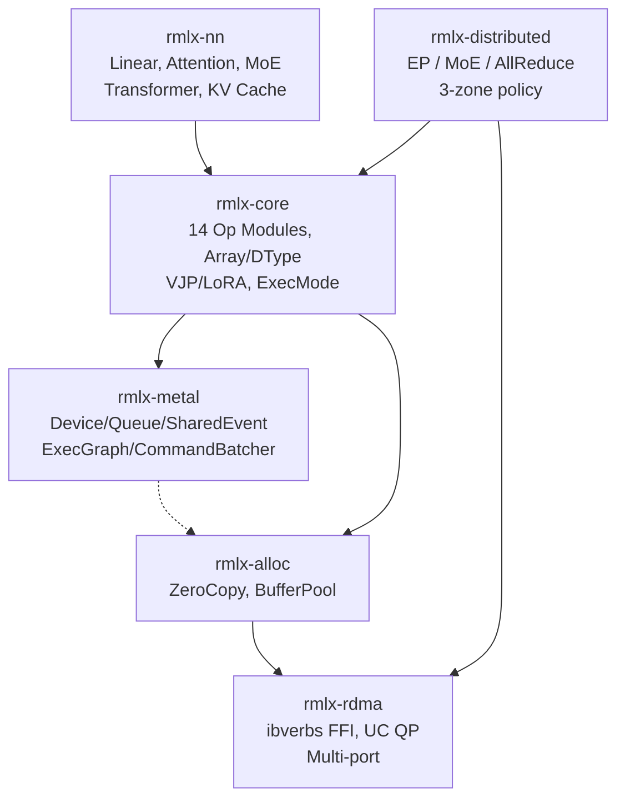

# RMLX

**Rust ML runtime for Apple Silicon UMA -- zero-copy distributed inference over TB5 RDMA**

[](LICENSE)
[](https://www.rust-lang.org/)
[]()
[]()

> 한국어 문서: [docs/README_ko.md](docs/README_ko.md)

---

RMLX reimplements the core Metal GPU compute pipeline of Apple's [MLX](https://github.com/ml-explore/mlx) framework **entirely in Rust**. The ExecGraph pipeline batches 65 command buffers down to 5 per transformer layer, achieving a **16.15x speedup** (110.4ms to 6.8ms) with full numerical parity (max\_diff=6.4e-6).

## Key Features

- **Zero-copy RDMA data path** -- `posix_memalign` + `newBufferWithBytesNoCopy` + `ibv_reg_mr` share a single physical address across CPU, Metal GPU, and RDMA, eliminating all memcpy from the hot path
- **MTLSharedEvent synchronization** -- Non-blocking signal/wait replaces `waitUntilCompleted`, achieving 1.61x sync latency improvement (263.9 us vs. 424.9 us)
- **Dual queue pipeline** -- Separate compute and transfer `MTLCommandQueue`s overlap GPU kernels with RDMA transfers at the hardware level
- **Eager-first execution** -- Eliminates lazy evaluation graph-build overhead for single-token decode; selective tracing applied for batch prefill
- **Unified buffer pool** -- Pre-allocated Metal + ibv_mr dual-registered buffers remove runtime registration overhead

## Performance Target

Measured on Apple Silicon, single transformer layer, Phase 9B-opt complete:

| Metric | Baseline | ExecGraph | Improvement |
|--------|----------|-----------|-------------|
| Latency / layer | 110.4 ms | 6.8 ms | **16.15x** speedup |
| Command buffers / layer | 65 | 5 | 92.3% reduction |
| CPU-GPU syncs | ~65 | ~1 | 98.5% reduction |
| Numerical parity | -- | -- | max\_diff=6.4e-6 |

## 🛠️ Feature Matrix

### Implemented

- **14 op modules** -- matmul, softmax, rms\_norm, rope, gemv, quantized, binary, reduce, copy, indexing, sdpa, silu, swiglu, embedding
- **ExecGraph pipeline** -- command buffer batching with 92.3% CB reduction
- **SDPA (Scaled Dot-Product Attention)** -- fused kernel, not full Flash Attention 2
- **SiLU / SwiGLU** -- fused activations
- **KV cache** -- static pre-allocated cache
- **4 model architectures** -- LLaMA, Qwen, DeepSeek-V3, Mixtral
- **MTLSharedEvent** -- non-blocking GPU-CPU synchronization
- **RDMA framework** -- ibverbs FFI, UC QP, multi-port Thunderbolt 5
- **Zero-copy allocator** -- `posix_memalign` + `newBufferWithBytesNoCopy` + `ibv_reg_mr`
- **Dual queue pipeline** -- separate compute and transfer command queues
- **VJP / LoRA** -- autodiff and parameter-efficient fine-tuning primitives

### Planned

- Flash Attention 2
- Paged KV Cache / dynamic cache management
- Speculative Decoding
- Continuous Batching
- Advanced Quantization (AWQ, GPTQ)
- Python API

## 🏗️ Architecture



## Tech Stack

| Component | Technology |
|-----------|-----------|
| Language | Rust 1.80+ (edition 2021) |
| GPU | metal-rs 0.31 (Apple Metal API) |
| RDMA | ibverbs FFI (Thunderbolt 5 UC QP) |
| Hardware | Apple Silicon UMA (M3/M4 Ultra, 80-core GPU, 512GB) |

## Architecture

```
           ┌──────────────┐ ┌─────────────┐ ┌─────────────────┐
           │   rmlx-nn    │ │  rmlx-core  │ │ rmlx-distributed│
           │  Transformer │ │  Op registry│ │  EP / MoE /     │
           │  KV cache    │ │  Array/DType│ │  AllReduce      │
           │  LLaMA/Qwen/ │ │  VJP/LoRA   │ │  3-zone policy  │
           │  DeepSeek/   │ │  10 kernels │ │  pipeline       │
           │  Mixtral     │ │             │ │                 │
           └──────┬───────┘ └──────┬──────┘ └───────┬─────────┘
                  │                │                 │
                  └────────┬───────┘                 │
                           ▼                         │
                    ┌─────────────┐                  │
                    │ rmlx-metal  │                  │
                    │ Device/Queue│                  │
                    │ SharedEvent │                  │
                    │ Dual-queue  │                  │
                    └──────┬──────┘                  │
                           │                         │
                    ┌──────┴──────┐                  │
                    │ rmlx-alloc  │◄─────────────────┘
                    │ ZeroCopy    │
                    │ BufferPool  │
                    └──────┬──────┘
                           │
                    ┌──────┴──────┐
                    │  rmlx-rdma  │
                    │ ibverbs FFI │
                    │ UC QP / CQ  │
                    │ Multi-port  │
                    └─────────────┘
```

## Quick Start

```bash
# Clone
git clone https://github.com/user/rmlx.git
cd rmlx

# Build the entire workspace
cargo build --workspace

# Run all tests
cargo test --workspace

# Format and lint check
cargo fmt --all --check
cargo clippy --workspace -- -D warnings
```

> Requires macOS 14+ on Apple Silicon. See [Prerequisites](docs/getting-started/prerequisites.md) for details.

## Project Structure

```
rmlx/                           # 6 crates, 339 tests
├── crates/
│   ├── rmlx-metal/             # Metal GPU abstraction (metal-rs 0.31)
│   ├── rmlx-alloc/             # Zero-copy memory allocator
│   ├── rmlx-rdma/              # RDMA communication (ibverbs FFI)
│   ├── rmlx-core/              # Compute engine (ops, graph, autodiff)
│   ├── rmlx-distributed/       # Distributed primitives (EP, MoE)
│   └── rmlx-nn/                # Neural network layers (Transformer, MoE)
├── shaders/                    # Metal shader sources
├── tests/                      # Integration tests
├── benches/                    # Criterion benchmarks
└── examples/                   # Usage examples
```

This repository contains the **framework only**. The serving layer (`rmlx-serve`) is in a [separate repository](https://github.com/rmlx-serve).

## Stats

| Metric | Value |
|--------|-------|
| Crates | 6 |
| Tests | 339 |
| Metal kernels | 10 (matmul, softmax, rms_norm, rope, gemv, quantized, binary, reduce, copy, indexing) |
| Model architectures | 4 (LLaMA, Qwen, DeepSeek-V3, Mixtral) |
| Implementation phases | 8 (all complete) |

## Documentation

Full documentation: **[docs/README.md](docs/README.md)**

- [Architecture Overview](docs/architecture/overview.md)
- [Crate Structure](docs/architecture/crate-structure.md)
- [Design Decisions](docs/architecture/design-decisions.md)
- [Getting Started](docs/getting-started/prerequisites.md)
- [Implementation Roadmap](docs/roadmap/phases.md)

## License

Licensed under either of:

- Apache License, Version 2.0 ([LICENSE-APACHE](LICENSE-APACHE) or <http://www.apache.org/licenses/LICENSE-2.0>)
- MIT license ([LICENSE-MIT](LICENSE-MIT) or <http://opensource.org/licenses/MIT>)

at your option.
