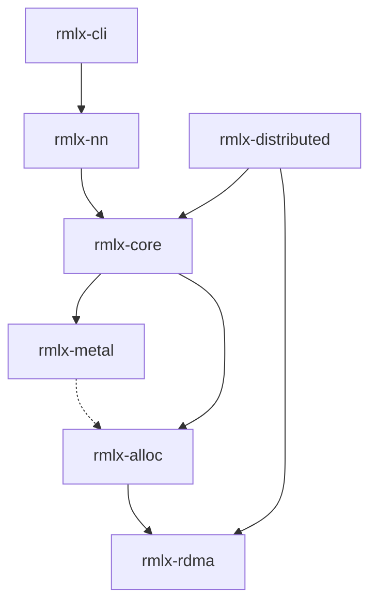

# RMLX

**Rust ML runtime for Apple Silicon — 6.34x faster than MLX at model-scale decode, prefill within 1.2-3.4x of MLX**

[](https://github.com/0xDaizz/RMLX/actions/workflows/ci.yml)
[](LICENSE)
[](https://www.rust-lang.org/)
[]()
[]()

> 한국어 문서: [docs/README_ko.md](docs/README_ko.md)

---

RMLX reimplements Apple's [MLX](https://github.com/ml-explore/mlx) Metal GPU pipeline **entirely in Rust**, built on `objc2-metal 0.3` / `objc2 0.6` / `block2 0.6` / `objc2-foundation 0.3`. The fused 7-dispatch decode path achieves **699.3 us/layer at 60-layer depth** — **6.34x faster than MLX compiled** (4,525 us/layer) on identical hardware (M3 Ultra). FP16 GEMM reaches **24.05 TFLOPS** and QMM Q4 hits **17.43 TFLOPS** (+28% vs MLX). Bandwidth efficiency sits at 73.6% — the practical floor for f16 decode on Apple Silicon.

## ⚡ Performance

Single transformer layer decode (MoE expert shapes, f16, M3 Ultra):

| Path | Latency | Speedup |
|------|--------:|--------:|
| Baseline (per-op sync) | 111,083 us | 1x |
| ExecGraph (5 CB) | 2,846 us | 39x |
| Single-CB (44 enc) | 2,143 us | 52x |
| **9-Dispatch (single layer)** | **1,081 us** | **103x** |
| **60-layer pipeline** | **751 us/L** | **6.34x vs MLX** |
| **Cached 2-encoder (60L)** | **714 us/L** | **8% faster, 6x lower σ** |
| **Fused 7-dispatch (60L)** | **699.3 us/L** | **Phase 10 best** |
| **Phase A prefill (single-layer)** | **3.5-7.3x vs baseline** | **MLX parity within 1.2-3.4x** |
| **FP16 GEMM TFLOPS** | **24.05T** | **Pipe parity** |
| **QMM Q4 M=512** | **17.43T** | **MLX 13.6T (+28%)** |
| **Fair bench M=32~256** | **1.24~2.83x** | **vs MLX** |
| MLX compiled (60L, f16) | 4,525 us/L | — |

## ✨ RMLX vs MLX vs CUDA

| Feature | RMLX | MLX | CUDA |
|---------|:----:|:---:|:----:|
| Unified memory (zero-copy) | ✅ | ✅ | ❌ |
| 9-dispatch decode (6.34x vs MLX) | ✅ | ➖ | ➖ |
| Prefill single-CB pipeline | ✅ | ➖ | ➖ |
| Expert parallelism | ✅ | ❌ | ⚠️ |
| Zero-copy RDMA | ✅ | ❌ | ❌ |
| Flash Attention 2 | ✅ | ✅ | ✅ |
| MLA (DeepSeek-V3) | ✅ | ❌ | ⚠️ |
| GGUF model loading | ✅ | ✅ | ✅ |
| Quantized inference | ✅ | ✅ | ✅ |
| Single Rust binary | ✅ | ❌ | ❌ |

## 🛠️ What's Inside

<details open>
<summary><b>32+ GPU ops</b> — matmul, softmax, RMS norm, RoPE, GEMV, SDPA, conv, scan, sort, argreduce, random, ...</summary>

- Flash Attention 2 Metal kernel (tiled online softmax, D up to 256)
- BM=8 GEMV with dynamic tile selection, SIMD group MMA matmul, barrier-free BM8, 4×float4 vectorization
- Batched SDPA decode with slab KV cache
- FP8 (E4M3/E5M2), AWQ/GPTQ INT4, K-quant (Q2K–Q6K)
- Single-pass layer norm, register-cached RMS norm
- Fused kernels: silu-mul, RMSNorm+residual, GEMV+bias, GEMM+residual epilogue
- GEMM: 24.05T TFLOPS (pipe parity), MLX-architecture kernel (BK=16, 2 SG, serpentine MMA)
- Quantized: QMM MMA Q4/Q8, QMV qdot pattern, no CPU fallback
</details>

<details open>
<summary><b>Infrastructure</b> — ExecGraph, 9-dispatch decode, RDMA, BFC allocator</summary>

- **7-dispatch fused decode**: merged QKV/gate-up weights, batched SDPA, fused_rms_gemv + fused_swiglu_down kernel fusion, 699.3 us/layer at 60L depth (6.34x faster than MLX); **CachedDecode** path with pre-resolved PSOs + zero per-token allocation
- **Phase A prefill**: single-CB pipeline (54 sync points to 1), GQA slab SDPA (32 per-head dispatches to 1), GEMM threadgroup swizzle, 3.5-7.3x speedup over baseline
- **ExecGraph**: command buffer batching (65 CB down to 5)
- **Metal**: `objc2-metal 0.3` bindings with **ComputePass** zero-cost abstraction and type alias layer, ChipTuning (M1–M4), DiskPipelineCache, fence manager, dual queues; **Metal 4** support (feature-gated `metal4`, macOS 26+)
- **Allocator**: zero-copy (posix_memalign + MTLBuffer), BFC, residency manager
- **RDMA**: ibverbs FFI, TB5 multi-port, ring/allreduce/allgather collectives
- **Distributed**: expert parallelism (3-zone auto), tree allreduce, topology-aware CLI, **DistributedTransformerModel** (TP with forward_with_group + shard_for_tp)
- **Phase F**: Dispatch overhead bench (176us/CB), DiskPipelineCache, GatherMM MMA (4-12x for MoE)
- **Phase G**: QMM MMA Q4/Q8, QMV qdot, CPU fallback removed
- **Phase H-2**: GEMM+residual epilogue fusion (5-12% for large N)
- **Phase I-1**: Distributed TP (TP=2 1.94x estimated)
- **Phase J**: QMM +73% (5.34T), QMV +37% (MLX 1.15x), ExecGraph stall removal, lazy.rs fusion, RMSNorm+GEMM fusion, Split-K QMM, MoE fused kernels
</details>

<details>
<summary><b>Neural network layers</b> — 4 model architectures, 16 activations, MoE, MLA</summary>

- **Models**: Qwen 3.5, DeepSeek-V3, Mixtral, Kimi K2.5
- **Attention**: Multi-Head, GQA, MLA, Sliding Window
- **KV cache**: static, rotating, paged (vLLM-style), quantized, slab decode
- **Quantization**: QuantizedLinear, AWQ, GPTQ, K-quant
- **Loading**: GGUF v2/v3 with tensor mapping
</details>

## 🏗️ Architecture



| Crate | Role |
|-------|------|
| **rmlx-nn** | Models, attention, MoE, KV cache, GGUF loader |
| **rmlx-core** | 32+ op modules, Array/DType, autodiff |
| **rmlx-metal** | Device, ExecGraph, ChipTuning, pipeline cache, ComputePass abstraction (`objc2-metal`), Metal 4 (feature-gated) |
| **rmlx-alloc** | Zero-copy allocator, BFC, residency |
| **rmlx-distributed** | EP, allreduce, topology |
| **rmlx-rdma** | ibverbs FFI, collectives |
| **rmlx-cli** | Launch, config, topology discovery |

## 🚀 Quick Start

```bash
git clone https://github.com/0xDaizz/RMLX.git && cd RMLX

cargo build --workspace        # Build
cargo test --workspace         # 1,298 tests
cargo bench -p rmlx-nn --bench pipeline_bench  # Benchmark
```

> Requires macOS 14+ on Apple Silicon. See [Prerequisites](docs/getting-started/prerequisites.md).

Distributed 2-node RDMA runbook (minimal):

```bash
# cargo install --path crates/rmlx-cli   (one-time)

# Auto-detect TB5 topology, assign IPs, configure interfaces, generate hostfile
rmlx config --hosts node1,node2 --auto-setup --output rmlx-hosts.json --verbose

# Launch distributed job
rmlx launch --backend rdma --hostfile rmlx-hosts.json -- ibv_devices
```

`--auto-setup` automatically discovers Thunderbolt connections via `system_profiler`, assigns point-to-point IPs, and configures RDMA interfaces — no manual `ifconfig` or hostfile editing required.

## 📊 Stats

| Metric | Value |
|--------|------:|
| Crates | 7 |
| Tests | 1,298 |
| GPU ops | 32+ |
| Activations | 16 |
| Model architectures | 4 |
| Decode latency | 699.3 us/L (60L fused 7-dispatch) |
| Prefill speedup | 3.5-7.3x vs baseline |
| Prefill vs MLX | within 1.2-3.4x |
| vs MLX (60L compiled) | 6.34x faster |

## 🗺️ Roadmap

seq_len=1 decode optimization is concluded at 699.3 us/layer (73.6% bandwidth efficiency — practical floor for f16 on Apple Silicon). GEMM throughput has reached 24.05T TFLOPS (pipe parity). QMM Q4 hits 17.43T (+28% vs MLX). Phase J closes quantized kernel gaps and adds infrastructure improvements.

| Phase | Focus | Key Result | Status |
|:-----:|-------|:----------:|:------:|
| J-1 | **QMM MMA redesign** | 3.09T -> 5.34T (+73%), MLX gap 4.78x -> 2.55x | Complete |
| J-2 | **QMV qdot optimization** | 0.26T -> 0.36T (+37%), MLX 1.15x (near parity) | Complete |
| J-3 | **ExecGraph stall removal** | 32 inter-layer stalls -> 0 | Complete |
| J-4 | **lazy.rs FusionCompiler** | FusionGraph -> Metal JIT -> ExecGraph | Complete |
| J-5 | **RMSNorm+GEMM fusion** | Function constant 203, 2-pass inv_rms | Complete |
| J-6 | **Split-K QMM** | +20% at M=128 | Complete |
| J-8 | **MoE fused kernels** | Scatter N x 3 sync -> 1 sync | In review |

> Framework = rmlx-core / rmlx-nn / rmlx-distributed kernel-level work.
> See [full roadmap](docs/roadmap/phases.md) and [benchmark report](docs/reports/phase-f-i-benchmark-2026-03-08.md) for details.

## 📚 Docs

- [Architecture Overview](docs/architecture/overview.md)
- [GPU Pipeline](docs/gpu-pipeline.md)
- [Implementation Roadmap](docs/roadmap/phases.md)
- [RMLX vs MLX vs CUDA](docs/comparison.md)
- [Getting Started](docs/getting-started/prerequisites.md)

## 📄 License

MIT — see [LICENSE](LICENSE).
