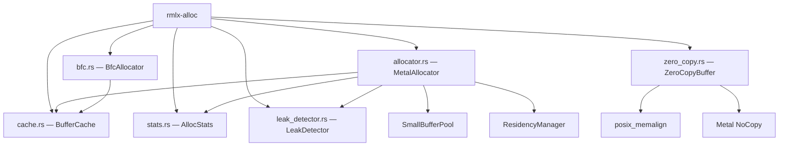
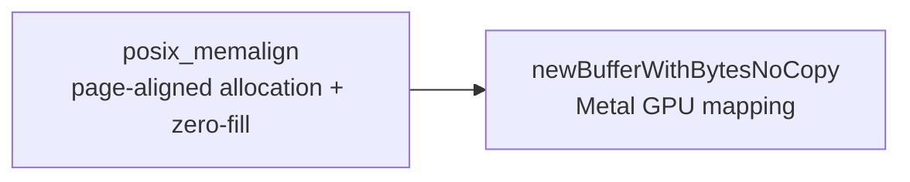
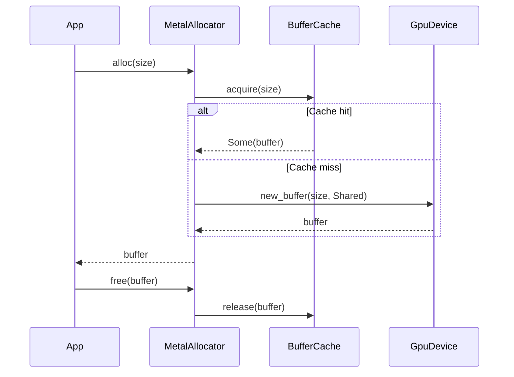

# rmlx-alloc — Memory Allocator

## Overview

`rmlx-alloc` is the crate responsible for GPU memory allocation and zero-copy buffer management. It registers page-aligned memory allocated via `posix_memalign` with Metal's `newBufferWithBytesNoCopy`, providing simultaneous CPU/GPU access to a single physical memory region. It follows the MLX MetalAllocator pattern and includes size-binned caching and allocation statistics tracking.

> **Status:** Phase 1 implementation complete + Phase 0+1+2 audit remediation (items A1-A12) + Phase 4 performance and allocator hardening (P4-1~P4-3, P4-6, P4-12). `ZeroCopyBuffer`, `MetalAllocator`, `BufferCache`, `AllocStats`, `LeakDetector`, and `SmallAllocator` are implemented. `ResidencyManager` API is present with Metal 3 runtime detection (P4-3). **Phase 4 additions:** Atomic CAS reservation loop for memory limit enforcement; pointer tracking (HashSet+Mutex) for ownership validation; stats `fetch_update` with `saturating_sub` for deallocation underflow prevention; SmallBufferPool wired into MetalAllocator for ≤256B allocations; LeakDetector wired for alloc/free tracking; HazardTrackingModeUntracked (bit 0x10) for manual hazard tracking; `BfcAllocator` — BFC-style allocator with block splitting, coalescing, and best-fit BTreeMap lookup as an alternative to MetalAllocator.

---

## Module Structure



### `allocator.rs` — `MetalAllocator`

A Metal buffer allocator following the MLX MetalAllocator pattern. Checks the cache first on allocation, falling back to direct device allocation on cache miss.

```rust
pub struct MetalAllocator {
    device: Arc<GpuDevice>,
    cache: Mutex<BufferCache>,
    stats: AllocStats,
    block_limit: AtomicUsize,           // CAS-enforced maximum total allocation (0 = unlimited)
    active_ptrs: Mutex<HashSet<usize>>, // pointer ownership tracking
    leak_detector: LeakDetector,        // wired alloc/free tracking (Phase 4)
    small_pool: SmallBufferPool,        // ≤256B fast path (Phase 4)
    residency: Option<ResidencyManager>, // Metal 3 runtime detection (Phase 4)
}
```

| Method | Description |
|--------|-------------|
| `new(device, max_cache_size)` | Creates a new allocator |
| `set_block_limit(limit)` | Sets the maximum total allocation limit (0 = unlimited) |
| `alloc(size)` | Allocates a Metal buffer (cache first, device fallback) |
| `free(buffer)` | Returns a buffer to the cache for reuse |
| `stats()` | Returns a reference to allocation statistics |
| `clear_cache()` | Clears the cache and releases all cached buffers |

**Allocation flow (Phase 4):**
1. If `size <= 256`, delegate to `SmallBufferPool` fast path
2. Atomic CAS reservation loop on `block_limit` (return `OutOfMemory` if exceeded)
3. Attempt `BufferCache::acquire(size)`
4. Cache hit -> record cache hit in stats and return
5. Cache miss -> call `device.new_buffer()` to allocate a new buffer
6. Insert pointer into `active_ptrs` HashSet for ownership validation
7. Record allocation in `LeakDetector`

**Deallocation (Phase 4):**
- Validate pointer ownership via `active_ptrs` lookup (panics on unknown pointer)
- Stats `fetch_update` with `saturating_sub` prevents underflow on concurrent deallocation

---

### `zero_copy.rs` — `ZeroCopyBuffer`

A zero-copy buffer where page-aligned memory can be simultaneously accessed by the CPU and Metal GPU.

**Allocation flow:**



1. **`posix_memalign`** — Allocates page-aligned memory in `sysconf(_SC_PAGESIZE)` units (typically 16KB on Apple Silicon) and zero-fills it
2. **`newBufferWithBytesNoCopy`** — Creates a Metal buffer accessible by the GPU without copying

```rust
pub struct ZeroCopyBuffer {
    raw_ptr: NonNull<u8>,
    metal_buffer: MetalBuffer,
    in_flight: Arc<()>,
    size: usize,
    _alignment: usize,
}
```

| Method | Description |
|--------|-------------|
| `new(device, size)` | Allocates a page-aligned zero-copy buffer |
| `metal_buffer()` | Returns a reference to the Metal buffer |
| `as_ptr()` | Returns a read-only pointer |
| `as_mut_ptr()` | Returns a writable pointer (requires `&mut self`) |
| `size()` | Returns the page-aligned buffer size |
| `acquire_in_flight()` | Acquires an `InFlightToken` to prevent deallocation during GPU/RDMA operations |
| `acquire_fence(op_tag)` | Acquires a `CompletionFence` for hardware completion verification |
| `in_flight_count()` | Returns the current in-flight reference count (including self; 1 if no external references) |

`Send` and `Sync` are manually implemented (guaranteeing thread safety for Metal `StorageModeShared` buffers on UMA-based Apple Silicon).

**Safe deallocation (Drop):**

The `ZeroCopyBuffer` `Drop` implementation waits via a `yield_now()` loop for up to 5 seconds until all in-flight tokens are released. On timeout, it intentionally leaks the memory to prevent use-after-free.

---

### In-Flight Tracking: `InFlightToken`, `CompletionFence`, `GpuCompletionHandler`

```rust
/// Arc<()>-based reference counting — prevents buffer deallocation
pub struct InFlightToken {
    _guard: Arc<()>,
}

/// ManuallyDrop-based — can only be released via release_after_verification()
pub struct CompletionFence {
    token: ManuallyDrop<InFlightToken>,
    op_tag: &'static str,
    verified: Arc<AtomicBool>,
}

/// Safely releases CompletionFence from Metal completedHandler callback
pub struct GpuCompletionHandler {
    fence: Option<CompletionFence>,
}
```

**Safety contract:**
- `CompletionFence::release_after_verification()` must only be called after the GPU command buffer has completed or `IBV_WC_SUCCESS` has been received from the CQ
- If a `CompletionFence` is dropped without verification, it intentionally leaks the `InFlightToken`, preventing `ZeroCopyBuffer::drop()` from freeing the memory (use-after-free prevention)
- `GpuCompletionHandler::on_completed()` safely releases the fence from a Metal completion callback

---

### `cache.rs` — `BufferCache`

A size-binned buffer cache following the MLX BufferCache pattern. Implemented with `BTreeMap<usize, VecDeque<MetalBuffer>>`, rounding sizes up to page boundaries.

| Method | Description |
|--------|-------------|
| `new(max_cache_size)` | Creates a new cache with the specified maximum cache size in bytes |
| `acquire(size)` | Searches the cache for a suitable buffer (exact match first, then next larger bin) |
| `release(buffer)` | Returns a buffer to the cache (evicts from the largest bin when max exceeded) |
| `cache_size()` | Returns the current cache usage in bytes |
| `clear()` | Releases all cached buffers |

**Eviction policy:** When the cache is full, eviction starts from the largest bin to reclaim as much memory as possible per eviction. Single buffers exceeding `max_cache_size` are dropped immediately without caching.

---

### `stats.rs` — `AllocStats`

A thread-safe allocation statistics tracker. All counters are `AtomicUsize`-based.

```rust
pub struct AllocStats {
    active_bytes: AtomicUsize,
    peak_bytes: AtomicUsize,
    total_allocs: AtomicUsize,
    total_frees: AtomicUsize,
    cache_hits: AtomicUsize,
    cache_misses: AtomicUsize,
}
```

| Method | Description |
|--------|-------------|
| `record_alloc(size)` | Records an allocation (peak update via `compare_exchange_weak` CAS loop) |
| `record_free(size)` | Records a deallocation |
| `record_cache_hit()` / `record_cache_miss()` | Records a cache hit/miss |
| `active()` | Returns current active bytes |
| `peak()` | Returns peak bytes |
| `total_allocs()` / `total_frees()` | Returns total allocation/deallocation counts |
| `cache_hits()` / `cache_misses()` | Returns cache hit/miss counts |

---

### `leak_detector.rs` — `LeakDetector`

An `AtomicU64`-based lock-free allocation/deallocation counter for memory leak detection. Tracks the high-water mark of allocated bytes via a CAS loop.

```rust
pub struct LeakDetector {
    alloc_count: AtomicU64,
    free_count: AtomicU64,
    alloc_bytes: AtomicU64,
    free_bytes: AtomicU64,
    high_water_mark_bytes: AtomicU64,
}
```

| Method | Description |
|--------|-------------|
| `new()` | Creates a new `LeakDetector` with all counters at 0 |
| `record_alloc(bytes)` | Records an allocation (count +1, bytes accumulated, high-water-mark CAS update) |
| `record_free(bytes)` | Records a deallocation (count +1, bytes accumulated) |
| `outstanding_allocs()` | Returns the number of unreleased allocations (`alloc_count - free_count`) |
| `outstanding_bytes()` | Returns the number of unreleased bytes (`alloc_bytes - free_bytes`) |
| `has_potential_leak()` | Heuristic leak detection: outstanding allocs > 0 **and** outstanding bytes > 1 MiB |
| `report()` | Returns a `LeakReport` snapshot of the full state |

**`LeakReport` snapshot:**

```rust
#[derive(Debug, Clone)]
pub struct LeakReport {
    pub total_allocs: u64,
    pub total_frees: u64,
    pub outstanding_allocs: u64,
    pub outstanding_bytes: u64,
    pub high_water_mark_bytes: u64,
    pub potential_leak: bool,
}
```

**High-water mark update:** On each `record_alloc()` call, the current outstanding bytes (`alloc_bytes - free_bytes`) are computed. If greater than the existing high-water mark, it is atomically updated via a `compare_exchange_weak` CAS loop.

> The `Default` trait is implemented, so `LeakDetector::default()` can also be used for creation.

---

### `bfc.rs` — `BfcAllocator` (Phase 4)

A BFC (Best-Fit with Coalescing) style allocator, providing an alternative to `MetalAllocator` for workloads that benefit from reduced fragmentation.

```rust
pub struct BfcAllocator {
    device: Arc<GpuDevice>,
    blocks: BTreeMap<usize, Block>,  // best-fit lookup by size
    allocated: HashMap<usize, Block>, // pointer -> block mapping
    stats: AllocStats,
}
```

| Method | Description |
|--------|-------------|
| `new(device)` | Creates a new BFC allocator |
| `alloc(size)` | Allocates via best-fit BTreeMap lookup; splits oversized blocks |
| `free(ptr)` | Frees a block and coalesces with adjacent free blocks |
| `stats()` | Returns allocation statistics |

**Key behaviors:**
- **Best-fit lookup**: `BTreeMap::range(size..)` finds the smallest block that satisfies the request
- **Block splitting**: If the best-fit block is significantly larger than requested, it is split and the remainder is returned to the free pool
- **Coalescing**: On free, adjacent free blocks are merged to reduce fragmentation
- Suitable for long-running inference servers where fragmentation accumulates over time

---

## Error Handling

```rust
#[derive(Debug)]
pub enum AllocError {
    PosixMemalign(i32),         // posix_memalign failed (error code)
    MetalBufferCreate,          // Metal buffer creation failed
    OutOfMemory {               // Out of memory
        requested: usize,
        available: usize,
    },
    PoolExhausted,              // Buffer pool exhausted
}
```

---

## Memory Management Flow



---

## Dependencies

```toml
[dependencies]
rmlx-metal = { path = "../rmlx-metal" }
libc = "0.2"
```
