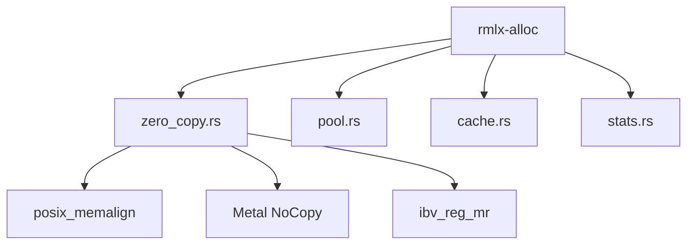
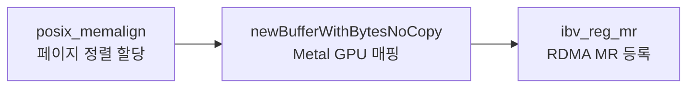
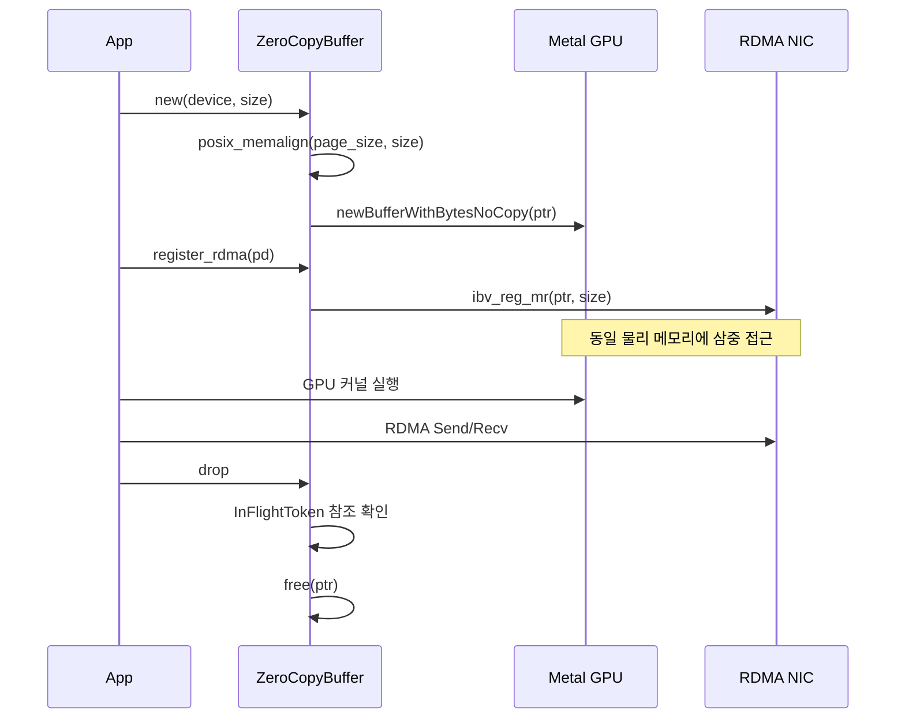

# rmlx-alloc — 메모리 할당자

## 개요

`rmlx-alloc`은 GPU 메모리 할당 및 zero-copy 버퍼 관리를 담당하는 크레이트입니다. `posix_memalign`으로 할당한 페이지 정렬 메모리에 Metal `newBufferWithBytesNoCopy`와 RDMA `ibv_reg_mr`을 동시 등록하여, 단일 물리 메모리에 대해 CPU/GPU/RDMA 삼중 접근을 제공합니다.

> **상태:** 현재 스켈레톤 상태이며, Phase 1에서 구현 예정입니다.

---

## 계획된 모듈



### `zero_copy.rs` — `ZeroCopyBuffer` *계획됨 (Phase 1)*

3단계 zero-copy 할당 패턴을 구현합니다.

**할당 흐름:**



1. **`posix_memalign`** — `vm_page_size` (일반적으로 16KB) 단위로 페이지 정렬된 메모리를 할당합니다
2. **`newBufferWithBytesNoCopy`** — 복사 없이 GPU에서 접근 가능한 Metal 버퍼를 생성합니다 (`StorageModeShared` + `HazardTrackingModeUntracked`)
3. **`ibv_reg_mr`** — 동일 물리 메모리에 RDMA Memory Region을 등록합니다 (선택적)

```rust
// 계획됨 (Phase 1)
pub struct ZeroCopyBuffer {
    /// posix_memalign으로 할당된 원본 포인터 (소유권 보유)
    raw_ptr: NonNull<u8>,
    /// Metal 버퍼 (raw_ptr를 감싸는 NoCopy 뷰)
    metal_buffer: metal::Buffer,
    /// RDMA MR (동일 raw_ptr에 대한 ibv_reg_mr, 선택적)
    rdma_mr: Option<RdmaMr>,
    /// In-flight 참조 카운터 (GPU command buffer / RDMA WR 참조 추적)
    in_flight: Arc<()>,
    /// 할당 크기
    size: usize,
    /// 페이지 정렬 크기
    alignment: usize,
}

impl ZeroCopyBuffer {
    pub fn new(device: &GpuDevice, size: usize) -> Result<Self, AllocError> { ... }
    pub fn register_rdma(&mut self, pd: &ProtectionDomain) -> Result<(), RdmaError> { ... }
    pub fn metal_buffer(&self) -> &metal::BufferRef { ... }
    pub fn as_ptr(&self) -> *const u8 { ... }
    pub fn as_mut_ptr(&self) -> *mut u8 { ... }
}
```

> **주의:** `HazardTrackingModeUntracked`를 사용하기 때문에 모든 cross-queue 접근은 `MTLSharedEvent`/`MTLFence`로 명시적 동기화가 필요합니다.

---

### `pool.rs` — `DualRegPool` *계획됨 (Phase 1)*

Metal + RDMA 이중 등록 버퍼 풀입니다. 크기별 비닝(size-binned) 캐싱으로 할당/해제 오버헤드를 최소화합니다.

**설계 목표:**
- 사전 등록된 버퍼를 풀링하여 반복적인 `posix_memalign` + Metal/RDMA 등록 비용을 제거합니다
- 크기별 빈(bin)을 사용하여 적절한 크기의 버퍼를 빠르게 검색합니다
- 사용 완료된 버퍼를 풀에 반환하여 재사용합니다

---

### `cache.rs` — 크기별 프리 리스트 캐시 *계획됨 (Phase 1)*

MLX 스타일의 크기별 프리 리스트(free list) 캐시입니다.

- 해제된 버퍼를 크기 범위별로 분류하여 캐싱합니다
- 새 할당 요청 시 캐시에서 적합한 버퍼를 먼저 검색합니다
- 메모리 압박 시 캐시를 부분적으로 비워 시스템에 반환합니다

---

### `stats.rs` — 할당 통계 *계획됨 (Phase 1)*

메모리 할당 통계 및 피크 메모리 추적을 제공합니다.

- 현재 할당량 / 피크 할당량
- 할당/해제 횟수
- 캐시 히트/미스 비율
- 디버깅 및 프로파일링 용도

---

## 핵심 개념

### `InFlightToken`

`Arc` 기반 참조 카운팅으로 GPU command buffer 또는 RDMA Work Request가 버퍼를 참조하는 동안 해제를 방지합니다.

```rust
// 계획됨 (Phase 1)
pub struct InFlightToken {
    _guard: Arc<()>,
}
```

### `CompletionFence`

하드웨어 완료 이벤트에 연결되는 펜스입니다. Metal `completionHandler` 또는 CQ 폴링을 통해서만 해제됩니다.

```rust
// 계획됨 (Phase 1)
pub struct CompletionFence {
    token: InFlightToken,
    op_tag: &'static str,
    verified: Arc<AtomicBool>,
}

impl CompletionFence {
    /// 하드웨어 완료 콜백 전용 — 직접 호출 금지.
    /// GPU command buffer completed 또는 CQ IBV_WC_SUCCESS 수신 후에만 호출합니다.
    fn release_after_verification(self) {
        self.verified.store(true, Ordering::Release);
        drop(self.token);
    }
}
```

**안전성 계약:**
- `release_after_verification`은 GPU command buffer가 completed 상태이거나 CQ에서 `IBV_WC_SUCCESS`를 수신한 후에만 호출해야 합니다
- 사용자가 임의로 호출할 수 없으며, 검증된 완료 경로(`GpuCompletionHandler`, `CqPoller`)를 통해서만 해제됩니다

---

## 메모리 관리 흐름



---

## 구현 시점

**Phase 1** — rmlx-metal 완료 후 구현을 시작합니다.

---

## 의존성

```toml
[dependencies]
rmlx-metal = { path = "../rmlx-metal" }
libc = "0.2"
```
