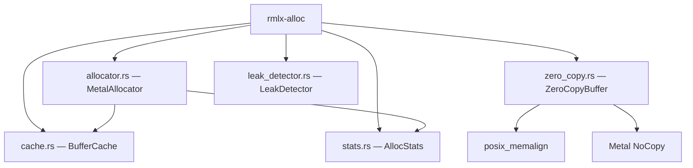
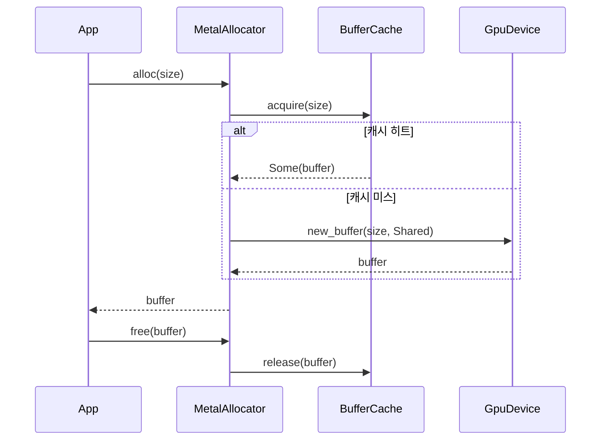

# rmlx-alloc — 메모리 할당자

## 개요

`rmlx-alloc`은 GPU 메모리 할당 및 zero-copy 버퍼 관리를 담당하는 크레이트입니다. `posix_memalign`으로 할당한 페이지 정렬 메모리에 Metal `newBufferWithBytesNoCopy`를 등록하여, 단일 물리 메모리에 대해 CPU/GPU 동시 접근을 제공합니다. MLX의 MetalAllocator 패턴을 따르며, 크기별 비닝 캐시와 할당 통계 추적 기능을 포함합니다.

> **상태:** Phase 1 구현 완료. `ZeroCopyBuffer`, `MetalAllocator`, `BufferCache`, `AllocStats`, `LeakDetector` 모두 구현되었습니다. `ResidencyManager` API는 존재하지만, Metal `MTLResidencySet` 백엔드는 `metal-rs` 바인딩 지원 전까지 문서화된 스텁입니다. `metal3` feature가 켜진 경우 현재 구현은 조용한 no-op 대신 `todo!("TODO(A6)...")`로 fail-fast 하도록 의도되어 있습니다.

---

## 모듈 구조



### `allocator.rs` — `MetalAllocator`

MLX MetalAllocator 패턴을 따르는 Metal 버퍼 할당자입니다. 할당 시 캐시를 먼저 확인하고, 캐시 미스 시 디바이스에서 직접 할당합니다.

```rust
pub struct MetalAllocator {
    device: Arc<GpuDevice>,
    cache: Mutex<BufferCache>,
    stats: AllocStats,
    block_limit: usize,           // 최대 총 할당량 (0 = 무제한)
}
```

| 메서드 | 설명 |
|--------|------|
| `new(device, max_cache_size)` | 새 할당자를 생성합니다 |
| `set_block_limit(limit)` | 최대 총 할당 제한을 설정합니다 (0 = 무제한) |
| `alloc(size)` | Metal 버퍼를 할당합니다 (캐시 우선, 디바이스 폴백) |
| `free(buffer)` | 버퍼를 캐시에 반환하여 재사용합니다 |
| `stats()` | 할당 통계 참조를 반환합니다 |
| `clear_cache()` | 캐시를 비우고 모든 캐시된 버퍼를 해제합니다 |

**할당 흐름:**
1. `block_limit` 확인 (초과 시 `OutOfMemory` 반환)
2. `BufferCache::acquire(size)` 시도
3. 캐시 히트 → 통계에 cache hit 기록 후 반환
4. 캐시 미스 → `device.new_buffer()` 호출하여 새 버퍼 할당

---

### `zero_copy.rs` — `ZeroCopyBuffer`

페이지 정렬 메모리를 CPU와 Metal GPU가 동시에 접근할 수 있는 zero-copy 버퍼입니다.

**할당 흐름:**


1. **`posix_memalign`** — `sysconf(_SC_PAGESIZE)` (일반적으로 16KB on Apple Silicon) 단위로 페이지 정렬된 메모리를 할당하고 0으로 초기화합니다
2. **`newBufferWithBytesNoCopy`** — 복사 없이 GPU에서 접근 가능한 Metal 버퍼를 생성합니다

```rust
pub struct ZeroCopyBuffer {
    raw_ptr: NonNull<u8>,
    metal_buffer: MetalBuffer,
    in_flight: Arc<()>,
    size: usize,
    _alignment: usize,
}
```

| 메서드 | 설명 |
|--------|------|
| `new(device, size)` | 페이지 정렬된 zero-copy 버퍼를 할당합니다 |
| `metal_buffer()` | Metal 버퍼 참조를 반환합니다 |
| `as_ptr()` | 읽기 전용 포인터를 반환합니다 |
| `as_mut_ptr()` | 쓰기 가능 포인터를 반환합니다 (`&mut self` 필요) |
| `size()` | 페이지 정렬된 버퍼 크기를 반환합니다 |
| `acquire_in_flight()` | GPU/RDMA 작업 중 해제를 방지하는 `InFlightToken`을 획득합니다 |
| `acquire_fence(op_tag)` | 하드웨어 완료 검증이 필요한 `CompletionFence`를 획득합니다 |
| `in_flight_count()` | 현재 in-flight 참조 수를 반환합니다 (self 포함, 외부 참조 없으면 1) |

`Send`와 `Sync`가 수동으로 구현되어 있습니다 (UMA 기반 Apple Silicon에서 Metal `StorageModeShared` 버퍼의 스레드 안전성 보장).

**안전한 해제 (Drop):**

`ZeroCopyBuffer`의 `Drop` 구현은 모든 in-flight 토큰이 해제될 때까지 최대 5초간 `yield_now()` 루프로 대기합니다. 타임아웃 시 use-after-free를 방지하기 위해 메모리를 의도적으로 leak합니다.

---

### In-Flight 추적: `InFlightToken`, `CompletionFence`, `GpuCompletionHandler`

```rust
/// Arc<()> 기반 참조 카운팅 — 버퍼 해제를 방지합니다
pub struct InFlightToken {
    _guard: Arc<()>,
}

/// ManuallyDrop 기반 — release_after_verification()으로만 해제 가능
pub struct CompletionFence {
    token: ManuallyDrop<InFlightToken>,
    op_tag: &'static str,
    verified: Arc<AtomicBool>,
}

/// Metal completedHandler 콜백에서 CompletionFence를 안전하게 해제
pub struct GpuCompletionHandler {
    fence: Option<CompletionFence>,
}
```

**안전성 계약:**
- `CompletionFence::release_after_verification()`은 GPU command buffer가 completed 상태이거나 CQ에서 `IBV_WC_SUCCESS`를 수신한 후에만 호출해야 합니다
- 검증 없이 `CompletionFence`가 드롭되면 `InFlightToken`을 의도적으로 leak하여, `ZeroCopyBuffer::drop()`이 메모리를 해제하지 못하게 합니다 (use-after-free 방지)
- `GpuCompletionHandler::on_completed()`를 통해 Metal 완료 콜백에서 안전하게 펜스를 해제합니다

---

### `cache.rs` — `BufferCache`

MLX BufferCache 패턴을 따르는 크기별 비닝(size-binned) 버퍼 캐시입니다. `BTreeMap<usize, VecDeque<MetalBuffer>>`로 구현되어 있으며, 크기를 페이지 경계로 올림 정렬합니다.

| 메서드 | 설명 |
|--------|------|
| `new(max_cache_size)` | 최대 캐시 크기(바이트)로 새 캐시를 생성합니다 |
| `acquire(size)` | 캐시에서 적합한 버퍼를 검색합니다 (정확 매칭 우선, 이후 다음 큰 빈) |
| `release(buffer)` | 버퍼를 캐시에 반환합니다 (max 초과 시 가장 큰 빈부터 퇴거) |
| `cache_size()` | 현재 캐시 사용량(바이트)을 반환합니다 |
| `clear()` | 모든 캐시된 버퍼를 해제합니다 |

**퇴거 정책:** 캐시가 가득 차면 가장 큰 빈에서 먼저 퇴거하여 단일 퇴거로 최대한 많은 메모리를 확보합니다. `max_cache_size`를 초과하는 단일 버퍼는 캐시하지 않고 즉시 드롭합니다.

---

### `stats.rs` — `AllocStats`

스레드 안전한 할당 통계 트래커입니다. 모든 카운터는 `AtomicUsize` 기반입니다.

```rust
pub struct AllocStats {
    active_bytes: AtomicUsize,
    peak_bytes: AtomicUsize,
    total_allocs: AtomicUsize,
    total_frees: AtomicUsize,
    cache_hits: AtomicUsize,
    cache_misses: AtomicUsize,
}
```

| 메서드 | 설명 |
|--------|------|
| `record_alloc(size)` | 할당을 기록합니다 (피크 갱신: `compare_exchange_weak` CAS 루프) |
| `record_free(size)` | 해제를 기록합니다 |
| `record_cache_hit()` / `record_cache_miss()` | 캐시 히트/미스를 기록합니다 |
| `active()` | 현재 활성 바이트 수를 반환합니다 |
| `peak()` | 피크 바이트 수를 반환합니다 |
| `total_allocs()` / `total_frees()` | 총 할당/해제 횟수를 반환합니다 |
| `cache_hits()` / `cache_misses()` | 캐시 히트/미스 횟수를 반환합니다 |

---

### `leak_detector.rs` — `LeakDetector`

`AtomicU64` 기반의 lock-free 할당/해제 카운터로 메모리 누수를 감지합니다. 할당 바이트의 high-water-mark를 CAS 루프로 추적합니다.

```rust
pub struct LeakDetector {
    alloc_count: AtomicU64,
    free_count: AtomicU64,
    alloc_bytes: AtomicU64,
    free_bytes: AtomicU64,
    high_water_mark_bytes: AtomicU64,
}
```

| 메서드 | 설명 |
|--------|------|
| `new()` | 모든 카운터가 0인 새 `LeakDetector`를 생성합니다 |
| `record_alloc(bytes)` | 할당을 기록합니다 (count +1, bytes 누적, high-water-mark CAS 갱신) |
| `record_free(bytes)` | 해제를 기록합니다 (count +1, bytes 누적) |
| `outstanding_allocs()` | 미해제 할당 횟수를 반환합니다 (`alloc_count - free_count`) |
| `outstanding_bytes()` | 미해제 바이트 수를 반환합니다 (`alloc_bytes - free_bytes`) |
| `has_potential_leak()` | 휴리스틱 누수 판단: 미해제 할당 > 0 **그리고** 미해제 바이트 > 1 MiB |
| `report()` | 전체 상태의 `LeakReport` 스냅샷을 반환합니다 |

**`LeakReport` 스냅샷:**

```rust
#[derive(Debug, Clone)]
pub struct LeakReport {
    pub total_allocs: u64,
    pub total_frees: u64,
    pub outstanding_allocs: u64,
    pub outstanding_bytes: u64,
    pub high_water_mark_bytes: u64,
    pub potential_leak: bool,
}
```

**High-Water-Mark 갱신:** `record_alloc()` 호출 시 현재 미해제 바이트(`alloc_bytes - free_bytes`)를 계산하고, 기존 high-water-mark보다 크면 `compare_exchange_weak` CAS 루프로 원자적으로 갱신합니다.

> `Default` 트레이트가 구현되어 있으므로 `LeakDetector::default()`로도 생성할 수 있습니다.

---

## 에러 처리

```rust
#[derive(Debug)]
pub enum AllocError {
    PosixMemalign(i32),         // posix_memalign 실패 (에러 코드)
    MetalBufferCreate,          // Metal 버퍼 생성 실패
    OutOfMemory {               // 메모리 부족
        requested: usize,
        available: usize,
    },
    PoolExhausted,              // 버퍼 풀 소진
}
```

---

## 메모리 관리 흐름



---

## 의존성

```toml
[dependencies]
rmlx-metal = { path = "../rmlx-metal" }
libc = "0.2"
```
