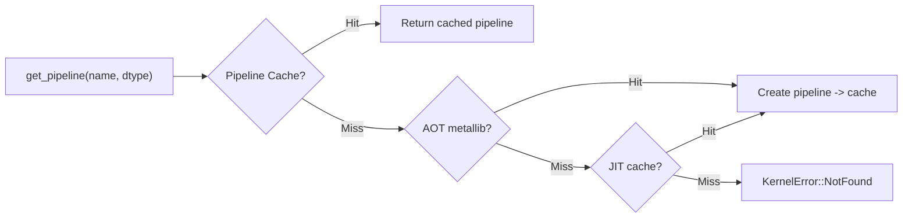

# rmlx-core — Compute Engine

## Overview

`rmlx-core` is the Metal GPU compute engine, providing data types, N-dimensional arrays, a kernel registry, GPU compute kernels, automatic differentiation, LoRA fine-tuning, runtime metrics, structured logging, numerical stability monitoring, and graceful shutdown.

> **Status:** DType (with FP8), Array, KernelRegistry, **27 op modules** (including SDPA/FA2 with bf16 + backward, SiLU/SwiGLU, GELU, FP8 dequant/quant, Conv1d/Conv2d, tiled conv, GatherMM, LayerNorm, unary ops, concat, select, VJP GPU), GGUF format parser, AWQ/GPTQ dequant, VJP autodiff, LoRA, logging, metrics, PrecisionGuard, and ShutdownSignal are all implemented. Phase 0+1+2 audit remediation complete (items C1-C9).

---

## Module Structure

```
rmlx-core/src/
├── lib.rs              # Module declarations + METALLIB_PATH constant
├── prelude.rs          # Convenience re-exports (Array, DType, KernelError, KernelRegistry)
├── dtype.rs            # DType enum
├── array.rs            # N-dimensional Metal buffer array
├── kernels/
│   └── mod.rs          # KernelRegistry (AOT -> JIT -> PipelineCache)
├── ops/
│   ├── mod.rs          # 27 kernel registration (register_all)
│   ├── copy.rs         # Buffer copy
│   ├── binary.rs       # add, mul, sub, div
│   ├── reduce.rs       # sum, max, argmax, row_sum
│   ├── softmax.rs      # softmax
│   ├── topk_route.rs   # GPU-native MoE top-k routing (fused softmax/top-k/scan)
│   ├── rms_norm.rs     # RMS normalization
│   ├── rope.rs         # Rotary Position Embedding
│   ├── gemv.rs         # Matrix-vector product
│   ├── matmul.rs       # Matrix multiplication (GEMM)
│   ├── quantized.rs    # Quantized matrix multiply (Q4_0, Q4_1, Q8_0)
│   ├── indexing.rs     # gather, scatter
│   ├── silu.rs         # SiLU activation + fused SwiGLU
│   ├── gelu.rs         # GELU activation (gelu_approx + gelu_fast)
│   ├── fp8.rs          # FP8 dequant/quant + per-token E4M3 wire kernels
│   ├── conv.rs         # Conv1d/Conv2d convolution
│   ├── sdpa.rs         # Flash Attention 2 (fused SDPA, bf16 support)
│   ├── sdpa_backward.rs # SDPA backward pass (VJP)
│   ├── gather_mm.rs    # GatherMM (batched gather-matmul, f16/bf16, _into_cb)
│   ├── layer_norm.rs   # LayerNorm (with affine parameters)
│   ├── unary.rs        # Unary ops (exp, log, sqrt, abs, neg, tanh, sigmoid, erf, etc.)
│   ├── concat.rs       # Tensor concatenation along arbitrary axis
│   ├── select.rs       # Index select operation
│   ├── conv_tiled.rs   # Tiled convolution for large inputs
│   ├── vjp_gpu.rs      # GPU-accelerated VJP backward pass
├── formats/
│   ├── mod.rs          # Format parser module
│   └── gguf.rs         # GGUF binary format parser (llama.cpp)
├── vjp.rs              # Tape-based reverse-mode autodiff
├── lora.rs             # LoRA fine-tuning
├── logging.rs          # Structured logging
├── metrics.rs          # Atomic runtime metrics
├── precision_guard.rs  # NaN/Inf/entropy drift monitoring
└── shutdown.rs         # Graceful shutdown signal
```

---

## DType — Data Types (`dtype.rs`)

Defines the data types used for tensor computations.

```rust
#[derive(Debug, Clone, Copy, PartialEq, Eq, Hash)]
pub enum DType {
    Float32,
    Float16,
    Bfloat16,
    UInt32,
    Float8E4M3,   // FP8 E4M3 (1s/4e/3m), range ±448, stored as uint8
    Float8E5M2,   // FP8 E5M2 (1s/5e/2m), range ±57344, stored as uint8
    Q4_0,   // 4-bit quantized, group size 32, f16 scale
    Q4_1,   // 4-bit quantized, group size 32, f16 scale + f16 min
    Q8_0,   // 8-bit quantized, group size 32, f16 scale
}
```

| Type | `size_of()` | `name()` | Description |
|------|-------------|----------|-------------|
| `Float32` | 4 | `"float32"` | Default floating point |
| `Float16` | 2 | `"float16"` | Memory-efficient inference |
| `Bfloat16` | 2 | `"bfloat16"` | Training/inference (brain floating point) |
| `UInt32` | 4 | `"uint32"` | Index arrays, token IDs |
| `Float8E4M3` | 1 | `"float8e4m3"` | FP8 weights/activations (E4M3 format) |
| `Float8E5M2` | 1 | `"float8e5m2"` | FP8 gradients (E5M2 format) |
| `Q4_0` | 1 | `"q4_0"` | ~0.5625 bytes/element (18B per 32 elements) |
| `Q4_1` | 1 | `"q4_1"` | ~0.625 bytes/element (20B per 32 elements) |
| `Q8_0` | 1 | `"q8_0"` | ~1.0625 bytes/element (34B per 32 elements) |

**`HasDType` trait:** Maps Rust types to `DType`. Currently `f32 -> DType::Float32` is implemented.

---

## Array — N-Dimensional Array (`array.rs`)

An N-dimensional array that owns a Metal `Buffer`. Uses `StorageModeShared` (CPU + GPU shared access) on Apple Silicon UMA.

```rust
pub struct Array {
    buffer: MTLBuffer,
    shape: Vec<usize>,
    strides: Vec<usize>,
    dtype: DType,
    offset: usize,       // byte offset
}
```

### Creation Methods

| Method | Description |
|--------|-------------|
| `Array::new(buffer, shape, strides, dtype, offset)` | Wraps an existing Metal buffer |
| `Array::from_slice::<T>(device, data, shape)` | Allocates a new buffer from a typed slice |
| `Array::zeros(device, shape, dtype)` | Creates a zero-initialized array |
| `Array::ones(device, shape)` | Creates a 1.0-initialized array (f32 only) |

### Accessors

| Method | Return type | Description |
|--------|-------------|-------------|
| `shape()` | `&[usize]` | Array shape |
| `strides()` | `&[usize]` | Strides (element-wise) |
| `dtype()` | `DType` | Data type |
| `ndim()` | `usize` | Number of dimensions |
| `numel()` | `usize` | Total number of elements |
| `byte_size()` | `usize` | Total byte size |
| `offset()` | `usize` | Byte offset within the buffer |
| `metal_buffer()` | `&MTLBuffer` | Metal buffer reference |
| `is_contiguous()` | `bool` | Whether storage is contiguous |

### View Operations

| Method | Description |
|--------|-------------|
| `reshape(new_shape)` | New shape view on the same buffer (zero-copy, contiguous array required) |
| `view(shape, strides, offset)` | Custom stride/offset view (zero-copy) |

### Data Extraction

```rust
// Safety: must be called after GPU writes have completed
unsafe fn to_vec<T: HasDType + Clone>(&self) -> Vec<T>
```

---

## ops/ — Compute Kernels

Registers 27 op modules with the `KernelRegistry`. Bulk registration via `register_all()`.

```rust
pub fn register_all(registry: &KernelRegistry) -> Result<(), KernelError> {
    copy::register(registry)?;
    binary::register(registry)?;
    reduce::register(registry)?;
    rms_norm::register(registry)?;
    softmax::register(registry)?;
    rope::register(registry)?;
    gemv::register(registry)?;
    matmul::register(registry)?;
    quantized::register(registry)?;
    indexing::register(registry)?;
    silu::register(registry)?;
    gelu::register(registry)?;
    fp8::register(registry)?;
    conv::register(registry)?;
    sdpa::register(registry)?;
    Ok(())
}
```

| Module | Operation | Description |
|--------|-----------|-------------|
| `copy` | Copy | Buffer-to-buffer data copy |
| `binary` | Add, Mul, Sub, Div | Element-wise arithmetic |
| `reduce` | Sum, Max, Argmax, Row_sum | Reduction operations |
| `softmax` | Softmax | Attention score normalization |
| `topk_route` | MoE Top-K Route | Fused softmax -> top-k -> normalize -> histogram -> prefix-scan routing on GPU |
| `rms_norm` | RMS Normalization | LLaMA-style normalization |
| `rope` | RoPE | Rotary Position Embedding |
| `gemv` | GEMV | Matrix-vector product |
| `matmul` | GEMM | General matrix multiplication |
| `quantized` | QMM, AWQ dequant, GPTQ dequant | Quantized matmul + AWQ/GPTQ INT4 unpacking |
| `indexing` | Gather, Scatter | Indexing operations |
| `silu` | SiLU, SiLU+Gate (SwiGLU) | Sigmoid Linear Unit activation + fused SwiGLU gate |
| `gelu` | GELU, GELU_fast | GELU activation (tanh approx + sigmoid fast) |
| `fp8` | FP8 dequant/quant | Float8E4M3/E5M2 conversion, per-token E4M3 scaling, fused dequant-scatter for EP payloads |
| `conv` | Conv1d, Conv2d | 1D and 2D convolution with padding/stride/dilation/groups |
| `sdpa` | SDPA / FA2 | Flash Attention 2 (fused Scaled Dot-Product Attention, bf16 support) |
| `sdpa_backward` | SDPA backward | SDPA backward pass for VJP |
| `gather_mm` | GatherMM | Batched gather-matmul for MoE expert routing with f16/bf16 kernels (float accumulation) and _into_cb support |
| `layer_norm` | LayerNorm | Layer normalization with affine (weight + bias) parameters |
| `unary` | Unary ops | exp, log, sqrt, abs, neg, tanh, sigmoid, erf, ceil, floor, round, sign, reciprocal |
| `concat` | Concat | Tensor concatenation along arbitrary axis |
| `select` | Select | Index select (gather along a dimension) |
| `conv_tiled` | Tiled Conv | Tiled convolution for large inputs |
| `vjp_gpu` | VJP GPU | GPU-accelerated backward pass for VJP |

### silu.rs — SiLU Activation + Fused SwiGLU

SiLU activation (`silu(x) = x * sigmoid(x)`) and fused SiLU*gate for SwiGLU FFN.

| Function | Description |
|----------|-------------|
| `silu(registry, input, queue)` | Element-wise SiLU activation |
| `silu_gate(registry, input, gate, queue)` | Fused `silu(input) * gate` (SwiGLU pattern) |

**Vectorization:**
- f32: 2 elements per thread
- f16/bf16: 4 elements per thread with numerically stable sigmoid

**Supported dtypes:** Float32, Float16, Bfloat16

### gelu.rs — GELU Activation

GELU activation in two variants:
- `gelu_approx(x) = 0.5 * x * (1 + tanh(sqrt(2/pi) * (x + 0.044715 * x^3)))` -- GPT-2, BERT, Gemma
- `gelu_fast(x) = x * sigmoid(1.702 * x)` -- fast sigmoid approximation

| Function | Description |
|----------|-------------|
| `gelu(registry, input, queue)` | GELU with tanh approximation (gelu_approx) |
| `gelu_fast(registry, input, queue)` | GELU with sigmoid approximation (gelu_fast) |

**Vectorization:**
- f32: 2 elements per thread
- f16/bf16: 4 elements per thread (f32 accumulation)

**Supported dtypes:** Float32, Float16, Bfloat16

### fp8.rs — FP8 Dequantization/Quantization

FP8 format conversion kernels. Metal does not natively support FP8, so values are stored as uint8 and converted via dedicated kernels.

| Function | Description |
|----------|-------------|
| `dequant_fp8e4m3_to_f16(registry, input, queue)` | E4M3 (uint8) -> Float16 |
| `dequant_fp8e5m2_to_f16(registry, input, queue)` | E5M2 (uint8) -> Float16 |
| `quant_f16_to_fp8e4m3(registry, input, scale, queue)` | Float16 -> E4M3 with per-tensor scale |
| `quant_f16_to_fp8e5m2(registry, input, scale, queue)` | Float16 -> E5M2 with per-tensor scale |

**Kernel design:** 4 elements per thread for all variants.

### conv.rs — Convolution (Conv1d/Conv2d)

GPU-accelerated 1D and 2D convolution using implicit GEMM (no im2col overhead).

| Function | Description |
|----------|-------------|
| `conv1d(registry, input, weight, bias, stride, padding, dilation, groups, queue)` | 1D convolution: [B, C_in, W] -> [B, C_out, W_out] |
| `conv2d(registry, input, weight, bias, stride, padding, dilation, groups, queue)` | 2D convolution: [B, C_in, H, W] -> [B, C_out, H_out, W_out] |

**Features:** padding, stride, dilation, grouped convolution, optional bias.

**Supported dtypes:** Float32, Float16, Bfloat16

### sdpa.rs — Flash Attention 2 (Fused SDPA)

Flash Attention 2 implementation with K/V outer loop for efficient attention computation.
Single-kernel computation of `softmax(Q @ K^T / sqrt(d) + mask) @ V` using online softmax.

| Function | Description |
|----------|-------------|
| `sdpa(registry, q, k, v, mask, scale, is_causal, queue)` | Single-head FA2: Q[N,D], K[S,D], V[S,D] -> O[N,D] |
| `sdpa_batched(registry, q_heads, k_heads, v_heads, mask, scale, is_causal, queue)` | Multi-head batched FA2 with GQA support |

**Key optimizations:**
- **Flash Attention 2**: K/V outer loop, Q inner loop for better GPU utilization
- **Decode fast path**: Optimized single-query kernel when N=1 (T_q=1)
- **Causal mask block-skipping**: Entire K/V blocks above the causal diagonal are skipped
- No intermediate score matrix materialization
- Online softmax with running max/normalizer
- Tiling: Br=32 (query block) x Bc=32 (key block)

**Constraints:**
- head_dim <= 256 (D<=128 uses shared memory tiles; D>128 uses split approach)
- Supported dtypes: Float32, Float16

### AWQ/GPTQ Dequantization (in quantized.rs)

Converts AWQ/GPTQ packed INT4 weights to f32 for inference.

| Function | Description |
|----------|-------------|
| `awq_dequant(registry, qweight, qzeros, scales, rows, cols, group_size, queue)` | AWQ INT4 -> f32 dequantization |
| `gptq_dequant(registry, qweight, qzeros, scales, g_idx, in_features, out_features, group_size, queue)` | GPTQ INT4 -> f32 dequantization (with optional g_idx for act_order) |

### ExecMode, CommandBufferHandle, LaunchResult (`ops/mod.rs`)

Types for async kernel dispatch control.

#### ExecMode

| Variant | Description |
|---------|-------------|
| `Sync` | Commit and wait immediately (default, safe) |
| `Async` | Commit without waiting; caller manages sync |

#### CommandBufferHandle

Handle for tracking async command buffer completion.

| Method | Description |
|--------|-------------|
| `is_complete()` | Non-blocking completion check |
| `wait()` | Block until GPU work completes |
| `wait_timeout(timeout)` | Block with timeout; returns true if completed |

#### LaunchResult

Wraps an output `Array` with a `CommandBufferHandle`. The only way to access the output
is via `into_array()`, which blocks until GPU completion -- preventing reads of incomplete data.

| Method | Description |
|--------|-------------|
| `is_complete()` | Non-blocking completion check |
| `into_array()` | Block until complete, return output Array |
| `into_array_timeout(timeout)` | Block with timeout; returns `Ok(Array)` or `Err(self)` |
| `handle()` | Access the completion handle for polling |

---

## KernelRegistry — Kernel Registry (`kernels/mod.rs`)

A kernel registry supporting 3-level fallback: AOT `.metallib` -> JIT compilation -> pipeline cache.

```rust
pub struct KernelRegistry {
    device: GpuDevice,
    aot_lib: Option<metal::Library>,
    jit_cache: Mutex<HashMap<String, metal::Library>>,
    pipelines: Mutex<HashMap<PipelineKey, metal::ComputePipelineState>>,
}
```

### Lookup Order



### `PipelineKey`

```rust
#[derive(Debug, Clone, Hash, PartialEq, Eq)]
pub struct PipelineKey {
    pub kernel_name: String,
    pub dtype: DType,
}
```

### `KernelError`

| Variant | Description |
|---------|-------------|
| `NotFound(String)` | Kernel not found |
| `CompilationFailed(String)` | Shader compilation failed |
| `PipelineFailed(String)` | Pipeline creation failed |

### Key Methods

| Method | Description |
|--------|-------------|
| `new(device)` | Automatically attempts to load AOT metallib |
| `get_pipeline(name, dtype)` | Pipeline lookup (cache -> AOT -> JIT) |
| `get_pipeline_with_constants(name, dtype, constants)` | Constant specialization entrypoint. Currently fail-fasts with `todo!("TODO(C15)...")` when `constants` is non-empty, to avoid silent pseudo-support. Use `register_specialized_source(...)` until C15 is implemented. |
| `register_jit_source(name, source)` | JIT-compiles an MSL source string and caches it |
| `register_specialized_source(name, source)` | Registers source-level specialized kernels as the current practical workaround for function-constant variants |
| `has_aot()` | Whether the AOT library is loaded |
| `cached_pipeline_count()` | Number of cached pipelines |
| `jit_library_count()` | Number of JIT libraries |

---

## vjp.rs — Tape-Based Reverse-Mode Autodiff

A reverse-mode automatic differentiation framework. Records operations on a tape, then propagates gradients in reverse order.

### Operation Enum

```rust
pub enum Operation {
    Add,
    Mul,
    MatMul { m: usize, k: usize, n: usize },
    Softmax,
    RmsNorm,
    Rope,
    Gemv,
    Reduce,
    Custom(String),
}
```

### GradFn Trait

```rust
pub trait GradFn {
    fn backward(&self, grad_output: &[f32]) -> Vec<Vec<f32>>;
}
```

Receives the output gradient and returns gradients for each input.

### Tape & TapedValue

```rust
pub struct Tape {
    entries: Vec<TapeEntry>,
    values: Vec<Vec<f32>>,
}

pub struct TapedValue {
    pub index: usize,
}
```

| Method | Description |
|--------|-------------|
| `Tape::new()` | Creates an empty tape |
| `tape.leaf(value)` | Registers a leaf value (input), returns `TapedValue` |
| `tape.record(inputs, output, op, grad_fn)` | Records an operation |
| `tape.backward(output)` | Executes backpropagation, returns gradients for all values |

### Built-in Gradient Functions

| Struct | Operation | Mathematical backprop |
|--------|-----------|----------------------|
| `AddGrad { len }` | Element-wise addition | Gradient propagated unchanged to both sides |
| `MulGrad { lhs, rhs }` | Element-wise multiplication | Product rule: `grad * rhs`, `grad * lhs` |
| `MatMulGrad { a, b, m, k, n }` | Matrix multiply C=A@B | `dA = dC @ B^T`, `dB = A^T @ dC` |

### Numerical Gradient (for testing)

```rust
pub fn numerical_gradient<F>(f: F, x: &[f32], eps: f32) -> Vec<Vec<f32>>
```

Approximates the Jacobian via central differences for verifying VJP correctness.

---

## lora.rs — LoRA Fine-Tuning

Supports parameter-efficient fine-tuning via Low-Rank Adaptation.

### LoraConfig

```rust
pub struct LoraConfig {
    pub rank: usize,            // default: 8
    pub alpha: f64,             // default: 16.0
    pub dropout: f64,           // default: 0.0
    pub target_modules: Vec<String>,  // default: ["q_proj", "v_proj"]
}
```

| Method | Description |
|--------|-------------|
| `LoraConfig::new(rank, alpha)` | Specified rank/alpha, defaults for the rest |
| `scaling()` | Computes `alpha / rank` |

### LoraLayer

Adds a low-rank decomposition `delta_W = scaling * B @ A` to a base linear layer `W: (out, in)`.

```rust
pub struct LoraLayer {
    pub in_features: usize,
    pub out_features: usize,
    pub rank: usize,
    pub scaling: f64,
    pub lora_a: Vec<f32>,   // A: (rank, in_features)
    pub lora_b: Vec<f32>,   // B: (out_features, rank)
}
```

| Method | Description |
|--------|-------------|
| `new(in_features, out_features, config)` | A initialized with Kaiming, B initialized to zeros |
| `with_weights(...)` | Creates with explicit A/B matrices (for testing) |
| `forward(base_output, input, batch_size)` | `base + scaling * input @ A^T @ B^T` |
| `num_params()` | Number of trainable parameters |

### LoraModel

```rust
pub struct LoraModel {
    pub config: LoraConfig,
    pub layers: Vec<(String, LoraLayer)>,
}
```

| Method | Description |
|--------|-------------|
| `add_adapter(name, in_features, out_features)` | Adds a LoRA adapter by name |
| `get_layer(name)` / `get_layer_mut(name)` | Looks up a layer by name |
| `total_params()` | Total trainable parameters across all adapters |

### TrainConfig & LoraTrainer

```rust
pub struct TrainConfig {
    pub learning_rate: f64,   // default: 1e-4
    pub num_epochs: usize,    // default: 1
    pub batch_size: usize,    // default: 1
}

pub struct LoraTrainer {
    pub config: TrainConfig,
}
```

| Method | Description |
|--------|-------------|
| `compute_loss(logits, targets, vocab_size)` | Cross-entropy loss (numerically stable) |
| `compute_loss_grad(logits, targets, vocab_size)` | Gradient of the loss with respect to logits |
| `train_step(layer, input, base_output, targets)` | Forward -> backward -> SGD update, returns loss |

---

## logging.rs — Structured Logging

A lightweight logging system supporting global log level filtering and JSON/text output.

### LogLevel

```rust
#[repr(u8)]
pub enum LogLevel {
    Error = 0,
    Warn  = 1,
    Info  = 2,   // default
    Debug = 3,
    Trace = 4,
}
```

The global level is managed via `AtomicU8`.

### LogEntry

```rust
pub struct LogEntry {
    pub timestamp_ms: u64,
    pub level: LogLevel,
    pub target: String,
    pub message: String,
    pub fields: Vec<(String, String)>,
}
```

| Method | Description |
|--------|-------------|
| `LogEntry::new(level, target, message)` | Creates an entry with the current timestamp |
| `.field(key, value)` | Adds a key-value field (builder pattern) |
| `.format_json()` | Outputs as a JSON string |
| `.format_text()` | Outputs as `[ts] LEVEL target: message k=v` format |

### Global Functions

| Function | Description |
|----------|-------------|
| `set_level(level)` | Sets the global log level |
| `current_level()` | Queries the current level |
| `is_enabled(level)` | Checks whether the given level is enabled |
| `log(level, target, message)` | Outputs in text format to stderr |
| `log_with_fields(level, target, message, fields)` | Outputs with key-value fields |

---

## metrics.rs — Runtime Metrics

`AtomicU64`-based lock-free runtime performance counters.

### RuntimeMetrics

```rust
pub struct RuntimeMetrics {
    pub kernel_dispatches: AtomicU64,
    pub kernel_total_time_us: AtomicU64,
    pub buffer_allocs: AtomicU64,
    pub buffer_frees: AtomicU64,
    pub buffer_bytes_allocated: AtomicU64,
    pub cache_hits: AtomicU64,
    pub cache_misses: AtomicU64,
}
```

| Method | Description |
|--------|-------------|
| `record_kernel_dispatch(duration_us)` | Records a kernel dispatch (count + time) |
| `record_buffer_alloc(bytes)` | Records a buffer allocation |
| `record_buffer_free(bytes)` | Records a buffer deallocation |
| `record_cache_hit()` | Records a cache hit |
| `record_cache_miss()` | Records a cache miss |
| `snapshot()` | Returns a point-in-time snapshot of all counters |

### MetricsSnapshot

```rust
#[derive(Debug, Clone)]
pub struct MetricsSnapshot {
    pub kernel_dispatches: u64,
    pub kernel_total_time_us: u64,
    pub buffer_allocs: u64,
    pub buffer_frees: u64,
    pub buffer_bytes_allocated: u64,
    pub cache_hits: u64,
    pub cache_misses: u64,
}
```

---

## precision_guard.rs — Numerical Stability Monitoring

Monitors NaN, Inf, and entropy drift in logits in real time.

### PrecisionResult

```rust
pub enum PrecisionResult {
    Ok,
    HasNaN(usize),         // NaN count
    HasInf(usize),         // Inf count
    EntropyDrift(f64),     // Relative drift ratio
}
```

### PrecisionGuard

```rust
pub struct PrecisionGuard {
    nan_count: u64,
    inf_count: u64,
    entropy_history: Vec<f64>,
    baseline_entropy: Option<f64>,
    window_size: usize,
    consecutive_drift_windows: usize,
}
```

| Method | Description |
|--------|-------------|
| `new(window_size)` | Creates with specified window size |
| `check_logits(logits)` | NaN/Inf check + entropy calculation -> `PrecisionResult` |
| `record_entropy(entropy)` | Records an entropy observation |
| `entropy_drift()` | Relative drift from baseline (`Option<f64>`) |
| `should_warn()` | Returns `true` if drift > 0.15 |
| `should_fallback()` | Returns `true` if drift > 0.30 for 2 consecutive windows |

**Entropy calculation:** logits -> softmax -> Shannon entropy (`-sum(p * ln(p))`)

**Baseline setting:** The mean entropy of the first window is set as the baseline.

---

## shutdown.rs — Graceful Shutdown

An `Arc<AtomicBool>`-based thread-safe shutdown signal.

### ShutdownSignal

```rust
pub struct ShutdownSignal {
    flag: Arc<AtomicBool>,
}
```

| Method | Description |
|--------|-------------|
| `new()` | Creates a new signal (initial value `false`) |
| `trigger()` | Triggers shutdown (`Release` ordering) |
| `is_triggered()` | Checks shutdown status (`Acquire` ordering) |
| `clone_handle()` | Creates a read-only `ShutdownHandle` |

### ShutdownHandle

```rust
pub struct ShutdownHandle {
    flag: Arc<AtomicBool>,
}
```

| Method | Description |
|--------|-------------|
| `is_shutdown()` | Checks shutdown status (`Acquire` ordering) |

**Usage pattern:** The main thread holds the `ShutdownSignal` and distributes `ShutdownHandle`s to worker threads.

---

## prelude.rs — Convenience Re-exports

A prelude module that provides commonly used types for ergonomic imports.

```rust
pub use crate::array::Array;
pub use crate::dtype::{DType, HasDType};
pub use crate::kernels::{KernelError, KernelRegistry};
```

**Usage:**
```rust
use rmlx_core::prelude::*;
```

---

## formats/ — File Format Parsers

### gguf.rs — GGUF Binary Format Parser

Parses llama.cpp GGUF model files (v2 and v3).

| Type | Description |
|------|-------------|
| `GgufFile` | Parsed GGUF file: version, metadata, tensor info, data offset |
| `GgufTensorInfo` | Tensor name, shape (RMLX order), GgmlType, byte offset |
| `GgufValue` | Metadata value (13 types: integers, floats, strings, arrays) |
| `GgmlType` | GGML tensor types (F32, F16, BF16, Q4_0, Q4_1, Q8_0, K-quants, etc.) |

| Function | Description |
|----------|-------------|
| `parse_gguf(reader)` | Parse GGUF header from any `Read + Seek` source |
| `ggml_type_to_dtype(ggml_type)` | Map GgmlType to RMLX DType (None for unsupported) |

**GGUF features:**
- Magic validation (0x46475547)
- Version 2 and 3 support
- Custom alignment via `general.alignment` metadata
- Shape reversal from GGUF order to RMLX row-major order

---

## Build System

`build.rs` AOT-compiles `.metal` files from the `kernels/` directory using `xcrun`.

| Step | Tool | Input | Output |
|------|------|-------|--------|
| 1. Compile | `xcrun metal -c` | `*.metal` | `*.air` |
| 2. Link | `xcrun metallib` | `*.air` | `rmlx_kernels.metallib` |
| 3. Expose | `cargo:rustc-env` | `.metallib` path | `RMLX_METALLIB_PATH` |

**Graceful fallback:** If Xcode is not installed, a warning is printed and `RMLX_METALLIB_PATH` is set to an empty string. Falls back to JIT compilation at runtime.

---

## Dependencies

```toml
[dependencies]
rmlx-metal = { path = "../rmlx-metal" }
rmlx-alloc = { path = "../rmlx-alloc" }
```
