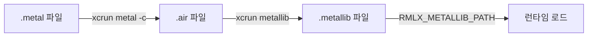

# rmlx-core — 연산 엔진

## 개요

`rmlx-core`는 Metal GPU 연산 엔진으로, 커널 관리, 텐서 연산, 연산 그래프, 실행 스케줄러를 담당합니다. LLM 추론에 필요한 모든 수학적 연산(행렬 곱셈, softmax, RMS 정규화 등)을 Metal 셰이더로 구현합니다.

> **상태:** 빌드 시스템(`build.rs`)과 기본 셰이더(`vector_add.metal`)가 구현되어 있습니다. 나머지 모듈은 Phase 2에서 구현 예정입니다.

---

## 현재 구현

### `build.rs` — AOT 셰이더 컴파일

`build.rs`가 `kernels/` 디렉토리의 `.metal` 파일을 빌드 시점에 AOT 컴파일합니다.

**컴파일 파이프라인:**



**핵심 로직:**

```rust
// build.rs — 실제 구현 코드

fn metal_compiler_available() -> bool {
    Command::new("xcrun")
        .args(["-sdk", "macosx", "--find", "metal"])
        .output()
        .map(|o| o.status.success())
        .unwrap_or(false)
}

fn main() {
    let out_dir = PathBuf::from(env::var("OUT_DIR").unwrap());
    let kernel_dir = Path::new("kernels");

    println!("cargo:rerun-if-changed=kernels/");

    // .metal 파일 탐색
    let metal_files: Vec<PathBuf> = std::fs::read_dir(kernel_dir)
        .expect("failed to read kernels/ directory")
        .filter_map(|entry| {
            let path = entry.ok()?.path();
            if path.extension().and_then(|e| e.to_str()) == Some("metal") {
                Some(path)
            } else {
                None
            }
        })
        .collect();

    // 각 .metal → .air 컴파일
    for metal_file in &metal_files {
        let stem = metal_file.file_stem().unwrap().to_str().unwrap();
        let air_path = out_dir.join(format!("{stem}.air"));
        Command::new("xcrun")
            .args(["-sdk", "macosx", "metal", "-c"])
            .arg(metal_file)
            .arg("-o")
            .arg(&air_path)
            .status()
            .expect("failed to execute xcrun metal compiler");
    }

    // .air → .metallib 링킹
    let metallib_path = out_dir.join("rmlx_kernels.metallib");
    Command::new("xcrun")
        .args(["-sdk", "macosx", "metallib"])
        .args(&air_files)
        .arg("-o")
        .arg(&metallib_path)
        .status()
        .expect("failed to execute xcrun metallib linker");

    println!("cargo:rustc-env=RMLX_METALLIB_PATH={}", metallib_path.display());
}
```

**Graceful Fallback:** Xcode가 설치되어 있지 않은 환경(Command Line Tools만 있는 경우)에서는 경고를 출력하고 `RMLX_METALLIB_PATH`를 빈 문자열로 설정합니다. GPU 커널은 런타임에 사용할 수 없게 되지만 컴파일 자체는 실패하지 않습니다.

### `lib.rs` — `METALLIB_PATH` 상수

```rust
// lib.rs — 실제 구현 코드
pub const METALLIB_PATH: &str = env!("RMLX_METALLIB_PATH");
```

빌드 시점에 `build.rs`가 설정한 환경 변수를 컴파일 타임 상수로 노출합니다.

### `kernels/vector_add.metal` — 벡터 덧셈 커널

```metal
// kernels/vector_add.metal — 실제 구현 코드
#include <metal_stdlib>
using namespace metal;

kernel void vector_add_float(
    device const float *a [[buffer(0)]],
    device const float *b [[buffer(1)]],
    device float *out [[buffer(2)]],
    uint idx [[thread_position_in_grid]])
{
    out[idx] = a[idx] + b[idx];
}
```

---

## 계획된 모듈

### `dtype.rs` — 데이터 타입 *계획됨 (Phase 2)*

LLM 추론에 사용되는 데이터 타입을 정의합니다.

| 타입 | 크기 | 용도 |
|------|------|------|
| `f32` | 4바이트 | 기본 부동소수점 |
| `f16` | 2바이트 | 메모리 절약 추론 |
| `bf16` | 2바이트 | 학습/추론 (뇌 부동소수점) |
| Quantized (4-bit, 8-bit) | 0.5~1바이트 | 양자화 추론 |
| FP4, FP8 | 0.5~1바이트 | 최신 양자화 형식 |

---

### `array.rs` — N차원 배열 *계획됨 (Phase 2)*

Metal `Buffer` 소유권을 가진 N차원 배열 타입을 구현합니다.

- Shape, stride, dtype 메타데이터
- Buffer 소유권 관리
- 뷰(view) 및 슬라이싱

---

### `ops/` — 연산 커널 *계획됨 (Phase 2)*

LLM 추론에 필요한 Metal 컴퓨트 커널 집합입니다.

| 모듈 | 연산 | 설명 |
|------|------|------|
| `matmul.rs` | GEMM | 범용 행렬 곱셈 |
| `quantized.rs` | QMM | 4-bit, 8-bit, FP4, FP8 양자화 행렬 곱셈 |
| `softmax.rs` | Softmax | Attention 스코어 정규화 |
| `rms_norm.rs` | RMS Normalization | LLaMA 스타일 정규화 |
| `rope.rs` | RoPE | Rotary Position Embedding |
| `binary.rs` | Element-wise | 덧셈, 곱셈, SiLU 등 원소별 연산 |
| `reduce.rs` | Reduce | Sum, max, mean 리덕션 |
| `copy.rs` | Copy | 버퍼 간 데이터 복사 |
| `indexing.rs` | Indexing | 인덱싱, gather, scatter |

---

### `kernels/` — 커널 레지스트리 *계획됨 (Phase 2)*

| 모듈 | 설명 |
|------|------|
| `mod.rs` | 커널 레지스트리 — 커널 이름으로 함수 조회 |
| `loader.rs` | `.metallib` AOT 로더 — `METALLIB_PATH`에서 사전 컴파일된 라이브러리 로드 |
| `jit.rs` | JIT 컴파일러 — MSL 소스 문자열 런타임 컴파일 |

---

### `graph.rs` — 연산 그래프 *계획됨 (Phase 2)*

선택적 tracing 기반 연산 그래프입니다.

- 연산을 기록하고 최적화(fusion, 메모리 재사용)를 적용합니다
- 반복 실행 시 그래프를 재사용하여 오버헤드를 줄입니다

---

### `scheduler.rs` — 실행 스케줄러 *계획됨 (Phase 2)*

스트림별 실행 스케줄링을 담당합니다.

- 연산을 적절한 스트림(compute/transfer)에 배치합니다
- 의존성을 추적하여 안전한 병렬 실행을 보장합니다
- `StreamManager` (rmlx-metal Phase 3)와 연계하여 동작합니다

---

## 빌드 시스템

`build.rs`가 `kernels/` 디렉토리의 `.metal` 파일을 `xcrun`으로 AOT 컴파일합니다.

| 단계 | 도구 | 입력 | 출력 |
|------|------|------|------|
| 1. 컴파일 | `xcrun metal -c` | `*.metal` | `*.air` |
| 2. 링킹 | `xcrun metallib` | `*.air` | `rmlx_kernels.metallib` |
| 3. 노출 | `cargo:rustc-env` | `.metallib` 경로 | `RMLX_METALLIB_PATH` |

**요구사항:**
- 전체 Xcode 설치 (Command Line Tools만으로는 부족)
- Xcode 미설치 시 graceful fallback (경고 출력, 빈 경로 설정)

**변경 감지:**
- `cargo:rerun-if-changed=kernels/` — 커널 파일 변경 시 자동 재컴파일

---

## 구현 시점

**Phase 2** — rmlx-metal, rmlx-alloc 완료 후 구현을 시작합니다.

---

## 의존성

```toml
[dependencies]
rmlx-metal = { path = "../rmlx-metal" }
rmlx-alloc = { path = "../rmlx-alloc" }
```
