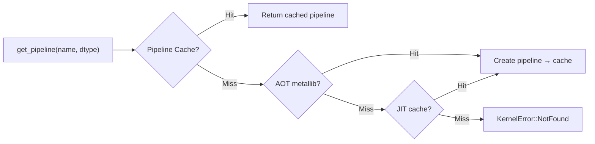

# rmlx-core — 연산 엔진

## 개요

`rmlx-core`는 Metal GPU 연산 엔진으로, 데이터 타입, N차원 배열, 커널 레지스트리, GPU 연산 커널, 자동 미분, LoRA 파인튜닝, 런타임 메트릭, 구조화된 로깅, 수치 안정성 감시, 그레이스풀 셧다운 등을 제공합니다.

> **상태:** DType (FP8 포함), Array, KernelRegistry, 18종의 op 모듈 (SDPA/FA2, SiLU/SwiGLU, GELU, FP8 dequant/quant, Conv1d/Conv2d 포함), GGUF 포맷 파서, AWQ/GPTQ dequant, VJP 자동 미분, LoRA, 로깅, 메트릭, PrecisionGuard, ShutdownSignal이 모두 구현되어 있습니다.

---

## 모듈 구조

```
rmlx-core/src/
├── lib.rs              # 모듈 선언 + METALLIB_PATH 상수
├── prelude.rs          # 편의 재내보내기 (Array, DType, KernelError, KernelRegistry)
├── dtype.rs            # DType 열거형
├── array.rs            # N차원 Metal 버퍼 배열
├── kernels/
│   └── mod.rs          # KernelRegistry (AOT → JIT → PipelineCache)
├── ops/
│   ├── mod.rs          # 18종 커널 등록 (register_all)
│   ├── copy.rs         # 버퍼 복사
│   ├── binary.rs       # add, mul, sub, div
│   ├── reduce.rs       # sum, max, argmax, row_sum
│   ├── softmax.rs      # softmax
│   ├── rms_norm.rs     # RMS 정규화
│   ├── rope.rs         # Rotary Position Embedding
│   ├── gemv.rs         # 행렬-벡터 곱
│   ├── matmul.rs       # 행렬 곱셈 (GEMM)
│   ├── quantized.rs    # 양자화 행렬 곱 (Q4_0, Q4_1, Q8_0, AWQ, GPTQ)
│   ├── indexing.rs     # gather, scatter
│   ├── silu.rs         # SiLU 활성화 + fused SwiGLU
│   ├── gelu.rs         # GELU 활성화 (gelu_approx + gelu_fast)
│   ├── fp8.rs          # FP8 dequant/quant (E4M3, E5M2)
│   ├── conv.rs         # Conv1d/Conv2d 합성곱
│   ├── sdpa.rs         # Flash Attention 2 (fused SDPA)
├── formats/
│   ├── mod.rs          # 포맷 파서 모듈
│   └── gguf.rs         # GGUF 바이너리 포맷 파서 (llama.cpp)
├── vjp.rs              # 테이프 기반 역전파 자동 미분
├── lora.rs             # LoRA 파인튜닝
├── logging.rs          # 구조화된 로깅
├── metrics.rs          # 원자적 런타임 메트릭
├── precision_guard.rs  # NaN/Inf/엔트로피 드리프트 감시
└── shutdown.rs         # 그레이스풀 셧다운 시그널
```

---

## DType — 데이터 타입 (`dtype.rs`)

텐서 연산에 사용되는 데이터 타입을 정의합니다.

```rust
#[derive(Debug, Clone, Copy, PartialEq, Eq, Hash)]
pub enum DType {
    Float32,
    Float16,
    Bfloat16,
    Float8E4M3,  // FP8 E4M3 (추론용)
    Float8E5M2,  // FP8 E5M2 (학습 그래디언트용)
    Q4_0,   // 4-bit 양자화, group size 32, f16 scale
    Q4_1,   // 4-bit 양자화, group size 32, f16 scale + f16 min
    Q8_0,   // 8-bit 양자화, group size 32, f16 scale
}
```

| 타입 | `size_of()` | `name()` | 설명 |
|------|-------------|----------|------|
| `Float32` | 4 | `"float32"` | 기본 부동소수점 |
| `Float16` | 2 | `"float16"` | 메모리 절약 추론 |
| `Bfloat16` | 2 | `"bfloat16"` | 학습/추론 (뇌 부동소수점) |
| `Float8E4M3` | 1 | `"float8_e4m3"` | FP8 추론 (4-bit 지수, 3-bit 가수) |
| `Float8E5M2` | 1 | `"float8_e5m2"` | FP8 학습 그래디언트 (5-bit 지수, 2-bit 가수) |
| `Q4_0` | 1 | `"q4_0"` | ~0.5625 bytes/element (18B per 32 elements) |
| `Q4_1` | 1 | `"q4_1"` | ~0.625 bytes/element (20B per 32 elements) |
| `Q8_0` | 1 | `"q8_0"` | ~1.0625 bytes/element (34B per 32 elements) |

**`HasDType` 트레이트:** Rust 타입을 `DType`으로 매핑합니다. 현재 `f32 → DType::Float32`이 구현되어 있습니다.

---

## Array — N차원 배열 (`array.rs`)

Metal `Buffer`를 소유하는 N차원 배열입니다. Apple Silicon UMA에서 `StorageModeShared`(CPU + GPU 공유 접근)를 사용합니다.

```rust
pub struct Array {
    buffer: MTLBuffer,
    shape: Vec<usize>,
    strides: Vec<usize>,
    dtype: DType,
    offset: usize,       // 바이트 오프셋
}
```

### 생성 메서드

| 메서드 | 설명 |
|--------|------|
| `Array::new(buffer, shape, strides, dtype, offset)` | 기존 Metal 버퍼를 래핑 |
| `Array::from_slice::<T>(device, data, shape)` | 타입 슬라이스에서 새 버퍼 할당 |
| `Array::zeros(device, shape, dtype)` | 0으로 초기화된 배열 생성 |
| `Array::ones(device, shape)` | 1.0으로 초기화 (f32 전용) |

### 접근자

| 메서드 | 반환 타입 | 설명 |
|--------|-----------|------|
| `shape()` | `&[usize]` | 배열 형상 |
| `strides()` | `&[usize]` | 스트라이드 (요소 단위) |
| `dtype()` | `DType` | 데이터 타입 |
| `ndim()` | `usize` | 차원 수 |
| `numel()` | `usize` | 총 요소 수 |
| `byte_size()` | `usize` | 총 바이트 크기 |
| `offset()` | `usize` | 버퍼 내 바이트 오프셋 |
| `metal_buffer()` | `&MTLBuffer` | Metal 버퍼 참조 |
| `is_contiguous()` | `bool` | 연속 저장 여부 |

### 뷰 연산

| 메서드 | 설명 |
|--------|------|
| `reshape(new_shape)` | 동일 버퍼에서 새 형상 뷰 (zero-copy, 연속 배열 필수) |
| `view(shape, strides, offset)` | 커스텀 스트라이드/오프셋 뷰 (zero-copy) |

### 데이터 추출

```rust
// Safety: GPU 쓰기가 완료된 후 호출해야 함
unsafe fn to_vec<T: HasDType + Clone>(&self) -> Vec<T>
```

---

## ops/ — 연산 커널

18종의 op 모듈을 `KernelRegistry`에 등록합니다. `register_all()`로 일괄 등록합니다.

```rust
pub fn register_all(registry: &KernelRegistry) -> Result<(), KernelError> {
    copy::register(registry)?;
    binary::register(registry)?;
    reduce::register(registry)?;
    rms_norm::register(registry)?;
    softmax::register(registry)?;
    rope::register(registry)?;
    gemv::register(registry)?;
    matmul::register(registry)?;
    quantized::register(registry)?;
    indexing::register(registry)?;
    silu::register(registry)?;
    gelu::register(registry)?;
    fp8::register(registry)?;
    conv::register(registry)?;
    sdpa::register(registry)?;
    Ok(())
}
```

| 모듈 | 연산 | 설명 |
|------|------|------|
| `copy` | Copy | 버퍼 간 데이터 복사 |
| `binary` | Add, Mul, Sub, Div | 원소별 사칙연산 |
| `reduce` | Sum, Max, Argmax, Row_sum | 리덕션 연산 |
| `softmax` | Softmax | Attention 스코어 정규화 |
| `rms_norm` | RMS Normalization | LLaMA 스타일 정규화 |
| `rope` | RoPE | Rotary Position Embedding |
| `gemv` | GEMV | 행렬-벡터 곱 |
| `matmul` | GEMM | 범용 행렬 곱셈 |
| `quantized` | QMM | Q4_0/Q4_1/Q8_0 양자화 행렬 곱 + AWQ/GPTQ dequant |
| `indexing` | Gather, Scatter | 인덱싱 연산 |
| `silu` | SiLU, SiLU+Gate (SwiGLU) | Sigmoid Linear Unit 활성화 + fused SwiGLU gate |
| `gelu` | GELU | GELU 활성화 (gelu_approx + gelu_fast) |
| `fp8` | FP8 Dequant/Quant | FP8 E4M3/E5M2 양자화/역양자화 |
| `conv` | Conv1d, Conv2d | 1D/2D 합성곱 |
| `sdpa` | SDPA (FA2) | Flash Attention 2 (fused SDPA, tiled K/V, online softmax) |

### silu.rs — SiLU 활성화 + Fused SwiGLU

SiLU 활성화 (`silu(x) = x * sigmoid(x)`)와 SwiGLU FFN을 위한 fused SiLU*gate를 제공합니다.

| 함수 | 설명 |
|------|------|
| `silu(registry, input, queue)` | 원소별 SiLU 활성화 |
| `silu_gate(registry, input, gate, queue)` | Fused `silu(input) * gate` (SwiGLU 패턴) |

**벡터화:**
- f32: 스레드당 2개 원소
- f16/bf16: 수치적으로 안정적인 sigmoid를 사용하여 스레드당 4개 원소

**지원 dtype:** Float32, Float16, Bfloat16

### gelu.rs -- GELU 활성화

GELU (Gaussian Error Linear Unit) 활성화 함수입니다. `gelu(x) = x * Phi(x)` 근사를 제공합니다.

| 함수 | 설명 |
|------|------|
| `gelu_approx(registry, input, queue)` | tanh 근사 GELU: `0.5 * x * (1 + tanh(sqrt(2/pi) * (x + 0.044715 * x^3)))` |
| `gelu_fast(registry, input, queue)` | 빠른 sigmoid 근사 GELU: `x * sigmoid(1.702 * x)` |

**지원 dtype:** Float32, Float16, Bfloat16

### fp8.rs -- FP8 Dequant/Quant

FP8 (8-bit 부동소수점) 양자화 및 역양자화를 제공합니다. E4M3 (추론용)과 E5M2 (학습 그래디언트용) 두 가지 변형을 지원합니다.

| 함수 | 설명 |
|------|------|
| `fp8_dequant(registry, input, scale, dtype, queue)` | FP8 -> Float16/Float32 역양자화 |
| `fp8_quant(registry, input, dtype, queue)` | Float16/Float32 -> FP8 양자화 |

**지원 FP8 변형:**
- `Float8E4M3`: 4-bit 지수, 3-bit 가수 (추론에 최적화, 더 넓은 범위)
- `Float8E5M2`: 5-bit 지수, 2-bit 가수 (학습 그래디언트에 적합)

### conv.rs -- Conv1d/Conv2d 합성곱

1D 및 2D 합성곱 연산을 제공합니다. Whisper 등 멀티모달 모델의 오디오/이미지 인코더에 사용됩니다.

| 함수 | 설명 |
|------|------|
| `conv1d(registry, input, weight, bias, stride, padding, queue)` | 1D 합성곱: input[B,C_in,L] * weight[C_out,C_in,K] -> output[B,C_out,L'] |
| `conv2d(registry, input, weight, bias, stride, padding, queue)` | 2D 합성곱: input[B,C_in,H,W] * weight[C_out,C_in,kH,kW] -> output[B,C_out,H',W'] |

**지원 dtype:** Float32, Float16

### sdpa.rs — Flash Attention 2 (Fused SDPA)

tiled K/V 처리와 online softmax를 사용한 Flash Attention 2 구현입니다.
`softmax(Q @ K^T / sqrt(d) + mask) @ V`를 단일 커널로 연산합니다.
전체 `[N, S]` 스코어 행렬을 디바이스 메모리에 구체화하는 것을 방지하여 메모리 사용량을 O(N^2)에서 O(N)으로 줄입니다.

| 함수 | 설명 |
|------|------|
| `sdpa(registry, q, k, v, mask, scale, queue)` | 단일 헤드 fused SDPA: Q[N,D], K[S,D], V[S,D] -> O[N,D] |
| `sdpa_batched(registry, q_heads, k_heads, v_heads, mask, scale, queue)` | GQA를 지원하는 멀티 헤드 배치 SDPA |

**핵심 최적화 (Flash Attention 2):**
- 중간 스코어 행렬 구체화 없음 -- 스코어는 threadgroup 공유 메모리에만 존재
- K 블록 간 running max/normalizer를 사용한 online softmax
- Tiled Q/K/V 처리로 메모리 효율성 O(N) 달성
- 어텐션 헤드당 단일 커맨드 버퍼
- 타일링: Br=32 (쿼리 블록) x Bc=32 (키 블록)

**제약 조건:**
- head_dim <= 128 (fused 경로); 더 큰 차원은 unfused로 폴백
- 지원 dtype: Float32, Float16

### formats/gguf.rs -- GGUF 바이너리 포맷 파서

llama.cpp의 GGUF 바이너리 포맷을 파싱합니다. 모델 메타데이터와 텐서를 읽어 RMLX Array로 변환합니다.

| 함수 / 구조체 | 설명 |
|----------------|------|
| `GgufFile::open(path)` | GGUF 파일 열기 및 헤더 파싱 |
| `metadata()` | 모델 메타데이터 (아키텍처, 컨텍스트 길이 등) |
| `tensor_info()` | 텐서 이름, shape, dtype, 오프셋 목록 |
| `load_tensor(name, device)` | 텐서를 Array로 로드 |

### quantized.rs -- AWQ/GPTQ 지원

기존 블록 양자화(Q4_0, Q4_1, Q8_0)에 더해 AWQ와 GPTQ 역양자화를 지원합니다.

| 함수 | 설명 |
|------|------|
| `quantized_matmul(registry, input, weight, dtype, queue)` | 양자화 행렬 곱 (Q4_0/Q4_1/Q8_0) |
| `awq_dequant(registry, weight, scales, zeros, group_size, queue)` | AWQ 가중치 역양자화 |
| `gptq_dequant(registry, weight, scales, zeros, g_idx, bits, queue)` | GPTQ 가중치 역양자화 |

### ExecMode, CommandBufferHandle, LaunchResult (`ops/mod.rs`)

비동기 커널 디스패치 제어를 위한 타입들입니다.

#### ExecMode

| 변형 | 설명 |
|------|------|
| `Sync` | 즉시 커밋하고 대기 (기본값, 안전) |
| `Async` | 대기 없이 커밋; 호출자가 동기화 관리 |

#### CommandBufferHandle

비동기 커맨드 버퍼 완료를 추적하기 위한 핸들입니다.

| 메서드 | 설명 |
|--------|------|
| `is_complete()` | 비블로킹 완료 확인 |
| `wait()` | GPU 작업 완료까지 블로킹 |
| `wait_timeout(timeout)` | 타임아웃 블로킹; 완료 시 true 반환 |

#### LaunchResult

출력 `Array`를 `CommandBufferHandle`과 함께 래핑합니다. 출력에 접근하는 유일한 방법은
`into_array()`로, GPU 완료까지 블로킹하여 불완전한 데이터 읽기를 방지합니다.

| 메서드 | 설명 |
|--------|------|
| `is_complete()` | 비블로킹 완료 확인 |
| `into_array()` | 완료까지 블로킹 후 출력 Array 반환 |
| `into_array_timeout(timeout)` | 타임아웃 블로킹; `Ok(Array)` 또는 `Err(self)` 반환 |
| `handle()` | 폴링을 위한 완료 핸들 접근 |

---

## KernelRegistry — 커널 레지스트리 (`kernels/mod.rs`)

AOT `.metallib` → JIT 컴파일 → 파이프라인 캐시의 3단계 폴백을 지원하는 커널 레지스트리입니다.

```rust
pub struct KernelRegistry {
    device: GpuDevice,
    aot_lib: Option<metal::Library>,
    jit_cache: Mutex<HashMap<String, metal::Library>>,
    pipelines: Mutex<HashMap<PipelineKey, metal::ComputePipelineState>>,
}
```

### 조회 순서



### `PipelineKey`

```rust
#[derive(Debug, Clone, Hash, PartialEq, Eq)]
pub struct PipelineKey {
    pub kernel_name: String,
    pub dtype: DType,
}
```

### `KernelError`

| 변형 | 설명 |
|------|------|
| `NotFound(String)` | 커널을 찾을 수 없음 |
| `CompilationFailed(String)` | 셰이더 컴파일 실패 |
| `PipelineFailed(String)` | 파이프라인 생성 실패 |

### 주요 메서드

| 메서드 | 설명 |
|--------|------|
| `new(device)` | AOT metallib 자동 로드 시도 |
| `get_pipeline(name, dtype)` | 파이프라인 조회 (캐시 → AOT → JIT) |
| `get_pipeline_with_constants(name, dtype, constants)` | 상수 specialization 진입점입니다. 현재 `constants`가 비어있지 않으면 `todo!("TODO(C15)...")`로 fail-fast하여, 조용한 가짜 지원을 막습니다. C15 구현 전에는 `register_specialized_source(...)`를 사용하세요. |
| `register_jit_source(name, source)` | MSL 소스 문자열 JIT 컴파일 후 캐시 |
| `register_specialized_source(name, source)` | 함수 상수 변형을 소스 레벨 specialization으로 등록하는 현재 권장 우회 경로 |
| `has_aot()` | AOT 라이브러리 로드 여부 |
| `cached_pipeline_count()` | 캐시된 파이프라인 수 |
| `jit_library_count()` | JIT 라이브러리 수 |

---

## vjp.rs — 테이프 기반 역전파 자동 미분

역전파(reverse-mode) 자동 미분 프레임워크입니다. 연산을 테이프에 기록한 후 역순으로 그래디언트를 전파합니다.

### Operation 열거형

```rust
pub enum Operation {
    Add,
    Mul,
    MatMul { m: usize, k: usize, n: usize },
    Softmax,
    RmsNorm,
    Rope,
    Gemv,
    Reduce,
    Custom(String),
}
```

### GradFn 트레이트

```rust
pub trait GradFn {
    fn backward(&self, grad_output: &[f32]) -> Vec<Vec<f32>>;
}
```

출력 그래디언트를 받아 각 입력에 대한 그래디언트를 반환합니다.

### Tape & TapedValue

```rust
pub struct Tape {
    entries: Vec<TapeEntry>,
    values: Vec<Vec<f32>>,
}

pub struct TapedValue {
    pub index: usize,
}
```

| 메서드 | 설명 |
|--------|------|
| `Tape::new()` | 빈 테이프 생성 |
| `tape.leaf(value)` | 리프 값(입력) 등록, `TapedValue` 반환 |
| `tape.record(inputs, output, op, grad_fn)` | 연산 기록 |
| `tape.backward(output)` | 역전파 실행, 모든 값에 대한 그래디언트 반환 |

### 내장 그래디언트 함수

| 구조체 | 연산 | 수학적 역전파 |
|--------|------|---------------|
| `AddGrad { len }` | 원소별 덧셈 | grad가 양쪽에 그대로 전파 |
| `MulGrad { lhs, rhs }` | 원소별 곱셈 | product rule: `grad * rhs`, `grad * lhs` |
| `MatMulGrad { a, b, m, k, n }` | 행렬 곱 C=A@B | `dA = dC @ B^T`, `dB = A^T @ dC` |

### 수치 그래디언트 (테스트용)

```rust
pub fn numerical_gradient<F>(f: F, x: &[f32], eps: f32) -> Vec<Vec<f32>>
```

중앙 차분법(central differences)으로 야코비안을 근사하여 VJP 정확성을 검증할 때 사용합니다.

---

## lora.rs — LoRA 파인튜닝

Low-Rank Adaptation을 통한 파라미터 효율적 파인튜닝을 지원합니다.

### LoraConfig

```rust
pub struct LoraConfig {
    pub rank: usize,            // 기본값: 8
    pub alpha: f64,             // 기본값: 16.0
    pub dropout: f64,           // 기본값: 0.0
    pub target_modules: Vec<String>,  // 기본값: ["q_proj", "v_proj"]
}
```

| 메서드 | 설명 |
|--------|------|
| `LoraConfig::new(rank, alpha)` | 지정 rank/alpha, 나머지 기본값 |
| `scaling()` | `alpha / rank` 계산 |

### LoraLayer

베이스 선형 레이어 `W: (out, in)`에 저랭크 분해 `delta_W = scaling * B @ A`를 추가합니다.

```rust
pub struct LoraLayer {
    pub in_features: usize,
    pub out_features: usize,
    pub rank: usize,
    pub scaling: f64,
    pub lora_a: Vec<f32>,   // A: (rank, in_features)
    pub lora_b: Vec<f32>,   // B: (out_features, rank)
}
```

| 메서드 | 설명 |
|--------|------|
| `new(in_features, out_features, config)` | A는 Kaiming 초기화, B는 0 초기화 |
| `with_weights(...)` | 명시적 A/B 행렬로 생성 (테스트용) |
| `forward(base_output, input, batch_size)` | `base + scaling * input @ A^T @ B^T` |
| `num_params()` | 학습 가능 파라미터 수 |

### LoraModel

```rust
pub struct LoraModel {
    pub config: LoraConfig,
    pub layers: Vec<(String, LoraLayer)>,
}
```

| 메서드 | 설명 |
|--------|------|
| `add_adapter(name, in_features, out_features)` | 이름으로 LoRA 어댑터 추가 |
| `get_layer(name)` / `get_layer_mut(name)` | 이름으로 레이어 조회 |
| `total_params()` | 전체 학습 가능 파라미터 합산 |

### TrainConfig & LoraTrainer

```rust
pub struct TrainConfig {
    pub learning_rate: f64,   // 기본값: 1e-4
    pub num_epochs: usize,    // 기본값: 1
    pub batch_size: usize,    // 기본값: 1
}

pub struct LoraTrainer {
    pub config: TrainConfig,
}
```

| 메서드 | 설명 |
|--------|------|
| `compute_loss(logits, targets, vocab_size)` | 교차 엔트로피 손실 (numerically stable) |
| `compute_loss_grad(logits, targets, vocab_size)` | 손실의 logits에 대한 그래디언트 |
| `train_step(layer, input, base_output, targets)` | 순전파 → 역전파 → SGD 갱신, 손실 반환 |

---

## logging.rs — 구조화된 로깅

전역 로그 레벨 필터와 JSON/텍스트 출력을 지원하는 경량 로깅 시스템입니다.

### LogLevel

```rust
#[repr(u8)]
pub enum LogLevel {
    Error = 0,
    Warn  = 1,
    Info  = 2,   // 기본값
    Debug = 3,
    Trace = 4,
}
```

전역 레벨은 `AtomicU8`로 관리됩니다.

### LogEntry

```rust
pub struct LogEntry {
    pub timestamp_ms: u64,
    pub level: LogLevel,
    pub target: String,
    pub message: String,
    pub fields: Vec<(String, String)>,
}
```

| 메서드 | 설명 |
|--------|------|
| `LogEntry::new(level, target, message)` | 현재 타임스탬프로 엔트리 생성 |
| `.field(key, value)` | 키-값 필드 추가 (빌더 패턴) |
| `.format_json()` | JSON 문자열 출력 |
| `.format_text()` | `[ts] LEVEL target: message k=v` 형식 출력 |

### 전역 함수

| 함수 | 설명 |
|------|------|
| `set_level(level)` | 전역 로그 레벨 설정 |
| `current_level()` | 현재 레벨 조회 |
| `is_enabled(level)` | 해당 레벨이 활성화되었는지 확인 |
| `log(level, target, message)` | stderr에 텍스트 형식으로 출력 |
| `log_with_fields(level, target, message, fields)` | 키-값 필드와 함께 출력 |

---

## metrics.rs — 런타임 메트릭

`AtomicU64` 기반의 lock-free 런타임 성능 카운터입니다.

### RuntimeMetrics

```rust
pub struct RuntimeMetrics {
    pub kernel_dispatches: AtomicU64,
    pub kernel_total_time_us: AtomicU64,
    pub buffer_allocs: AtomicU64,
    pub buffer_frees: AtomicU64,
    pub buffer_bytes_allocated: AtomicU64,
    pub cache_hits: AtomicU64,
    pub cache_misses: AtomicU64,
}
```

| 메서드 | 설명 |
|--------|------|
| `record_kernel_dispatch(duration_us)` | 커널 디스패치 기록 (횟수 + 시간) |
| `record_buffer_alloc(bytes)` | 버퍼 할당 기록 |
| `record_buffer_free(bytes)` | 버퍼 해제 기록 |
| `record_cache_hit()` | 캐시 히트 기록 |
| `record_cache_miss()` | 캐시 미스 기록 |
| `snapshot()` | 모든 카운터의 시점 스냅샷 반환 |

### MetricsSnapshot

```rust
#[derive(Debug, Clone)]
pub struct MetricsSnapshot {
    pub kernel_dispatches: u64,
    pub kernel_total_time_us: u64,
    pub buffer_allocs: u64,
    pub buffer_frees: u64,
    pub buffer_bytes_allocated: u64,
    pub cache_hits: u64,
    pub cache_misses: u64,
}
```

---

## precision_guard.rs — 수치 안전성 감시

logits의 NaN, Inf, 엔트로피 드리프트를 실시간으로 감시합니다.

### PrecisionResult

```rust
pub enum PrecisionResult {
    Ok,
    HasNaN(usize),         // NaN 개수
    HasInf(usize),         // Inf 개수
    EntropyDrift(f64),     // 상대 드리프트 비율
}
```

### PrecisionGuard

```rust
pub struct PrecisionGuard {
    nan_count: u64,
    inf_count: u64,
    entropy_history: Vec<f64>,
    baseline_entropy: Option<f64>,
    window_size: usize,
    consecutive_drift_windows: usize,
}
```

| 메서드 | 설명 |
|--------|------|
| `new(window_size)` | 윈도우 크기 지정하여 생성 |
| `check_logits(logits)` | NaN/Inf 검사 + 엔트로피 계산 → `PrecisionResult` |
| `record_entropy(entropy)` | 엔트로피 관측값 기록 |
| `entropy_drift()` | 베이스라인 대비 상대 드리프트 (`Option<f64>`) |
| `should_warn()` | 드리프트 > 0.15이면 `true` |
| `should_fallback()` | 드리프트 > 0.30이 2개 윈도우 연속이면 `true` |

**엔트로피 계산:** logits → softmax → Shannon 엔트로피 (`-sum(p * ln(p))`)

**베이스라인 설정:** 첫 번째 윈도우의 평균 엔트로피를 베이스라인으로 설정합니다.

---

## shutdown.rs — 그레이스풀 셧다운

`Arc<AtomicBool>` 기반의 스레드 안전 셧다운 시그널입니다.

### ShutdownSignal

```rust
pub struct ShutdownSignal {
    flag: Arc<AtomicBool>,
}
```

| 메서드 | 설명 |
|--------|------|
| `new()` | 새 시그널 생성 (초기값 `false`) |
| `trigger()` | 셧다운 트리거 (`Release` ordering) |
| `is_triggered()` | 셧다운 여부 확인 (`Acquire` ordering) |
| `clone_handle()` | 읽기 전용 `ShutdownHandle` 생성 |

### ShutdownHandle

```rust
pub struct ShutdownHandle {
    flag: Arc<AtomicBool>,
}
```

| 메서드 | 설명 |
|--------|------|
| `is_shutdown()` | 셧다운 여부 확인 (`Acquire` ordering) |

**사용 패턴:** 메인 스레드에서 `ShutdownSignal`을 보유하고, 워커 스레드들에게 `ShutdownHandle`을 배포합니다.

---

## 빌드 시스템

`build.rs`가 `kernels/` 디렉토리의 `.metal` 파일을 `xcrun`으로 AOT 컴파일합니다.

| 단계 | 도구 | 입력 | 출력 |
|------|------|------|------|
| 1. 컴파일 | `xcrun metal -c` | `*.metal` | `*.air` |
| 2. 링킹 | `xcrun metallib` | `*.air` | `rmlx_kernels.metallib` |
| 3. 노출 | `cargo:rustc-env` | `.metallib` 경로 | `RMLX_METALLIB_PATH` |

**Graceful Fallback:** Xcode가 설치되어 있지 않으면 경고 출력 후 `RMLX_METALLIB_PATH`를 빈 문자열로 설정합니다. 런타임에 JIT 컴파일로 폴백합니다.

---

## 의존성

```toml
[dependencies]
rmlx-metal = { path = "../rmlx-metal" }
rmlx-alloc = { path = "../rmlx-alloc" }
```
