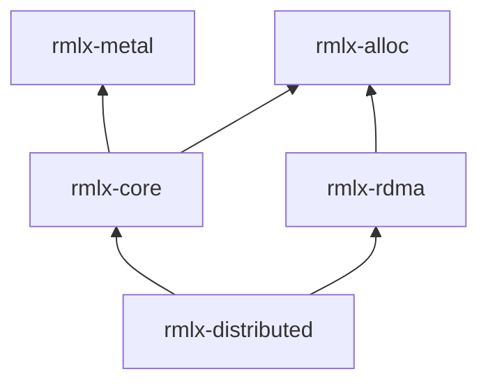

# rmlx-distributed — Distributed Primitives

## Overview

`rmlx-distributed` is a crate providing communication groups, MoE (Mixture of Experts) dispatch/combine exchange, 3-zone backend policy, compute-RDMA pipeline overlap, overflow monitoring (SparseGuard), variable-length EP packet protocol, FP8 exchange path, RDMA slab-ring transport, distributed initialization, warmup protocol, and MoE metrics for distributed inference.

> **Status:** All modules are implemented: group, init, moe_exchange, moe_policy, pipeline, sparse_guard, warmup, metrics, v3_protocol, fp8_exchange, slab_ring, moe_kernels. Phase 0+1+2 audit remediation complete (items D1-D10): dispatch loop ordering fixed (k-outer), per-rank capacity partitioning, combine kernel caching, byte threshold (4KB->2MB), hysteresis path fix, dual cooldown semantics, shared expert support, EP integration improvements. EP-3/EP-5/EP-6 optimization additions complete. EP-2~EP-6 forward path integration: `MoeDispatchConfig::new()` constructor, `dispatch_fp8()` convenience method, `WireProtocol::V3` support in all dispatch paths, SlabRing integration in `route_rdma`, FP8 wire helpers (`pack_for_wire`, `unpack_from_wire`, `wire_token_stride`). **Production Readiness Phase 2 (distributed correctness):** new `moe_kernels.rs` (JIT-compiled MoE Metal kernels), `ExchangeBuffers` struct + `acquire_exchange_buffers()` in moe_exchange, `AcquiredBuffer` lifecycle + `acquire_send_recv_buffers()` in ep_runtime, CAS-based TOCTOU race fix in slab_ring, deadlock fix (interleaved send/recv) in v3_protocol, unknown backend now errors in init. **Phase 3 additions:** ring allreduce element-aligned chunk rounding fix (f16/bf16 reduction via `half` crate, NaN preservation); MoePolicy thread safety via interior mutability (RwLock), all methods now take `&self`, implements Send+Sync.

---

## Module Structure

```
rmlx-distributed/src/
├── lib.rs           # Module declarations
├── group.rs         # Distributed communication group
├── moe_exchange.rs  # MoE dispatch/combine exchange
├── moe_policy.rs    # 3-zone backend policy
├── pipeline.rs      # Compute-RDMA pipeline overlap
├── v3_protocol.rs   # Variable-length EP v3 packet protocol
├── fp8_exchange.rs  # FP8 E4M3 wire exchange + fused dequant-scatter
├── slab_ring.rs     # Pre-registered RDMA slab ring (zero-copy)
├── sparse_guard.rs  # Expert overflow monitoring
├── init.rs          # Distributed initialization (MLX-style)
├── warmup.rs        # RDMA + JIT warmup protocol
├── metrics.rs       # Atomic MoE metrics
└── moe_kernels.rs   # JIT-compiled MoE Metal kernels (scatter-add, permute)
```

---

## EP Optimization Additions (EP-3, EP-5, EP-6)

| Module | Highlights |
|--------|------------|
| `v3_protocol.rs` | Variable-length two-phase exchange (count sendrecv + payload sendrecv), packed 4-byte `PacketMeta` header, 16-byte packet alignment |
| `fp8_exchange.rs` | Per-token FP8 E4M3 wire format, fused `dequant_scatter_fp8e4m3` decode path with `_into_cb` support, wire helpers (`pack_for_wire`, `unpack_from_wire`, `wire_token_stride`) |
| `slab_ring.rs` | Pre-registered `MTLBuffer` slab ring for zero-copy RDMA producer/consumer flow synchronized via `GpuEvent` timeline; integrated into `route_rdma` for pre-allocated `local_output` buffers |

## Phase 3 Additions

### Ring Allreduce Chunk Rounding Fix (P3-6)

The ring allreduce implementation now uses element-aligned chunk boundaries instead of byte-aligned boundaries. This fixes correctness issues when reducing f16/bf16 data where chunk boundaries could split individual elements. The `half` crate is used for native f16/bf16 arithmetic during reduction. NaN values are preserved through the reduction (NaN + x = NaN).

### MoePolicy Thread Safety (P3-7)

`MoePolicy` now uses `RwLock`-based interior mutability, allowing all public methods to take `&self` instead of `&mut self`. This makes `MoePolicy` `Send + Sync`, enabling safe concurrent access from multiple dispatch threads without external synchronization.

---

### fp8_exchange Wire Helpers

The following helper functions in `fp8_exchange.rs` support FP8 wire serialization for dispatch paths:

| Function | Description |
|----------|-------------|
| `pack_for_wire(tokens, scales) -> Vec<u8>` | Packs FP8 E4M3 quantized tokens and their per-token scales into a contiguous wire-format byte buffer suitable for RDMA transfer |
| `unpack_from_wire(wire_bytes, num_tokens, hidden_dim) -> (Vec<u8>, Vec<f32>)` | Unpacks a wire-format buffer back into separate FP8 token data and scale arrays |
| `wire_token_stride(hidden_dim) -> usize` | Returns the per-token byte stride on the wire (FP8 data bytes + scale bytes), used for buffer pre-allocation and offset calculations |

These helpers are used internally by `dispatch_fp8()` and the RDMA exchange paths when `enable_fp8 = true` in `MoeDispatchConfig`.

---

## group.rs — Distributed Communication Group

Abstracts communication groups, providing rank identification and peer management.

```rust
pub struct Group {
    ranks: Vec<u32>,      // sorted unique rank list
    local_rank: u32,      // current node rank
    world_size: u32,      // total number of nodes
    transport: Option<Arc<dyn RdmaTransport>>,  // None = single-process stub
}
```

| Method | Description |
|--------|-------------|
| `Group::new(ranks, local_rank, world_size)` | Creates a group from a rank list (auto-sorted/deduplicated) |
| `Group::world(world_size, local_rank)` | Full rank [0, world_size) group |
| `ranks()` | Rank list within the group |
| `local_rank()` | Current node rank |
| `size()` | Number of ranks in the group |
| `world_size()` | Total world size |
| `peers()` | Peer rank list excluding self |
| `contains(rank)` | Checks whether a rank belongs to the group |

### Array-Level Collective Operations

Convenience wrappers that operate on `rmlx_core::array::Array` instead of raw `&[u8]`. On Apple Silicon UMA, Metal buffer bytes are extracted (zero-copy), the byte-level collective is performed, and a new Array is constructed from the result.

| Method | Description |
|--------|-------------|
| `allreduce_sum(input, device)` | All-reduce sum across ranks; returns Array with same shape/dtype |
| `allgather_array(input, device)` | All-gather across ranks; returns Array with shape `[world_size * dim0, ...rest]` |

Both methods return the input unchanged for single-rank groups (identity).

---

## moe_exchange.rs — MoE Dispatch/Combine Exchange

### MoeDispatchExchange

Dispatch exchange that routes tokens to experts. Supports `WireProtocol::V3` and FP8 exchange in all dispatch paths (EP-2~EP-6 forward path integration).

```rust
pub struct MoeDispatchConfig {
    pub num_experts: usize,
    pub top_k: usize,
    pub capacity_factor: f32,   // 1.0 = exact, >1.0 = overprovisioning
    pub group: Group,
    pub wire_protocol: WireProtocol, // V2 (default) or V3
    pub enable_fp8: bool,            // FP8 quantization for RDMA exchange
}

pub struct MoeDispatchExchange {
    config: MoeDispatchConfig,
    policy: MoePolicy,
    metrics: MoeMetrics,        // internal metrics for moe_exchange
}
```

#### MoeDispatchConfig::new()

```rust
impl MoeDispatchConfig {
    pub fn new(num_experts: usize, top_k: usize, group: Group) -> Self;
}
```

Convenience constructor with non-breaking defaults: `capacity_factor = 1.0`, `wire_protocol = WireProtocol::V2`, `enable_fp8 = false`. This is the recommended entry point for creating a dispatch config -- callers can then chain builder-style setters for optional fields.

| Method | Description |
|--------|-------------|
| `new(config, policy)` | Creates a dispatch exchange (initializes `MoeMetrics::with_experts(num_experts)`) |
| `dispatch(batch_size, expert_indices, expert_weights)` | Dispatches tokens -> `DispatchResult`; records per-expert counts to metrics |
| `dispatch_async(...)` | Async variant of `dispatch`; records per-expert counts to metrics |
| `dispatch_fp8(batch_size, expert_indices, expert_weights)` | FP8-aware dispatch convenience wrapper; automatically quantizes tokens to FP8 E4M3 before RDMA exchange when the config has `enable_fp8 = true`, otherwise falls back to standard `dispatch()` |
| `metrics()` | Queries internal metrics |
| `policy()` / `policy_mut()` | Gets/modifies the policy reference |

#### WireProtocol::V3 Support

All dispatch paths (`route_rdma`, `route_rdma_zero_copy`, `dispatch_async`) now support `WireProtocol::V3`. When `wire_protocol` is set to `V3`, the dispatch uses the two-phase variable-length exchange protocol from `v3_protocol.rs` (count sendrecv + payload sendrecv with packed `PacketMeta` headers and 16-byte alignment).

#### SlabRing Integration in route_rdma

The `route_rdma` path now integrates with `slab_ring.rs` for pre-allocated Metal buffer management. Instead of allocating a new `local_output` buffer per dispatch, the RDMA path acquires a slab from the `SlabRing` producer/consumer ring, performs the RDMA transfer into the pre-registered `MTLBuffer`, and releases it back after the combine phase. This eliminates per-dispatch allocation overhead and enables true zero-copy RDMA transfers synchronized via `GpuEvent` timeline.

### DispatchResult

```rust
pub struct DispatchResult {
    pub backend: MoeBackend,
    pub tokens_per_expert: usize,         // max tokens per expert (capacity)
    pub expert_counts: Vec<usize>,        // actual tokens per expert
    pub overflow_count: u64,              // overflow token count
    pub local_expert_range: (usize, usize),  // local expert index range [start, end)
}
```

### MoeCombineExchange

Combines expert outputs back into original token order.

```rust
pub struct MoeCombineExchange {
    group: Group,
}
```

| Method | Description |
|--------|-------------|
| `combine_cpu(expert_outputs, weights, indices, batch_size, top_k, hidden_dim)` | CPU fallback combine |
| `group()` | Group reference |

### MoeMetrics (moe_exchange internal)

```rust
#[derive(Debug, Clone, Default)]
pub struct MoeMetrics {
    pub tokens_dispatched: u64,
    pub overflow_count: u64,
    pub cpu_dispatches: u64,
    pub metal_dispatches: u64,
    pub rdma_dispatches: u64,
}
```

---

## moe_policy.rs — 3-Zone Backend Policy

Automatically selects CPU/Metal/RDMA backends based on data size. Uses cooldown to prevent oscillation.

### MoeBackend

```rust
pub enum MoeBackend {
    Cpu,
    Metal,
    Rdma,
}
```

### MoePolicy

`MoePolicy` uses interior mutability via `RwLock` (Phase 3), making all methods take `&self` instead of `&mut self`. This enables safe concurrent access from multiple threads and implements `Send + Sync`.

```rust
pub struct MoePolicy {
    inner: RwLock<MoePolicyInner>,       // interior mutability for thread safety
    cooldown_remaining: AtomicU32,
    step_count: AtomicU32,
}

struct MoePolicyInner {
    cpu_max: u32,                         // default: 64
    gpu_min: u32,                         // default: 320
    byte_threshold: usize,               // default: 4096 (4KB)
    cooldown_steps: u32,                 // default: 32
    current_backend: MoeBackend,
}
```

**Selection logic:**

```
N <= cpu_max       -> Cpu
N >= gpu_min       -> Metal
cpu_max < N < gpu_min:
  byte_size < byte_threshold -> Cpu
  byte_size >= byte_threshold -> Metal
During cooldown -> maintain current backend
```

| Method | Description |
|--------|-------------|
| `MoePolicy::new()` | Creates with default thresholds |
| `with_thresholds(cpu_max, gpu_min, byte_threshold)` | Custom thresholds |
| `select(n_elements, byte_size)` | Selects a backend |
| `switch_backend(new_backend)` | Switches backend (activates cooldown) |
| `step()` | Increments step counter |

---

## pipeline.rs — Compute-RDMA Pipeline

Manages layer-level compute-RDMA pipeline overlap.

### PipelineStage

```rust
pub enum PipelineStage {
    WaitingForInput,
    Computing,
    Transferring,
    Complete,
}
```

### PipelineConfig

```rust
pub struct PipelineConfig {
    pub num_layers: usize,
    pub enable_overlap: bool,        // default: true
    pub sync_timeout: Duration,      // default: 5 seconds
}
```

### LayerPipeline

```rust
pub struct LayerPipeline {
    config: PipelineConfig,
    stages: Vec<PipelineStage>,
}
```

| Method | Description |
|--------|-------------|
| `new(config)` | Creates a pipeline (all layers WaitingForInput) |
| `begin_compute(layer)` | Marks a layer's compute as started |
| `begin_transfer(layer)` | Marks a layer's transfer as started |
| `complete(layer)` | Marks a layer as complete |
| `stage(layer)` | Queries a layer's current stage |
| `all_complete()` | Whether all layers are complete |
| `reset()` | Resets all stages to WaitingForInput |
| `measure_overlap(compute_fn, transfer_fn)` | Measures serial vs. pipeline execution time |

### PipelineStats

```rust
pub struct PipelineStats {
    pub serial_time: Duration,
    pub pipeline_time: Duration,
    pub overlap_gain: f64,          // (serial - pipeline) / serial
    pub compute_time: Duration,
    pub transfer_time: Duration,
    pub sync_overhead: Duration,
}
```

---

## sparse_guard.rs — Expert Overflow Monitoring

Tracks overflow ratio via EMA and recommends capacity increases or dense fallback.

### GuardAction

```rust
pub enum GuardAction {
    None,
    IncreaseCapacity(f64),   // Capacity increase factor
    DenseFallback,           // Dense computation fallback
    Reset,                   // Return to normal
}
```

### SparseGuard

```rust
pub struct SparseGuard {
    overflow_ema: f64,         // EMA value
    ema_alpha: f64,            // default: 0.1
    capacity_factor: f64,      // default: 1.0
    dense_fallback: bool,
    window_size: usize,        // default: 100
    step_count: usize,
    overflow_count_window: usize,
    total_count_window: usize,
}
```

| Method | Description |
|--------|-------------|
| `record_step(overflow_count, total_count)` | Records a step |
| `evaluate()` | Updates EMA at window end -> returns `GuardAction` |
| `should_increase_capacity()` | EMA > 0.05 |
| `should_dense_fallback()` | EMA > 0.20 |
| `capacity_factor()` | Current capacity factor |
| `is_dense_fallback()` | Whether dense fallback is active |
| `overflow_ema()` | Current EMA value |

**Policy:**
- EMA > 0.05 -> Increase capacity by 1.25x (max 2.0)
- EMA > 0.20 -> Switch to dense fallback
- During dense, EMA <= 0.05 -> Return to normal (Reset)

---

## init.rs — Distributed Initialization (MLX-style)

Provides `init()` for automatic RDMA bootstrapping from environment variables, with graceful fallback to loopback (single-process) mode.

### InitConfig

```rust
pub struct InitConfig {
    pub strict: bool,                    // fail on error instead of fallback
    pub backend: BackendHint,            // Auto / Rdma / Loopback
    pub rank: Option<u32>,               // override rank (else from env)
    pub world_size: Option<u32>,         // override world_size (else from env)
    pub coordinator_addr: Option<String>,// coordinator address (else RMLX_COORDINATOR)
    pub coordinator_port: Option<u16>,   // coordinator port (default 18520)
    pub device_file: Option<String>,     // device file path (else RMLX_IBV_DEVICES)
    pub topology: Option<String>,        // topology hint
}
```

### BackendHint

```rust
pub enum BackendHint {
    Auto,       // try RDMA first, fall back to loopback
    Rdma,       // force RDMA (fail if unavailable)
    Loopback,   // force loopback (single-process) mode
}
```

### DistributedContext

```rust
pub struct DistributedContext {
    pub group: Group,
    pub rank: u32,
    pub world_size: u32,
    pub backend: BackendHint,
    pub warmup: Option<WarmupResult>,
}
```

| Function | Description |
|----------|-------------|
| `init(config)` | Initialize the distributed context; resolves config from `InitConfig` fields, falling back to environment variables |

### Environment Variables

| Variable | Description |
|----------|-------------|
| `RMLX_RANK` / `RMLX_WORLD_SIZE` | Rank and world size |
| `RMLX_BACKEND` | `"auto"`, `"rdma"`, or `"loopback"` |
| `RMLX_COORDINATOR` | Coordinator address (rank 0's IP) |
| `RMLX_COORDINATOR_PORT` | Coordinator port (default 18520) |
| `RMLX_IBV_DEVICES` | Path to JSON device file |
| `RMLX_TOPOLOGY` | `"ring"`, `"mesh"`, or `"hybrid"` |

Also checks MPI/SLURM compat env vars (`OMPI_COMM_WORLD_RANK`, `PMI_RANK`, `SLURM_PROCID`, etc.) as fallback for rank/world_size.

---

## warmup.rs — RDMA + JIT Warmup Protocol

Performs RDMA connection warmup and Metal JIT kernel compilation before inference begins. Called internally by `init()` after RDMA connection establishment.

### WarmupConfig

```rust
pub struct WarmupConfig {
    pub rdma_rounds: usize,      // default: 10
    pub jit_precompile: bool,    // default: true
    pub run_calibration: bool,   // default: true
}
```

### WarmupState

```rust
pub struct WarmupState {
    rdma_warmed: bool,
    jit_warmed: bool,
    last_result: Option<WarmupResult>,
    calibration: ThresholdCalibration,
}
```

| Method | Description |
|--------|-------------|
| `set_rdma_warmed()` | Marks RDMA warmup as complete |
| `set_jit_warmed()` | Marks JIT warmup as complete |
| `is_ready()` | Whether both are complete |
| `set_result(result)` | Stores the warmup result |
| `last_result()` | Last warmup result |
| `run_warmup(config, rdma_fn, jit_fn)` | Run full warmup: RDMA + JIT + calibration (idempotent) |

### WarmupResult

```rust
pub struct WarmupResult {
    pub rdma_warmup: Duration,
    pub jit_warmup: Duration,
    pub calibration: Duration,
    pub total: Duration,
}
```

---

## metrics.rs — Atomic MoE Metrics

`AtomicU64`-based lock-free MoE operational counters.

### MoeMetrics (metrics module)

```rust
pub struct MoeMetrics {
    pub dispatch_count: AtomicU64,
    pub combine_count: AtomicU64,
    pub cpu_dispatches: AtomicU64,
    pub metal_dispatches: AtomicU64,
    pub rdma_dispatches: AtomicU64,
    pub overflow_events: AtomicU64,
    pub zone_switches: AtomicU64,
    pub total_tokens_routed: AtomicU64,
    pub dense_fallback_count: AtomicU64,
    pub expert_histogram: Vec<AtomicU64>, // per-expert accumulated token count
    pub num_experts: usize,
}
```

| Method | Description |
|--------|-------------|
| `with_experts(num_experts)` | Creates metrics with `expert_histogram` initialized to `num_experts` entries |
| `record_dispatch(tokens)` | Records dispatch count + token count |
| `record_combine()` | Records combine count |
| `record_cpu_dispatch()` | Records a CPU dispatch |
| `record_metal_dispatch()` | Records a Metal dispatch |
| `record_rdma_dispatch()` | Records an RDMA dispatch |
| `record_overflow()` | Records an overflow event |
| `record_zone_switch()` | Records a zone switch |
| `record_dense_fallback()` | Records a dense fallback |
| `record_expert_counts(counts)` | Accumulates per-expert token counts into `expert_histogram` |
| `snapshot()` | Point-in-time snapshot -> `MoeMetricsSnapshot` |

### MoeMetricsSnapshot

```rust
#[derive(Debug, Clone)]
pub struct MoeMetricsSnapshot {
    pub dispatch_count: u64,
    pub combine_count: u64,
    pub cpu_dispatches: u64,
    pub metal_dispatches: u64,
    pub rdma_dispatches: u64,
    pub overflow_events: u64,
    pub zone_switches: u64,
    pub total_tokens_routed: u64,
    pub dense_fallback_count: u64,
    pub expert_histogram: Vec<u64>,
}
```

---

## Dependencies



```toml
[dependencies]
rmlx-core = { path = "../rmlx-core" }
rmlx-rdma = { path = "../rmlx-rdma" }
```
