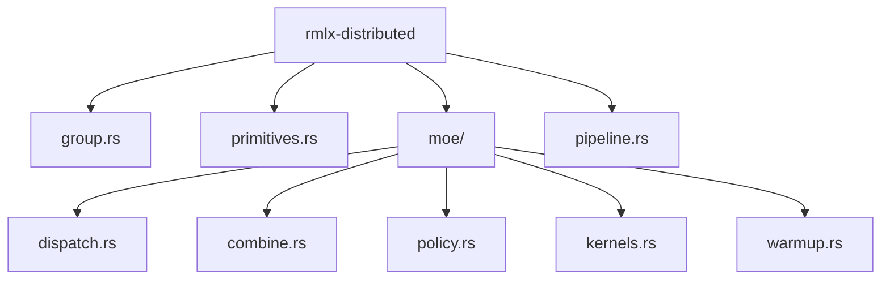
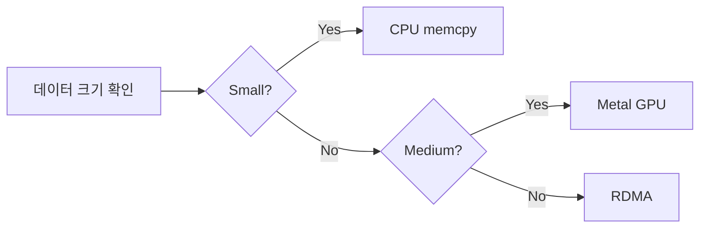
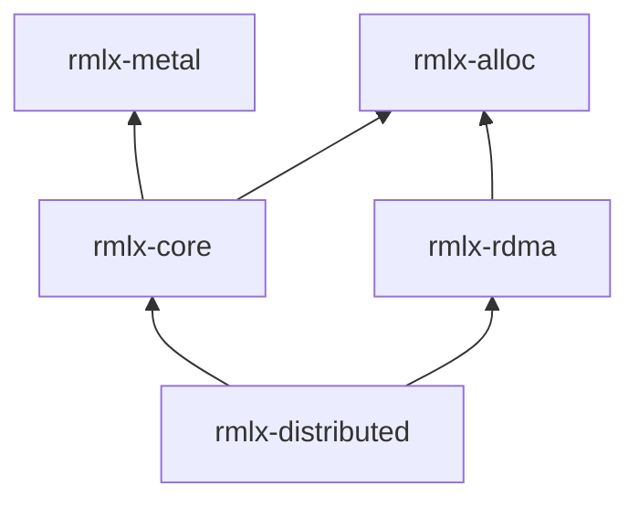

# rmlx-distributed — 분산 프리미티브

## 개요

`rmlx-distributed`는 분산 추론을 위한 통신 프리미티브 및 MoE (Mixture of Experts) Expert Parallelism을 구현하는 크레이트입니다. `rmlx-rdma`의 RDMA 통신 계층 위에 AllReduce, AllGather, AllToAll 등의 집합 통신과 MoE 전용 디스패치/결합 교환을 구현합니다.

> **상태:** 현재 스켈레톤 상태이며, Phase 4에서 구현 예정입니다.

---

## 계획된 모듈



### `group.rs` — 분산 그룹 *계획됨 (Phase 4)*

분산 실행 그룹을 추상화합니다.

| 속성 | 설명 |
|------|------|
| `rank` | 현재 노드의 순위 (0-indexed) |
| `world_size` | 전체 노드 수 |
| `peers` | 연결된 피어 노드 목록 |

```rust
// 계획됨 (Phase 4)
pub struct DistributedGroup {
    rank: u32,
    world_size: u32,
    peers: Vec<PeerConnection>,
}
```

---

### `primitives.rs` — 집합 통신 프리미티브 *계획됨 (Phase 4)*

분산 연산에 필요한 기본 통신 프리미티브를 제공합니다.

| 프리미티브 | 설명 | 용도 |
|-----------|------|------|
| `AllReduce` | 모든 노드의 데이터를 집계하여 결과를 모든 노드에 배포 | 그래디언트 동기화 |
| `AllGather` | 모든 노드의 데이터를 수집하여 모든 노드에 배포 | 텐서 병렬 출력 수집 |
| `Send` / `Recv` | 점대점(point-to-point) 전송 | 파이프라인 병렬 |
| `AllToAll` | 모든 노드 간 데이터 재분배 | MoE Expert Parallelism |

---

### `moe/` — MoE Expert Parallelism *계획됨 (Phase 4)*

Mixture of Experts 모델의 분산 추론을 위한 전용 모듈입니다.

#### `dispatch.rs` — `MoeDispatchExchange`

MoE 게이트 출력에 따라 토큰을 적절한 전문가(expert)에게 디스패치하는 교환 로직을 구현합니다.

#### `combine.rs` — `MoeCombineExchange`

각 전문가의 출력을 원래 토큰 순서로 결합하는 교환 로직을 구현합니다.

#### `policy.rs` — 3-zone 정책

데이터 크기에 따라 최적의 통신 백엔드를 자동 선택합니다.

| Zone | 데이터 크기 | 백엔드 | 이유 |
|------|-----------|--------|------|
| Small | 수 KB 이하 | CPU memcpy | RDMA 오버헤드 > 이점 |
| Medium | 수십 KB ~ 수 MB | Metal GPU | GPU 병렬 처리 활용 |
| Large | 수 MB 이상 | RDMA byte 전송 | 네트워크 대역폭 최대 활용 |



#### `kernels.rs` — MoE Metal 커널

MoE 연산 전용 7종의 Metal 컴퓨트 커널을 관리합니다.

#### `warmup.rs` — RDMA + Metal JIT 사전 워밍업

추론 시작 전에 RDMA 연결 워밍업과 Metal JIT 커널 컴파일을 수행하여 첫 번째 토큰 생성 지연을 최소화합니다.

---

### `pipeline.rs` — Compute↔RDMA 파이프라인 *계획됨 (Phase 4)*

레이어 단위의 compute↔RDMA 파이프라인 오버랩을 구현합니다.

```mermaid
gantt
    title 레이어별 Compute↔RDMA 파이프라인 오버랩
    dateFormat X
    axisFormat %s

    section Layer N
    Compute (Layer N)   :a1, 0, 3
    RDMA Send (Layer N) :a2, 3, 5

    section Layer N+1
    Compute (Layer N+1) :b1, 3, 6
    RDMA Send (Layer N+1) :b2, 6, 8
```



- Layer N의 RDMA 전송과 Layer N+1의 컴퓨트를 동시에 수행합니다
- 듀얼 큐(compute + transfer)를 활용하여 GPU 유휴 시간을 최소화합니다
- `rmlx-metal`의 `StreamManager`와 연계하여 동작합니다

---

## 구현 시점

**Phase 4** — rmlx-core, rmlx-rdma 완료 후 구현을 시작합니다.

---

## 의존성



```toml
[dependencies]
rmlx-core = { path = "../rmlx-core" }
rmlx-rdma = { path = "../rmlx-rdma" }
```
