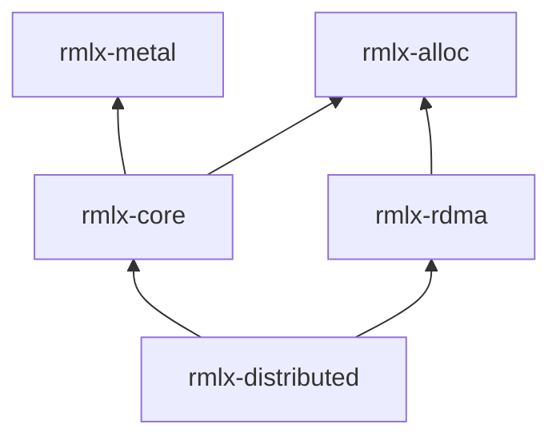

# rmlx-distributed — 분산 프리미티브

## 개요

`rmlx-distributed`는 분산 추론을 위한 통신 그룹, MoE (Mixture of Experts) 디스패치/결합 교환, 3-zone 백엔드 정책, compute↔RDMA 파이프라인 오버랩, 오버플로우 감시(SparseGuard), 워밍업 프로토콜, MoE 메트릭을 제공하는 크레이트입니다.

> **상태:** 모든 모듈이 구현되어 있습니다. group, moe_exchange, moe_policy, pipeline, sparse_guard, warmup, metrics, v3_protocol, fp8_exchange, slab_ring. Phase 0+1+2 감사 수정 완료 (항목 D1-D10): 디스패치 루프 순서 수정 (k-outer), 랭크별 용량 분배, combine 커널 캐싱, byte threshold (4KB->2MB), 히스테리시스 경로 수정, 이중 쿨다운 시맨틱, 공유 expert 지원, EP 통합 개선. EP-3/EP-5/EP-6 최적화 추가 완료. EP-2~EP-6 순방향 경로 통합: `MoeDispatchConfig::new()` 생성자, `dispatch_fp8()` 편의 메서드, 모든 디스패치 경로에서 `WireProtocol::V3` 지원, `route_rdma`에 SlabRing 통합, FP8 와이어 헬퍼 (`pack_for_wire`, `unpack_from_wire`, `wire_token_stride`).

---

## 모듈 구조

```
rmlx-distributed/src/
├── lib.rs           # 모듈 선언
├── group.rs         # 분산 통신 그룹
├── moe_exchange.rs  # MoE 디스패치/결합 교환
├── moe_policy.rs    # 3-zone 백엔드 정책
├── pipeline.rs      # compute↔RDMA 파이프라인 오버랩
├── v3_protocol.rs   # 가변 길이 EP v3 패킷 프로토콜 (EP-3)
├── fp8_exchange.rs  # FP8 E4M3 와이어 교환 + 융합 dequant-scatter (EP-5)
├── slab_ring.rs     # 사전 등록 RDMA slab 링 (zero-copy) (EP-6)
├── sparse_guard.rs  # Expert 오버플로우 감시
├── warmup.rs        # RDMA + JIT 사전 워밍업
└── metrics.rs       # 원자적 MoE 메트릭
```

---

## EP 최적화 추가 모듈 (EP-3, EP-5, EP-6)

| 모듈 | 주요 특징 |
|------|-----------|
| `v3_protocol.rs` | 가변 길이 2단계 교환 (count sendrecv + payload sendrecv), 패킹된 4바이트 `PacketMeta` 헤더, 16바이트 패킷 정렬 |
| `fp8_exchange.rs` | 토큰별 FP8 E4M3 와이어 포맷, `_into_cb` 지원을 포함한 융합 `dequant_scatter_fp8e4m3` 디코드 경로, 와이어 헬퍼 (`pack_for_wire`, `unpack_from_wire`, `wire_token_stride`) |
| `slab_ring.rs` | `GpuEvent` 타임라인으로 동기화되는 zero-copy RDMA 프로듀서/컨슈머 흐름을 위한 사전 등록 `MTLBuffer` slab 링; `route_rdma`에서 사전 할당된 `local_output` 버퍼에 통합 |

### fp8_exchange 와이어 헬퍼

`fp8_exchange.rs`의 다음 헬퍼 함수들은 디스패치 경로에서 FP8 와이어 직렬화를 지원합니다:

| 함수 | 설명 |
|------|------|
| `pack_for_wire(tokens, scales) -> Vec<u8>` | FP8 E4M3 양자화된 토큰과 토큰별 스케일을 RDMA 전송에 적합한 연속 와이어 포맷 바이트 버퍼로 패킹 |
| `unpack_from_wire(wire_bytes, num_tokens, hidden_dim) -> (Vec<u8>, Vec<f32>)` | 와이어 포맷 버퍼를 FP8 토큰 데이터와 스케일 배열로 분리하여 언패킹 |
| `wire_token_stride(hidden_dim) -> usize` | 와이어상의 토큰별 바이트 스트라이드 반환 (FP8 데이터 바이트 + 스케일 바이트), 버퍼 사전 할당 및 오프셋 계산에 사용 |

이 헬퍼들은 `MoeDispatchConfig`에서 `enable_fp8 = true`일 때 `dispatch_fp8()` 및 RDMA 교환 경로에서 내부적으로 사용됩니다.

---

## group.rs — 분산 통신 그룹

통신 그룹을 추상화하여 rank 식별과 피어 관리를 제공합니다.

```rust
pub struct Group {
    ranks: Vec<u32>,      // 정렬된 고유 rank 목록
    local_rank: u32,      // 현재 노드 rank
    world_size: u32,      // 전체 노드 수
    transport: Option<Arc<dyn RdmaTransport>>,  // None = 단일 프로세스 스텁
}
```

| 메서드 | 설명 |
|--------|------|
| `Group::new(ranks, local_rank, world_size)` | rank 목록에서 그룹 생성 (자동 정렬/중복 제거) |
| `Group::world(world_size, local_rank)` | 전체 rank [0, world_size) 그룹 |
| `ranks()` | 그룹 내 rank 목록 |
| `local_rank()` | 현재 노드 rank |
| `size()` | 그룹 내 rank 수 |
| `world_size()` | 전체 월드 크기 |
| `peers()` | 자신을 제외한 피어 rank 목록 |
| `contains(rank)` | rank가 그룹에 속하는지 확인 |

### Array 수준 집합 연산

원시 `&[u8]` 대신 `rmlx_core::array::Array`에 대해 동작하는 편의 래퍼입니다. Apple Silicon UMA에서 Metal 버퍼 바이트를 추출하고(zero-copy), 바이트 수준 집합 연산을 수행한 뒤, 결과로부터 새 Array를 생성합니다.

| 메서드 | 설명 |
|--------|------|
| `allreduce_sum(input, device)` | 전체 rank에 대한 all-reduce sum; 동일 shape/dtype의 Array 반환 |
| `allgather_array(input, device)` | 전체 rank에 대한 all-gather; shape `[world_size * dim0, ...rest]`의 Array 반환 |

단일 rank 그룹에서는 입력을 그대로 반환합니다 (항등 연산).

---

## moe_exchange.rs — MoE 디스패치/결합 교환

### MoeDispatchExchange

토큰을 expert에 라우팅하는 디스패치 교환입니다. 모든 디스패치 경로에서 `WireProtocol::V3` 및 FP8 교환을 지원합니다 (EP-2~EP-6 순방향 경로 통합).

```rust
pub struct MoeDispatchConfig {
    pub num_experts: usize,
    pub top_k: usize,
    pub capacity_factor: f32,   // 1.0 = 정확, >1.0 = 오버프로비저닝
    pub group: Group,
    pub wire_protocol: WireProtocol, // V2 (기본값) 또는 V3
    pub enable_fp8: bool,            // RDMA 교환을 위한 FP8 양자화
}

pub struct MoeDispatchExchange {
    config: MoeDispatchConfig,
    policy: MoePolicy,
    metrics: MoeMetrics,        // moe_exchange 내부 메트릭
}
```

#### MoeDispatchConfig::new()

```rust
impl MoeDispatchConfig {
    pub fn new(num_experts: usize, top_k: usize, group: Group) -> Self;
}
```

비파괴 기본값을 사용하는 편의 생성자: `capacity_factor = 1.0`, `wire_protocol = WireProtocol::V2`, `enable_fp8 = false`. 디스패치 설정을 생성하는 권장 진입점이며, 선택적 필드는 빌더 스타일 setter를 체이닝하여 설정할 수 있습니다.

| 메서드 | 설명 |
|--------|------|
| `new(config, policy)` | 디스패치 교환 생성 (`MoeMetrics::with_experts(num_experts)` 초기화) |
| `dispatch(batch_size, expert_indices, expert_weights)` | 토큰 디스패치 → `DispatchResult`; 메트릭에 expert별 카운트 기록 |
| `dispatch_async(...)` | `dispatch`의 비동기 변형; 메트릭에 expert별 카운트 기록 |
| `dispatch_fp8(batch_size, expert_indices, expert_weights)` | FP8 인식 디스패치 편의 래퍼; 설정에서 `enable_fp8 = true`일 때 RDMA 교환 전 토큰을 FP8 E4M3로 자동 양자화, 그 외에는 표준 `dispatch()`로 폴백 |
| `metrics()` | 내부 메트릭 조회 |
| `policy()` / `policy_mut()` | 정책 참조/변경 |

#### WireProtocol::V3 지원

모든 디스패치 경로 (`route_rdma`, `route_rdma_zero_copy`, `dispatch_async`)가 이제 `WireProtocol::V3`를 지원합니다. `wire_protocol`이 `V3`로 설정되면, `v3_protocol.rs`의 2단계 가변 길이 교환 프로토콜(count sendrecv + payload sendrecv, 패킹된 `PacketMeta` 헤더와 16바이트 정렬)을 사용합니다.

#### route_rdma에서의 SlabRing 통합

`route_rdma` 경로는 이제 `slab_ring.rs`와 통합되어 사전 할당된 Metal 버퍼 관리를 수행합니다. 디스패치마다 새 `local_output` 버퍼를 할당하는 대신, RDMA 경로가 `SlabRing` 프로듀서/컨슈머 링에서 slab을 획득하고, 사전 등록된 `MTLBuffer`에 RDMA 전송을 수행한 뒤, combine 단계 후 반환합니다. 이를 통해 디스패치별 할당 오버헤드를 제거하고 `GpuEvent` 타임라인으로 동기화되는 진정한 zero-copy RDMA 전송을 가능하게 합니다.

### DispatchResult

```rust
pub struct DispatchResult {
    pub backend: MoeBackend,
    pub tokens_per_expert: usize,         // Expert당 최대 토큰 수 (capacity)
    pub expert_counts: Vec<usize>,        // Expert별 실제 토큰 수
    pub overflow_count: u64,              // 오버플로우 토큰 수
    pub local_expert_range: (usize, usize),  // 로컬 expert 인덱스 범위 [start, end)
}
```

### MoeCombineExchange

Expert 출력을 원래 토큰 순서로 결합합니다.

```rust
pub struct MoeCombineExchange {
    group: Group,
}
```

| 메서드 | 설명 |
|--------|------|
| `combine_cpu(expert_outputs, weights, indices, batch_size, top_k, hidden_dim)` | CPU 폴백 결합 |
| `group()` | 그룹 참조 |

### MoeMetrics (moe_exchange 내부)

```rust
#[derive(Debug, Clone, Default)]
pub struct MoeMetrics {
    pub tokens_dispatched: u64,
    pub overflow_count: u64,
    pub cpu_dispatches: u64,
    pub metal_dispatches: u64,
    pub rdma_dispatches: u64,
}
```

---

## moe_policy.rs — 3-zone 백엔드 정책

데이터 크기에 따라 CPU/Metal/RDMA 백엔드를 자동 선택합니다. 쿨다운으로 진동을 방지합니다.

### MoeBackend

```rust
pub enum MoeBackend {
    Cpu,
    Metal,
    Rdma,
}
```

### MoePolicy

```rust
pub struct MoePolicy {
    cpu_max: u32,                         // 기본값: 64
    gpu_min: u32,                         // 기본값: 320
    byte_threshold: usize,               // 기본값: 4096 (4KB)
    cooldown_steps: u32,                 // 기본값: 32
    current_backend: MoeBackend,
    cooldown_remaining: AtomicU32,
    step_count: AtomicU32,
}
```

**선택 로직:**

```
N <= cpu_max       → Cpu
N >= gpu_min       → Metal
cpu_max < N < gpu_min:
  byte_size < byte_threshold → Cpu
  byte_size >= byte_threshold → Metal
쿨다운 중 → 현재 백엔드 유지
```

| 메서드 | 설명 |
|--------|------|
| `MoePolicy::new()` | 기본 임계값으로 생성 |
| `with_thresholds(cpu_max, gpu_min, byte_threshold)` | 커스텀 임계값 |
| `select(n_elements, byte_size)` | 백엔드 선택 |
| `switch_backend(new_backend)` | 백엔드 전환 (쿨다운 활성화) |
| `step()` | 스텝 카운터 증가 |

---

## pipeline.rs — Compute↔RDMA 파이프라인

레이어 단위의 compute↔RDMA 파이프라인 오버랩을 관리합니다.

### PipelineStage

```rust
pub enum PipelineStage {
    WaitingForInput,
    Computing,
    Transferring,
    Complete,
}
```

### PipelineConfig

```rust
pub struct PipelineConfig {
    pub num_layers: usize,
    pub enable_overlap: bool,        // 기본값: true
    pub sync_timeout: Duration,      // 기본값: 5초
}
```

### LayerPipeline

```rust
pub struct LayerPipeline {
    config: PipelineConfig,
    stages: Vec<PipelineStage>,
}
```

| 메서드 | 설명 |
|--------|------|
| `new(config)` | 파이프라인 생성 (모든 레이어 WaitingForInput) |
| `begin_compute(layer)` | 레이어 컴퓨트 시작 표시 |
| `begin_transfer(layer)` | 레이어 전송 시작 표시 |
| `complete(layer)` | 레이어 완료 표시 |
| `stage(layer)` | 레이어 현재 단계 조회 |
| `all_complete()` | 모든 레이어 완료 여부 |
| `reset()` | 모든 단계 WaitingForInput으로 초기화 |
| `measure_overlap(compute_fn, transfer_fn)` | 직렬 vs 파이프라인 실행 시간 측정 |

### PipelineStats

```rust
pub struct PipelineStats {
    pub serial_time: Duration,
    pub pipeline_time: Duration,
    pub overlap_gain: f64,          // (serial - pipeline) / serial
    pub compute_time: Duration,
    pub transfer_time: Duration,
    pub sync_overhead: Duration,
}
```

---

## sparse_guard.rs — Expert 오버플로우 감시

오버플로우 비율을 EMA로 추적하고, 용량 증가 또는 Dense 폴백을 권고합니다.

### GuardAction

```rust
pub enum GuardAction {
    None,
    IncreaseCapacity(f64),   // 용량 증가 팩터
    DenseFallback,           // Dense 연산 폴백
    Reset,                   // 정상 복귀
}
```

### SparseGuard

```rust
pub struct SparseGuard {
    overflow_ema: f64,         // EMA 값
    ema_alpha: f64,            // 기본값: 0.1
    capacity_factor: f64,      // 기본값: 1.0
    dense_fallback: bool,
    window_size: usize,        // 기본값: 100
    step_count: usize,
    overflow_count_window: usize,
    total_count_window: usize,
}
```

| 메서드 | 설명 |
|--------|------|
| `record_step(overflow_count, total_count)` | 스텝 기록 |
| `evaluate()` | 윈도우 종료 시 EMA 갱신 → `GuardAction` 반환 |
| `should_increase_capacity()` | EMA > 0.05 |
| `should_dense_fallback()` | EMA > 0.20 |
| `capacity_factor()` | 현재 용량 팩터 |
| `is_dense_fallback()` | Dense 폴백 활성 여부 |
| `overflow_ema()` | 현재 EMA 값 |

**정책:**
- EMA > 0.05 → 용량 1.25배 증가 (최대 2.0)
- EMA > 0.20 → Dense 폴백 전환
- Dense 중 EMA <= 0.05 → 정상 복귀 (Reset)

---

## warmup.rs — RDMA + JIT 사전 워밍업

추론 시작 전에 RDMA 연결 워밍업과 Metal JIT 커널 컴파일을 수행합니다.

### WarmupConfig

```rust
pub struct WarmupConfig {
    pub rdma_rounds: usize,      // 기본값: 10
    pub jit_precompile: bool,    // 기본값: true
}
```

### WarmupState

```rust
pub struct WarmupState {
    rdma_warmed: bool,
    jit_warmed: bool,
    last_result: Option<WarmupResult>,
}
```

| 메서드 | 설명 |
|--------|------|
| `set_rdma_warmed()` | RDMA 워밍업 완료 표시 |
| `set_jit_warmed()` | JIT 워밍업 완료 표시 |
| `is_ready()` | 둘 다 완료 여부 |
| `set_result(result)` | 워밍업 결과 저장 |
| `last_result()` | 마지막 워밍업 결과 |

### WarmupResult

```rust
pub struct WarmupResult {
    pub rdma_warmup: Duration,
    pub jit_warmup: Duration,
    pub total: Duration,
}
```

---

## metrics.rs — 원자적 MoE 메트릭

`AtomicU64` 기반의 lock-free MoE 운영 카운터입니다.

### MoeMetrics (metrics 모듈)

```rust
pub struct MoeMetrics {
    pub dispatch_count: AtomicU64,
    pub combine_count: AtomicU64,
    pub cpu_dispatches: AtomicU64,
    pub metal_dispatches: AtomicU64,
    pub rdma_dispatches: AtomicU64,
    pub overflow_events: AtomicU64,
    pub zone_switches: AtomicU64,
    pub total_tokens_routed: AtomicU64,
    pub dense_fallback_count: AtomicU64,
}
```

| 메서드 | 설명 |
|--------|------|
| `record_dispatch(tokens)` | 디스패치 횟수 + 토큰 수 기록 |
| `record_combine()` | 결합 횟수 기록 |
| `record_cpu_dispatch()` | CPU 디스패치 기록 |
| `record_metal_dispatch()` | Metal 디스패치 기록 |
| `record_rdma_dispatch()` | RDMA 디스패치 기록 |
| `record_overflow()` | 오버플로우 이벤트 기록 |
| `record_zone_switch()` | Zone 전환 기록 |
| `record_dense_fallback()` | Dense 폴백 기록 |
| `snapshot()` | 시점 스냅샷 → `MoeMetricsSnapshot` |

### MoeMetricsSnapshot

```rust
#[derive(Debug, Clone)]
pub struct MoeMetricsSnapshot {
    pub dispatch_count: u64,
    pub combine_count: u64,
    pub cpu_dispatches: u64,
    pub metal_dispatches: u64,
    pub rdma_dispatches: u64,
    pub overflow_events: u64,
    pub zone_switches: u64,
    pub total_tokens_routed: u64,
    pub dense_fallback_count: u64,
}
```

---

## 의존성



```toml
[dependencies]
rmlx-core = { path = "../rmlx-core" }
rmlx-rdma = { path = "../rmlx-rdma" }
```
