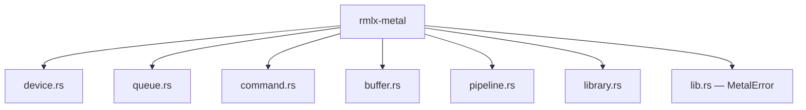
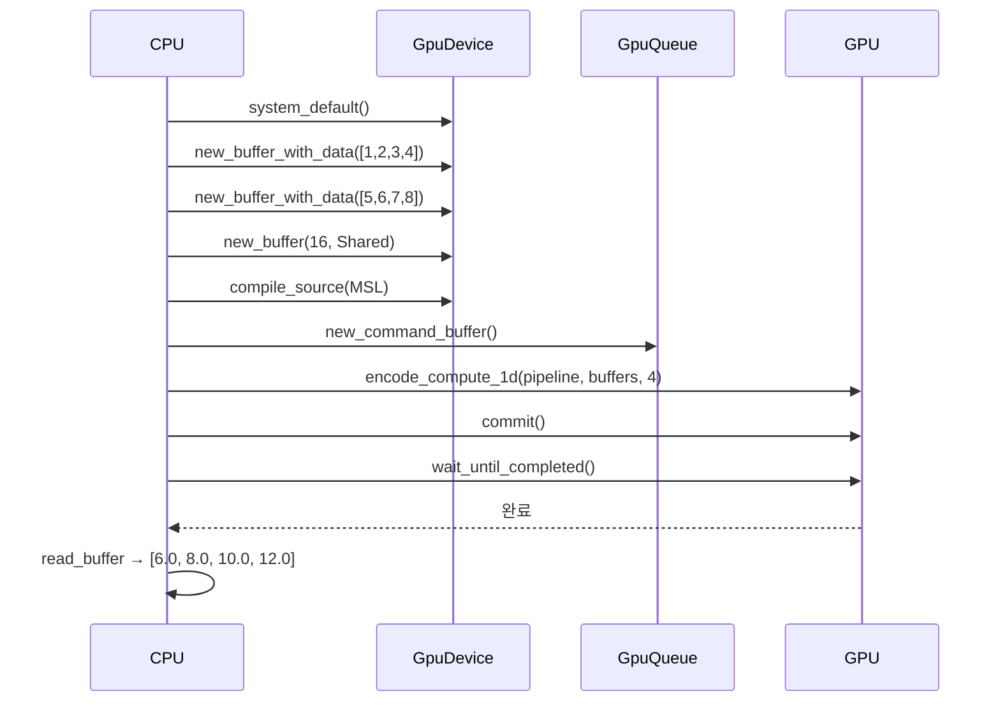

# rmlx-metal — Metal GPU 추상화 계층

## 개요

`rmlx-metal`은 Apple Metal GPU API에 대한 안전하고 편리한 Rust 래퍼 계층입니다. Metal 디바이스, 커맨드 큐, 버퍼, 컴퓨트 파이프라인, 셰이더 라이브러리를 추상화하여 GPU 연산을 간결하게 수행할 수 있도록 합니다.

`metal-rs` 0.31 크레이트를 기반으로 하며, MLX의 Metal 추상화 구조를 참고하여 Rust 관용적 API로 재설계하였습니다. 현재 RMLX 프로젝트에서 가장 먼저 완전 구현된 크레이트입니다(Phase 0 완료).

---

## 모듈 구조



### `device.rs` — `GpuDevice`

Metal 디바이스의 획득, 아키텍처 감지, 버퍼/큐 팩토리 메서드를 제공합니다.

| 메서드 | 설명 |
|--------|------|
| `system_default()` | 시스템 기본 Metal 디바이스를 획득합니다 |
| `name()` | 디바이스 이름을 반환합니다 (예: "Apple M2 Max") |
| `architecture()` | 감지된 GPU 아키텍처를 반환합니다 |
| `has_unified_memory()` | UMA 지원 여부를 확인합니다 (Apple Silicon은 항상 `true`) |
| `max_buffer_length()` | 단일 버퍼 최대 크기(바이트)를 반환합니다 |
| `max_threadgroup_memory()` | 최대 threadgroup 메모리 크기를 반환합니다 |
| `new_command_queue()` | 새 커맨드 큐를 생성합니다 |
| `new_buffer()` | 초기화되지 않은 버퍼를 할당합니다 |
| `new_buffer_with_data<T>()` | 슬라이스 데이터로 초기화된 `StorageModeShared` 버퍼를 생성합니다 |
| `raw()` | 내부 `metal::Device` 참조를 반환합니다 |

**아키텍처 감지:**

디바이스 이름 문자열을 파싱하여 Apple Silicon 세대를 판별합니다.

```rust
pub enum Architecture {
    Apple { generation: u32 },  // M1=15, M2=16, M3=17, M4=18
    Unknown,
}
```

| 칩 | generation 값 |
|----|--------------|
| M1 | 15 |
| M2 | 16 |
| M3 | 17 |
| M4 | 18 |

```rust
fn detect_architecture(name: &str) -> Architecture {
    if name.contains("M4") {
        Architecture::Apple { generation: 18 }
    } else if name.contains("M3") {
        Architecture::Apple { generation: 17 }
    } else if name.contains("M2") {
        Architecture::Apple { generation: 16 }
    } else if name.contains("M1") {
        Architecture::Apple { generation: 15 }
    } else {
        Architecture::Unknown
    }
}
```

---

### `queue.rs` — `GpuQueue`

Metal 커맨드 큐에 대한 얇은 래퍼입니다.

| 메서드 | 설명 |
|--------|------|
| `new(device)` | 지정된 디바이스에 새 커맨드 큐를 생성합니다 |
| `new_command_buffer()` | 이 큐에서 새 커맨드 버퍼를 생성합니다 |
| `raw()` | 내부 `metal::CommandQueue` 참조를 반환합니다 |

```rust
pub struct GpuQueue {
    queue: CommandQueue,
}

impl GpuQueue {
    pub fn new(device: &GpuDevice) -> Self {
        Self {
            queue: device.new_command_queue(),
        }
    }

    pub fn new_command_buffer(&self) -> &CommandBufferRef {
        self.queue.new_command_buffer()
    }
}
```

> **참고:** Phase 0에서는 단일 큐 래퍼로 구현되어 있습니다. Phase 3에서 듀얼 큐 `StreamManager`로 확장될 예정입니다.

---

### `command.rs` — `encode_compute_1d()`

1D 컴퓨트 디스패치를 위한 편의 함수입니다. 인코더 생성부터 디스패치 완료까지의 전체 과정을 한 번의 호출로 처리합니다.

**처리 흐름:**
1. 커맨드 버퍼에서 컴퓨트 커맨드 인코더 생성
2. 파이프라인 스테이트 설정
3. 버퍼 바인딩 (연속 인덱스 0, 1, 2, ...)
4. 1D 그리드로 스레드 디스패치
5. 인코딩 종료

```rust
pub fn encode_compute_1d(
    cmd_buf: &CommandBufferRef,
    pipeline: &ComputePipelineState,
    buffers: &[(&Buffer, u64)],    // (버퍼, 오프셋) 쌍의 배열
    num_threads: u64,
) {
    let encoder = cmd_buf.new_compute_command_encoder();
    encoder.set_compute_pipeline_state(pipeline);

    for (index, (buffer, offset)) in buffers.iter().enumerate() {
        encoder.set_buffer(index as u64, Some(buffer), *offset);
    }

    let max_threads = pipeline.max_total_threads_per_threadgroup();
    let threadgroup_size = std::cmp::min(max_threads, num_threads);

    let grid_size = MTLSize::new(num_threads, 1, 1);
    let group_size = MTLSize::new(threadgroup_size, 1, 1);

    encoder.dispatch_threads(grid_size, group_size);
    encoder.end_encoding();
}
```

---

### `buffer.rs` — 버퍼 관리

GPU 버퍼의 생성과 읽기를 위한 유틸리티 함수들을 제공합니다.

| 함수 | 설명 |
|------|------|
| `new_buffer_with_data<T>()` | 타입 슬라이스로 초기화된 `StorageModeShared` 버퍼를 생성합니다 |
| `new_buffer_no_copy()` | 외부 할당 메모리를 감싸는 zero-copy 버퍼를 생성합니다 (`unsafe`) |
| `read_buffer<T>()` | GPU 버퍼 내용을 타입 슬라이스로 읽어옵니다 (`unsafe`) |

```rust
// 데이터로 초기화된 버퍼 생성
pub fn new_buffer_with_data<T>(device: &metal::Device, data: &[T]) -> MTLBuffer {
    let size = std::mem::size_of_val(data) as u64;
    let ptr = data.as_ptr() as *const c_void;
    device.new_buffer_with_data(ptr, size, MTLResourceOptions::StorageModeShared)
}

// Zero-copy 버퍼 생성 (외부 할당 메모리 래핑)
pub unsafe fn new_buffer_no_copy(
    device: &metal::Device,
    ptr: *mut c_void,
    size: u64,
) -> MTLBuffer { ... }

// GPU→CPU 결과 읽기
pub unsafe fn read_buffer<T>(buffer: &MTLBuffer, count: usize) -> &[T] {
    let ptr = buffer.contents() as *const T;
    std::slice::from_raw_parts(ptr, count)
}
```

---

### `pipeline.rs` — `PipelineCache`

커널 함수 이름을 키로 사용하는 `HashMap` 기반 컴퓨트 파이프라인 캐시입니다. 동일 커널의 반복 디스패치 시 중복 컴파일을 방지합니다.

| 메서드 | 설명 |
|--------|------|
| `new(device)` | 빈 파이프라인 캐시를 생성합니다 |
| `get_or_create(name, library)` | 캐시된 파이프라인을 반환하거나, 없으면 컴파일하여 캐시한 뒤 반환합니다 |

```rust
pub struct PipelineCache {
    device: metal::Device,
    cache: HashMap<String, ComputePipelineState>,
}

impl PipelineCache {
    pub fn get_or_create(
        &mut self,
        name: &str,
        library: &Library,
    ) -> Result<&ComputePipelineState, MetalError> {
        if !self.cache.contains_key(name) {
            let function = library
                .get_function(name, None)
                .map_err(|_| MetalError::KernelNotFound(name.to_string()))?;
            let pipeline = self.device
                .new_compute_pipeline_state_with_function(&function)
                .map_err(|e| MetalError::PipelineCreate(e.to_string()))?;
            self.cache.insert(name.to_string(), pipeline);
        }
        Ok(self.cache.get(name).expect("just inserted"))
    }
}
```

---

### `library.rs` — 셰이더 라이브러리 로딩

AOT 컴파일된 `.metallib` 파일 로드와 MSL 소스 문자열 JIT 컴파일을 지원합니다.

| 함수 | 설명 |
|------|------|
| `load_metallib(device, path)` | 디스크에서 사전 컴파일된 `.metallib` 파일을 로드합니다 |
| `compile_source(device, source)` | MSL 소스 문자열을 런타임에 JIT 컴파일합니다 |

```rust
// AOT: 사전 컴파일된 .metallib 로드
pub fn load_metallib(device: &metal::Device, path: &Path) -> Result<Library, MetalError> {
    device.new_library_with_file(path)
        .map_err(|e| MetalError::LibraryLoad(e.to_string()))
}

// JIT: MSL 소스 문자열 런타임 컴파일
pub fn compile_source(device: &metal::Device, source: &str) -> Result<Library, MetalError> {
    let options = CompileOptions::new();
    device.new_library_with_source(source, &options)
        .map_err(|e| MetalError::ShaderCompile(e.to_string()))
}
```

> **참고:** 프로덕션 코드에서는 `load_metallib`을 통한 AOT 컴파일을 사용하는 것을 권장합니다. `compile_source`는 테스트 및 JIT 용도에 적합합니다.

---

## 에러 처리

`MetalError` enum으로 모든 Metal 작업의 에러를 통합 관리합니다.

```rust
#[derive(Debug)]
pub enum MetalError {
    NoDevice,                   // Metal 디바이스를 찾을 수 없음
    ShaderCompile(String),      // MSL 셰이더 컴파일 실패
    PipelineCreate(String),     // 파이프라인 스테이트 생성 실패
    LibraryLoad(String),        // .metallib 파일 로드 실패
    KernelNotFound(String),     // 라이브러리에서 커널 함수를 찾을 수 없음
}
```

`std::fmt::Display`와 `std::error::Error`를 구현하므로 `?` 연산자 및 `anyhow` 등과 호환됩니다.

---

## 사용 예시

다음은 `test_basic_metal_compute` 통합 테스트에서 가져온 전체 벡터 덧셈 예제입니다. 디바이스 획득부터 결과 검증까지의 전체 파이프라인을 보여줍니다.

```rust
use rmlx_metal::buffer::read_buffer;
use rmlx_metal::command::encode_compute_1d;
use rmlx_metal::device::GpuDevice;
use rmlx_metal::library::compile_source;
use rmlx_metal::pipeline::PipelineCache;
use rmlx_metal::queue::GpuQueue;

// MSL 벡터 덧셈 커널
const VECTOR_ADD_SOURCE: &str = r#"
#include <metal_stdlib>
using namespace metal;

kernel void vector_add_float(
    device const float *a [[buffer(0)]],
    device const float *b [[buffer(1)]],
    device float *out [[buffer(2)]],
    uint idx [[thread_position_in_grid]])
{
    out[idx] = a[idx] + b[idx];
}
"#;

fn main() {
    // 1. 디바이스 획득
    let device = GpuDevice::system_default().expect("Metal device");
    let queue = GpuQueue::new(&device);

    // 2. 입출력 버퍼 생성
    let buffer_a = device.new_buffer_with_data(&[1.0f32, 2.0, 3.0, 4.0]);
    let buffer_b = device.new_buffer_with_data(&[5.0f32, 6.0, 7.0, 8.0]);
    let buffer_out = device.new_buffer(
        16, // 4 floats × 4 bytes
        rmlx_metal::metal::MTLResourceOptions::StorageModeShared,
    );

    // 3. 셰이더 JIT 컴파일 + 파이프라인 캐시
    let library = compile_source(device.raw(), VECTOR_ADD_SOURCE)
        .expect("shader compilation");
    let mut cache = PipelineCache::new(device.raw());
    let pipeline = cache
        .get_or_create("vector_add_float", &library)
        .expect("pipeline creation");

    // 4. 컴퓨트 커맨드 인코딩 및 디스패치
    let cmd_buf = queue.new_command_buffer();
    encode_compute_1d(
        cmd_buf,
        pipeline,
        &[(&buffer_a, 0), (&buffer_b, 0), (&buffer_out, 0)],
        4,
    );

    // 5. GPU 실행 및 완료 대기
    cmd_buf.commit();
    cmd_buf.wait_until_completed();

    // 6. 결과 읽기
    let result: &[f32] = unsafe { read_buffer(&buffer_out, 4) };
    assert_eq!(result, &[6.0, 8.0, 10.0, 12.0]);
}
```

**실행 흐름:**



---

## 안전성 (Safety)

이 크레이트에는 두 개의 `unsafe` 함수가 포함되어 있습니다.

### `new_buffer_no_copy()`

```rust
pub unsafe fn new_buffer_no_copy(
    device: &metal::Device,
    ptr: *mut c_void,
    size: u64,
) -> MTLBuffer
```

**안전성 요구사항:**
- `ptr`은 반드시 **페이지 정렬**(Apple Silicon에서 4096바이트)이어야 합니다
- `ptr`은 반환된 버퍼의 **전체 수명 동안 유효**해야 합니다
- `size`는 `ptr` 뒤에 할당된 메모리 크기를 초과해서는 안 됩니다
- 메모리 해제는 버퍼가 드롭된 **이후에** 호출자가 수행해야 합니다

### `read_buffer<T>()`

```rust
pub unsafe fn read_buffer<T>(buffer: &MTLBuffer, count: usize) -> &[T]
```

**안전성 요구사항:**
- 버퍼는 반드시 `StorageModeShared` (CPU 접근 가능)이어야 합니다
- 이 버퍼에 대한 **GPU 쓰기가 진행 중이 아니어야** 합니다 (마지막 쓰기 커맨드 버퍼가 완료되었는지 확인)
- `count`는 버퍼에 들어갈 수 있는 `T` 값의 수를 초과해서는 안 됩니다

---

## 향후 계획

Phase 3에서 다음 모듈이 추가될 예정입니다.

| 모듈 | 설명 | Phase |
|------|------|-------|
| `event.rs` | `MTLSharedEvent` 래퍼 — cross-queue 동기화를 위한 이벤트 시그널링 | Phase 3 |
| `fence.rs` | `MTLFence` + fast-fence (shared buffer spin) — 저지연 동기화 | Phase 3 |
| `StreamManager` | 듀얼 큐(compute + transfer) 스케줄링, `DeviceStream` 관리, auto-commit 정책 | Phase 3 |
| `resident.rs` | `ResidencySet` 관리 — Metal 3 리소스 상주 관리 | Phase 3 |

**계획된 `StreamManager` 구조:**

```rust
// 계획됨 (Phase 3)
pub struct StreamManager {
    compute_queue: CommandQueue,    // 주 연산 큐
    transfer_queue: CommandQueue,   // RDMA 동기화/데이터 준비 큐
    streams: HashMap<StreamId, DeviceStream>,
}

pub struct DeviceStream {
    queue: CommandQueue,
    current_buffer: Option<CommandBuffer>,
    buffer_ops: u32,
    buffer_size_bytes: usize,
    encoder: Option<ActiveEncoder>,
    fence_map: DashMap<BufferId, Arc<FenceState>>,
}
```

---

## 의존성

```toml
[dependencies]
metal = "0.31"
objc2 = "..."
block2 = "..."
```
