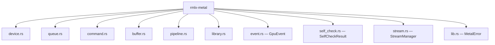
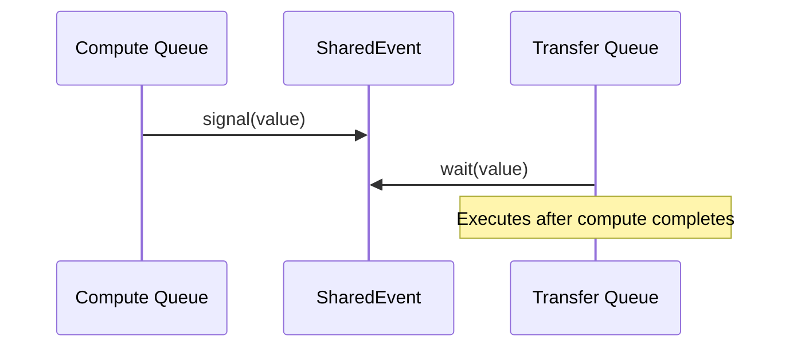
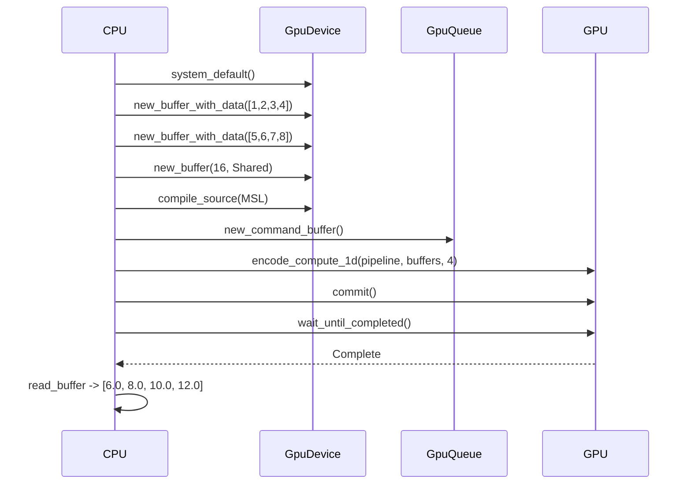

# rmlx-metal — Metal GPU Abstraction Layer

## Overview

`rmlx-metal` is a safe and ergonomic Rust wrapper layer over the Apple Metal GPU API. It abstracts Metal devices, command queues, buffers, compute pipelines, and shader libraries to enable concise GPU computation.

Built on the `metal-rs` 0.31 crate, it takes design cues from MLX's Metal abstraction structure and remodels them into idiomatic Rust APIs. The basic wrappers were completed in Phase 0, with event synchronization (`event.rs`), self-check (`self_check.rs`), and the dual queue stream manager (`stream.rs`) added subsequently.

---

## Module Structure



### `lib.rs` — Top-Level Re-exports

For ergonomic access, common types are re-exported at the crate root:

```rust
pub use device::{Architecture, GpuDevice};
pub use event::GpuEvent;
```

This allows `use rmlx_metal::GpuDevice;` instead of `use rmlx_metal::device::GpuDevice;`.

---

### `device.rs` — `GpuDevice`

Provides Metal device acquisition, architecture detection, and buffer/queue factory methods.

| Method | Description |
|--------|-------------|
| `system_default()` | Acquires the system's default Metal device |
| `name()` | Returns the device name (e.g., "Apple M2 Max") |
| `architecture()` | Returns the detected GPU architecture |
| `has_unified_memory()` | Checks UMA support (always `true` on Apple Silicon) |
| `max_buffer_length()` | Returns the maximum single buffer size in bytes |
| `max_threadgroup_memory()` | Returns the maximum threadgroup memory size |
| `new_command_queue()` | Creates a new command queue |
| `new_buffer()` | Allocates an uninitialized buffer |
| `new_buffer_with_data<T>()` | Creates a `StorageModeShared` buffer initialized from a slice |
| `raw()` | Returns a reference to the inner `metal::Device` |

**Architecture detection:**

Parses the device name string to determine the Apple Silicon generation.

```rust
pub enum Architecture {
    Apple { generation: u32 },  // M1=15, M2=16, M3=17, M4=18
    Unknown,
}
```

| Chip | generation value |
|------|-----------------|
| M1 | 15 |
| M2 | 16 |
| M3 | 17 |
| M4 | 18 |

```rust
fn detect_architecture(name: &str) -> Architecture {
    if name.contains("M4") {
        Architecture::Apple { generation: 18 }
    } else if name.contains("M3") {
        Architecture::Apple { generation: 17 }
    } else if name.contains("M2") {
        Architecture::Apple { generation: 16 }
    } else if name.contains("M1") {
        Architecture::Apple { generation: 15 }
    } else {
        Architecture::Unknown
    }
}
```

---

### `queue.rs` — `GpuQueue`

A thin wrapper around a Metal command queue.

| Method | Description |
|--------|-------------|
| `new(device)` | Creates a new command queue on the specified device |
| `new_command_buffer()` | Creates a new command buffer from this queue |
| `raw()` | Returns a reference to the inner `metal::CommandQueue` |

```rust
pub struct GpuQueue {
    queue: CommandQueue,
}

impl GpuQueue {
    pub fn new(device: &GpuDevice) -> Self {
        Self {
            queue: device.new_command_queue(),
        }
    }

    pub fn new_command_buffer(&self) -> &CommandBufferRef {
        self.queue.new_command_buffer()
    }
}
```

---

### `command.rs` — `encode_compute_1d()`

A convenience function for 1D compute dispatch. Handles the entire process from encoder creation to dispatch completion in a single call.

**Processing flow:**
1. Create a compute command encoder from the command buffer
2. Set the pipeline state
3. Bind buffers (consecutive indices 0, 1, 2, ...)
4. Dispatch threads as a 1D grid
5. End encoding

```rust
pub fn encode_compute_1d(
    cmd_buf: &CommandBufferRef,
    pipeline: &ComputePipelineState,
    buffers: &[(&Buffer, u64)],    // array of (buffer, offset) pairs
    num_threads: u64,
) {
    let encoder = cmd_buf.new_compute_command_encoder();
    encoder.set_compute_pipeline_state(pipeline);

    for (index, (buffer, offset)) in buffers.iter().enumerate() {
        encoder.set_buffer(index as u64, Some(buffer), *offset);
    }

    let max_threads = pipeline.max_total_threads_per_threadgroup();
    let threadgroup_size = std::cmp::min(max_threads, num_threads);

    let grid_size = MTLSize::new(num_threads, 1, 1);
    let group_size = MTLSize::new(threadgroup_size, 1, 1);

    encoder.dispatch_threads(grid_size, group_size);
    encoder.end_encoding();
}
```

---

### `buffer.rs` — Buffer Management

Provides utility functions for GPU buffer creation and reading.

| Function | Description |
|----------|-------------|
| `new_buffer_with_data<T>()` | Creates a `StorageModeShared` buffer initialized from a typed slice |
| `new_buffer_no_copy()` | Creates a zero-copy buffer wrapping externally allocated memory (`unsafe`) |
| `read_buffer<T>()` | Reads GPU buffer contents as a typed slice (`unsafe`) |

```rust
// Create a buffer initialized with data
pub fn new_buffer_with_data<T>(device: &metal::Device, data: &[T]) -> MTLBuffer {
    let size = std::mem::size_of_val(data) as u64;
    let ptr = data.as_ptr() as *const c_void;
    device.new_buffer_with_data(ptr, size, MTLResourceOptions::StorageModeShared)
}

// Zero-copy buffer creation (wrapping externally allocated memory)
pub unsafe fn new_buffer_no_copy(
    device: &metal::Device,
    ptr: *mut c_void,
    size: u64,
) -> MTLBuffer { ... }

// Read GPU -> CPU results
pub unsafe fn read_buffer<T>(buffer: &MTLBuffer, count: usize) -> &[T] {
    let ptr = buffer.contents() as *const T;
    std::slice::from_raw_parts(ptr, count)
}
```

---

### `pipeline.rs` — `PipelineCache`

A `HashMap`-based compute pipeline cache keyed by kernel function name. Prevents redundant compilation during repeated dispatches of the same kernel.

| Method | Description |
|--------|-------------|
| `new(device)` | Creates an empty pipeline cache |
| `get_or_create(name, library)` | Returns a cached pipeline or compiles, caches, and returns a new one |

```rust
pub struct PipelineCache {
    device: metal::Device,
    cache: HashMap<String, ComputePipelineState>,
}

impl PipelineCache {
    pub fn get_or_create(
        &mut self,
        name: &str,
        library: &Library,
    ) -> Result<&ComputePipelineState, MetalError> {
        if !self.cache.contains_key(name) {
            let function = library
                .get_function(name, None)
                .map_err(|_| MetalError::KernelNotFound(name.to_string()))?;
            let pipeline = self.device
                .new_compute_pipeline_state_with_function(&function)
                .map_err(|e| MetalError::PipelineCreate(e.to_string()))?;
            self.cache.insert(name.to_string(), pipeline);
        }
        Ok(self.cache.get(name).expect("just inserted"))
    }
}
```

---

### `library.rs` — Shader Library Loading

Supports loading AOT-compiled `.metallib` files and JIT compilation of MSL source strings.

| Function | Description |
|----------|-------------|
| `load_metallib(device, path)` | Loads a pre-compiled `.metallib` file from disk |
| `compile_source(device, source)` | JIT-compiles an MSL source string at runtime |

```rust
// AOT: load pre-compiled .metallib
pub fn load_metallib(device: &metal::Device, path: &Path) -> Result<Library, MetalError> {
    device.new_library_with_file(path)
        .map_err(|e| MetalError::LibraryLoad(e.to_string()))
}

// JIT: runtime compilation of MSL source string
pub fn compile_source(device: &metal::Device, source: &str) -> Result<Library, MetalError> {
    let options = CompileOptions::new();
    device.new_library_with_source(source, &options)
        .map_err(|e| MetalError::ShaderCompile(e.to_string()))
}
```

> **Note:** Using `load_metallib` for AOT compilation is recommended in production. `compile_source` is suitable for testing and JIT use cases.

---

### `event.rs` — `GpuEvent` (CPU-GPU Synchronization)

Wraps `MTLSharedEvent` to provide low-latency CPU-GPU synchronization. Uses a **spin -> yield -> sleep escalation strategy** for CPU waits, balancing latency and CPU consumption.

```rust
pub struct GpuEvent {
    event: SharedEvent,         // MTLSharedEvent
    counter: AtomicU64,         // monotonic signal counter
    cancelled: AtomicBool,      // wait cancellation flag
}
```

| Method | Description |
|--------|-------------|
| `new(device)` | Creates a new `MTLSharedEvent` on the specified device |
| `next_value()` | Atomically increments the counter and returns the next signal value |
| `current_value()` | Returns the current counter value |
| `signal_from_command_buffer(cb, value)` | Encodes an event signal into the command buffer |
| `wait_from_command_buffer(cb, value)` | Encodes an event wait into the command buffer |
| `cpu_wait(value, deadline)` | Waits on the CPU until the event reaches the specified value |
| `cancel()` | Cancels a pending `cpu_wait` |
| `reset_cancel()` | Resets the cancellation flag |
| `raw()` | Returns a reference to the inner `SharedEvent` |

**CPU wait escalation strategy:**

```
0~10 us   -> spin_loop (busywait, lowest latency)
10~100 us -> yield_now (yields to OS scheduler)
100 us+   -> sleep(50 us) (conserves CPU)
```

```rust
pub fn cpu_wait(&self, value: u64, deadline: Duration) -> Result<Duration, EventError> {
    let start = Instant::now();
    let spin_threshold = Duration::from_micros(10);
    let yield_threshold = Duration::from_micros(100);

    loop {
        if self.cancelled.load(Ordering::Acquire) {
            return Err(EventError::Cancelled);
        }
        let current = self.event.signaled_value();
        if current >= value {
            return Ok(start.elapsed());
        }
        let elapsed = start.elapsed();
        if elapsed >= deadline {
            return Err(EventError::Timeout(elapsed));
        }
        // Escalation strategy
        if elapsed < spin_threshold {
            std::hint::spin_loop();
        } else if elapsed < yield_threshold {
            std::thread::yield_now();
        } else {
            std::thread::sleep(Duration::from_micros(50));
        }
    }
}
```

**Error types:**

```rust
pub enum EventError {
    Timeout(Duration),  // Deadline exceeded
    Cancelled,          // Cancelled via cancel()
}
```

---

### `self_check.rs` — Metal Self-Check

Performs startup diagnostics of the Metal GPU environment. Inspects Metal availability, memory limits, and GPU information, collecting issues and warnings.

```rust
#[derive(Debug, Clone)]
pub struct SelfCheckResult {
    pub metal_available: bool,
    pub metal_version: String,
    pub gpu_family: String,
    pub max_buffer_length: u64,
    pub max_threadgroup_memory: u64,
    pub shared_memory_size: u64,      // recommended_max_working_set_size
    pub issues: Vec<String>,          // critical issues
    pub warnings: Vec<String>,        // warnings
}

impl SelfCheckResult {
    /// Returns whether the check passed with no issues.
    pub fn is_ok(&self) -> bool {
        self.issues.is_empty()
    }
}
```

| Function | Description |
|----------|-------------|
| `run_self_check()` | Runs the full Metal self-check and returns the result |
| `check_metal_support()` | Checks whether a Metal device can be acquired |
| `check_memory_limits()` | Queries `max_buffer_length` and `max_threadgroup_memory` |

**Items checked:**
- Whether a Metal device is available (added to `issues` if not)
- Maximum buffer size query (added to `warnings` if 0)
- GPU name and recommended working set size query

---

### `stream.rs` — `StreamManager` (Dual Queue Management)

Manages two independent Metal command queues:
- **Compute queue**: GPU kernel dispatch (matmul, softmax, etc.)
- **Transfer queue**: DMA/copy operations and RDMA coordination

Inter-queue synchronization is performed through an internal `GpuEvent`.

```rust
pub struct StreamManager {
    compute_queue: CommandQueue,
    transfer_queue: CommandQueue,
    sync_event: GpuEvent,
}
```

| Method | Description |
|--------|-------------|
| `new(device)` | Creates compute + transfer dual queues and a sync event |
| `compute_queue()` | Returns a reference to the compute queue |
| `transfer_queue()` | Returns a reference to the transfer queue |
| `compute_command_buffer()` | Creates a command buffer from the compute queue |
| `transfer_command_buffer()` | Creates a command buffer from the transfer queue |
| `sync_transfer_after_compute(compute_cb, transfer_cb)` | Inserts a dependency so transfer runs after compute completes |
| `sync_compute_after_transfer(transfer_cb, compute_cb)` | Inserts a dependency so compute runs after transfer completes |
| `sync_event()` | Returns a reference to the sync event |

**Inter-queue synchronization flow:**



---

## Error Handling

All Metal operation errors are unified under the `MetalError` enum.

```rust
#[derive(Debug)]
pub enum MetalError {
    NoDevice,                   // No Metal device found
    ShaderCompile(String),      // MSL shader compilation failed
    PipelineCreate(String),     // Pipeline state creation failed
    LibraryLoad(String),        // .metallib file load failed
    KernelNotFound(String),     // Kernel function not found in library
}
```

Implements `std::fmt::Display` and `std::error::Error`, making it compatible with the `?` operator and libraries like `anyhow`.

---

## Usage Example

Below is a full vector addition example taken from the `test_basic_metal_compute` integration test, showing the complete pipeline from device acquisition to result verification.

```rust
use rmlx_metal::buffer::read_buffer;
use rmlx_metal::command::encode_compute_1d;
use rmlx_metal::device::GpuDevice;
use rmlx_metal::library::compile_source;
use rmlx_metal::pipeline::PipelineCache;
use rmlx_metal::queue::GpuQueue;

// MSL vector addition kernel
const VECTOR_ADD_SOURCE: &str = r#"
#include <metal_stdlib>
using namespace metal;

kernel void vector_add_float(
    device const float *a [[buffer(0)]],
    device const float *b [[buffer(1)]],
    device float *out [[buffer(2)]],
    uint idx [[thread_position_in_grid]])
{
    out[idx] = a[idx] + b[idx];
}
"#;

fn main() {
    // 1. Acquire device
    let device = GpuDevice::system_default().expect("Metal device");
    let queue = GpuQueue::new(&device);

    // 2. Create input/output buffers
    let buffer_a = device.new_buffer_with_data(&[1.0f32, 2.0, 3.0, 4.0]);
    let buffer_b = device.new_buffer_with_data(&[5.0f32, 6.0, 7.0, 8.0]);
    let buffer_out = device.new_buffer(
        16, // 4 floats x 4 bytes
        rmlx_metal::metal::MTLResourceOptions::StorageModeShared,
    );

    // 3. JIT compile shader + pipeline cache
    let library = compile_source(device.raw(), VECTOR_ADD_SOURCE)
        .expect("shader compilation");
    let mut cache = PipelineCache::new(device.raw());
    let pipeline = cache
        .get_or_create("vector_add_float", &library)
        .expect("pipeline creation");

    // 4. Encode and dispatch compute command
    let cmd_buf = queue.new_command_buffer();
    encode_compute_1d(
        cmd_buf,
        pipeline,
        &[(&buffer_a, 0), (&buffer_b, 0), (&buffer_out, 0)],
        4,
    );

    // 5. Execute on GPU and wait for completion
    cmd_buf.commit();
    cmd_buf.wait_until_completed();

    // 6. Read results
    let result: &[f32] = unsafe { read_buffer(&buffer_out, 4) };
    assert_eq!(result, &[6.0, 8.0, 10.0, 12.0]);
}
```

**Execution flow:**



---

## Safety

This crate contains two `unsafe` functions.

### `new_buffer_no_copy()`

```rust
pub unsafe fn new_buffer_no_copy(
    device: &metal::Device,
    ptr: *mut c_void,
    size: u64,
) -> MTLBuffer
```

**Safety requirements:**
- `ptr` must be **page-aligned** (4096 bytes on Apple Silicon)
- `ptr` must remain **valid for the entire lifetime** of the returned buffer
- `size` must not exceed the memory allocated behind `ptr`
- Memory deallocation must be performed by the caller **after** the buffer is dropped

### `read_buffer<T>()`

```rust
pub unsafe fn read_buffer<T>(buffer: &MTLBuffer, count: usize) -> &[T]
```

**Safety requirements:**
- The buffer must use `StorageModeShared` (CPU accessible)
- **No GPU writes to this buffer may be in progress** (ensure the last write command buffer has completed)
- `count` must not exceed the number of `T` values that fit in the buffer

---

## Future Plans

The following module is planned for Phase 3:

| Module | Description | Phase |
|--------|-------------|-------|
| `resident.rs` | `ResidencySet` management — Metal 3 resource residency management | Phase 3 |

---

## Dependencies

```toml
[dependencies]
metal = "0.31"
objc2 = "..."
block2 = "..."
```
