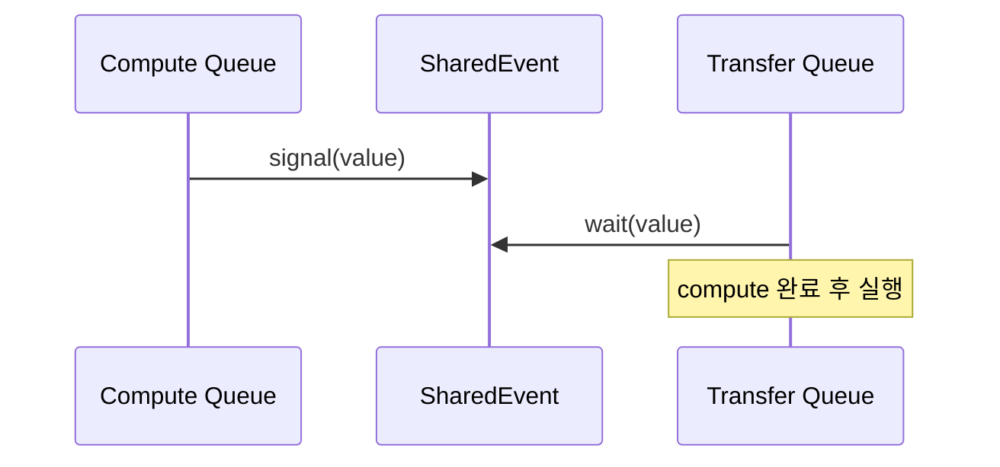
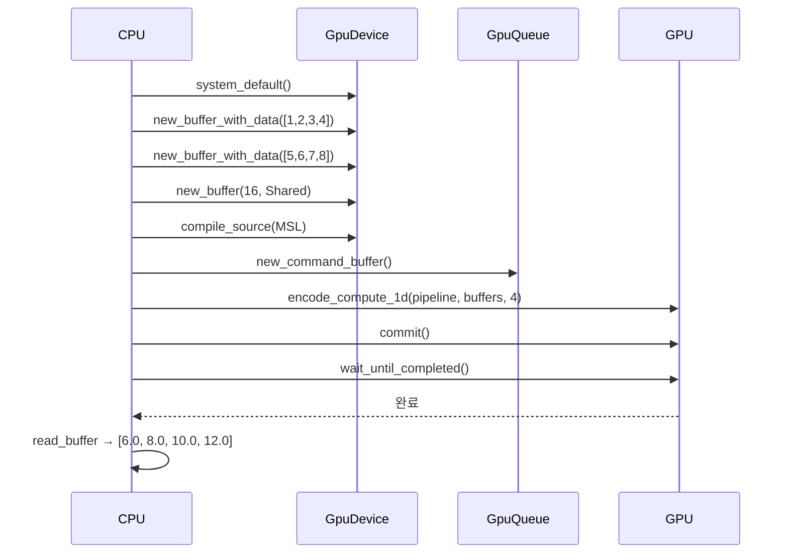

# rmlx-metal — Metal GPU 추상화 계층

## 개요

`rmlx-metal`은 Apple Metal GPU API에 대한 안전하고 편리한 Rust 래퍼 계층입니다. Metal 디바이스, 커맨드 큐, 버퍼, 컴퓨트 파이프라인, 셰이더 라이브러리를 추상화하여 GPU 연산을 간결하게 수행할 수 있도록 합니다.

`objc2-metal` 0.3 (`objc2` 생태계)을 기반으로 하며, MLX의 Metal 추상화 구조를 참고하여 Rust 관용적 API로 재설계하였습니다. `ComputePass` 뉴타입 래퍼(`#[repr(transparent)]`)가 Metal 인코더에 대한 zero-cost 추상화를 제공하며, `set_buffer`, `set_val`, `dispatch_threads`, `end` 등의 편의 메서드를 포함합니다. `types.rs`에서 타입 별칭(`MtlDevice`, `MtlBuffer`, `MtlPipeline`, `MtlCB`, `MtlQueue`, `MtlEvent`, `MtlEncoder`, `MtlLibrary`, `MtlFunction`, `MtlFunctionConstants`, `MtlCompileOptions` 등)을 정의합니다. `metal4` feature flag로 macOS 26+ Metal 4 API를 지원하며, `CommandAllocator`, `CounterHeap`, `ComputePass4`, `AsyncCompiler`를 제공합니다. Phase 0에서 기본 래퍼가 완성되었고, 이후 이벤트 동기화(`event.rs`), 셀프 체크(`self_check.rs`), 듀얼 큐 스트림 매니저(`stream.rs`)가 추가되었습니다. EP-6에서는 Indirect Command Buffer를 사용한 sparse expert 실행을 위해 `icb_sparse.rs`가 추가되었습니다. **objc2-metal 마이그레이션:** unsafe 블록 ~166개에서 18개로 감소(모두 안전한 래퍼 내부), `msg_send!` 호출 30개에서 2개로 감소(바이너리 아카이브 직렬화용, `pipeline_cache.rs`에 위치).

---

## 모듈 구조

```mermaid
graph TD
    A[rmlx-metal] --> B[device.rs]
    A --> C[queue.rs]
    A --> D[command.rs]
    A --> E[buffer.rs]
    A --> F[pipeline.rs]
    A --> G[library.rs]
    A --> H[event.rs — GpuEvent]
    A --> I[self_check.rs — SelfCheckResult]
    A --> J[stream.rs — StreamManager]
    A --> K[lib.rs — MetalError]
    A --> L[batcher.rs — CommandBatcher]
    A --> M[exec_graph.rs — ExecGraph]
    A --> N[icb.rs — ICB Support]
    A --> O[icb_sparse.rs — Sparse Expert ICB]
    A --> P[chip_tuning.rs — ChipTuning]
    A --> Q[pipeline_cache.rs — DiskPipelineCache]
    A --> R[compute_pass.rs — ComputePass]
    A --> S[types.rs — Type Aliases]
    A --> T[metal4/ — Metal 4 API]
```



### `lib.rs` — 최상위 Re-exports

편의를 위해 자주 사용되는 타입을 크레이트 루트에서 re-export합니다:

```rust
pub use device::{Architecture, GpuDevice};
pub use event::GpuEvent;
pub use stream::StreamManager;
```

`use rmlx_metal::device::GpuDevice;` 대신 `use rmlx_metal::GpuDevice;`로 사용할 수 있습니다.

---

### `device.rs` — `GpuDevice`

Metal 디바이스의 획득, 아키텍처 감지, 버퍼/큐 팩토리 메서드를 제공합니다.

| 메서드 | 설명 |
|--------|------|
| `system_default()` | 시스템 기본 Metal 디바이스를 획득합니다 |
| `name()` | 디바이스 이름을 반환합니다 (예: "Apple M2 Max") |
| `architecture()` | 감지된 GPU 아키텍처를 반환합니다 |
| `has_unified_memory()` | UMA 지원 여부를 확인합니다 (Apple Silicon은 항상 `true`) |
| `max_buffer_length()` | 단일 버퍼 최대 크기(바이트)를 반환합니다 |
| `max_threadgroup_memory()` | 최대 threadgroup 메모리 크기를 반환합니다 |
| `new_command_queue()` | 새 커맨드 큐를 생성합니다 |
| `new_buffer()` | 초기화되지 않은 버퍼를 할당합니다 |
| `new_buffer_with_data<T>()` | 슬라이스 데이터로 초기화된 `StorageModeShared` 버퍼를 생성합니다 |
| `raw()` | 내부 `MtlDevice` 참조를 반환합니다 |

**아키텍처 감지:**

디바이스 이름 문자열을 파싱하여 Apple Silicon 세대를 판별합니다.

```rust
pub enum Architecture {
    Apple { generation: u32 },  // M1=15, M2=16, M3=17, M4=18
    Unknown,
}
```

| 칩 | generation 값 |
|----|--------------|
| M1 | 15 |
| M2 | 16 |
| M3 | 17 |
| M4 | 18 |

```rust
fn detect_architecture(name: &str) -> Architecture {
    if name.contains("M4") {
        Architecture::Apple { generation: 18 }
    } else if name.contains("M3") {
        Architecture::Apple { generation: 17 }
    } else if name.contains("M2") {
        Architecture::Apple { generation: 16 }
    } else if name.contains("M1") {
        Architecture::Apple { generation: 15 }
    } else {
        Architecture::Unknown
    }
}
```

---

### `queue.rs` — `GpuQueue`

Metal 커맨드 큐에 대한 얇은 래퍼입니다.

| 메서드 | 설명 |
|--------|------|
| `new(device)` | 지정된 디바이스에 새 커맨드 큐를 생성합니다 |
| `new_command_buffer()` | 이 큐에서 새 커맨드 버퍼를 생성합니다 |
| `raw()` | 내부 MTLCommandQueue 참조를 반환합니다 |

```rust
pub struct GpuQueue {
    queue: CommandQueue,
}

impl GpuQueue {
    pub fn new(device: &GpuDevice) -> Self {
        Self {
            queue: device.new_command_queue(),
        }
    }

    pub fn new_command_buffer(&self) -> &ProtocolObject<dyn MTLCommandBuffer> {
        self.queue.new_command_buffer()
    }
}
```

---

### `command.rs` — `encode_compute_1d()`

1D 컴퓨트 디스패치를 위한 편의 함수입니다. ComputePass 생성부터 디스패치 완료까지의 전체 과정을 한 번의 호출로 처리합니다.

**처리 흐름:**
1. 커맨드 버퍼에서 ComputePass 생성
2. 파이프라인 스테이트 설정
3. 버퍼 바인딩 (연속 인덱스 0, 1, 2, ...)
4. 1D 그리드로 스레드 디스패치
5. 패스 종료

```rust
pub fn encode_compute_1d(
    cmd_buf: &ProtocolObject<dyn MTLCommandBuffer>,
    pipeline: &MtlPipeline,
    buffers: &[(&MtlBuffer, u64)],    // (버퍼, 오프셋) 쌍의 배열
    num_threads: u64,
) {
    let pass = ComputePass::new(cmd_buf);
    pass.set_pipeline(pipeline);

    for (index, (buffer, offset)) in buffers.iter().enumerate() {
        pass.set_buffer(index as u64, buffer, *offset);
    }

    let max_threads = pipeline.max_total_threads_per_threadgroup();
    let threadgroup_size = std::cmp::min(max_threads, num_threads);

    let grid_size = MTLSize::new(num_threads, 1, 1);
    let group_size = MTLSize::new(threadgroup_size, 1, 1);

    pass.dispatch_threads(grid_size, group_size);
    pass.end();
}
```

---

### `buffer.rs` — 버퍼 관리

GPU 버퍼의 생성과 읽기를 위한 유틸리티 함수들을 제공합니다.

| 함수 | 설명 |
|------|------|
| `new_buffer_with_data<T>()` | 타입 슬라이스로 초기화된 `StorageModeShared` 버퍼를 생성합니다 |
| `new_buffer_no_copy()` | 외부 할당 메모리를 감싸는 zero-copy 버퍼를 생성합니다 (`unsafe`) |
| `read_buffer<T>()` | GPU 버퍼 내용을 타입 슬라이스로 읽어옵니다 (`unsafe`) |

```rust
// 데이터로 초기화된 버퍼 생성
pub fn new_buffer_with_data<T>(device: &MtlDevice, data: &[T]) -> MtlBuffer {
    let size = std::mem::size_of_val(data) as u64;
    let ptr = data.as_ptr() as *const c_void;
    device.new_buffer_with_data(ptr, size, MTLResourceOptions::StorageModeShared)
}

// Zero-copy 버퍼 생성 (외부 할당 메모리 래핑)
pub unsafe fn new_buffer_no_copy(
    device: &MtlDevice,
    ptr: *mut c_void,
    size: u64,
) -> MtlBuffer { ... }

// GPU→CPU 결과 읽기
pub unsafe fn read_buffer<T>(buffer: &MtlBuffer, count: usize) -> &[T] {
    let ptr = buffer.contents() as *const T;
    std::slice::from_raw_parts(ptr, count)
}
```

---

### `pipeline.rs` — `PipelineCache`

커널 함수 이름을 키로 사용하는 `HashMap` 기반 컴퓨트 파이프라인 캐시입니다. 동일 커널의 반복 디스패치 시 중복 컴파일을 방지합니다.

| 메서드 | 설명 |
|--------|------|
| `new(device)` | 빈 파이프라인 캐시를 생성합니다 |
| `get_or_create(name, library)` | 캐시된 파이프라인을 반환하거나, 없으면 컴파일하여 캐시한 뒤 반환합니다 |

```rust
pub struct PipelineCache {
    device: MtlDevice,
    cache: HashMap<String, MtlPipeline>,
}

impl PipelineCache {
    pub fn get_or_create(
        &mut self,
        name: &str,
        library: &Library,
    ) -> Result<&MtlPipeline, MetalError> {
        if !self.cache.contains_key(name) {
            let function = library
                .get_function(name, None)
                .map_err(|_| MetalError::KernelNotFound(name.to_string()))?;
            let pipeline = self.device
                .new_compute_pipeline_state_with_function(&function)
                .map_err(|e| MetalError::PipelineCreate(e.to_string()))?;
            self.cache.insert(name.to_string(), pipeline);
        }
        Ok(self.cache.get(name).expect("just inserted"))
    }
}
```

---

### `library.rs` — 셰이더 라이브러리 로딩

AOT 컴파일된 `.metallib` 파일 로드와 MSL 소스 문자열 JIT 컴파일을 지원합니다.

| 함수 | 설명 |
|------|------|
| `load_metallib(device, path)` | 디스크에서 사전 컴파일된 `.metallib` 파일을 로드합니다 |
| `compile_source(device, source)` | MSL 소스 문자열을 런타임에 JIT 컴파일합니다 |

```rust
// AOT: 사전 컴파일된 .metallib 로드
pub fn load_metallib(device: &MtlDevice, path: &Path) -> Result<Library, MetalError> {
    device.new_library_with_file(path)
        .map_err(|e| MetalError::LibraryLoad(e.to_string()))
}

// JIT: MSL 소스 문자열 런타임 컴파일
pub fn compile_source(device: &MtlDevice, source: &str) -> Result<Library, MetalError> {
    let options = CompileOptions::new();
    device.new_library_with_source(source, &options)
        .map_err(|e| MetalError::ShaderCompile(e.to_string()))
}
```

> **참고:** 프로덕션 코드에서는 `load_metallib`을 통한 AOT 컴파일을 사용하는 것을 권장합니다. `compile_source`는 테스트 및 JIT 용도에 적합합니다.

---

### `event.rs` — `GpuEvent` (CPU-GPU 동기화)

`MTLSharedEvent`를 래핑하여 CPU-GPU 간 저지연 동기화를 제공합니다. CPU 대기 시 **spin→yield→sleep 에스컬레이션 전략**을 사용하여 지연 시간과 CPU 소비 사이의 균형을 유지합니다.

```rust
pub struct GpuEvent {
    event: SharedEvent,         // MTLSharedEvent
    counter: AtomicU64,         // 모노토닉 시그널 카운터
    cancelled: AtomicBool,      // 대기 취소 플래그
}
```

| 메서드 | 설명 |
|--------|------|
| `new(device)` | 지정된 디바이스에 새 `MTLSharedEvent`를 생성합니다 |
| `next_value()` | 카운터를 원자적으로 증가시키고 다음 시그널 값을 반환합니다 |
| `current_value()` | 현재 카운터 값을 반환합니다 |
| `signal_from_command_buffer(cb, value)` | 커맨드 버퍼에 이벤트 시그널을 인코딩합니다 |
| `wait_from_command_buffer(cb, value)` | 커맨드 버퍼에 이벤트 대기를 인코딩합니다 |
| `cpu_wait(value, deadline)` | CPU에서 이벤트가 지정된 값에 도달할 때까지 대기합니다 |
| `cancel()` | 대기 중인 `cpu_wait`를 취소합니다 |
| `reset_cancel()` | 취소 플래그를 리셋합니다 |
| `raw()` | 내부 `SharedEvent` 참조를 반환합니다 |

**CPU 대기 에스컬레이션 전략:**

```
0~10μs   → spin_loop (busywait, 최저 지연)
10~100μs → yield_now (OS 스케줄러에 양보)
100μs+   → sleep(50μs) (CPU 절약)
```

```rust
pub fn cpu_wait(&self, value: u64, deadline: Duration) -> Result<Duration, EventError> {
    let start = Instant::now();
    let spin_threshold = Duration::from_micros(10);
    let yield_threshold = Duration::from_micros(100);

    loop {
        if self.cancelled.load(Ordering::Acquire) {
            return Err(EventError::Cancelled);
        }
        let current = self.event.signaled_value();
        if current >= value {
            return Ok(start.elapsed());
        }
        let elapsed = start.elapsed();
        if elapsed >= deadline {
            return Err(EventError::Timeout(elapsed));
        }
        // 에스컬레이션 전략
        if elapsed < spin_threshold {
            std::hint::spin_loop();
        } else if elapsed < yield_threshold {
            std::thread::yield_now();
        } else {
            std::thread::sleep(Duration::from_micros(50));
        }
    }
}
```

**에러 타입:**

```rust
pub enum EventError {
    Timeout(Duration),  // 데드라인 초과
    Cancelled,          // cancel()로 취소됨
}
```

---

### `self_check.rs` — Metal 셀프 체크

Metal GPU 환경의 시작 시 진단을 수행합니다. Metal 가용성, 메모리 제한, GPU 정보를 검사하여 문제(`issues`)와 경고(`warnings`)를 수집합니다.

```rust
#[derive(Debug, Clone)]
pub struct SelfCheckResult {
    pub metal_available: bool,
    pub metal_version: String,
    pub gpu_family: String,
    pub max_buffer_length: u64,
    pub max_threadgroup_memory: u64,
    pub shared_memory_size: u64,      // recommended_max_working_set_size
    pub issues: Vec<String>,          // 치명적 문제
    pub warnings: Vec<String>,        // 경고
}

impl SelfCheckResult {
    /// 이슈 없이 통과했는지 확인합니다.
    pub fn is_ok(&self) -> bool {
        self.issues.is_empty()
    }
}
```

| 함수 | 설명 |
|------|------|
| `run_self_check()` | 전체 Metal 셀프 체크를 실행하고 결과를 반환합니다 |
| `check_metal_support()` | Metal 디바이스 획득 가능 여부를 확인합니다 |
| `check_memory_limits()` | `max_buffer_length`와 `max_threadgroup_memory`를 조회합니다 |

**검사 항목:**
- Metal 디바이스 사용 가능 여부 (불가능 시 `issues`에 추가)
- 최대 버퍼 크기 조회 (0이면 `warnings`에 추가)
- GPU 이름, recommended working set size 조회

---

### `stream.rs` — `StreamManager` (듀얼 큐 관리)

두 개의 독립적인 Metal 커맨드 큐를 관리합니다:
- **Compute queue**: GPU 커널 디스패치 (matmul, softmax 등)
- **Transfer queue**: DMA/복사 작업 및 RDMA 조율

큐 간 동기화는 내부 `GpuEvent`를 통해 수행됩니다.

```rust
pub struct StreamManager {
    compute_queue: CommandQueue,
    transfer_queue: CommandQueue,
    sync_event: GpuEvent,
}
```

| 메서드 | 설명 |
|--------|------|
| `new(device)` | compute + transfer 듀얼 큐와 동기화 이벤트를 생성합니다 |
| `compute_queue()` | compute 큐 참조를 반환합니다 |
| `transfer_queue()` | transfer 큐 참조를 반환합니다 |
| `compute_command_buffer()` | compute 큐에서 커맨드 버퍼를 생성합니다 |
| `transfer_command_buffer()` | transfer 큐에서 커맨드 버퍼를 생성합니다 |
| `sync_transfer_after_compute(compute_cb, transfer_cb)` | compute 완료 후 transfer가 실행되도록 의존성을 삽입합니다 |
| `sync_compute_after_transfer(transfer_cb, compute_cb)` | transfer 완료 후 compute가 실행되도록 의존성을 삽입합니다 |
| `sync_event()` | 동기화 이벤트 참조를 반환합니다 |

**큐 간 동기화 흐름:**



---

### `batcher.rs` — `CommandBatcher`

여러 GPU 인코더 연산을 공유 커맨드 버퍼에 그룹화하여, 연산별 CB 생성 오버헤드를 줄입니다.

| 메서드 | 설명 |
|--------|------|
| `new(queue)` | 커맨드 큐에 바인딩된 새 batcher를 생성합니다 |
| `begin_batch()` | 새 배치를 시작합니다 (새 CB 생성) |
| `encoder()` | 현재 compute command encoder를 반환합니다 |
| `end_batch()` | 배치를 완료하고 CB를 커밋합니다 |
| `batch_count()` | 실행된 배치 수 |

CommandBatcher는 ExecGraph의 92.3% CB 감소를 구현하는 핵심 메커니즘입니다.
각 연산이 자체 커맨드 버퍼를 생성하는 대신, 여러 연산이 batcher의 encoder를 통해
하나의 CB를 공유합니다.

---

### `exec_graph.rs` — `ExecGraph`

결정론적 트랜스포머 레이어 연산 시퀀스를 최소한의 커맨드 버퍼로 재생하는
사전 빌드된 실행 그래프입니다.

| 타입 | 설명 |
|------|------|
| `ExecGraph` | 트랜스포머 레이어를 위한 사전 분석된 연산 시퀀스 |
| `EventToken` | CB 간 의존성을 위한 동기화 토큰 |
| `ExecGraphStats` | 실행 통계 (CB 수, encoder 수, 동기화 포인트) |

| 메서드 | 설명 |
|--------|------|
| `new(queue, event)` | 큐와 동기화 이벤트에 바인딩된 그래프 생성 |
| `execute(layer_ops)` | 5개 CB로 사전 빌드된 연산 시퀀스 실행 |
| `stats()` | 실행 통계 반환 |

**트랜스포머 레이어별 CB 레이아웃:**

| CB | 연산 |
|----|------|
| CB1 | RMS norm + Q/K/V projections (fused) |
| CB2 | Head split + RoPE + cache append |
| CB3 | SDPA + head concat + O_proj |
| CB4 | Residual + pre-FFN norm |
| CB5 | Gate + up + silu_mul + down + residual |

**성능**: 레이어당 65 CB -> 5 CB (92.3% 감소), 17.4x 속도 향상 달성.

---

### `icb.rs` — Indirect Command Buffers

CPU 오버헤드 없이 커맨드를 재생하기 위한 Metal Indirect Command Buffer 지원입니다.

| 타입 | 설명 |
|------|------|
| `IcbBuilder` | 기록된 커맨드로 indirect command buffer를 빌드합니다 |
| `IcbReplay` | 이전에 빌드된 ICB를 재생합니다 |
| `IcbCache` | forward pass 간 재사용을 위해 빌드된 ICB를 캐시합니다 |

---

### `icb_sparse.rs` — Sparse Expert ICB (EP-6)

EP-6에서 추가된 sparse expert 실행 전용 Indirect Command Buffer 지원입니다. 활성화된 expert 집합이 스텝마다 달라지는 MoE 추론에서 불필요한 expert 실행을 생략하는 sparse 실행 패턴을 ICB로 구현합니다.

| 타입 | 설명 |
|------|------|
| `IcbSparseBuilder` | 활성 expert 마스크 기반 sparse ICB를 빌드합니다 |
| `IcbSparseCache` | expert 집합별 사전 빌드된 sparse ICB를 캐시합니다 |

**핵심 이점:** CPU에서 활성 expert를 선택하지 않고 GPU가 직접 sparse dispatch를 수행하여, EP-6의 zero-CPU-overhead sparse expert 실행을 가능하게 합니다.

---

### `compute_pass.rs` — `ComputePass` (Zero-Cost 인코더 래퍼)

Metal compute command encoder에 대한 zero-cost `#[repr(transparent)]` 뉴타입입니다. 모든 메서드가 `#[inline(always)]`로 오버헤드가 없습니다.

```rust
#[derive(Clone, Copy)]
#[repr(transparent)]
pub struct ComputePass<'a>(pub(crate) &'a ProtocolObject<dyn MTLComputeCommandEncoder>);
```

| 메서드 | 설명 |
|--------|------|
| `new(encoder)` | 빌린 compute command encoder를 래핑합니다 |
| `set_pipeline(pso)` | compute 파이프라인 상태를 설정합니다 |
| `set_buffer(index, buffer, offset)` | 지정 인덱스에 버퍼를 바인딩합니다 |
| `set_val<T>(index, value)` | 지정 인덱스에 스칼라 값을 바이트로 설정합니다 |
| `set_threadgroup_memory(index, length)` | 지정 인덱스에 threadgroup 메모리를 할당합니다 |
| `dispatch_threads(grid, group)` | 명시적 grid, group 크기로 스레드를 디스패치합니다 |
| `dispatch_threadgroups(groups, group)` | threadgroup을 디스패치합니다 |
| `memory_barrier_with_scope(scope)` | 메모리 배리어를 삽입합니다 |
| `end()` | 인코딩을 종료합니다 |

---

### `types.rs` — 타입 별칭

장황한 `Retained<ProtocolObject<dyn MTLFoo>>` 타입에 대한 간결한 타입 별칭을 제공합니다.

| 별칭 | 원래 타입 |
|------|----------|
| `MtlDevice` | `Retained<ProtocolObject<dyn MTLDevice>>` |
| `MtlQueue` | `Retained<ProtocolObject<dyn MTLCommandQueue>>` |
| `MtlBuffer` | `Retained<ProtocolObject<dyn MTLBuffer>>` |
| `MtlPipeline` | `Retained<ProtocolObject<dyn MTLComputePipelineState>>` |
| `MtlLibrary` | `Retained<ProtocolObject<dyn MTLLibrary>>` |
| `MtlCB` | `Retained<ProtocolObject<dyn MTLCommandBuffer>>` |
| `MtlEvent` | `Retained<ProtocolObject<dyn MTLSharedEvent>>` |
| `MtlEncoder` | `Retained<ProtocolObject<dyn MTLComputeCommandEncoder>>` |
| `MtlFunction` | `Retained<ProtocolObject<dyn MTLFunction>>` |
| `MtlFunctionConstants` | `Retained<MTLFunctionConstantValues>` |
| `MtlCompileOptions` | `Retained<MTLCompileOptions>` |
| `MtlCaptureManager` | `Retained<MTLCaptureManager>` |
| `MtlCaptureDescriptor` | `Retained<MTLCaptureDescriptor>` |

unsized protocol-object 참조를 retain하기 위한 `retain_proto<T>()` 도우미도 제공합니다 (`Retained::retain()`이 `T: Sized`를 요구하는 제한을 우회).

---

### `metal4/` — Metal 4 API (Feature-Gated)

> `metal4` feature flag와 macOS 26+ 런타임이 필요합니다.

명시적 command buffer 수명 관리, GPU 측 타임스탬프, 비동기 셰이더 컴파일을 제공하는 Metal 4 API 래퍼입니다.

| 모듈 | 타입 | 설명 |
|------|------|------|
| `command.rs` | `CommandAllocator` | Metal 4 command buffer의 인코딩 메모리 관리 |
| `command.rs` | `Mtl4CommandBuffer` | 명시적 begin/end command buffer 수명 관리 |
| `command.rs` | `CommandQueue4` | 여러 command buffer의 배치 커밋 |
| `counter_heap.rs` | `CounterHeap` | GPU 측 타임스탬프 카운터 힙 |
| `counter_heap.rs` | `GpuTimestamp` | 해석된 GPU 타임스탬프 쌍 (start/end) |
| `compute.rs` | `ComputePass4` | 명시적 리소스 사용 선언이 포함된 Metal 4 compute pass |
| `compiler.rs` | `AsyncCompiler` | 완료 콜백이 있는 백그라운드 셰이더 컴파일 |

---

### `chip_tuning.rs` — `ChipTuning` (Phase 4)

Apple Silicon 칩(M1/M2/M3/M4) 세대별 GPU 튜닝 파라미터입니다. `GpuDevice`에 통합되어 칩 인식 디스패치 구성을 제공합니다.

| 필드 | 설명 |
|------|------|
| `max_threadgroup_threads` | 칩 세대에 최적화된 threadgroup 크기 |
| `simd_width` | SIMD 레인 폭 (현재 모든 Apple Silicon에서 32) |
| `max_threadgroups_per_grid` | 디스패치당 최대 threadgroup 수 |
| `preferred_tile_size` | 타일 커널에 최적화된 타일 크기 |

`ChipTuning`은 `GpuDevice` 초기화 시 `Architecture` 열거형에서 자동으로 해석되며, `GpuDevice::chip_tuning()`으로 접근합니다.

---

### `pipeline_cache.rs` — `DiskPipelineCache` (Phase 4)

컴파일된 Metal 파이프라인 바이너리의 영구 디스크 캐시입니다. 커널 소스 + function constant의 `sha2` 해시로 결정론적 캐시 키를 생성합니다. 캐시된 바이너리는 `~/.cache/rmlx/pipelines/`에 저장됩니다.

| 메서드 | 설명 |
|--------|------|
| `new(device)` | 캐시를 생성하고 디스크 디렉토리를 초기화합니다 |
| `get_or_create(name, library)` | 캐시된 파이프라인 바이너리를 반환하거나, 컴파일하고 저장한 후 반환합니다 |
| `invalidate(name)` | 캐시 항목을 제거합니다 |
| `clear()` | 모든 캐시된 파이프라인 바이너리를 제거합니다 |

프로세스 재시작 시 중복 셰이더 컴파일을 제거하여 콜드 스타트 지연을 크게 줄입니다.

---

### HazardTrackingModeUntracked (Phase 4)

Phase 4에서 수동 해저드 트래킹을 위한 버퍼 생성 옵션으로 `HazardTrackingModeUntracked` (비트 0x10)이 추가되었습니다. 설정 시 Metal이 버퍼의 읽기/쓰기 해저드를 자동 추적하지 않아, 애플리케이션이 `GpuEvent` 또는 fence로 동기화를 직접 관리합니다. 알려진 접근 패턴을 가진 버퍼(slab ring 버퍼, expert 가중치 텐서 등)의 드라이버 오버헤드를 줄입니다.

`rmlx-alloc` 버퍼 생성 경로와 `rmlx-metal` slab ring 통합에서 사용됩니다.

---

## 에러 처리

`MetalError` enum으로 모든 Metal 작업의 에러를 통합 관리합니다.

```rust
#[derive(Debug)]
pub enum MetalError {
    NoDevice,                   // Metal 디바이스를 찾을 수 없음
    ShaderCompile(String),      // MSL 셰이더 컴파일 실패
    PipelineCreate(String),     // 파이프라인 스테이트 생성 실패
    LibraryLoad(String),        // .metallib 파일 로드 실패
    KernelNotFound(String),     // 라이브러리에서 커널 함수를 찾을 수 없음
}
```

`std::fmt::Display`와 `std::error::Error`를 구현하므로 `?` 연산자 및 `anyhow` 등과 호환됩니다.

---

## 사용 예시

다음은 `test_basic_metal_compute` 통합 테스트에서 가져온 전체 벡터 덧셈 예제입니다. 디바이스 획득부터 결과 검증까지의 전체 파이프라인을 보여줍니다.

```rust
use rmlx_metal::buffer::read_buffer;
use rmlx_metal::command::encode_compute_1d;
use rmlx_metal::device::GpuDevice;
use rmlx_metal::library::compile_source;
use rmlx_metal::pipeline::PipelineCache;
use rmlx_metal::queue::GpuQueue;

// MSL 벡터 덧셈 커널
const VECTOR_ADD_SOURCE: &str = r#"
#include <metal_stdlib>
using namespace metal;

kernel void vector_add_float(
    device const float *a [[buffer(0)]],
    device const float *b [[buffer(1)]],
    device float *out [[buffer(2)]],
    uint idx [[thread_position_in_grid]])
{
    out[idx] = a[idx] + b[idx];
}
"#;

fn main() {
    // 1. 디바이스 획득
    let device = GpuDevice::system_default().expect("Metal device");
    let queue = GpuQueue::new(&device);

    // 2. 입출력 버퍼 생성
    let buffer_a = device.new_buffer_with_data(&[1.0f32, 2.0, 3.0, 4.0]);
    let buffer_b = device.new_buffer_with_data(&[5.0f32, 6.0, 7.0, 8.0]);
    let buffer_out = device.new_buffer(
        16, // 4 floats x 4 bytes
        rmlx_metal::MTLResourceOptions::StorageModeShared,
    );

    // 3. 셰이더 JIT 컴파일 + 파이프라인 캐시
    let library = compile_source(device.raw(), VECTOR_ADD_SOURCE)
        .expect("shader compilation");
    let mut cache = PipelineCache::new(device.raw());
    let pipeline = cache
        .get_or_create("vector_add_float", &library)
        .expect("pipeline creation");

    // 4. 컴퓨트 커맨드 인코딩 및 디스패치
    let cmd_buf = queue.new_command_buffer();
    encode_compute_1d(
        cmd_buf,
        pipeline,
        &[(&buffer_a, 0), (&buffer_b, 0), (&buffer_out, 0)],
        4,
    );

    // 5. GPU 실행 및 완료 대기
    cmd_buf.commit();
    cmd_buf.wait_until_completed();

    // 6. 결과 읽기
    let result: &[f32] = unsafe { read_buffer(&buffer_out, 4) };
    assert_eq!(result, &[6.0, 8.0, 10.0, 12.0]);
}
```

**실행 흐름:**



---

## 안전성 (Safety)

이 크레이트의 `unsafe` 블록은 총 18개입니다(objc2-metal 마이그레이션 이전 ~166개에서 감소). 모두 안전한 래퍼 API 내부에 있습니다. `objc2` 타입은 본질적으로 `Send + Sync`이므로 `unsafe impl Send/Sync` 블록이 불필요합니다. `msg_send!` 호출은 2개만 남아 있으며(이전 30개에서 감소), 둘 다 `pipeline_cache.rs`의 바이너리 아카이브 직렬화에 사용됩니다(아직 typed binding이 없는 API).

### `new_buffer_no_copy()`

```rust
pub unsafe fn new_buffer_no_copy(
    device: &MtlDevice,
    ptr: *mut c_void,
    size: u64,
) -> MtlBuffer
```

**안전성 요구사항:**
- `ptr`은 반드시 **페이지 정렬**(Apple Silicon에서 4096바이트)이어야 합니다
- `ptr`은 반환된 버퍼의 **전체 수명 동안 유효**해야 합니다
- `size`는 `ptr` 뒤에 할당된 메모리 크기를 초과해서는 안 됩니다
- 메모리 해제는 버퍼가 드롭된 **이후에** 호출자가 수행해야 합니다

### `read_buffer<T>()`

```rust
pub unsafe fn read_buffer<T>(buffer: &MtlBuffer, count: usize) -> &[T]
```

**안전성 요구사항:**
- 버퍼는 반드시 `StorageModeShared` (CPU 접근 가능)이어야 합니다
- 이 버퍼에 대한 **GPU 쓰기가 진행 중이 아니어야** 합니다 (마지막 쓰기 커맨드 버퍼가 완료되었는지 확인)
- `count`는 버퍼에 들어갈 수 있는 `T` 값의 수를 초과해서는 안 됩니다

---

## 향후 계획

모든 모듈이 Phase 9B-opt까지 완전히 구현되었습니다.

---

## 의존성

```toml
[dependencies]
objc2-metal = "0.3"
objc2 = "0.6"
block2 = "0.6"
```
