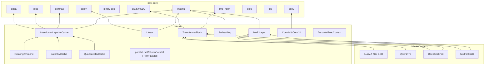

# rmlx-nn — Neural Network Layers

## Overview

`rmlx-nn` is a crate that implements neural network layers for GPU-accelerated inference. It builds core Transformer architecture components (Linear, Embedding, Attention, TransformerBlock, MoE) on top of `rmlx-core` compute kernels, and includes built-in model configurations for LLaMA, Qwen, DeepSeek-V3, and Mixtral.

> **Status (Phase 0-9B-opt + S1-S5 + Audit + EP-2~EP-6 + Prod Phase 2 + Phase 3 + Phase 4 + Phase 5 + Phase KO + Phase 8c + Phase 9 + Phase 10 + Phase 11):** Linear, QuantizedLinear (+ AwqLinear, GptqLinear, KQuantType/KQuantConfig), Embedding, Attention (with LayerKvCache, RotatingKvCache, BatchKvCache, QuantizedKvCache, **PagedKvCache**), MLA (full forward: DeepSeek-V3 9-step pipeline with latent KV compression), SlidingWindowAttention (full forward: Mistral-style RoPE + SDPA + KV cache), TransformerBlock, MoE (with shared expert + EP integration + GPU routing + `MoeStrategy` dispatch), `ExpertGroup` (stacked expert GEMM path), `MoePipeline` (TBO/SBO overlap), LayerNorm, **16 activation functions**, Parallel (TP), Conv1d/Conv2d, DynamicExecContext, GGUF model loader (+ K-quant type mapping), **prefix cache** (radix-tree with LRU eviction), **chunked prefill** scheduler, **continuous batching scheduler**, and **4 full model architectures** (LlamaModel, Qwen2Model, DeepSeekV3Model, MixtralModel) are implemented. Phase 0+1+2 audit remediation complete (items N1-N8). EP Phases 2-6 forward path integration complete. **Phase 5 additions:** 11 new activations (ReLU, LeakyReLU, ELU, SELU, Mish, QuickGELU, HardSwish, HardSigmoid, Softplus, Softsign, GLU -- 16 total); full MLA forward implementation; full SlidingWindowAttention forward; AwqLinear/GptqLinear/KQuantType/KQuantConfig in quantized\_linear.rs; K-quant GGUF mapping in gguf\_loader.rs; radix-tree prefix cache (prefix\_cache.rs); chunked prefill in scheduler.rs; 4 full model architectures in models/. **Phase KO additions:** 9-dispatch decode path (forward_decode_9dispatch, forward_single_cb_9dispatch), merged QKV and gate_up weight preparation, slab-layout KV cache (LayerKvCache::preallocated with slab), prepare_weights_private() pipeline for StorageModePrivate weights. **Phase 8c additions:** `CachedDecode` struct with pre-resolved PSOs and pre-allocated scratch buffers, `forward_cached_2encoder_9dispatch` method, `append_into_encoder` and `append_preresolved_into_encoder` for KV cache, `_preresolved_into_encoder` pattern across all ops. **Phase 9 additions:** f16 default dtype, single-encoder decode path, direct KV append, pre-cached threadgroup sizes — 714 us/layer at 60L. **Phase 10 additions:** `fused_rms_gemv` and `fused_swiglu_down` fused kernels, 7-dispatch decode pipeline — 703.4 us/layer at 60L. **Phase 11 conclusion:** All kernel-level GEMV optimization experiments failed; 703.4 us/layer is the practical floor for f16 decode on Apple Silicon (73.6% bandwidth efficiency).

---

## Module Structure

```
rmlx-nn/src/
├── lib.rs               # Module declarations + re-exports
├── linear.rs            # Linear (FC) layer
├── quantized_linear.rs  # QuantizedLinear, AwqLinear, GptqLinear, KQuantType/KQuantConfig
├── embedding.rs         # Token embedding
├── attention.rs         # Multi-Head / GQA Attention + KV cache
├── mla.rs               # Multi-Latent Attention (DeepSeek-V3)
├── sliding_window.rs    # Sliding Window Attention
├── layer_norm.rs        # LayerNorm layer wrapper
├── activations.rs       # 16 activation functions (SiLU, GELU, ReLU, Mish, GLU, etc.)
├── transformer.rs       # Transformer block + model
├── moe.rs               # Mixture of Experts (shared expert, EP integration, GPU routing)
├── expert_group.rs      # Grouped expert GEMM + stacked expert weights
├── moe_pipeline.rs      # TBO/SBO compute-communication overlap orchestration
├── conv.rs              # Conv1d/Conv2d layer wrappers
├── dynamic.rs           # DynamicExecContext for variable shapes
├── gguf_loader.rs       # End-to-end GGUF model loading + K-quant type mapping
├── paged_kv_cache.rs    # Paged KV cache + block manager (vLLM-style)
├── prefix_cache.rs      # Radix-tree prefix cache with LRU eviction
├── scheduler.rs         # Continuous batching scheduler (prefill/decode + chunked prefill)
├── parallel.rs          # Tensor-parallel layers (feature = "distributed")
└── models/
    ├── mod.rs            # Model module declarations
    ├── llama.rs          # LLaMA 7B, LLaMA 3 8B
    ├── qwen.rs           # Qwen2 7B
    ├── deepseek.rs       # DeepSeek-V3 (with MLA + shared expert)
    └── mixtral.rs        # Mixtral 8x7B
```

---

## linear.rs — Linear Layer

A linear (fully-connected) layer performing `y = x @ W^T + bias`.

```rust
pub struct LinearConfig {
    pub in_features: usize,
    pub out_features: usize,
    pub has_bias: bool,
}

pub struct Linear {
    config: LinearConfig,
    weight: Option<Array>,
    bias: Option<Array>,
}
```

| Method | Description |
|--------|-------------|
| `Linear::new(config)` | Creates a config-only layer (weights loaded later) |
| `from_arrays(config, weight, bias)` | Create with pre-loaded weight and optional bias |
| `forward(input, registry, queue)` | Forward pass: `input @ W^T + bias` |
| `in_features()` | Input dimension |
| `out_features()` | Output dimension |
| `has_bias()` | Whether bias is used |
| `has_weights()` | Whether weights have been loaded |
| `weight()` | Reference to weight array |
| `bias()` | Reference to bias array |

### Phase 9 Additions

#### `forward_into_cb()`

Encodes the linear forward pass into a caller-provided command buffer instead of
creating a new one. This is the key pattern enabling ExecGraph's CB batching.

| Method | Description |
|--------|-------------|
| `forward_into_cb(input, registry, cb)` | Encode `x @ W^T + bias` into the given CB |

#### `prepare_weight_t()` / `weight_transposed_contiguous()`

Pre-computes and caches the contiguous transposed weight matrix at model load time.

| Method | Description |
|--------|-------------|
| `prepare_weight_t(registry, queue)` | Pre-compute `W^T` as a contiguous array and cache it |
| `weight_transposed_contiguous()` | Returns the cached transposed weight (if prepared) |

This trades ~2x weight memory for zero-cost transpose during inference, contributing
to the 17.4x speedup.

---

## embedding.rs — Token Embedding

A lookup table that converts token IDs to embedding vectors.

```rust
pub struct EmbeddingConfig {
    pub vocab_size: usize,
    pub embed_dim: usize,
}

pub struct Embedding {
    config: EmbeddingConfig,
}
```

| Method | Description |
|--------|-------------|
| `Embedding::new(config)` | Creates from config |
| `vocab_size()` | Vocabulary size |
| `embed_dim()` | Embedding dimension |

---

## attention.rs — Multi-Head Attention

Multi-Head / Grouped Query Attention with KV cache support for incremental decoding.

```rust
pub struct AttentionConfig {
    pub num_heads: usize,
    pub num_kv_heads: usize,
    pub head_dim: usize,
    pub max_seq_len: usize,
    pub rope_theta: f32,
}

pub struct Attention {
    config: AttentionConfig,
    q_proj: Linear,
    k_proj: Linear,
    v_proj: Linear,
    o_proj: Linear,
}
```

| Method | Description |
|--------|-------------|
| `Attention::new(config)` | Config-only constructor (weights loaded later) |
| `from_layers(config, q_proj, k_proj, v_proj, o_proj)` | Create with pre-loaded projection layers |
| `forward(x, cos_freqs, sin_freqs, mask, cache, registry, queue)` | Forward pass; `cos_freqs`/`sin_freqs` are optional RoPE frequency tables, `cache: Option<&mut LayerKvCache>` |
| `config()` | Reference to `AttentionConfig` |
| `num_heads()` | Number of Q heads |
| `num_kv_heads()` | Number of KV heads |
| `head_dim()` | Head dimension |
| `hidden_size()` | `num_heads * head_dim` |
| `is_gqa()` | Whether GQA is used (`num_kv_heads < num_heads`) |

When `cache` is `Some`, new K/V tensors are appended to the cache and the full cached K/V is used for attention computation. When `cache` is `None`, behavior is unchanged (backward compatible).

| Attention variant | Condition | Representative model |
|-------------------|-----------|---------------------|
| MHA | `num_kv_heads == num_heads` | LLaMA 7B |
| GQA | `num_kv_heads < num_heads` | LLaMA 3, Qwen2, Mixtral |
| MLA | `num_kv_heads == 1` | DeepSeek-V3 |

### Phase 9 Additions

#### `forward_graph()`

ExecGraph-compatible forward pass that encodes attention operations into the
ExecGraph's command buffers.

| Method | Description |
|--------|-------------|
| `forward_graph(x, cos_freqs, sin_freqs, mask, cache, registry, graph)` | ExecGraph-compatible forward |

#### `batched_qkv_proj_into()`

Batches Q, K, V projections into a single command buffer.

| Method | Description |
|--------|-------------|
| `batched_qkv_proj_into(x, registry, cb)` | Encode all three projections into one CB |

### LayerKvCache

Per-layer KV cache for incremental decoding. Stores cached K/V per KV head so that previously computed key-value pairs are reused across decoding steps. Uses pre-allocated contiguous buffers with O(1) append (no full-history copy).

```rust
pub struct LayerKvCache {
    pub keys: Vec<Array>,      // per kv_head: [max_seq, head_dim], pre-allocated
    pub values: Vec<Array>,    // per kv_head: [max_seq, head_dim], pre-allocated
    pub seq_len: usize,
    max_seq_len: usize,
    num_kv_heads: usize,
    head_dim: usize,
}
```

| Method | Description |
|--------|-------------|
| `LayerKvCache::new(num_kv_heads)` | Creates an empty cache (no pre-allocation, legacy compatible) |
| `LayerKvCache::preallocated(device, num_kv_heads, head_dim, max_seq_len, dtype)` | Creates a pre-allocated cache with O(1) append |
| `append(new_keys, new_values, new_tokens, registry, queue)` | Appends new K/V and advances `seq_len` by `new_tokens` |
| `cached_keys(head)` | View of cached keys for head h: [seq_len, head_dim] |
| `cached_values(head)` | View of cached values for head h: [seq_len, head_dim] |
| `position_offset()` | Current cached sequence length (RoPE offset) |
| `is_empty()` | Whether the cache has any tokens |

#### `append_into_cb()`

Appends new K/V into the cache using a caller-provided command buffer (ExecGraph compatible).

| Method | Description |
|--------|-------------|
| `append_into_cb(new_keys, new_values, new_tokens, registry, cb)` | Append into caller's CB |

#### `append_into_encoder()` / `append_preresolved_into_encoder()`

Appends new K/V into the cache using a caller-provided compute encoder (no encoder creation).

| Method | Description |
|--------|-------------|
| `append_into_encoder(new_keys, new_values, new_tokens, registry, encoder)` | Append using existing encoder (no create/end) |
| `append_preresolved_into_encoder(new_keys, new_values, new_tokens, copy_pso, encoder)` | Append with pre-resolved copy PSO (no registry lookup, no validation) |

### RotatingKvCache

Circular buffer KV cache following mlx-lm's rotating cache design. Supports a `keep` parameter to preserve system prompt tokens.

```rust
pub struct RotatingKvCache {
    keys: Vec<Array>,      // per kv_head: [max_size, head_dim]
    values: Vec<Array>,
    offset: usize,         // total tokens processed (monotonically increasing)
    write_idx: usize,      // circular write position
    max_size: usize,       // buffer capacity
    keep: usize,           // front tokens to preserve (system prompt)
    num_kv_heads: usize,
    head_dim: usize,
}
```

| Method | Description |
|--------|-------------|
| `new(device, num_kv_heads, head_dim, max_size, keep, dtype)` | Pre-allocate circular buffers |
| `offset()` | Total tokens processed |
| `current_len()` | min(offset, max_size) -- actual cached tokens |
| `append(new_keys, new_values, new_tokens, registry, queue)` | Append with circular wrap |
| `cached_keys(head)` / `cached_values(head)` | View of valid cached portion |

**Circular write behavior:**
- Single-token decode: write at `write_idx`, wrap past `keep` region on overflow
- Multi-token prefill: linearize ring buffer via temporal ordering, concat, trim
- `keep=0`: simple circular buffer (no preserved tokens)

### BatchKvCache

Per-sequence batched KV cache for batch inference.

```rust
pub struct BatchKvCache {
    caches: Vec<LayerKvCache>,  // one per sequence
    offsets: Vec<usize>,        // per-sequence token count
    batch_size: usize,
}
```

| Method | Description |
|--------|-------------|
| `new(batch_size, num_kv_heads, head_dim, max_seq_len, dtype, device)` | Create batch of pre-allocated caches |
| `get(batch_idx)` / `get_mut(batch_idx)` | Access single sequence cache |
| `reset(batch_idx, ...)` | Re-allocate a specific sequence's cache |
| `filter(indices)` | Keep only sequences at given indices |
| `extend(other)` | Append caches from another batch |
| `offsets()` / `max_offset()` | Per-sequence offset access |

### QuantizedKvCache

KV cache storing keys and values in quantized format (packed uint32 + scales + biases) to reduce memory consumption.

```rust
pub struct QuantizedArray {
    pub packed: Array,     // uint32 packed data
    pub scales: Array,     // f32 per-group scales
    pub biases: Array,     // f32 per-group biases
    pub group_size: u32,
    pub bits: u32,         // 4 or 8
}

pub struct QuantizedKvCache {
    keys: Vec<Vec<QuantizedArray>>,   // [num_layers][num_kv_heads]
    values: Vec<Vec<QuantizedArray>>,
    offsets: Vec<usize>,
    // ... config fields
}
```

| Method | Description |
|--------|-------------|
| `new(num_layers, num_kv_heads, head_dim, group_size, bits)` | Create empty quantized cache |
| `append(layer, new_keys, new_values, new_tokens, registry, queue)` | Append and re-quantize |
| `quantized_keys(layer, head)` / `quantized_values(layer, head)` | Access quantized cache |
| `offset(layer)` / `is_empty(layer)` | Per-layer state |

**Memory savings** (128 head_dim, 32 KV heads, 8192 seq): f16=128MB, q8=64MB, q4=32MB

---

## transformer.rs — Transformer Block + Model

### FeedForwardType

```rust
pub enum FeedForwardType {
    Dense { intermediate_dim: usize },
    MoE { config: MoeConfig },
}
```

### FeedForward

```rust
/// Feed-forward network: either dense (SwiGLU) or MoE.
pub enum FeedForward {
    /// SwiGLU FFN: gate_proj, up_proj, down_proj
    Dense {
        gate_proj: Linear,
        up_proj: Linear,
        down_proj: Linear,
    },
    /// Mixture of Experts
    MoE(MoeLayer),
}
```

| Method | Description |
|--------|-------------|
| `forward(x, registry, queue)` | Forward pass: SwiGLU (`down(silu(gate(x)) * up(x))`) or MoE routing |

### TransformerConfig

```rust
pub struct TransformerConfig {
    pub hidden_size: usize,
    pub num_heads: usize,
    pub num_kv_heads: usize,
    pub head_dim: usize,
    pub num_layers: usize,
    pub vocab_size: usize,
    pub max_seq_len: usize,
    pub rope_theta: f32,
    pub rms_norm_eps: f32,
    pub ff_type: FeedForwardType,
}
```

### TransformerBlock

```rust
pub struct TransformerBlock {
    layer_idx: usize,
    attention: Attention,
    ffn: FeedForward,
    norm1_weight: Option<Array>,
    norm2_weight: Option<Array>,
    rms_norm_eps: f32,
}
```

| Method | Description |
|--------|-------------|
| `TransformerBlock::new(layer_idx, config)` | Creates with layer index and config |
| `from_parts(layer_idx, attention, ffn, norm1_weight, norm2_weight, rms_norm_eps)` | Create with pre-loaded components |
| `forward(x, cos_freqs, sin_freqs, mask, cache, registry, queue)` | Forward pass: norm -> attn -> residual -> norm -> FFN -> residual |
| `layer_idx()` | Layer index |
| `hidden_size()` | Hidden dimension |

#### Phase 9 Additions

##### `forward_graph()`

ExecGraph-compatible forward pass for the full transformer block (norm -> attn -> residual -> norm -> FFN -> residual).

| Method | Description |
|--------|-------------|
| `forward_graph(x, cos_freqs, sin_freqs, mask, cache, registry, graph)` | ExecGraph-compatible forward |

##### `prepare_weights_for_graph()`

Pre-caches all weight transposes for ExecGraph execution.

| Method | Description |
|--------|-------------|
| `prepare_weights_for_graph(registry, queue)` | Pre-cache all Linear weight transposes in this block |

#### Phase KO Additions: 9-Dispatch Decode Path

Phase KO introduces a minimal-dispatch decode path that reduces a full transformer layer to 9 Metal dispatches (further optimized to 4 encoders with memory barriers), achieving 64x speedup over the per-op baseline.

##### 9-Dispatch Decode Architecture

The 9-dispatch path splits a transformer layer into:
- **Attention block (5 dispatches):** merged QKV projection (1 fused GEMV), batched RoPE (1), batched SDPA decode with slab KV cache (1), output projection as fused GEMV+bias (1), residual add (1)
- **FFN block (3 dispatches):** merged gate_up projection (1 fused GEMV), fused SiLU*mul (1), down projection as fused GEMV+bias (1)
- **Final residual (1 dispatch)**

##### Weight Merging

| Method | Description |
|--------|-------------|
| `Attention::prepare_merged_qkv()` | Merge Q, K, V projection weights into a single concatenated matrix for fused QKV GEMV |
| `FeedForward::prepare_merged_gate_up()` | Merge gate and up projection weights into a single matrix for fused gate_up GEMV |

##### 9-Dispatch Forward Methods

| Method | Description |
|--------|-------------|
| `Attention::forward_decode_9dispatch(x, kv_cache, cos, sin, encoder, ...)` | 5-dispatch attention path using merged QKV, batched RoPE, slab SDPA decode |
| `FeedForward::forward_single_cb_9dispatch(x, encoder, ...)` | 3-dispatch FFN path using merged gate_up, fused SiLU*mul |
| `TransformerBlock::forward_single_cb_9dispatch(x, kv_cache, cos, sin, encoder, ...)` | Full 9-dispatch orchestration combining attention + FFN + residuals |
| `TransformerBlock::prepare_weights_9dispatch(registry, queue)` | Prepare all merged weights for the 9-dispatch path |

#### Phase 8c Additions: CachedDecode + 2-Encoder Path

Phase 8c eliminates per-token CPU overhead by pre-resolving all pipeline state objects and pre-allocating scratch buffers at model initialization.

##### CachedDecode

```rust
pub struct CachedDecode {
    // 10 pre-resolved PSOs (zero registry lookups per token)
    // 9 pre-allocated scratch buffers (zero Array::uninit per token)
    // Pre-computed dispatch geometries
    // Cached norm weight strides
}
```

| Method | Description |
|--------|-------------|
| `CachedDecode::new(block, registry)` | Pre-resolve all PSOs, allocate scratch buffers, compute dispatch geometries |
| `TransformerBlock::prepare_cached_decode(registry)` | Convenience constructor |
| `TransformerBlock::forward_cached_2encoder_9dispatch(x, cos, sin, cache, cached, cb)` | 2-encoder decode using pre-resolved state (zero dynamic allocation) |

**Non-reentrancy**: `CachedDecode` reuses scratch buffers across calls. Holding a reference to a previous output across a subsequent call will alias and overwrite data.

##### StorageModePrivate Weight Pipeline

| Method | Description |
|--------|-------------|
| `Linear::prepare_weights_private(device, queue)` | Copy weights to StorageModePrivate buffers |
| `FeedForward::prepare_weights_private(device, queue)` | Recursively prepare all FFN weights as private |
| `Attention::prepare_weights_private(device, queue)` | Recursively prepare all attention weights as private |
| `TransformerBlock::prepare_weights_private(device, queue)` | Recursively prepare all block weights as private |

StorageModePrivate buffers are GPU-only with no CPU-side page table entries, reducing TLB pressure for static model weights that are never accessed by the CPU after loading.

##### KV Cache Slab Layout

`LayerKvCache::preallocated()` now supports a slab layout where all KV heads for a layer are stored in a single contiguous allocation. The slab layout enables stride-aware SDPA decode that reads K/V directly from the slab without per-head buffer indirection, improving cache locality.

### TransformerModel

```rust
pub struct TransformerModel {
    config: TransformerConfig,
    embedding: Option<Embedding>,
    layers: Vec<TransformerBlock>,
    final_norm_weight: Option<Array>,
    lm_head: Option<Linear>,
    num_layers: usize,
}
```

| Method | Description |
|--------|-------------|
| `TransformerModel::new(config)` | Creates a config-only model (no weights loaded) |
| `from_parts(config, embedding, layers, final_norm_weight, lm_head)` | Create with all components pre-loaded |
| `forward(token_ids, cos_freqs, sin_freqs, mask, cache, registry, queue)` | Forward pass: token IDs -> logits; `cache: Option<&mut Vec<LayerKvCache>>` (per-layer cache vector, length validated against `num_layers`) |
| `num_layers()` | Number of layers |
| `config()` | Config reference |

#### Phase 9 Additions

##### `forward_graph()`

Full model forward pass using ExecGraph -- each layer uses 5 CBs instead of 65 (92.3% reduction).

| Method | Description |
|--------|-------------|
| `forward_graph(token_ids, cos_freqs, sin_freqs, mask, cache, registry, graph)` | ExecGraph-compatible full model forward |

##### `prepare_weights_for_graph()`

Pre-caches all weight transposes across all layers.

| Method | Description |
|--------|-------------|
| `prepare_weights_for_graph(registry, queue)` | Pre-cache weight transposes for all layers |

---

## moe.rs — Mixture of Experts

An MoE layer using top-k gating with strategy-based dispatch (EP-2~EP-6 forward path integration).

### MoeStrategy

```rust
pub enum MoeStrategy {
    PerExpert,  // default: per-expert sequential forward
    Grouped,    // batched gather -> ExpertGroup GEMM -> batched scatter
}
```

`MoeStrategy` controls how `forward()` dispatches expert computation:
- **PerExpert** (default): calls `forward_per_expert()`, iterating over each active expert individually. Straightforward but O(E) kernel launches.
- **Grouped**: calls `forward_grouped()`, which performs a batched gather to collect tokens by expert, runs a single `ExpertGroup` GEMM pass (Gate -> Up -> fused SwiGLU -> Down), then batched scatter back to original token order. Significantly reduces kernel launch overhead for large expert counts.

### MoeConfig & MoeLayer

```rust
pub struct MoeConfig {
    pub num_experts: usize,
    pub num_experts_per_token: usize,
    pub hidden_dim: usize,
    pub intermediate_dim: usize,
}

pub struct MoeLayer {
    config: MoeConfig,
    strategy: MoeStrategy,
    pipeline: Option<MoePipeline>,
    sparse_plan: Option<SparsePlan>,
}
```

| Method | Description |
|--------|-------------|
| `MoeLayer::new(config)` | Creates from config (defaults to `PerExpert` strategy, no pipeline) |
| `with_strategy(strategy)` | Builder: sets the dispatch strategy (`PerExpert` or `Grouped`) |
| `with_pipeline(pipeline)` | Builder: attaches a `MoePipeline` for SBO/TBO compute-communication overlap |
| `with_sparse_plan(plan)` | Builder: attaches a `SparsePlan` for ICB sparse dispatch (see below) |
| `forward(x, metrics)` | Forward pass; dispatches via `strategy` (PerExpert -> `forward_per_expert`, Grouped -> `forward_grouped`); records per-expert routing into `metrics` |
| `forward_per_expert(x, metrics)` | Per-expert sequential forward (original path) |
| `forward_grouped(x, metrics)` | Grouped path: batched gather -> ExpertGroup GEMM -> batched scatter |
| `num_experts()` | Number of experts |
| `top_k()` | Number of active experts per token |
| `hidden_dim()` | Hidden dimension |
| `strategy()` | Current dispatch strategy |

### Grouped Forward Path

The `forward_grouped()` path executes three phases:

1. **Batched Gather**: Collects tokens destined for each expert into contiguous expert-grouped buffers.
2. **ExpertGroup GEMM**: Runs Gate -> Up -> fused SwiGLU -> Down as batched GEMMs on stacked expert weights `[E, D, intermediate_dim]`, replacing O(E) individual kernel launches with a single GPU pass.
3. **Batched Scatter**: Distributes computed expert outputs back to their original token positions, applying gating weights.

### Pipeline Integration (MoePipeline)

When a `MoePipeline` is attached via `with_pipeline()`, the forward path uses SBO (Stage-Before-Output) or TBO (Token-Before-Output) overlap strategies to overlap compute and RDMA communication. The pipeline uses `GpuEvent` signal/wait chains with a single terminal CPU wait, achieving near-zero in-flight CPU blocking.

### ICB Sparse Expert Dispatch (Phase 4)

The `with_sparse_plan()` builder attaches a `SparsePlan` that enables ICB (Indirect Command Buffer) sparse dispatch. When routing sparsity exceeds 50% (i.e., more than half the expert slots are empty), the sparse path is auto-selected to skip empty expert computation entirely.

Phase 4 (P4-11) wires the full ICB sparse dispatch path:
- **`grouped_forward_icb()`** in `expert_group.rs`: encodes only active experts via Metal ICB indirect dispatch, skipping empty experts at the GPU command level
- **`IcbReplay` per-sparsity-pattern cache**: caches compiled ICB commands keyed by expert activity pattern, replaying without re-encoding when the same sparsity pattern recurs
- **`forward_sparse_icb()`** in `moe.rs`: calls `grouped_forward_icb()` with the attached `SparsePlan` and capacity vector

### gather_mm Batched MoE Strategy (Phase 4)

Phase 4 (P4-8) adds the `GatherMM` batched strategy as a third MoE dispatch option. Instead of the per-expert loop (O(E) kernel launches) or the grouped ExpertGroup GEMM path, this strategy uses `gather_mm` from `rmlx-core` to perform batched gather-matmul operations directly, replacing the per-expert forward loop with a single batched dispatch. This is particularly effective for models with moderate expert counts (8-64) where the gather overhead is amortized across experts.

### MoeForwardMetrics

Metrics collected during MoE forward passes, including per-expert token routing counts. Per-expert token tracking now works on all forward paths (PerExpert, Grouped, and pipelined).

| Field / Method | Description |
|----------------|-------------|
| `expert_tokens: Vec<AtomicU64>` | Per-expert routed token counter |
| `num_experts: usize` | Number of experts tracked |
| `MoeForwardMetrics::with_experts(num_experts)` | Creates metrics pre-allocated for `num_experts` |
| `record_expert_token(expert_idx)` | Atomically increments the counter for `expert_idx` |
| `expert_tokens_snapshot() -> Vec<u64>` | Returns a point-in-time snapshot of all expert token counts |

### EP Optimization Modules

**`expert_group.rs` (EP-2 + Phase 4):** `ExpertGroup` pre-stacks expert weights into `[E, D, intermediate_dim]` tensors and executes grouped expert GEMM (Gate -> Up -> fused SwiGLU -> Down) via `GatherMM` (f16/bf16, `_into_cb` support), replacing O(E) per-expert launches with a single GPU pass. Phase 4 adds `grouped_forward_icb()` for ICB sparse dispatch of active experts only, with `IcbReplay` per-sparsity-pattern caching.

**`moe_pipeline.rs` (EP-4):** `MoePipeline` orchestrates TBO/SBO overlap using `GpuEvent` signal/wait chains with a single terminal CPU wait, achieving full compute-RDMA overlap with zero in-flight CPU waits.

---

## paged_kv_cache.rs -- Paged KV Cache + Block Manager (Phase 3)

A vLLM-style paged KV cache that manages KV storage in fixed-size blocks, enabling efficient memory sharing across sequences and reducing memory fragmentation during serving.

**Key components:**
- **Block Manager**: allocates and tracks fixed-size KV blocks from a Metal buffer pool, supporting dynamic block allocation as sequences grow
- **Copy-on-Write (CoW)**: blocks shared between sequences (e.g., common prefixes) are only copied when one sequence diverges, reducing memory usage for prompt caching and beam search
- **Metal Buffer Pool**: pre-allocated pool of Metal buffers for block storage, avoiding per-request allocation overhead

This is a core building block for the continuous batching scheduler, enabling memory-efficient multi-sequence serving.

---

## scheduler.rs -- Continuous Batching Scheduler (Phase 3)

A memory-aware continuous batching scheduler that manages inference requests through prefill and decode phases, enabling efficient GPU utilization during serving.

**Key features:**
- **Request queue**: accepts incoming inference requests and manages their lifecycle (queued, prefilling, decoding, complete)
- **Memory-aware scheduling**: uses PagedKvCache block availability to determine how many sequences can be batched concurrently, preventing OOM during serving
- **Prefill/decode phases**: separates compute-intensive prefill (processing the full prompt) from memory-bound decode (generating tokens one at a time), allowing the scheduler to interleave new prefills with ongoing decodes
- **Batch scheduling**: forms batches that maximize GPU utilization while respecting memory constraints

Together with `PagedKvCache`, this module provides the serving infrastructure needed for production LLM inference.

### Chunked Prefill (Phase 5)

Phase 5 adds chunked prefill support to the scheduler. When `max_prefill_chunk` is configured, long prompts are split into chunks and prefilled incrementally, interleaving decode steps for other requests between chunks. This prevents head-of-line blocking during long prefill sequences and improves overall throughput for mixed workloads.

---

## prefix_cache.rs -- Radix-Tree Prefix Cache (Phase 5)

A radix-tree based prefix cache that enables KV block reuse across sequences sharing common prefixes (e.g., system prompts, few-shot examples).

**Key features:**
- **Radix tree structure**: token sequences are stored in a trie, with shared prefixes sharing the same KV blocks
- **LRU eviction**: when cache capacity is exceeded, least-recently-used prefix entries are evicted first
- **Block reuse**: when a new sequence matches an existing prefix, the cached KV blocks are reused directly, skipping redundant prefill computation
- **Integration with PagedKvCache**: prefix cache entries reference paged KV blocks, enabling seamless integration with the block manager

---

## conv.rs — Convolution Layers

### Conv1d

1D convolution layer wrapping `rmlx_core::ops::conv::conv1d`.

```rust
pub struct Conv1dConfig {
    pub in_channels: usize,
    pub out_channels: usize,
    pub kernel_size: usize,
    pub stride: usize,       // default: 1
    pub padding: usize,      // default: 0
    pub dilation: usize,     // default: 1
    pub groups: usize,       // default: 1
    pub has_bias: bool,      // default: false
}
```

| Method | Description |
|--------|-------------|
| `Conv1d::new(config)` | Config-only (weights loaded later) |
| `from_arrays(config, weight, bias)` | Create with pre-loaded weights |
| `load_weights(weight, bias)` | Load weights after construction |
| `forward(input, registry, queue)` | Forward: [B, C_in, W] -> [B, C_out, W_out] |

### Conv2d

2D convolution layer wrapping `rmlx_core::ops::conv::conv2d`.

```rust
pub struct Conv2dConfig {
    pub in_channels: usize,
    pub out_channels: usize,
    pub kernel_size: (usize, usize),
    pub stride: (usize, usize),     // default: (1,1)
    pub padding: (usize, usize),    // default: (0,0)
    pub dilation: (usize, usize),   // default: (1,1)
    pub groups: usize,              // default: 1
    pub has_bias: bool,             // default: false
}
```

| Method | Description |
|--------|-------------|
| `Conv2d::new(config)` | Config-only (weights loaded later) |
| `from_arrays(config, weight, bias)` | Create with pre-loaded weights |
| `load_weights(weight, bias)` | Load weights after construction |
| `forward(input, registry, queue)` | Forward: [B, C_in, H, W] -> [B, C_out, H_out, W_out] |

---

## dynamic.rs — Dynamic Shape Support

Pre-allocates intermediate buffers at maximum size and dispatches with actual dimensions, avoiding buffer reallocation for varying input sizes.

```rust
pub struct DynamicExecContext {
    max_seq_len: usize,
    hidden_dim: usize,
    dtype: DType,
    intermediates: Vec<Array>,
}
```

| Method | Description |
|--------|-------------|
| `new(device, max_seq_len, hidden_dim, dtype, num_intermediates)` | Pre-allocate buffers |
| `get_intermediate(idx, actual_seq_len)` | Zero-copy view with actual shape |
| `max_seq_len()` / `hidden_dim()` | Configuration accessors |
| `num_intermediates()` / `allocated_bytes()` | Buffer info |

---

## models/ — Model Architecture Definitions

Provides 4 full Transformer model architectures as `TransformerConfig` with complete forward implementations.

### LLaMA (`models/llama.rs`)

| Function | hidden | heads | kv_heads | layers | vocab | max_seq | ff_type |
|----------|--------|-------|----------|--------|-------|---------|---------|
| `llama_7b()` | 4096 | 32 | 32 (MHA) | 32 | 32000 | 4096 | Dense(11008) |
| `llama_3_8b()` | 4096 | 32 | 8 (GQA) | 32 | 128256 | 8192 | Dense(14336) |

- LLaMA 7B: rope_theta=10000, rms_norm_eps=1e-5
- LLaMA 3 8B: rope_theta=500000, rms_norm_eps=1e-5

### Qwen2 (`models/qwen.rs`)

| Function | hidden | heads | kv_heads | layers | vocab | max_seq | ff_type |
|----------|--------|-------|----------|--------|-------|---------|---------|
| `qwen2_7b()` | 3584 | 28 | 4 (GQA) | 28 | 152064 | 32768 | Dense(18944) |

- rope_theta=1000000, rms_norm_eps=1e-6

### DeepSeek-V3 (`models/deepseek.rs`)

| Function | hidden | heads | kv_heads | layers | vocab | max_seq | ff_type |
|----------|--------|-------|----------|--------|-------|---------|---------|
| `deepseek_v3()` | 7168 | 128 | 1 (MLA) | 61 | 129280 | 16384 | MoE(256 experts, top-8) |

- MoE: num_experts=256, num_experts_per_token=8, intermediate_dim=2048
- rope_theta=10000, rms_norm_eps=1e-6

### Mixtral (`models/mixtral.rs`)

| Function | hidden | heads | kv_heads | layers | vocab | max_seq | ff_type |
|----------|--------|-------|----------|--------|-------|---------|---------|
| `mixtral_8x7b()` | 4096 | 32 | 8 (GQA) | 32 | 32000 | 32768 | MoE(8 experts, top-2) |

- MoE: num_experts=8, num_experts_per_token=2, intermediate_dim=14336
- rope_theta=1000000, rms_norm_eps=1e-5

---

## Architecture Diagram



---

## Re-exports (lib.rs)

```rust
pub use attention::{
    Attention, AttentionConfig, BatchKvCache, LayerKvCache,
    QuantizedArray, QuantizedKvCache, RotatingKvCache,
};
pub use conv::{Conv1d, Conv1dConfig, Conv2d, Conv2dConfig};
pub use dynamic::DynamicExecContext;
pub use embedding::{Embedding, EmbeddingConfig};
pub use linear::{Linear, LinearConfig};
pub use moe::{MoeConfig, MoeForwardMetrics, MoeLayer};
pub use transformer::{
    CachedDecode, FeedForward, FeedForwardType, TransformerBlock, TransformerConfig, TransformerModel,
};
```

---

## MLA Forward Implementation (Phase 5)

Phase 5 delivers the full MLA (Multi-Latent Attention) forward implementation in `mla.rs`, replacing the previous stub. This implements the DeepSeek-V3 style 9-step pipeline:

1. Latent KV compression (down-projection)
2. KV up-projection from compressed latent
3. K/V split from up-projected tensor
4. RoPE application to queries and keys
5. Q/K/V reshape for multi-head layout
6. KV cache update (append new K/V)
7. Scaled dot-product attention (SDPA)
8. Output reshape and projection
9. Final output projection

This enables efficient inference for DeepSeek-V3 and similar architectures that use latent KV compression to reduce the KV cache memory footprint.

---

## SlidingWindowAttention Forward (Phase 5)

Phase 5 delivers the full SlidingWindowAttention forward implementation in `sliding_window.rs`, replacing the previous stub. This implements Mistral-style sliding window attention:

- **RoPE**: rotary position embeddings applied to Q and K
- **SDPA with window mask**: attention is restricted to a configurable window size, enabling efficient long-context inference
- **KV cache integration**: seamless integration with RotatingKvCache for sliding window KV management

---

## Quantized Linear Additions (Phase 5)

Phase 5 expands `quantized_linear.rs` with three new quantization types:

| Type | Description |
|------|-------------|
| `AwqLinear` | INT4 row-major quantization (AWQ format), unpacks packed uint32 weights with per-group scales and zeros |
| `GptqLinear` | INT4 column-major quantization (GPTQ format), supports g\_idx for act\_order reordering |
| `KQuantType` | K-quant type enum (Q2K, Q3K, Q4K, Q5K, Q6K) for GGUF K-quantized models |
| `KQuantConfig` | Configuration for K-quant layers (quant type, group size, super-block size) |

### GGUF K-Quant Mapping (Phase 5)

The `gguf_loader.rs` module adds K-quant type mapping functions:

| Function | Description |
|----------|-------------|
| `ggml_type_to_kquant(ggml_type)` | Maps GGML K-quant types to `KQuantType` |
| `kquant_load_info(kquant_type)` | Returns load parameters (group size, bits per weight) for a K-quant type |

---

## Phase KO: Decode Performance Summary

Phase KO closes the per-layer decode performance gap with MLX:

| Configuration | Latency (us) | Speedup | Dispatches |
|--------------|-------------|---------|------------|
| Baseline (per-op sync) | 109,215 | 1x | ~65 |
| ExecGraph (5 CB) | 2,735 | 40x | ~65 in 5 CBs |
| Single-CB (44 enc) | 2,049 | 53x | 44 |
| 9-Dispatch (4 enc) | 1,739 | 64x | 9 |
| Cached 2-encoder (60L) | 714 us/L | 6x lower σ | 9 (2 encoders) |
| **Fused 7-dispatch (60L)** | **703.4 us/L** | **Phase 10 best** | **7 (fused)** |
| MLX compiled (60L) | 4,525 us/L | -- | -- |
| vs MLX (60L) | | 6.34x faster | |

**Phase 11 conclusion:** All kernel-level optimization experiments (col-major GEMV, interleaved GEMV, SRAM prefetch + f16 accumulation + function constants) failed to improve beyond 703.4 us/layer. Row-major BM8 GEMV with f32 accumulation achieves 73.6% bandwidth efficiency, which is the practical floor for f16 decode on Apple Silicon. No further kernel-level improvements are expected without quantization (INT4/INT8) or a hardware change.

---

## parallel.rs — Tensor-Parallel Layers

> Conditionally compiled with the `"distributed"` feature.

Megatron-LM style tensor-parallel linear layers for distributed inference.

| Struct | Description |
|--------|-------------|
| `ColumnParallelLinear` | Splits the output dimension across TP ranks (each rank holds a column shard) |
| `RowParallelLinear` | Splits the input dimension across TP ranks (each rank holds a row shard) |

### TP Validation (Production Readiness Phase 2)

TP layers now validate configuration at construction time via a `TpError` error type. `world_size` must be > 0, and `hidden_dim` / `out_features` must be evenly divisible by `world_size`. Invalid configurations return `Err(TpError)` instead of silently producing incorrect shards.

---

## Dependencies

```toml
[dependencies]
rmlx-core = { path = "../rmlx-core" }

[dependencies.rmlx-distributed]
path = "../rmlx-distributed"
optional = true   # enables "distributed" feature → parallel.rs
```
