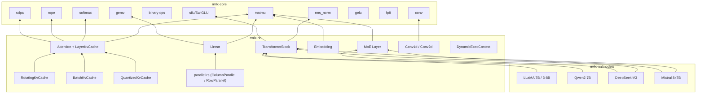

# rmlx-nn — Neural Network Layers

## Overview

`rmlx-nn` is a crate that implements neural network layers for GPU-accelerated inference. It builds core Transformer architecture components (Linear, Embedding, Attention, TransformerBlock, MoE) on top of `rmlx-core` compute kernels, and includes built-in model configurations for LLaMA, Qwen, DeepSeek-V3, and Mixtral.

> **Status (Phase 0-9B-opt + S1-S5 + Audit):** Linear, QuantizedLinear, Embedding, Attention (with LayerKvCache, RotatingKvCache, BatchKvCache, QuantizedKvCache), MLA (Multi-Latent Attention), Sliding Window Attention, TransformerBlock, MoE (with shared expert + EP integration + GPU routing), LayerNorm, 14 activation functions, Parallel (TP), Conv1d/Conv2d, DynamicExecContext, GGUF model loader, and 4 model configurations are implemented. Phase 0+1+2 audit remediation complete (items N1-N8).

---

## Module Structure

```
rmlx-nn/src/
├── lib.rs               # Module declarations + re-exports
├── linear.rs            # Linear (FC) layer
├── quantized_linear.rs  # QuantizedLinear (4-bit/8-bit with group quantization)
├── embedding.rs         # Token embedding
├── attention.rs         # Multi-Head / GQA Attention + KV cache
├── mla.rs               # Multi-Latent Attention (DeepSeek-V3)
├── sliding_window.rs    # Sliding Window Attention
├── layer_norm.rs        # LayerNorm layer wrapper
├── activations.rs       # 14 activation functions (SiLU, GELU, Mish, etc.)
├── transformer.rs       # Transformer block + model
├── moe.rs               # Mixture of Experts (shared expert, EP integration, GPU routing)
├── conv.rs              # Conv1d/Conv2d layer wrappers
├── dynamic.rs           # DynamicExecContext for variable shapes
├── gguf_loader.rs       # End-to-end GGUF model loading
├── parallel.rs          # Tensor-parallel layers (feature = "distributed")
└── models/
    ├── mod.rs            # Model module declarations
    ├── llama.rs          # LLaMA 7B, LLaMA 3 8B
    ├── qwen.rs           # Qwen2 7B
    ├── deepseek.rs       # DeepSeek-V3 (with MLA + shared expert)
    └── mixtral.rs        # Mixtral 8x7B
```

---

## linear.rs — Linear Layer

A linear (fully-connected) layer performing `y = x @ W^T + bias`.

```rust
pub struct LinearConfig {
    pub in_features: usize,
    pub out_features: usize,
    pub has_bias: bool,
}

pub struct Linear {
    config: LinearConfig,
    weight: Option<Array>,
    bias: Option<Array>,
}
```

| Method | Description |
|--------|-------------|
| `Linear::new(config)` | Creates a config-only layer (weights loaded later) |
| `from_arrays(config, weight, bias)` | Create with pre-loaded weight and optional bias |
| `forward(input, registry, queue)` | Forward pass: `input @ W^T + bias` |
| `in_features()` | Input dimension |
| `out_features()` | Output dimension |
| `has_bias()` | Whether bias is used |
| `has_weights()` | Whether weights have been loaded |
| `weight()` | Reference to weight array |
| `bias()` | Reference to bias array |

### Phase 9 Additions

#### `forward_into_cb()`

Encodes the linear forward pass into a caller-provided command buffer instead of
creating a new one. This is the key pattern enabling ExecGraph's CB batching.

| Method | Description |
|--------|-------------|
| `forward_into_cb(input, registry, cb)` | Encode `x @ W^T + bias` into the given CB |

#### `prepare_weight_t()` / `weight_transposed_contiguous()`

Pre-computes and caches the contiguous transposed weight matrix at model load time.

| Method | Description |
|--------|-------------|
| `prepare_weight_t(registry, queue)` | Pre-compute `W^T` as a contiguous array and cache it |
| `weight_transposed_contiguous()` | Returns the cached transposed weight (if prepared) |

This trades ~2x weight memory for zero-cost transpose during inference, contributing
to the 17.4x speedup.

---

## embedding.rs — Token Embedding

A lookup table that converts token IDs to embedding vectors.

```rust
pub struct EmbeddingConfig {
    pub vocab_size: usize,
    pub embed_dim: usize,
}

pub struct Embedding {
    config: EmbeddingConfig,
}
```

| Method | Description |
|--------|-------------|
| `Embedding::new(config)` | Creates from config |
| `vocab_size()` | Vocabulary size |
| `embed_dim()` | Embedding dimension |

---

## attention.rs — Multi-Head Attention

Multi-Head / Grouped Query Attention with KV cache support for incremental decoding.

```rust
pub struct AttentionConfig {
    pub num_heads: usize,
    pub num_kv_heads: usize,
    pub head_dim: usize,
    pub max_seq_len: usize,
    pub rope_theta: f32,
}

pub struct Attention {
    config: AttentionConfig,
    q_proj: Linear,
    k_proj: Linear,
    v_proj: Linear,
    o_proj: Linear,
}
```

| Method | Description |
|--------|-------------|
| `Attention::new(config)` | Config-only constructor (weights loaded later) |
| `from_layers(config, q_proj, k_proj, v_proj, o_proj)` | Create with pre-loaded projection layers |
| `forward(x, cos_freqs, sin_freqs, mask, cache, registry, queue)` | Forward pass; `cos_freqs`/`sin_freqs` are optional RoPE frequency tables, `cache: Option<&mut LayerKvCache>` |
| `config()` | Reference to `AttentionConfig` |
| `num_heads()` | Number of Q heads |
| `num_kv_heads()` | Number of KV heads |
| `head_dim()` | Head dimension |
| `hidden_size()` | `num_heads * head_dim` |
| `is_gqa()` | Whether GQA is used (`num_kv_heads < num_heads`) |

When `cache` is `Some`, new K/V tensors are appended to the cache and the full cached K/V is used for attention computation. When `cache` is `None`, behavior is unchanged (backward compatible).

| Attention variant | Condition | Representative model |
|-------------------|-----------|---------------------|
| MHA | `num_kv_heads == num_heads` | LLaMA 7B |
| GQA | `num_kv_heads < num_heads` | LLaMA 3, Qwen2, Mixtral |
| MLA | `num_kv_heads == 1` | DeepSeek-V3 |

### Phase 9 Additions

#### `forward_graph()`

ExecGraph-compatible forward pass that encodes attention operations into the
ExecGraph's command buffers.

| Method | Description |
|--------|-------------|
| `forward_graph(x, cos_freqs, sin_freqs, mask, cache, registry, graph)` | ExecGraph-compatible forward |

#### `batched_qkv_proj_into()`

Batches Q, K, V projections into a single command buffer.

| Method | Description |
|--------|-------------|
| `batched_qkv_proj_into(x, registry, cb)` | Encode all three projections into one CB |

### LayerKvCache

Per-layer KV cache for incremental decoding. Stores cached K/V per KV head so that previously computed key-value pairs are reused across decoding steps. Uses pre-allocated contiguous buffers with O(1) append (no full-history copy).

```rust
pub struct LayerKvCache {
    pub keys: Vec<Array>,      // per kv_head: [max_seq, head_dim], pre-allocated
    pub values: Vec<Array>,    // per kv_head: [max_seq, head_dim], pre-allocated
    pub seq_len: usize,
    max_seq_len: usize,
    num_kv_heads: usize,
    head_dim: usize,
}
```

| Method | Description |
|--------|-------------|
| `LayerKvCache::new(num_kv_heads)` | Creates an empty cache (no pre-allocation, legacy compatible) |
| `LayerKvCache::preallocated(device, num_kv_heads, head_dim, max_seq_len, dtype)` | Creates a pre-allocated cache with O(1) append |
| `append(new_keys, new_values, new_tokens, registry, queue)` | Appends new K/V and advances `seq_len` by `new_tokens` |
| `cached_keys(head)` | View of cached keys for head h: [seq_len, head_dim] |
| `cached_values(head)` | View of cached values for head h: [seq_len, head_dim] |
| `position_offset()` | Current cached sequence length (RoPE offset) |
| `is_empty()` | Whether the cache has any tokens |

#### `append_into_cb()`

Appends new K/V into the cache using a caller-provided command buffer (ExecGraph compatible).

| Method | Description |
|--------|-------------|
| `append_into_cb(new_keys, new_values, new_tokens, registry, cb)` | Append into caller's CB |

### RotatingKvCache

Circular buffer KV cache following mlx-lm's rotating cache design. Supports a `keep` parameter to preserve system prompt tokens.

```rust
pub struct RotatingKvCache {
    keys: Vec<Array>,      // per kv_head: [max_size, head_dim]
    values: Vec<Array>,
    offset: usize,         // total tokens processed (monotonically increasing)
    write_idx: usize,      // circular write position
    max_size: usize,       // buffer capacity
    keep: usize,           // front tokens to preserve (system prompt)
    num_kv_heads: usize,
    head_dim: usize,
}
```

| Method | Description |
|--------|-------------|
| `new(device, num_kv_heads, head_dim, max_size, keep, dtype)` | Pre-allocate circular buffers |
| `offset()` | Total tokens processed |
| `current_len()` | min(offset, max_size) -- actual cached tokens |
| `append(new_keys, new_values, new_tokens, registry, queue)` | Append with circular wrap |
| `cached_keys(head)` / `cached_values(head)` | View of valid cached portion |

**Circular write behavior:**
- Single-token decode: write at `write_idx`, wrap past `keep` region on overflow
- Multi-token prefill: linearize ring buffer via temporal ordering, concat, trim
- `keep=0`: simple circular buffer (no preserved tokens)

### BatchKvCache

Per-sequence batched KV cache for batch inference.

```rust
pub struct BatchKvCache {
    caches: Vec<LayerKvCache>,  // one per sequence
    offsets: Vec<usize>,        // per-sequence token count
    batch_size: usize,
}
```

| Method | Description |
|--------|-------------|
| `new(batch_size, num_kv_heads, head_dim, max_seq_len, dtype, device)` | Create batch of pre-allocated caches |
| `get(batch_idx)` / `get_mut(batch_idx)` | Access single sequence cache |
| `reset(batch_idx, ...)` | Re-allocate a specific sequence's cache |
| `filter(indices)` | Keep only sequences at given indices |
| `extend(other)` | Append caches from another batch |
| `offsets()` / `max_offset()` | Per-sequence offset access |

### QuantizedKvCache

KV cache storing keys and values in quantized format (packed uint32 + scales + biases) to reduce memory consumption.

```rust
pub struct QuantizedArray {
    pub packed: Array,     // uint32 packed data
    pub scales: Array,     // f32 per-group scales
    pub biases: Array,     // f32 per-group biases
    pub group_size: u32,
    pub bits: u32,         // 4 or 8
}

pub struct QuantizedKvCache {
    keys: Vec<Vec<QuantizedArray>>,   // [num_layers][num_kv_heads]
    values: Vec<Vec<QuantizedArray>>,
    offsets: Vec<usize>,
    // ... config fields
}
```

| Method | Description |
|--------|-------------|
| `new(num_layers, num_kv_heads, head_dim, group_size, bits)` | Create empty quantized cache |
| `append(layer, new_keys, new_values, new_tokens, registry, queue)` | Append and re-quantize |
| `quantized_keys(layer, head)` / `quantized_values(layer, head)` | Access quantized cache |
| `offset(layer)` / `is_empty(layer)` | Per-layer state |

**Memory savings** (128 head_dim, 32 KV heads, 8192 seq): f16=128MB, q8=64MB, q4=32MB

---

## transformer.rs — Transformer Block + Model

### FeedForwardType

```rust
pub enum FeedForwardType {
    Dense { intermediate_dim: usize },
    MoE { config: MoeConfig },
}
```

### FeedForward

```rust
/// Feed-forward network: either dense (SwiGLU) or MoE.
pub enum FeedForward {
    /// SwiGLU FFN: gate_proj, up_proj, down_proj
    Dense {
        gate_proj: Linear,
        up_proj: Linear,
        down_proj: Linear,
    },
    /// Mixture of Experts
    MoE(MoeLayer),
}
```

| Method | Description |
|--------|-------------|
| `forward(x, registry, queue)` | Forward pass: SwiGLU (`down(silu(gate(x)) * up(x))`) or MoE routing |

### TransformerConfig

```rust
pub struct TransformerConfig {
    pub hidden_size: usize,
    pub num_heads: usize,
    pub num_kv_heads: usize,
    pub head_dim: usize,
    pub num_layers: usize,
    pub vocab_size: usize,
    pub max_seq_len: usize,
    pub rope_theta: f32,
    pub rms_norm_eps: f32,
    pub ff_type: FeedForwardType,
}
```

### TransformerBlock

```rust
pub struct TransformerBlock {
    layer_idx: usize,
    attention: Attention,
    ffn: FeedForward,
    norm1_weight: Option<Array>,
    norm2_weight: Option<Array>,
    rms_norm_eps: f32,
}
```

| Method | Description |
|--------|-------------|
| `TransformerBlock::new(layer_idx, config)` | Creates with layer index and config |
| `from_parts(layer_idx, attention, ffn, norm1_weight, norm2_weight, rms_norm_eps)` | Create with pre-loaded components |
| `forward(x, cos_freqs, sin_freqs, mask, cache, registry, queue)` | Forward pass: norm -> attn -> residual -> norm -> FFN -> residual |
| `layer_idx()` | Layer index |
| `hidden_size()` | Hidden dimension |

#### Phase 9 Additions

##### `forward_graph()`

ExecGraph-compatible forward pass for the full transformer block (norm -> attn -> residual -> norm -> FFN -> residual).

| Method | Description |
|--------|-------------|
| `forward_graph(x, cos_freqs, sin_freqs, mask, cache, registry, graph)` | ExecGraph-compatible forward |

##### `prepare_weights_for_graph()`

Pre-caches all weight transposes for ExecGraph execution.

| Method | Description |
|--------|-------------|
| `prepare_weights_for_graph(registry, queue)` | Pre-cache all Linear weight transposes in this block |

### TransformerModel

```rust
pub struct TransformerModel {
    config: TransformerConfig,
    embedding: Option<Embedding>,
    layers: Vec<TransformerBlock>,
    final_norm_weight: Option<Array>,
    lm_head: Option<Linear>,
    num_layers: usize,
}
```

| Method | Description |
|--------|-------------|
| `TransformerModel::new(config)` | Creates a config-only model (no weights loaded) |
| `from_parts(config, embedding, layers, final_norm_weight, lm_head)` | Create with all components pre-loaded |
| `forward(token_ids, cos_freqs, sin_freqs, mask, cache, registry, queue)` | Forward pass: token IDs -> logits; `cache: Option<&mut Vec<LayerKvCache>>` (per-layer cache vector, length validated against `num_layers`) |
| `num_layers()` | Number of layers |
| `config()` | Config reference |

#### Phase 9 Additions

##### `forward_graph()`

Full model forward pass using ExecGraph -- each layer uses 5 CBs instead of 65 (92.3% reduction).

| Method | Description |
|--------|-------------|
| `forward_graph(token_ids, cos_freqs, sin_freqs, mask, cache, registry, graph)` | ExecGraph-compatible full model forward |

##### `prepare_weights_for_graph()`

Pre-caches all weight transposes across all layers.

| Method | Description |
|--------|-------------|
| `prepare_weights_for_graph(registry, queue)` | Pre-cache weight transposes for all layers |

---

## moe.rs — Mixture of Experts

An MoE layer using top-k gating.

```rust
pub struct MoeConfig {
    pub num_experts: usize,
    pub num_experts_per_token: usize,
    pub hidden_dim: usize,
    pub intermediate_dim: usize,
}

pub struct MoeLayer {
    config: MoeConfig,
}
```

| Method | Description |
|--------|-------------|
| `MoeLayer::new(config)` | Creates from config |
| `forward(x, metrics)` | Forward pass; records per-expert routing into `metrics` |
| `num_experts()` | Number of experts |
| `top_k()` | Number of active experts per token |
| `hidden_dim()` | Hidden dimension |

### MoeForwardMetrics

Metrics collected during MoE forward passes, including per-expert token routing counts.

| Field / Method | Description |
|----------------|-------------|
| `expert_tokens: Vec<AtomicU64>` | Per-expert routed token counter |
| `num_experts: usize` | Number of experts tracked |
| `MoeForwardMetrics::with_experts(num_experts)` | Creates metrics pre-allocated for `num_experts` |
| `record_expert_token(expert_idx)` | Atomically increments the counter for `expert_idx` |
| `expert_tokens_snapshot() -> Vec<u64>` | Returns a point-in-time snapshot of all expert token counts |

---

## conv.rs — Convolution Layers

### Conv1d

1D convolution layer wrapping `rmlx_core::ops::conv::conv1d`.

```rust
pub struct Conv1dConfig {
    pub in_channels: usize,
    pub out_channels: usize,
    pub kernel_size: usize,
    pub stride: usize,       // default: 1
    pub padding: usize,      // default: 0
    pub dilation: usize,     // default: 1
    pub groups: usize,       // default: 1
    pub has_bias: bool,      // default: false
}
```

| Method | Description |
|--------|-------------|
| `Conv1d::new(config)` | Config-only (weights loaded later) |
| `from_arrays(config, weight, bias)` | Create with pre-loaded weights |
| `load_weights(weight, bias)` | Load weights after construction |
| `forward(input, registry, queue)` | Forward: [B, C_in, W] -> [B, C_out, W_out] |

### Conv2d

2D convolution layer wrapping `rmlx_core::ops::conv::conv2d`.

```rust
pub struct Conv2dConfig {
    pub in_channels: usize,
    pub out_channels: usize,
    pub kernel_size: (usize, usize),
    pub stride: (usize, usize),     // default: (1,1)
    pub padding: (usize, usize),    // default: (0,0)
    pub dilation: (usize, usize),   // default: (1,1)
    pub groups: usize,              // default: 1
    pub has_bias: bool,             // default: false
}
```

| Method | Description |
|--------|-------------|
| `Conv2d::new(config)` | Config-only (weights loaded later) |
| `from_arrays(config, weight, bias)` | Create with pre-loaded weights |
| `load_weights(weight, bias)` | Load weights after construction |
| `forward(input, registry, queue)` | Forward: [B, C_in, H, W] -> [B, C_out, H_out, W_out] |

---

## dynamic.rs — Dynamic Shape Support

Pre-allocates intermediate buffers at maximum size and dispatches with actual dimensions, avoiding buffer reallocation for varying input sizes.

```rust
pub struct DynamicExecContext {
    max_seq_len: usize,
    hidden_dim: usize,
    dtype: DType,
    intermediates: Vec<Array>,
}
```

| Method | Description |
|--------|-------------|
| `new(device, max_seq_len, hidden_dim, dtype, num_intermediates)` | Pre-allocate buffers |
| `get_intermediate(idx, actual_seq_len)` | Zero-copy view with actual shape |
| `max_seq_len()` / `hidden_dim()` | Configuration accessors |
| `num_intermediates()` / `allocated_bytes()` | Buffer info |

---

## models/ — Model Architecture Definitions

Provides 4 Transformer model configurations as `TransformerConfig`.

### LLaMA (`models/llama.rs`)

| Function | hidden | heads | kv_heads | layers | vocab | max_seq | ff_type |
|----------|--------|-------|----------|--------|-------|---------|---------|
| `llama_7b()` | 4096 | 32 | 32 (MHA) | 32 | 32000 | 4096 | Dense(11008) |
| `llama_3_8b()` | 4096 | 32 | 8 (GQA) | 32 | 128256 | 8192 | Dense(14336) |

- LLaMA 7B: rope_theta=10000, rms_norm_eps=1e-5
- LLaMA 3 8B: rope_theta=500000, rms_norm_eps=1e-5

### Qwen2 (`models/qwen.rs`)

| Function | hidden | heads | kv_heads | layers | vocab | max_seq | ff_type |
|----------|--------|-------|----------|--------|-------|---------|---------|
| `qwen2_7b()` | 3584 | 28 | 4 (GQA) | 28 | 152064 | 32768 | Dense(18944) |

- rope_theta=1000000, rms_norm_eps=1e-6

### DeepSeek-V3 (`models/deepseek.rs`)

| Function | hidden | heads | kv_heads | layers | vocab | max_seq | ff_type |
|----------|--------|-------|----------|--------|-------|---------|---------|
| `deepseek_v3()` | 7168 | 128 | 1 (MLA) | 61 | 129280 | 16384 | MoE(256 experts, top-8) |

- MoE: num_experts=256, num_experts_per_token=8, intermediate_dim=2048
- rope_theta=10000, rms_norm_eps=1e-6

### Mixtral (`models/mixtral.rs`)

| Function | hidden | heads | kv_heads | layers | vocab | max_seq | ff_type |
|----------|--------|-------|----------|--------|-------|---------|---------|
| `mixtral_8x7b()` | 4096 | 32 | 8 (GQA) | 32 | 32000 | 32768 | MoE(8 experts, top-2) |

- MoE: num_experts=8, num_experts_per_token=2, intermediate_dim=14336
- rope_theta=1000000, rms_norm_eps=1e-5

---

## Architecture Diagram



---

## Re-exports (lib.rs)

```rust
pub use attention::{
    Attention, AttentionConfig, BatchKvCache, LayerKvCache,
    QuantizedArray, QuantizedKvCache, RotatingKvCache,
};
pub use conv::{Conv1d, Conv1dConfig, Conv2d, Conv2dConfig};
pub use dynamic::DynamicExecContext;
pub use embedding::{Embedding, EmbeddingConfig};
pub use linear::{Linear, LinearConfig};
pub use moe::{MoeConfig, MoeForwardMetrics, MoeLayer};
pub use transformer::{
    FeedForward, FeedForwardType, TransformerBlock, TransformerConfig, TransformerModel,
};
```

---

## parallel.rs — Tensor-Parallel Layers

> Conditionally compiled with the `"distributed"` feature.

Megatron-LM style tensor-parallel linear layers for distributed inference.

| Struct | Description |
|--------|-------------|
| `ColumnParallelLinear` | Splits the output dimension across TP ranks (each rank holds a column shard) |
| `RowParallelLinear` | Splits the input dimension across TP ranks (each rank holds a row shard) |

---

## Dependencies

```toml
[dependencies]
rmlx-core = { path = "../rmlx-core" }

[dependencies.rmlx-distributed]
path = "../rmlx-distributed"
optional = true   # enables "distributed" feature → parallel.rs
```
