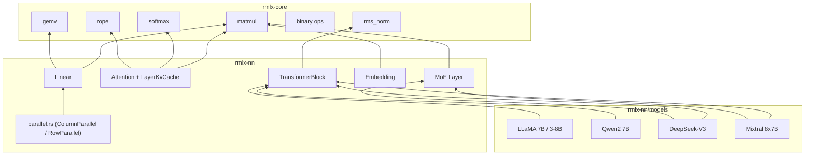

# rmlx-nn — Neural Network Layers

## Overview

`rmlx-nn` is a crate that implements neural network layers for LLM inference. It builds core Transformer architecture components (Linear, Embedding, Attention, TransformerBlock, MoE) on top of `rmlx-core` compute kernels, and includes built-in model configurations for LLaMA, Qwen, DeepSeek-V3, and Mixtral.

> **Status:** Linear, Embedding, Attention (with KV cache), TransformerBlock, MoE, Parallel (TP), and 4 model configurations (LLaMA 7B/3-8B, Qwen2 7B, DeepSeek-V3, Mixtral 8x7B) are implemented.

---

## Module Structure

```
rmlx-nn/src/
├── lib.rs           # Module declarations + re-exports
├── linear.rs        # Linear (FC) layer
├── embedding.rs     # Token embedding
├── attention.rs     # Multi-Head / GQA Attention + KV cache
├── transformer.rs   # Transformer block + model
├── moe.rs           # Mixture of Experts layer
├── parallel.rs      # Tensor-parallel layers (feature = "distributed")
└── models/
    ├── mod.rs        # Model module declarations
    ├── llama.rs      # LLaMA 7B, LLaMA 3 8B
    ├── qwen.rs       # Qwen2 7B
    ├── deepseek.rs   # DeepSeek-V3
    └── mixtral.rs    # Mixtral 8x7B
```

---

## linear.rs — Linear Layer

A linear (fully-connected) layer performing `y = x @ W^T + bias`.

```rust
pub struct LinearConfig {
    pub in_features: usize,
    pub out_features: usize,
    pub has_bias: bool,
}

pub struct Linear {
    config: LinearConfig,
}
```

| Method | Description |
|--------|-------------|
| `Linear::new(config)` | Creates a layer from config |
| `in_features()` | Input dimension |
| `out_features()` | Output dimension |
| `has_bias()` | Whether bias is used |

---

## embedding.rs — Token Embedding

A lookup table that converts token IDs to embedding vectors.

```rust
pub struct EmbeddingConfig {
    pub vocab_size: usize,
    pub embed_dim: usize,
}

pub struct Embedding {
    config: EmbeddingConfig,
}
```

| Method | Description |
|--------|-------------|
| `Embedding::new(config)` | Creates from config |
| `vocab_size()` | Vocabulary size |
| `embed_dim()` | Embedding dimension |

---

## attention.rs — Multi-Head Attention

Multi-Head / Grouped Query Attention with KV cache support for incremental decoding.

```rust
pub struct AttentionConfig {
    pub num_heads: usize,
    pub num_kv_heads: usize,
    pub head_dim: usize,
    pub max_seq_len: usize,
    pub rope_theta: f32,
}

pub struct Attention {
    config: AttentionConfig,
}
```

| Method | Description |
|--------|-------------|
| `Attention::new(config)` | Creates from config |
| `forward(x, cache)` | Forward pass; `cache: Option<&mut LayerKvCache>` |
| `num_heads()` | Number of Q heads |
| `num_kv_heads()` | Number of KV heads |
| `head_dim()` | Head dimension |
| `hidden_size()` | `num_heads * head_dim` |
| `is_gqa()` | Whether GQA is used (`num_kv_heads < num_heads`) |

When `cache` is `Some`, new K/V tensors are appended to the cache and the full cached K/V is used for attention computation. When `cache` is `None`, behavior is unchanged (backward compatible).

| Attention variant | Condition | Representative model |
|-------------------|-----------|---------------------|
| MHA | `num_kv_heads == num_heads` | LLaMA 7B |
| GQA | `num_kv_heads < num_heads` | LLaMA 3, Qwen2, Mixtral |
| MLA | `num_kv_heads == 1` | DeepSeek-V3 |

### LayerKvCache

Per-layer KV cache for incremental decoding. Stores cached K/V per KV head so that previously computed key-value pairs are reused across decoding steps.

```rust
pub struct LayerKvCache {
    pub keys: Vec<Array>,      // per kv_head cached K: [cached_seq, head_dim]
    pub values: Vec<Array>,    // per kv_head cached V: [cached_seq, head_dim]
    pub seq_len: usize,
}
```

| Method | Description |
|--------|-------------|
| `LayerKvCache::new(num_kv_heads)` | Creates an empty cache for `num_kv_heads` heads |
| `append(new_keys, new_values, new_tokens)` | Appends new K/V and advances `seq_len` by `new_tokens` |

---

## transformer.rs — Transformer Block + Model

### FeedForwardType

```rust
pub enum FeedForwardType {
    Dense { intermediate_dim: usize },
    MoE { config: MoeConfig },
}
```

### TransformerConfig

```rust
pub struct TransformerConfig {
    pub hidden_size: usize,
    pub num_heads: usize,
    pub num_kv_heads: usize,
    pub head_dim: usize,
    pub num_layers: usize,
    pub vocab_size: usize,
    pub max_seq_len: usize,
    pub rope_theta: f32,
    pub rms_norm_eps: f32,
    pub ff_type: FeedForwardType,
}
```

### TransformerBlock

```rust
pub struct TransformerBlock {
    layer_idx: usize,
    config: TransformerConfig,
}
```

| Method | Description |
|--------|-------------|
| `TransformerBlock::new(layer_idx, config)` | Creates with layer index and config |
| `forward(x, cache)` | Forward pass; `cache: Option<&mut LayerKvCache>` — passed through to `Attention` |
| `layer_idx()` | Layer index |
| `hidden_size()` | Hidden dimension |

### TransformerModel

```rust
pub struct TransformerModel {
    config: TransformerConfig,
    num_layers: usize,
}
```

| Method | Description |
|--------|-------------|
| `TransformerModel::new(config)` | Creates a model |
| `forward(x, cache)` | Forward pass; `cache: Option<&mut Vec<LayerKvCache>>` (per-layer cache vector, length validated against `num_layers`) |
| `num_layers()` | Number of layers |
| `config()` | Config reference |

---

## moe.rs — Mixture of Experts

An MoE layer using top-k gating.

```rust
pub struct MoeConfig {
    pub num_experts: usize,
    pub num_experts_per_token: usize,
    pub hidden_dim: usize,
    pub intermediate_dim: usize,
}

pub struct MoeLayer {
    config: MoeConfig,
}
```

| Method | Description |
|--------|-------------|
| `MoeLayer::new(config)` | Creates from config |
| `forward(x, metrics)` | Forward pass; records per-expert routing into `metrics` |
| `num_experts()` | Number of experts |
| `top_k()` | Number of active experts per token |
| `hidden_dim()` | Hidden dimension |

### MoeForwardMetrics

Metrics collected during MoE forward passes, including per-expert token routing counts.

| Field / Method | Description |
|----------------|-------------|
| `expert_tokens: Vec<AtomicU64>` | Per-expert routed token counter |
| `num_experts: usize` | Number of experts tracked |
| `MoeForwardMetrics::with_experts(num_experts)` | Creates metrics pre-allocated for `num_experts` |
| `record_expert_token(expert_idx)` | Atomically increments the counter for `expert_idx` |
| `expert_tokens_snapshot() -> Vec<u64>` | Returns a point-in-time snapshot of all expert token counts |

---

## models/ — Model Architecture Definitions

Provides 4 LLM model configurations as `TransformerConfig`.

### LLaMA (`models/llama.rs`)

| Function | hidden | heads | kv_heads | layers | vocab | max_seq | ff_type |
|----------|--------|-------|----------|--------|-------|---------|---------|
| `llama_7b()` | 4096 | 32 | 32 (MHA) | 32 | 32000 | 4096 | Dense(11008) |
| `llama_3_8b()` | 4096 | 32 | 8 (GQA) | 32 | 128256 | 8192 | Dense(14336) |

- LLaMA 7B: rope_theta=10000, rms_norm_eps=1e-5
- LLaMA 3 8B: rope_theta=500000, rms_norm_eps=1e-5

### Qwen2 (`models/qwen.rs`)

| Function | hidden | heads | kv_heads | layers | vocab | max_seq | ff_type |
|----------|--------|-------|----------|--------|-------|---------|---------|
| `qwen2_7b()` | 3584 | 28 | 4 (GQA) | 28 | 152064 | 32768 | Dense(18944) |

- rope_theta=1000000, rms_norm_eps=1e-6

### DeepSeek-V3 (`models/deepseek.rs`)

| Function | hidden | heads | kv_heads | layers | vocab | max_seq | ff_type |
|----------|--------|-------|----------|--------|-------|---------|---------|
| `deepseek_v3()` | 7168 | 128 | 1 (MLA) | 61 | 129280 | 16384 | MoE(256 experts, top-8) |

- MoE: num_experts=256, num_experts_per_token=8, intermediate_dim=2048
- rope_theta=10000, rms_norm_eps=1e-6

### Mixtral (`models/mixtral.rs`)

| Function | hidden | heads | kv_heads | layers | vocab | max_seq | ff_type |
|----------|--------|-------|----------|--------|-------|---------|---------|
| `mixtral_8x7b()` | 4096 | 32 | 8 (GQA) | 32 | 32000 | 32768 | MoE(8 experts, top-2) |

- MoE: num_experts=8, num_experts_per_token=2, intermediate_dim=14336
- rope_theta=1000000, rms_norm_eps=1e-5

---

## Architecture Diagram



---

## Re-exports (lib.rs)

```rust
pub use attention::LayerKvCache;
pub use transformer::FeedForward;
```

---

## parallel.rs — Tensor-Parallel Layers

> Conditionally compiled with the `"distributed"` feature.

Megatron-LM style tensor-parallel linear layers for distributed inference.

| Struct | Description |
|--------|-------------|
| `ColumnParallelLinear` | Splits the output dimension across TP ranks (each rank holds a column shard) |
| `RowParallelLinear` | Splits the input dimension across TP ranks (each rank holds a row shard) |

---

## Dependencies

```toml
[dependencies]
rmlx-core = { path = "../rmlx-core" }

[dependencies.rmlx-distributed]
path = "../rmlx-distributed"
optional = true   # enables "distributed" feature → parallel.rs
```
