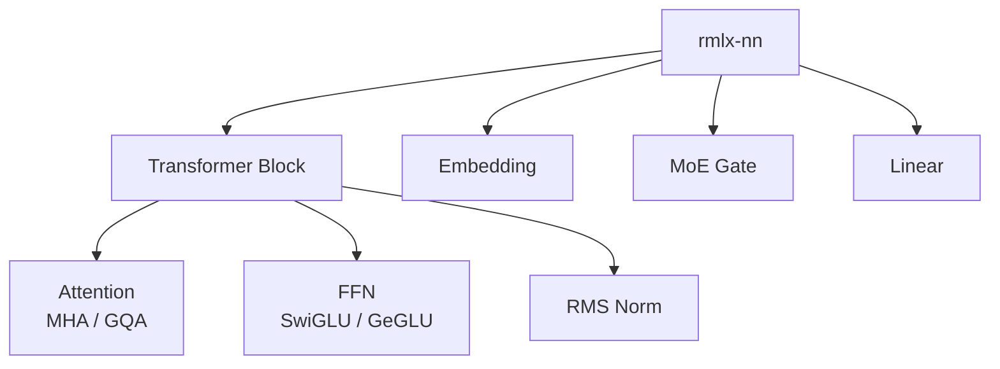
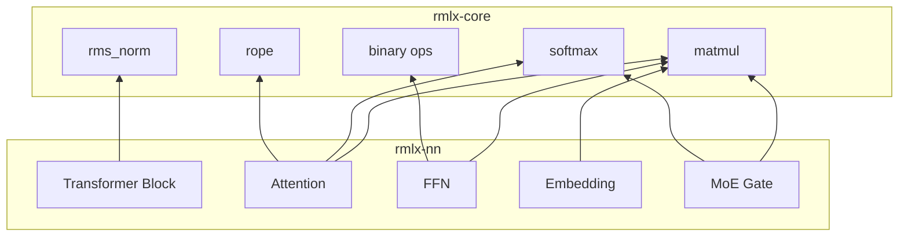

# rmlx-nn — 신경망 레이어

## 개요

`rmlx-nn`은 LLM 추론을 위한 신경망 레이어를 구현하는 크레이트입니다. Transformer 아키텍처의 핵심 구성 요소(Attention, FFN, Embedding 등)를 `rmlx-core`의 연산 커널 위에 구성합니다. 최종적으로 `rmlx-lm` (LLM 추론 엔진)에서 이 레이어들을 조합하여 모델을 구성합니다.

> **상태:** 현재 스켈레톤 상태이며, Phase 5에서 구현 예정입니다.

---

## 계획된 모듈



### Transformer Block *계획됨 (Phase 5)*

LLM의 기본 구성 단위인 Transformer 블록을 구현합니다.

```
Input
  │
  ├─→ RMS Norm → Attention → Residual Add
  │
  ├─→ RMS Norm → FFN → Residual Add
  │
Output
```

---

### Attention (MHA / GQA) *계획됨 (Phase 5)*

| 변형 | 설명 | 대표 모델 |
|------|------|-----------|
| MHA (Multi-Head Attention) | 각 헤드가 독립적인 Q, K, V를 가짐 | GPT-2 |
| GQA (Grouped Query Attention) | K, V를 그룹 단위로 공유하여 메모리 절약 | LLaMA 2/3 |

**주요 연산:**
- Q, K, V 프로젝션 (Linear)
- RoPE (Rotary Position Embedding)
- Scaled Dot-Product Attention
- KV Cache 관리

---

### FFN (Feed-Forward Network) *계획됨 (Phase 5)*

| 변형 | 활성화 함수 | 대표 모델 |
|------|-----------|-----------|
| SwiGLU | SiLU + Gate | LLaMA |
| GeGLU | GELU + Gate | - |

---

### Embedding *계획됨 (Phase 5)*

토큰 ID를 임베딩 벡터로 변환합니다.

- 어휘 크기(vocabulary size) × 임베딩 차원(hidden dim) 가중치 행렬
- 양자화 지원 (4-bit, 8-bit)

---

### MoE Gate *계획됨 (Phase 5)*

Mixture of Experts 모델에서 각 토큰을 적절한 전문가(expert)에게 라우팅하는 게이팅 메커니즘을 구현합니다.

- Top-K expert 선택
- Load balancing loss 계산
- `rmlx-distributed`의 MoE 프리미티브와 연계

---

### Linear *계획됨 (Phase 5)*

범용 선형(fully-connected) 레이어입니다.

- `rmlx-core`의 GEMM / QMM 커널을 사용합니다
- 가중치 양자화 (4-bit, 8-bit, FP4, FP8) 지원

---

## 아키텍처 다이어그램



---

## 구현 시점

**Phase 5** — rmlx-core, rmlx-distributed 완료 후 구현을 시작합니다.

---

## 의존성

```toml
[dependencies]
rmlx-core = { path = "../rmlx-core" }
```
