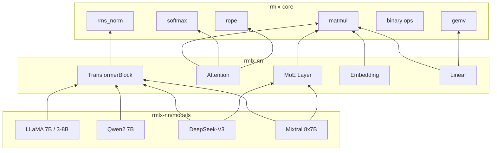

# rmlx-nn — 신경망 레이어

## 개요

`rmlx-nn`은 GPU 가속 추론을 위한 신경망 레이어를 구현하는 크레이트입니다. Transformer 아키텍처의 핵심 구성 요소(Linear, Embedding, Attention, TransformerBlock, MoE)를 `rmlx-core`의 연산 커널 위에 구성하며, LLaMA, Qwen, DeepSeek-V3, Mixtral 모델 설정을 내장하고 있습니다.

> **상태:** Linear, Embedding, Attention, TransformerBlock, MoE, 그리고 4종 모델 설정(LLaMA 7B/3-8B, Qwen2 7B, DeepSeek-V3, Mixtral 8x7B)이 구현되어 있습니다.

---

## 모듈 구조

```
rmlx-nn/src/
├── lib.rs           # 모듈 선언
├── linear.rs        # 선형 (FC) 레이어
├── embedding.rs     # 토큰 임베딩
├── attention.rs     # Multi-Head / GQA Attention
├── transformer.rs   # Transformer 블록 + 모델
├── moe.rs           # Mixture of Experts 레이어
└── models/
    ├── mod.rs        # 모델 모듈 선언
    ├── llama.rs      # LLaMA 7B, LLaMA 3 8B
    ├── qwen.rs       # Qwen2 7B
    ├── deepseek.rs   # DeepSeek-V3
    └── mixtral.rs    # Mixtral 8x7B
```

---

## linear.rs — 선형 레이어

`y = x @ W^T + bias` 연산을 수행하는 선형(fully-connected) 레이어입니다.

```rust
pub struct LinearConfig {
    pub in_features: usize,
    pub out_features: usize,
    pub has_bias: bool,
}

pub struct Linear {
    config: LinearConfig,
}
```

| 메서드 | 설명 |
|--------|------|
| `Linear::new(config)` | 설정으로 레이어 생성 |
| `in_features()` | 입력 차원 |
| `out_features()` | 출력 차원 |
| `has_bias()` | 바이어스 사용 여부 |

---

## embedding.rs — 토큰 임베딩

토큰 ID를 임베딩 벡터로 변환하는 lookup 테이블입니다.

```rust
pub struct EmbeddingConfig {
    pub vocab_size: usize,
    pub embed_dim: usize,
}

pub struct Embedding {
    config: EmbeddingConfig,
}
```

| 메서드 | 설명 |
|--------|------|
| `Embedding::new(config)` | 설정으로 생성 |
| `vocab_size()` | 어휘 크기 |
| `embed_dim()` | 임베딩 차원 |

---

## attention.rs — Multi-Head Attention

KV 캐시를 지원하는 Multi-Head / Grouped Query Attention입니다.

```rust
pub struct AttentionConfig {
    pub num_heads: usize,
    pub num_kv_heads: usize,
    pub head_dim: usize,
    pub max_seq_len: usize,
    pub rope_theta: f32,
}

pub struct Attention {
    config: AttentionConfig,
}
```

| 메서드 | 설명 |
|--------|------|
| `Attention::new(config)` | 설정으로 생성 |
| `num_heads()` | Q 헤드 수 |
| `num_kv_heads()` | KV 헤드 수 |
| `head_dim()` | 헤드 차원 |
| `hidden_size()` | `num_heads * head_dim` |
| `is_gqa()` | GQA 여부 (`num_kv_heads < num_heads`) |

| Attention 변형 | 조건 | 대표 모델 |
|---------------|------|-----------|
| MHA | `num_kv_heads == num_heads` | LLaMA 7B |
| GQA | `num_kv_heads < num_heads` | LLaMA 3, Qwen2, Mixtral |
| MLA | `num_kv_heads == 1` | DeepSeek-V3 |

---

## transformer.rs — Transformer 블록 + 모델

### FeedForwardType

```rust
pub enum FeedForwardType {
    Dense { intermediate_dim: usize },
    MoE { config: MoeConfig },
}
```

### TransformerConfig

```rust
pub struct TransformerConfig {
    pub hidden_size: usize,
    pub num_heads: usize,
    pub num_kv_heads: usize,
    pub head_dim: usize,
    pub num_layers: usize,
    pub vocab_size: usize,
    pub max_seq_len: usize,
    pub rope_theta: f32,
    pub rms_norm_eps: f32,
    pub ff_type: FeedForwardType,
}
```

### TransformerBlock

```rust
pub struct TransformerBlock {
    layer_idx: usize,
    config: TransformerConfig,
}
```

| 메서드 | 설명 |
|--------|------|
| `TransformerBlock::new(layer_idx, config)` | 레이어 인덱스와 설정으로 생성 |
| `layer_idx()` | 레이어 인덱스 |
| `hidden_size()` | 은닉 차원 |

### TransformerModel

```rust
pub struct TransformerModel {
    config: TransformerConfig,
    num_layers: usize,
}
```

| 메서드 | 설명 |
|--------|------|
| `TransformerModel::new(config)` | 모델 생성 |
| `num_layers()` | 레이어 수 |
| `config()` | 설정 참조 |

---

## moe.rs — Mixture of Experts

Top-k 게이팅을 사용하는 MoE 레이어입니다.

```rust
pub struct MoeConfig {
    pub num_experts: usize,
    pub num_experts_per_token: usize,
    pub hidden_dim: usize,
    pub intermediate_dim: usize,
}

pub struct MoeLayer {
    config: MoeConfig,
}
```

| 메서드 | 설명 |
|--------|------|
| `MoeLayer::new(config)` | 설정으로 생성 |
| `num_experts()` | 전문가 수 |
| `top_k()` | 토큰당 활성 전문가 수 |
| `hidden_dim()` | 은닉 차원 |

---

## models/ — 모델 아키텍처 정의

4종의 Transformer 모델 설정을 `TransformerConfig`로 제공합니다.

### LLaMA (`models/llama.rs`)

| 함수 | hidden | heads | kv_heads | layers | vocab | max_seq | ff_type |
|------|--------|-------|----------|--------|-------|---------|---------|
| `llama_7b()` | 4096 | 32 | 32 (MHA) | 32 | 32000 | 4096 | Dense(11008) |
| `llama_3_8b()` | 4096 | 32 | 8 (GQA) | 32 | 128256 | 8192 | Dense(14336) |

- LLaMA 7B: rope_theta=10000, rms_norm_eps=1e-5
- LLaMA 3 8B: rope_theta=500000, rms_norm_eps=1e-5

### Qwen2 (`models/qwen.rs`)

| 함수 | hidden | heads | kv_heads | layers | vocab | max_seq | ff_type |
|------|--------|-------|----------|--------|-------|---------|---------|
| `qwen2_7b()` | 3584 | 28 | 4 (GQA) | 28 | 152064 | 32768 | Dense(18944) |

- rope_theta=1000000, rms_norm_eps=1e-6

### DeepSeek-V3 (`models/deepseek.rs`)

| 함수 | hidden | heads | kv_heads | layers | vocab | max_seq | ff_type |
|------|--------|-------|----------|--------|-------|---------|---------|
| `deepseek_v3()` | 7168 | 128 | 1 (MLA) | 61 | 129280 | 16384 | MoE(256 experts, top-8) |

- MoE: num_experts=256, num_experts_per_token=8, intermediate_dim=2048
- rope_theta=10000, rms_norm_eps=1e-6

### Mixtral (`models/mixtral.rs`)

| 함수 | hidden | heads | kv_heads | layers | vocab | max_seq | ff_type |
|------|--------|-------|----------|--------|-------|---------|---------|
| `mixtral_8x7b()` | 4096 | 32 | 8 (GQA) | 32 | 32000 | 32768 | MoE(8 experts, top-2) |

- MoE: num_experts=8, num_experts_per_token=2, intermediate_dim=14336
- rope_theta=1000000, rms_norm_eps=1e-5

---

## 아키텍처 다이어그램



---

## 의존성

```toml
[dependencies]
rmlx-core = { path = "../rmlx-core" }
```
