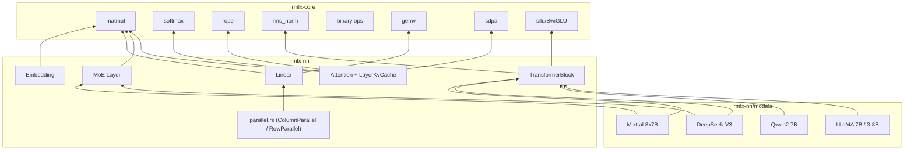

# rmlx-nn — 신경망 레이어

## 개요

`rmlx-nn`은 GPU 가속 추론을 위한 신경망 레이어를 구현하는 크레이트입니다. Transformer 아키텍처의 핵심 구성 요소(Linear, Embedding, Attention, TransformerBlock, MoE)를 `rmlx-core`의 연산 커널 위에 구성하며, LLaMA, Qwen, DeepSeek-V3, Mixtral 모델 설정을 내장하고 있습니다.

> **상태 (Phase 0-9B-opt + S1-S5 + EP-2~EP-6):** Linear, Embedding, Attention (KV 캐시 포함), TransformerBlock, MoE (`MoeStrategy` 디스패치 포함), Parallel (TP), 4종 모델 설정(LLaMA 7B/3-8B, Qwen2 7B, DeepSeek-V3, Mixtral 8x7B), RotatingKvCache, BatchKvCache, QuantizedKvCache, QuantizedArray, Conv1d/Conv2d, DynamicExecContext가 구현되어 있습니다. Phase 9에서 `forward_graph()`, `forward_into_cb()`, 가중치 사전 캐싱(`prepare_weight_t`)이 추가되어 ExecGraph CB 배칭을 지원합니다 (레이어당 65 CB -> 5 CB, 92.3% 감소, 17.4x 속도 향상). EP Phase 2-6 순방향 경로 통합 완료: `MoeStrategy` 열거형 (PerExpert/Grouped), 빌더 API (`with_strategy`, `with_pipeline`, `with_sparse_plan`), 그룹형 GEMM 경로, 파이프라인 통합, ICB 희소 디스패치 플레이스홀더, FP8/SlabRing 와이어링. **Phase KO 추가:** 9-디스패치 디코드 경로 (`forward_decode_9dispatch`, `forward_single_cb_9dispatch`), 병합 QKV/gate_up 가중치 준비, slab 레이아웃 KV 캐시 (`LayerKvCache::preallocated` with slab), `StorageModePrivate` 가중치를 위한 `prepare_weights_private()` 파이프라인. **Phase 8c 추가:** `CachedDecode` 구조체 (사전 해석 PSO + 사전 할당 스크래치 버퍼), `forward_cached_2encoder_9dispatch` 메서드, `append_into_encoder` 및 `append_preresolved_into_encoder` KV 캐시 메서드, 모든 op에 걸친 `_preresolved_into_encoder` 패턴. **Phase 10 추가:** 융합 RMSNorm+GEMV 및 SwiGLU+down 커널을 사용하는 TransformerBlock의 `forward_cached_fused_7dispatch` 메서드; CachedDecode 융합 PSO 필드와 자동 폴백. **Phase 11 추가:** 열-주도(column-major) 가중치 저장을 위한 Linear의 `prepare_weight_col_major()`; 4개 열-주도 가중치 버퍼와 행-주도 자동 폴백을 포함하는 CachedDecode 열-주도 PSO/가중치 통합.

---

## 모듈 구조

```
rmlx-nn/src/
├── lib.rs              # 모듈 선언 + 재내보내기
├── linear.rs           # 선형 (FC) 레이어
├── embedding.rs        # 토큰 임베딩
├── attention.rs        # Multi-Head / GQA Attention + KV 캐시
├── kv_cache.rs         # RotatingKvCache, BatchKvCache, QuantizedKvCache
├── quantized_array.rs  # QuantizedArray (AWQ/GPTQ 양자화 가중치 래퍼)
├── conv.rs             # Conv1d/Conv2d 레이어
├── dynamic_exec.rs     # DynamicExecContext (동적 shape 실행 컨텍스트)
├── transformer.rs      # Transformer 블록 + 모델
├── moe.rs              # Mixture of Experts 레이어 (공유 expert, EP 통합, GPU 라우팅)
├── expert_group.rs     # 그룹형 expert GEMM + 스태킹된 expert 가중치 (EP-2)
├── moe_pipeline.rs     # TBO/SBO compute-communication 오버랩 오케스트레이션 (EP-4)
├── parallel.rs         # 텐서 병렬 레이어 (feature = "distributed")
└── models/
    ├── mod.rs           # 모델 모듈 선언
    ├── llama.rs         # LLaMA 7B, LLaMA 3 8B
    ├── qwen.rs          # Qwen2 7B
    ├── deepseek.rs      # DeepSeek-V3
    └── mixtral.rs       # Mixtral 8x7B
```

---

## linear.rs — 선형 레이어

`y = x @ W^T + bias` 연산을 수행하는 선형(fully-connected) 레이어입니다.

```rust
pub struct LinearConfig {
    pub in_features: usize,
    pub out_features: usize,
    pub has_bias: bool,
}

pub struct Linear {
    config: LinearConfig,
    weight: Option<Array>,
    bias: Option<Array>,
    // Phase 11: GEMV 대역폭 최적화를 위한 캐시된 열-주도 가중치
    // weight_col_cached: Option<Array>,
}
```

| 메서드 | 설명 |
|--------|------|
| `Linear::new(config)` | 설정 전용 레이어 생성 (가중치는 나중에 로드) |
| `from_arrays(config, weight, bias)` | 사전 로드된 가중치와 선택적 바이어스로 생성 |
| `forward(input, registry, queue)` | 순전파: `input @ W^T + bias` |
| `in_features()` | 입력 차원 |
| `out_features()` | 출력 차원 |
| `has_bias()` | 바이어스 사용 여부 |
| `has_weights()` | 가중치 로드 여부 |
| `weight()` | 가중치 배열 참조 |
| `bias()` | 바이어스 배열 참조 |

### Phase 9 추가 사항

#### `forward_into_cb()`

새 command buffer를 생성하는 대신 호출자가 제공한 command buffer에 선형 순전파를
인코딩합니다. ExecGraph의 CB 배칭을 가능하게 하는 핵심 패턴입니다.

| 메서드 | 설명 |
|--------|------|
| `forward_into_cb(input, registry, cb)` | 주어진 CB에 `x @ W^T + bias` 인코딩 |

#### `prepare_weight_t()` / `weight_transposed_contiguous()`

모델 로드 시점에 연속 전치 가중치 행렬을 사전 계산하고 캐싱합니다.

| 메서드 | 설명 |
|--------|------|
| `prepare_weight_t(registry, queue)` | `W^T`를 연속 배열로 사전 계산 및 캐싱 |
| `weight_transposed_contiguous()` | 캐싱된 전치 가중치 반환 (사전 준비된 경우) |

가중치 메모리를 약 2배 사용하는 대신 추론 시 전치 비용을 제거하여
17.4x 속도 향상에 기여합니다.

#### `prepare_weight_col_major()` (Phase 11)

GEMV 대역폭 최적화를 위해 모델 로드 시점에 열-주도(column-major) [K,M] 가중치 행렬을 사전 계산하고 캐싱합니다.

| 메서드 | 설명 |
|--------|------|
| `prepare_weight_col_major(registry, queue)` | 가중치를 [K,M] 열-주도 레이아웃으로 전치 및 캐싱 |
| `weight_col_cached()` | 캐싱된 열-주도 가중치 반환 (사전 준비된 경우) |

---

## embedding.rs — 토큰 임베딩

토큰 ID를 임베딩 벡터로 변환하는 lookup 테이블입니다.

```rust
pub struct EmbeddingConfig {
    pub vocab_size: usize,
    pub embed_dim: usize,
}

pub struct Embedding {
    config: EmbeddingConfig,
}
```

| 메서드 | 설명 |
|--------|------|
| `Embedding::new(config)` | 설정으로 생성 |
| `vocab_size()` | 어휘 크기 |
| `embed_dim()` | 임베딩 차원 |

---

## attention.rs — Multi-Head Attention

KV 캐시를 지원하는 Multi-Head / Grouped Query Attention입니다.

```rust
pub struct AttentionConfig {
    pub num_heads: usize,
    pub num_kv_heads: usize,
    pub head_dim: usize,
    pub max_seq_len: usize,
    pub rope_theta: f32,
}

pub struct Attention {
    config: AttentionConfig,
    q_proj: Linear,
    k_proj: Linear,
    v_proj: Linear,
    o_proj: Linear,
}
```

| 메서드 | 설명 |
|--------|------|
| `Attention::new(config)` | 설정 전용 생성자 (가중치는 나중에 로드) |
| `from_layers(config, q_proj, k_proj, v_proj, o_proj)` | 사전 로드된 프로젝션 레이어로 생성 |
| `forward(x, cos_freqs, sin_freqs, mask, cache, registry, queue)` | 순전파; `cos_freqs`/`sin_freqs`는 선택적 RoPE 주파수 테이블, `cache: Option<&mut LayerKvCache>` |
| `config()` | `AttentionConfig` 참조 |
| `num_heads()` | Q 헤드 수 |
| `num_kv_heads()` | KV 헤드 수 |
| `head_dim()` | 헤드 차원 |
| `hidden_size()` | `num_heads * head_dim` |
| `is_gqa()` | GQA 여부 (`num_kv_heads < num_heads`) |

`cache`가 `Some`이면 새 K/V 텐서가 캐시에 추가되고 전체 캐시된 K/V가 어텐션 계산에 사용됩니다. `cache`가 `None`이면 동작이 변경되지 않습니다 (하위 호환).

| Attention 변형 | 조건 | 대표 모델 |
|---------------|------|-----------|
| MHA | `num_kv_heads == num_heads` | LLaMA 7B |
| GQA | `num_kv_heads < num_heads` | LLaMA 3, Qwen2, Mixtral |
| MLA | `num_kv_heads == 1` | DeepSeek-V3 |

### Phase 9 추가 사항

#### `forward_graph()`

ExecGraph의 command buffer에 어텐션 연산을 인코딩하는 ExecGraph 호환 순전파입니다.

| 메서드 | 설명 |
|--------|------|
| `forward_graph(x, cos_freqs, sin_freqs, mask, cache, registry, graph)` | ExecGraph 호환 순전파 |

#### `batched_qkv_proj_into()`

Q, K, V 프로젝션을 단일 command buffer에 배칭합니다.

| 메서드 | 설명 |
|--------|------|
| `batched_qkv_proj_into(x, registry, cb)` | 세 프로젝션을 하나의 CB에 인코딩 |

### LayerKvCache

레이어별 KV 캐시로, 증분 디코딩에 사용됩니다. KV 헤드별로 캐시된 K/V를 저장하여 이전에 계산된 key-value 쌍을 디코딩 단계 간에 재사용합니다. 사전 할당된 연속 버퍼를 사용하여 O(1) append를 지원합니다 (전체 이력 복사 없음).

```rust
pub struct LayerKvCache {
    pub keys: Vec<Array>,      // kv_head별: [max_seq, head_dim], 사전 할당
    pub values: Vec<Array>,    // kv_head별: [max_seq, head_dim], 사전 할당
    pub seq_len: usize,
    max_seq_len: usize,
    num_kv_heads: usize,
    head_dim: usize,
}
```

| 메서드 | 설명 |
|--------|------|
| `LayerKvCache::new(num_kv_heads)` | 빈 캐시 생성 (사전 할당 없음, 레거시 호환) |
| `LayerKvCache::preallocated(device, num_kv_heads, head_dim, max_seq_len, dtype)` | O(1) append를 위한 사전 할당 캐시 생성 |
| `append(new_keys, new_values, new_tokens, registry, queue)` | 새 K/V를 추가하고 `seq_len`을 `new_tokens`만큼 증가 |
| `cached_keys(head)` | 헤드 h의 캐시된 키 뷰: [seq_len, head_dim] |
| `cached_values(head)` | 헤드 h의 캐시된 값 뷰: [seq_len, head_dim] |
| `position_offset()` | 현재 캐시된 시퀀스 길이 (RoPE 오프셋) |
| `is_empty()` | 캐시에 토큰이 있는지 여부 |

#### `append_into_cb()`

호출자가 제공한 command buffer를 사용하여 새 K/V를 캐시에 추가합니다 (ExecGraph 호환).

| 메서드 | 설명 |
|--------|------|
| `append_into_cb(new_keys, new_values, new_tokens, registry, cb)` | 호출자의 CB에 추가 |

#### `append_into_encoder()` / `append_preresolved_into_encoder()`

호출자가 제공한 compute encoder를 사용하여 새 K/V를 캐시에 추가합니다 (인코더 생성 없음).

| 메서드 | 설명 |
|--------|------|
| `append_into_encoder(new_keys, new_values, new_tokens, registry, encoder)` | 기존 인코더를 사용하여 추가 (생성/종료 없음) |
| `append_preresolved_into_encoder(new_keys, new_values, new_tokens, copy_pso, encoder)` | 사전 해석된 copy PSO로 추가 (레지스트리 조회 없음, 검증 없음) |

---

## kv_cache.rs -- KV 캐시 변형

### RotatingKvCache

고정 크기 순환 버퍼로 구현된 KV 캐시입니다. `max_seq_len`을 초과하면 가장 오래된 항목을 덮어씁니다. 스트리밍 추론에 적합합니다.

```rust
pub struct RotatingKvCache {
    keys: Vec<Array>,       // kv_head별: [max_seq, head_dim]
    values: Vec<Array>,     // kv_head별: [max_seq, head_dim]
    seq_len: usize,
    write_pos: usize,       // 순환 쓰기 위치
    max_seq_len: usize,
    num_kv_heads: usize,
    head_dim: usize,
}
```

| 메서드 | 설명 |
|--------|------|
| `RotatingKvCache::new(device, num_kv_heads, head_dim, max_seq_len, dtype)` | 사전 할당된 순환 캐시 생성 |
| `append(new_keys, new_values, new_tokens, registry, queue)` | 새 K/V 추가 (가득 차면 순환 덮어쓰기) |
| `cached_keys(head)` | 유효한 캐시된 키 뷰 |
| `cached_values(head)` | 유효한 캐시된 값 뷰 |
| `position_offset()` | 현재 시퀀스 위치 |

### BatchKvCache

배치 추론을 위한 KV 캐시입니다. 여러 시퀀스의 KV 캐시를 동시에 관리합니다.

```rust
pub struct BatchKvCache {
    caches: Vec<LayerKvCache>,  // 시퀀스별 캐시
    batch_size: usize,
}
```

| 메서드 | 설명 |
|--------|------|
| `BatchKvCache::new(batch_size, num_kv_heads, head_dim, max_seq_len, device, dtype)` | 배치 크기만큼 캐시 생성 |
| `get(seq_idx)` | 특정 시퀀스의 캐시 참조 |
| `get_mut(seq_idx)` | 특정 시퀀스의 캐시 가변 참조 |
| `batch_size()` | 배치 크기 |

### QuantizedKvCache

양자화된 K/V를 저장하여 메모리 사용량을 줄이는 KV 캐시입니다. FP8 또는 Q8_0으로 K/V를 양자화하여 캐시합니다.

```rust
pub struct QuantizedKvCache {
    keys: Vec<Array>,       // 양자화된 K: FP8/Q8_0
    values: Vec<Array>,     // 양자화된 V: FP8/Q8_0
    scales: Vec<Array>,     // 역양자화 스케일
    cache_dtype: DType,     // Float8E4M3 또는 Q8_0
    seq_len: usize,
    max_seq_len: usize,
    num_kv_heads: usize,
    head_dim: usize,
}
```

| 메서드 | 설명 |
|--------|------|
| `QuantizedKvCache::new(device, num_kv_heads, head_dim, max_seq_len, cache_dtype)` | 양자화 캐시 생성 |
| `append(new_keys, new_values, new_tokens, registry, queue)` | 새 K/V를 양자화하여 추가 |
| `dequant_keys(head, registry, queue)` | 역양자화된 키 반환 |
| `dequant_values(head, registry, queue)` | 역양자화된 값 반환 |
| `memory_savings()` | Float16 대비 메모리 절감 비율 |

---

## quantized_array.rs -- QuantizedArray

AWQ/GPTQ 양자화 가중치를 래핑하는 구조체입니다. 역양자화 메타데이터를 함께 저장합니다.

```rust
pub struct QuantizedArray {
    data: Array,           // 양자화된 가중치 데이터
    scales: Array,         // 그룹별 스케일
    zeros: Option<Array>,  // 그룹별 제로포인트 (AWQ/GPTQ)
    group_size: usize,     // 양자화 그룹 크기
    bits: usize,           // 비트 수 (4 또는 8)
}
```

| 메서드 | 설명 |
|--------|------|
| `QuantizedArray::from_awq(data, scales, zeros, group_size)` | AWQ 가중치로부터 생성 |
| `QuantizedArray::from_gptq(data, scales, zeros, g_idx, bits)` | GPTQ 가중치로부터 생성 |
| `dequantize(registry, queue)` | 전체 가중치를 Float16/Float32로 역양자화 |
| `matmul(input, registry, queue)` | 양자화 상태에서 직접 행렬 곱 수행 |

---

## conv.rs -- Conv1d/Conv2d 레이어

멀티모달 모델(Whisper 등)의 오디오/이미지 인코더에 사용되는 합성곱 레이어입니다.

```rust
pub struct Conv1dConfig {
    pub in_channels: usize,
    pub out_channels: usize,
    pub kernel_size: usize,
    pub stride: usize,
    pub padding: usize,
    pub has_bias: bool,
}

pub struct Conv2dConfig {
    pub in_channels: usize,
    pub out_channels: usize,
    pub kernel_size: (usize, usize),
    pub stride: (usize, usize),
    pub padding: (usize, usize),
    pub has_bias: bool,
}
```

| 메서드 | 설명 |
|--------|------|
| `Conv1d::new(config)` | 1D 합성곱 레이어 생성 |
| `Conv1d::forward(input, registry, queue)` | 1D 합성곱 순전파 |
| `Conv2d::new(config)` | 2D 합성곱 레이어 생성 |
| `Conv2d::forward(input, registry, queue)` | 2D 합성곱 순전파 |

---

## dynamic_exec.rs -- DynamicExecContext

동적 shape를 가진 입력에 대해 ExecGraph를 효율적으로 재사용하는 실행 컨텍스트입니다. 입력 shape가 변경될 때 ExecGraph를 자동으로 재컴파일하거나 캐시된 그래프를 재사용합니다.

```rust
pub struct DynamicExecContext {
    graph_cache: HashMap<ShapeKey, ExecGraph>,
    max_cached_graphs: usize,
    current_shape: Option<ShapeKey>,
}
```

| 메서드 | 설명 |
|--------|------|
| `DynamicExecContext::new(max_cached_graphs)` | 캐시 크기 제한과 함께 생성 |
| `get_or_build(shape, build_fn)` | shape에 맞는 캐시된 그래프 반환 또는 새로 빌드 |
| `invalidate(shape)` | 특정 shape의 캐시된 그래프 무효화 |
| `cached_count()` | 캐시된 그래프 수 |

---

## transformer.rs — Transformer 블록 + 모델

### FeedForwardType

```rust
pub enum FeedForwardType {
    Dense { intermediate_dim: usize },
    MoE { config: MoeConfig },
}
```

### FeedForward

```rust
/// 피드포워드 네트워크: Dense (SwiGLU) 또는 MoE.
pub enum FeedForward {
    /// SwiGLU FFN: gate_proj, up_proj, down_proj
    Dense {
        gate_proj: Linear,
        up_proj: Linear,
        down_proj: Linear,
    },
    /// Mixture of Experts
    MoE(MoeLayer),
}
```

| 메서드 | 설명 |
|--------|------|
| `forward(x, registry, queue)` | 순전파: SwiGLU (`down(silu(gate(x)) * up(x))`) 또는 MoE 라우팅 |

### TransformerConfig

```rust
pub struct TransformerConfig {
    pub hidden_size: usize,
    pub num_heads: usize,
    pub num_kv_heads: usize,
    pub head_dim: usize,
    pub num_layers: usize,
    pub vocab_size: usize,
    pub max_seq_len: usize,
    pub rope_theta: f32,
    pub rms_norm_eps: f32,
    pub ff_type: FeedForwardType,
}
```

### TransformerBlock

```rust
pub struct TransformerBlock {
    layer_idx: usize,
    attention: Attention,
    ffn: FeedForward,
    norm1_weight: Option<Array>,
    norm2_weight: Option<Array>,
    rms_norm_eps: f32,
}
```

| 메서드 | 설명 |
|--------|------|
| `TransformerBlock::new(layer_idx, config)` | 레이어 인덱스와 설정으로 생성 |
| `from_parts(layer_idx, attention, ffn, norm1_weight, norm2_weight, rms_norm_eps)` | 사전 로드된 구성 요소로 생성 |
| `forward(x, cos_freqs, sin_freqs, mask, cache, registry, queue)` | 순전파: norm -> attn -> 잔차 -> norm -> FFN -> 잔차 |
| `layer_idx()` | 레이어 인덱스 |
| `hidden_size()` | 은닉 차원 |

#### Phase 9 추가 사항

##### `forward_graph()`

전체 Transformer 블록의 ExecGraph 호환 순전파입니다 (norm -> attn -> 잔차 -> norm -> FFN -> 잔차).

| 메서드 | 설명 |
|--------|------|
| `forward_graph(x, cos_freqs, sin_freqs, mask, cache, registry, graph)` | ExecGraph 호환 순전파 |

##### `prepare_weights_for_graph()`

ExecGraph 실행을 위해 모든 가중치 전치를 사전 캐싱합니다.

| 메서드 | 설명 |
|--------|------|
| `prepare_weights_for_graph(registry, queue)` | 이 블록의 모든 Linear 가중치 전치를 사전 캐싱 |

#### Phase KO 추가 사항: 9-디스패치 디코드 경로

Phase KO는 전체 transformer 레이어를 9개의 Metal 디스패치(메모리 배리어를 통해 4개 인코더로 추가 최적화)로 줄이는 최소 디스패치 디코드 경로를 도입하여, 연산별 베이스라인 대비 64x 속도 향상을 달성합니다.

##### 9-디스패치 디코드 아키텍처

9-디스패치 경로는 transformer 레이어를 다음과 같이 분할합니다:
- **어텐션 블록 (5 디스패치):** 병합 QKV 프로젝션 (1 융합 GEMV), 배치 RoPE (1), slab KV 캐시 배치 SDPA 디코드 (1), 융합 GEMV+바이어스 출력 프로젝션 (1), 잔차 덧셈 (1)
- **FFN 블록 (3 디스패치):** 병합 gate_up 프로젝션 (1 융합 GEMV), 융합 SiLU*mul (1), 융합 GEMV+바이어스 down 프로젝션 (1)
- **최종 잔차 (1 디스패치)**

##### 가중치 병합

| 메서드 | 설명 |
|--------|------|
| `Attention::prepare_merged_qkv()` | Q, K, V 프로젝션 가중치를 단일 결합 행렬로 병합하여 융합 QKV GEMV 실행 |
| `FeedForward::prepare_merged_gate_up()` | gate와 up 프로젝션 가중치를 단일 행렬로 병합하여 융합 gate_up GEMV 실행 |

##### 9-디스패치 순전파 메서드

| 메서드 | 설명 |
|--------|------|
| `Attention::forward_decode_9dispatch(x, kv_cache, cos, sin, encoder, ...)` | 병합 QKV, 배치 RoPE, slab SDPA 디코드를 사용하는 5-디스패치 어텐션 경로 |
| `FeedForward::forward_single_cb_9dispatch(x, encoder, ...)` | 병합 gate_up, 융합 SiLU*mul을 사용하는 3-디스패치 FFN 경로 |
| `TransformerBlock::forward_single_cb_9dispatch(x, kv_cache, cos, sin, encoder, ...)` | 어텐션 + FFN + 잔차를 결합하는 전체 9-디스패치 오케스트레이션 |
| `TransformerBlock::prepare_weights_9dispatch(registry, queue)` | 9-디스패치 경로를 위한 모든 병합 가중치 준비 |

#### Phase 8c 추가 사항: CachedDecode + 2-인코더 경로

Phase 8c는 모델 초기화 시 모든 파이프라인 상태 객체를 사전 해석하고 스크래치 버퍼를 사전 할당하여 토큰별 CPU 오버헤드를 제거합니다.

##### CachedDecode

```rust
pub struct CachedDecode {
    // 10개 사전 해석 PSO (토큰당 레지스트리 조회 제로)
    // 9개 사전 할당 스크래치 버퍼 (토큰당 Array::uninit 제로)
    // 사전 계산된 디스패치 기하
    // 캐시된 norm 가중치 스트라이드
}
```

| 메서드 | 설명 |
|--------|------|
| `CachedDecode::new(block, registry)` | 모든 PSO 사전 해석, 스크래치 버퍼 할당, 디스패치 기하 계산 |
| `TransformerBlock::prepare_cached_decode(registry)` | 편의 생성자 |
| `TransformerBlock::forward_cached_2encoder_9dispatch(x, cos, sin, cache, cached, cb)` | 사전 해석 상태를 사용하는 2-인코더 디코드 (동적 할당 제로) |

**비재진입성**: `CachedDecode`는 호출 간 스크래치 버퍼를 재사용합니다. 이전 출력에 대한 참조를 이후 호출에 걸쳐 유지하면 데이터가 앨리어싱되어 덮어쓰여집니다.

##### `StorageModePrivate` 가중치 파이프라인

| 메서드 | 설명 |
|--------|------|
| `Linear::prepare_weights_private(device, queue)` | 가중치를 `StorageModePrivate` 버퍼로 복사 |
| `FeedForward::prepare_weights_private(device, queue)` | 모든 FFN 가중치를 재귀적으로 private으로 준비 |
| `Attention::prepare_weights_private(device, queue)` | 모든 어텐션 가중치를 재귀적으로 private으로 준비 |
| `TransformerBlock::prepare_weights_private(device, queue)` | 모든 블록 가중치를 재귀적으로 private으로 준비 |

`StorageModePrivate` 버퍼는 CPU 측 페이지 테이블 항목이 없는 GPU 전용으로, 로딩 후 CPU가 접근하지 않는 정적 모델 가중치의 TLB 부담을 줄입니다.

##### KV 캐시 Slab 레이아웃

`LayerKvCache::preallocated()`가 이제 slab 레이아웃을 지원합니다. 레이어의 모든 KV 헤드가 단일 연속 할당에 저장됩니다. slab 레이아웃은 헤드별 버퍼 간접 참조 없이 slab에서 K/V를 직접 읽는 스트라이드 인식 SDPA 디코드를 가능하게 하여 캐시 지역성을 개선합니다.

### TransformerModel

```rust
pub struct TransformerModel {
    config: TransformerConfig,
    embedding: Option<Embedding>,
    layers: Vec<TransformerBlock>,
    final_norm_weight: Option<Array>,
    lm_head: Option<Linear>,
    num_layers: usize,
}
```

| 메서드 | 설명 |
|--------|------|
| `TransformerModel::new(config)` | 설정 전용 모델 생성 (가중치 미로드) |
| `from_parts(config, embedding, layers, final_norm_weight, lm_head)` | 모든 구성 요소를 사전 로드하여 생성 |
| `forward(token_ids, cos_freqs, sin_freqs, mask, cache, registry, queue)` | 순전파: 토큰 ID -> logits; `cache: Option<&mut Vec<LayerKvCache>>` (레이어별 캐시 벡터, `num_layers`와 길이 검증) |
| `num_layers()` | 레이어 수 |
| `config()` | 설정 참조 |

#### Phase 9 추가 사항

##### `forward_graph()`

ExecGraph를 사용한 전체 모델 순전파 -- 레이어당 65개 대신 5개 CB 사용 (92.3% 감소).

| 메서드 | 설명 |
|--------|------|
| `forward_graph(token_ids, cos_freqs, sin_freqs, mask, cache, registry, graph)` | ExecGraph 호환 전체 모델 순전파 |

##### `prepare_weights_for_graph()`

모든 레이어의 가중치 전치를 사전 캐싱합니다.

| 메서드 | 설명 |
|--------|------|
| `prepare_weights_for_graph(registry, queue)` | 전체 레이어의 가중치 전치를 사전 캐싱 |

---

## moe.rs — Mixture of Experts

전략 기반 디스패치를 사용하는 Top-k 게이팅 MoE 레이어입니다 (EP-2~EP-6 순방향 경로 통합).

### MoeStrategy

```rust
pub enum MoeStrategy {
    PerExpert,  // 기본값: expert별 순차 순전파
    Grouped,    // 배치 gather -> ExpertGroup GEMM -> 배치 scatter
}
```

`MoeStrategy`는 `forward()`가 expert 연산을 디스패치하는 방법을 제어합니다:
- **PerExpert** (기본값): `forward_per_expert()`를 호출하여 각 활성 expert를 개별적으로 반복합니다. 직관적이지만 O(E) 커널 런치가 발생합니다.
- **Grouped**: `forward_grouped()`를 호출하여, 배치 gather로 expert별 토큰을 수집하고, 단일 `ExpertGroup` GEMM 패스 (Gate -> Up -> fused SwiGLU -> Down)를 실행한 뒤, 배치 scatter로 원래 토큰 순서로 복원합니다. 대규모 expert 수에서 커널 런치 오버헤드를 크게 줄입니다.

### MoeConfig & MoeLayer

```rust
pub struct MoeConfig {
    pub num_experts: usize,
    pub num_experts_per_token: usize,
    pub hidden_dim: usize,
    pub intermediate_dim: usize,
}

pub struct MoeLayer {
    config: MoeConfig,
    strategy: MoeStrategy,
    pipeline: Option<MoePipeline>,
    sparse_plan: Option<SparsePlan>,
}
```

| 메서드 | 설명 |
|--------|------|
| `MoeLayer::new(config)` | 설정으로 생성 (기본값: `PerExpert` 전략, 파이프라인 없음) |
| `with_strategy(strategy)` | 빌더: 디스패치 전략 설정 (`PerExpert` 또는 `Grouped`) |
| `with_pipeline(pipeline)` | 빌더: SBO/TBO compute-communication 오버랩을 위한 `MoePipeline` 연결 |
| `with_sparse_plan(plan)` | 빌더: ICB 희소 디스패치를 위한 `SparsePlan` 연결 (아래 참조) |
| `forward(x, metrics)` | 순전파; `strategy`에 따라 디스패치 (PerExpert -> `forward_per_expert`, Grouped -> `forward_grouped`); 메트릭에 expert별 라우팅 기록 |
| `forward_per_expert(x, metrics)` | Expert별 순차 순전파 (기존 경로) |
| `forward_grouped(x, metrics)` | 그룹형 경로: 배치 gather -> ExpertGroup GEMM -> 배치 scatter |
| `num_experts()` | 전문가 수 |
| `top_k()` | 토큰당 활성 전문가 수 |
| `hidden_dim()` | 은닉 차원 |
| `strategy()` | 현재 디스패치 전략 |

### 그룹형 순전파 경로

`forward_grouped()` 경로는 세 단계로 실행됩니다:

1. **배치 Gather**: 각 expert로 향하는 토큰을 연속적인 expert 그룹 버퍼로 수집합니다.
2. **ExpertGroup GEMM**: 스태킹된 expert 가중치 `[E, D, intermediate_dim]`에 대해 Gate -> Up -> fused SwiGLU -> Down을 배치 GEMM으로 실행하여, O(E)개의 개별 커널 런치를 단일 GPU 패스로 대체합니다.
3. **배치 Scatter**: 계산된 expert 출력을 게이팅 가중치를 적용하여 원래 토큰 위치로 분배합니다.

### 파이프라인 통합 (MoePipeline)

`with_pipeline()`로 `MoePipeline`이 연결되면, 순전파 경로는 SBO (Stage-Before-Output) 또는 TBO (Token-Before-Output) 오버랩 전략을 사용하여 compute와 RDMA 통신을 오버랩합니다. 파이프라인은 `GpuEvent` signal/wait 체인과 단일 터미널 CPU wait를 사용하여, 비행 중 CPU 차단을 거의 제로로 달성합니다.

### ICB 희소 디스패치

`with_sparse_plan()` 빌더는 ICB (Index-Compressed Batch) 희소 디스패치를 활성화하는 `SparsePlan`을 연결합니다. 라우팅 희소성이 50%를 초과하면 (즉, expert 슬롯의 절반 이상이 비어있으면) 빈 expert 연산을 완전히 건너뛰는 희소 경로가 자동 선택됩니다. 이것은 향후 EP-7 최적화를 위한 플레이스홀더이며, plan 인터페이스는 연결되어 있지만 커널 수준의 희소 디스패치는 아직 구현되지 않았습니다.

### MoeForwardMetrics

MoE 순전파 중 수집되는 메트릭으로, expert별 토큰 라우팅 횟수를 포함합니다. expert별 토큰 추적은 이제 모든 순전파 경로(PerExpert, Grouped, 파이프라인)에서 동작합니다.

| 필드 / 메서드 | 설명 |
|---------------|------|
| `expert_tokens: Vec<AtomicU64>` | 전문가별 라우팅된 토큰 카운터 |
| `num_experts: usize` | 추적 중인 전문가 수 |
| `MoeForwardMetrics::with_experts(num_experts)` | `num_experts`개로 사전 할당된 메트릭 생성 |
| `record_expert_token(expert_idx)` | `expert_idx` 카운터를 원자적으로 증가 |
| `expert_tokens_snapshot() -> Vec<u64>` | 전체 전문가 토큰 카운트의 시점 스냅샷 반환 |

### EP 최적화 모듈

**`expert_group.rs` (EP-2):** `ExpertGroup`은 여러 expert의 가중치를 `[E, D, intermediate_dim]` 텐서로 사전 스태킹하고, `GatherMM` (f16/bf16, `_into_cb` 지원)을 사용한 그룹형 expert GEMM (Gate -> Up -> fused SwiGLU -> Down)으로 O(E)개의 expert별 런치를 단일 GPU 패스로 대체합니다.

**`moe_pipeline.rs` (EP-4):** `MoePipeline`은 `GpuEvent` signal/wait 체인과 단일 터미널 CPU wait를 사용하여 TBO/SBO 오버랩을 오케스트레이션하며, 비행 중 CPU 대기 없이 compute와 RDMA 통신의 완전한 오버랩을 달성합니다.

---

## Phase KO: 디코드 성능 요약

Phase KO는 MLX 대비 레이어당 디코드 성능 격차를 해소합니다:

| 구성 | 레이턴시 (us) | 속도 향상 | 디스패치 수 |
|------|-------------|-----------|------------|
| 베이스라인 (연산별 동기화) | 109,215 | 1x | ~65 |
| ExecGraph (5 CB) | 2,735 | 40x | 5 CB에 ~65 |
| 단일-CB (44 인코더) | 2,049 | 53x | 44 |
| 9-디스패치 (4 인코더) | 1,739 | 64x | 9 |
| Cached 2-인코더 (60L) | 714 us/L | 6x 낮은 σ | 9 (2 인코더) |
| MLX 컴파일 | 4,525 (60L) | -- | -- |
| MLX 대비 격차 | | 6.34x 빠름 | |

M3 Ultra, f16, Llama-2 7B 형상에서 벤치마크.

---

## models/ — 모델 아키텍처 정의

4종의 Transformer 모델 설정을 `TransformerConfig`로 제공합니다.

### LLaMA (`models/llama.rs`)

| 함수 | hidden | heads | kv_heads | layers | vocab | max_seq | ff_type |
|------|--------|-------|----------|--------|-------|---------|---------|
| `llama_7b()` | 4096 | 32 | 32 (MHA) | 32 | 32000 | 4096 | Dense(11008) |
| `llama_3_8b()` | 4096 | 32 | 8 (GQA) | 32 | 128256 | 8192 | Dense(14336) |

- LLaMA 7B: rope_theta=10000, rms_norm_eps=1e-5
- LLaMA 3 8B: rope_theta=500000, rms_norm_eps=1e-5

### Qwen2 (`models/qwen.rs`)

| 함수 | hidden | heads | kv_heads | layers | vocab | max_seq | ff_type |
|------|--------|-------|----------|--------|-------|---------|---------|
| `qwen2_7b()` | 3584 | 28 | 4 (GQA) | 28 | 152064 | 32768 | Dense(18944) |

- rope_theta=1000000, rms_norm_eps=1e-6

### DeepSeek-V3 (`models/deepseek.rs`)

| 함수 | hidden | heads | kv_heads | layers | vocab | max_seq | ff_type |
|------|--------|-------|----------|--------|-------|---------|---------|
| `deepseek_v3()` | 7168 | 128 | 1 (MLA) | 61 | 129280 | 16384 | MoE(256 experts, top-8) |

- MoE: num_experts=256, num_experts_per_token=8, intermediate_dim=2048
- rope_theta=10000, rms_norm_eps=1e-6

### Mixtral (`models/mixtral.rs`)

| 함수 | hidden | heads | kv_heads | layers | vocab | max_seq | ff_type |
|------|--------|-------|----------|--------|-------|---------|---------|
| `mixtral_8x7b()` | 4096 | 32 | 8 (GQA) | 32 | 32000 | 32768 | MoE(8 experts, top-2) |

- MoE: num_experts=8, num_experts_per_token=2, intermediate_dim=14336
- rope_theta=1000000, rms_norm_eps=1e-5

---

## 아키텍처 다이어그램



---

## 재내보내기 (lib.rs)

```rust
pub use attention::{Attention, AttentionConfig, LayerKvCache};
pub use kv_cache::{RotatingKvCache, BatchKvCache, QuantizedKvCache};
pub use quantized_array::QuantizedArray;
pub use conv::{Conv1d, Conv1dConfig, Conv2d, Conv2dConfig};
pub use dynamic_exec::DynamicExecContext;
pub use embedding::{Embedding, EmbeddingConfig};
pub use linear::{Linear, LinearConfig};
pub use moe::{MoeConfig, MoeForwardMetrics, MoeLayer};
pub use transformer::{
    CachedDecode, FeedForward, FeedForwardType, TransformerBlock, TransformerConfig, TransformerModel,
};
```

---

## parallel.rs — 텐서 병렬 레이어

> `"distributed"` feature로 조건부 컴파일됩니다.

분산 추론을 위한 Megatron-LM 스타일 텐서 병렬 선형 레이어입니다.

| 구조체 | 설명 |
|--------|------|
| `ColumnParallelLinear` | 출력 차원을 TP 랭크 간에 분할 (각 랭크가 열 샤드 보유) |
| `RowParallelLinear` | 입력 차원을 TP 랭크 간에 분할 (각 랭크가 행 샤드 보유) |

---

## 의존성

```toml
[dependencies]
rmlx-core = { path = "../rmlx-core" }

[dependencies.rmlx-distributed]
path = "../rmlx-distributed"
optional = true   # "distributed" feature 활성화 → parallel.rs
```
