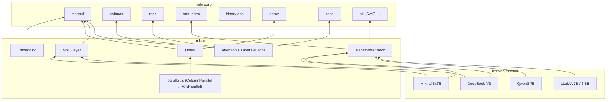

# rmlx-nn — 신경망 레이어

## 개요

`rmlx-nn`은 GPU 가속 추론을 위한 신경망 레이어를 구현하는 크레이트입니다. Transformer 아키텍처의 핵심 구성 요소(Linear, Embedding, Attention, TransformerBlock, MoE)를 `rmlx-core`의 연산 커널 위에 구성하며, LLaMA, Qwen, DeepSeek-V3, Mixtral 모델 설정을 내장하고 있습니다.

> **상태 (Phase 0-9B-opt):** Linear, Embedding, Attention (KV 캐시 포함), TransformerBlock, MoE, Parallel (TP), 그리고 4종 모델 설정(LLaMA 7B/3-8B, Qwen2 7B, DeepSeek-V3, Mixtral 8x7B)이 구현되어 있습니다. Phase 9에서 `forward_graph()`, `forward_into_cb()`, 가중치 사전 캐싱(`prepare_weight_t`)이 추가되어 ExecGraph CB 배칭을 지원합니다 (레이어당 65 CB -> 5 CB, 92.3% 감소, 16.15x 속도 향상).

---

## 모듈 구조

```
rmlx-nn/src/
├── lib.rs           # 모듈 선언 + 재내보내기
├── linear.rs        # 선형 (FC) 레이어
├── embedding.rs     # 토큰 임베딩
├── attention.rs     # Multi-Head / GQA Attention + KV 캐시
├── transformer.rs   # Transformer 블록 + 모델
├── moe.rs           # Mixture of Experts 레이어
├── parallel.rs      # 텐서 병렬 레이어 (feature = "distributed")
└── models/
    ├── mod.rs        # 모델 모듈 선언
    ├── llama.rs      # LLaMA 7B, LLaMA 3 8B
    ├── qwen.rs       # Qwen2 7B
    ├── deepseek.rs   # DeepSeek-V3
    └── mixtral.rs    # Mixtral 8x7B
```

---

## linear.rs — 선형 레이어

`y = x @ W^T + bias` 연산을 수행하는 선형(fully-connected) 레이어입니다.

```rust
pub struct LinearConfig {
    pub in_features: usize,
    pub out_features: usize,
    pub has_bias: bool,
}

pub struct Linear {
    config: LinearConfig,
    weight: Option<Array>,
    bias: Option<Array>,
}
```

| 메서드 | 설명 |
|--------|------|
| `Linear::new(config)` | 설정 전용 레이어 생성 (가중치는 나중에 로드) |
| `from_arrays(config, weight, bias)` | 사전 로드된 가중치와 선택적 바이어스로 생성 |
| `forward(input, registry, queue)` | 순전파: `input @ W^T + bias` |
| `in_features()` | 입력 차원 |
| `out_features()` | 출력 차원 |
| `has_bias()` | 바이어스 사용 여부 |
| `has_weights()` | 가중치 로드 여부 |
| `weight()` | 가중치 배열 참조 |
| `bias()` | 바이어스 배열 참조 |

### Phase 9 추가 사항

#### `forward_into_cb()`

새 command buffer를 생성하는 대신 호출자가 제공한 command buffer에 선형 순전파를
인코딩합니다. ExecGraph의 CB 배칭을 가능하게 하는 핵심 패턴입니다.

| 메서드 | 설명 |
|--------|------|
| `forward_into_cb(input, registry, cb)` | 주어진 CB에 `x @ W^T + bias` 인코딩 |

#### `prepare_weight_t()` / `weight_transposed_contiguous()`

모델 로드 시점에 연속 전치 가중치 행렬을 사전 계산하고 캐싱합니다.

| 메서드 | 설명 |
|--------|------|
| `prepare_weight_t(registry, queue)` | `W^T`를 연속 배열로 사전 계산 및 캐싱 |
| `weight_transposed_contiguous()` | 캐싱된 전치 가중치 반환 (사전 준비된 경우) |

가중치 메모리를 약 2배 사용하는 대신 추론 시 전치 비용을 제거하여
16.15x 속도 향상에 기여합니다.

---

## embedding.rs — 토큰 임베딩

토큰 ID를 임베딩 벡터로 변환하는 lookup 테이블입니다.

```rust
pub struct EmbeddingConfig {
    pub vocab_size: usize,
    pub embed_dim: usize,
}

pub struct Embedding {
    config: EmbeddingConfig,
}
```

| 메서드 | 설명 |
|--------|------|
| `Embedding::new(config)` | 설정으로 생성 |
| `vocab_size()` | 어휘 크기 |
| `embed_dim()` | 임베딩 차원 |

---

## attention.rs — Multi-Head Attention

KV 캐시를 지원하는 Multi-Head / Grouped Query Attention입니다.

```rust
pub struct AttentionConfig {
    pub num_heads: usize,
    pub num_kv_heads: usize,
    pub head_dim: usize,
    pub max_seq_len: usize,
    pub rope_theta: f32,
}

pub struct Attention {
    config: AttentionConfig,
    q_proj: Linear,
    k_proj: Linear,
    v_proj: Linear,
    o_proj: Linear,
}
```

| 메서드 | 설명 |
|--------|------|
| `Attention::new(config)` | 설정 전용 생성자 (가중치는 나중에 로드) |
| `from_layers(config, q_proj, k_proj, v_proj, o_proj)` | 사전 로드된 프로젝션 레이어로 생성 |
| `forward(x, cos_freqs, sin_freqs, mask, cache, registry, queue)` | 순전파; `cos_freqs`/`sin_freqs`는 선택적 RoPE 주파수 테이블, `cache: Option<&mut LayerKvCache>` |
| `config()` | `AttentionConfig` 참조 |
| `num_heads()` | Q 헤드 수 |
| `num_kv_heads()` | KV 헤드 수 |
| `head_dim()` | 헤드 차원 |
| `hidden_size()` | `num_heads * head_dim` |
| `is_gqa()` | GQA 여부 (`num_kv_heads < num_heads`) |

`cache`가 `Some`이면 새 K/V 텐서가 캐시에 추가되고 전체 캐시된 K/V가 어텐션 계산에 사용됩니다. `cache`가 `None`이면 동작이 변경되지 않습니다 (하위 호환).

| Attention 변형 | 조건 | 대표 모델 |
|---------------|------|-----------|
| MHA | `num_kv_heads == num_heads` | LLaMA 7B |
| GQA | `num_kv_heads < num_heads` | LLaMA 3, Qwen2, Mixtral |
| MLA | `num_kv_heads == 1` | DeepSeek-V3 |

### Phase 9 추가 사항

#### `forward_graph()`

ExecGraph의 command buffer에 어텐션 연산을 인코딩하는 ExecGraph 호환 순전파입니다.

| 메서드 | 설명 |
|--------|------|
| `forward_graph(x, cos_freqs, sin_freqs, mask, cache, registry, graph)` | ExecGraph 호환 순전파 |

#### `batched_qkv_proj_into()`

Q, K, V 프로젝션을 단일 command buffer에 배칭합니다.

| 메서드 | 설명 |
|--------|------|
| `batched_qkv_proj_into(x, registry, cb)` | 세 프로젝션을 하나의 CB에 인코딩 |

### LayerKvCache

레이어별 KV 캐시로, 증분 디코딩에 사용됩니다. KV 헤드별로 캐시된 K/V를 저장하여 이전에 계산된 key-value 쌍을 디코딩 단계 간에 재사용합니다. 사전 할당된 연속 버퍼를 사용하여 O(1) append를 지원합니다 (전체 이력 복사 없음).

```rust
pub struct LayerKvCache {
    pub keys: Vec<Array>,      // kv_head별: [max_seq, head_dim], 사전 할당
    pub values: Vec<Array>,    // kv_head별: [max_seq, head_dim], 사전 할당
    pub seq_len: usize,
    max_seq_len: usize,
    num_kv_heads: usize,
    head_dim: usize,
}
```

| 메서드 | 설명 |
|--------|------|
| `LayerKvCache::new(num_kv_heads)` | 빈 캐시 생성 (사전 할당 없음, 레거시 호환) |
| `LayerKvCache::preallocated(device, num_kv_heads, head_dim, max_seq_len, dtype)` | O(1) append를 위한 사전 할당 캐시 생성 |
| `append(new_keys, new_values, new_tokens, registry, queue)` | 새 K/V를 추가하고 `seq_len`을 `new_tokens`만큼 증가 |
| `cached_keys(head)` | 헤드 h의 캐시된 키 뷰: [seq_len, head_dim] |
| `cached_values(head)` | 헤드 h의 캐시된 값 뷰: [seq_len, head_dim] |
| `position_offset()` | 현재 캐시된 시퀀스 길이 (RoPE 오프셋) |
| `is_empty()` | 캐시에 토큰이 있는지 여부 |

#### `append_into_cb()`

호출자가 제공한 command buffer를 사용하여 새 K/V를 캐시에 추가합니다 (ExecGraph 호환).

| 메서드 | 설명 |
|--------|------|
| `append_into_cb(new_keys, new_values, new_tokens, registry, cb)` | 호출자의 CB에 추가 |

---

## transformer.rs — Transformer 블록 + 모델

### FeedForwardType

```rust
pub enum FeedForwardType {
    Dense { intermediate_dim: usize },
    MoE { config: MoeConfig },
}
```

### FeedForward

```rust
/// 피드포워드 네트워크: Dense (SwiGLU) 또는 MoE.
pub enum FeedForward {
    /// SwiGLU FFN: gate_proj, up_proj, down_proj
    Dense {
        gate_proj: Linear,
        up_proj: Linear,
        down_proj: Linear,
    },
    /// Mixture of Experts
    MoE(MoeLayer),
}
```

| 메서드 | 설명 |
|--------|------|
| `forward(x, registry, queue)` | 순전파: SwiGLU (`down(silu(gate(x)) * up(x))`) 또는 MoE 라우팅 |

### TransformerConfig

```rust
pub struct TransformerConfig {
    pub hidden_size: usize,
    pub num_heads: usize,
    pub num_kv_heads: usize,
    pub head_dim: usize,
    pub num_layers: usize,
    pub vocab_size: usize,
    pub max_seq_len: usize,
    pub rope_theta: f32,
    pub rms_norm_eps: f32,
    pub ff_type: FeedForwardType,
}
```

### TransformerBlock

```rust
pub struct TransformerBlock {
    layer_idx: usize,
    attention: Attention,
    ffn: FeedForward,
    norm1_weight: Option<Array>,
    norm2_weight: Option<Array>,
    rms_norm_eps: f32,
}
```

| 메서드 | 설명 |
|--------|------|
| `TransformerBlock::new(layer_idx, config)` | 레이어 인덱스와 설정으로 생성 |
| `from_parts(layer_idx, attention, ffn, norm1_weight, norm2_weight, rms_norm_eps)` | 사전 로드된 구성 요소로 생성 |
| `forward(x, cos_freqs, sin_freqs, mask, cache, registry, queue)` | 순전파: norm -> attn -> 잔차 -> norm -> FFN -> 잔차 |
| `layer_idx()` | 레이어 인덱스 |
| `hidden_size()` | 은닉 차원 |

#### Phase 9 추가 사항

##### `forward_graph()`

전체 Transformer 블록의 ExecGraph 호환 순전파입니다 (norm -> attn -> 잔차 -> norm -> FFN -> 잔차).

| 메서드 | 설명 |
|--------|------|
| `forward_graph(x, cos_freqs, sin_freqs, mask, cache, registry, graph)` | ExecGraph 호환 순전파 |

##### `prepare_weights_for_graph()`

ExecGraph 실행을 위해 모든 가중치 전치를 사전 캐싱합니다.

| 메서드 | 설명 |
|--------|------|
| `prepare_weights_for_graph(registry, queue)` | 이 블록의 모든 Linear 가중치 전치를 사전 캐싱 |

### TransformerModel

```rust
pub struct TransformerModel {
    config: TransformerConfig,
    embedding: Option<Embedding>,
    layers: Vec<TransformerBlock>,
    final_norm_weight: Option<Array>,
    lm_head: Option<Linear>,
    num_layers: usize,
}
```

| 메서드 | 설명 |
|--------|------|
| `TransformerModel::new(config)` | 설정 전용 모델 생성 (가중치 미로드) |
| `from_parts(config, embedding, layers, final_norm_weight, lm_head)` | 모든 구성 요소를 사전 로드하여 생성 |
| `forward(token_ids, cos_freqs, sin_freqs, mask, cache, registry, queue)` | 순전파: 토큰 ID -> logits; `cache: Option<&mut Vec<LayerKvCache>>` (레이어별 캐시 벡터, `num_layers`와 길이 검증) |
| `num_layers()` | 레이어 수 |
| `config()` | 설정 참조 |

#### Phase 9 추가 사항

##### `forward_graph()`

ExecGraph를 사용한 전체 모델 순전파 -- 레이어당 65개 대신 5개 CB 사용 (92.3% 감소).

| 메서드 | 설명 |
|--------|------|
| `forward_graph(token_ids, cos_freqs, sin_freqs, mask, cache, registry, graph)` | ExecGraph 호환 전체 모델 순전파 |

##### `prepare_weights_for_graph()`

모든 레이어의 가중치 전치를 사전 캐싱합니다.

| 메서드 | 설명 |
|--------|------|
| `prepare_weights_for_graph(registry, queue)` | 전체 레이어의 가중치 전치를 사전 캐싱 |

---

## moe.rs — Mixture of Experts

Top-k 게이팅을 사용하는 MoE 레이어입니다.

```rust
pub struct MoeConfig {
    pub num_experts: usize,
    pub num_experts_per_token: usize,
    pub hidden_dim: usize,
    pub intermediate_dim: usize,
}

pub struct MoeLayer {
    config: MoeConfig,
}
```

| 메서드 | 설명 |
|--------|------|
| `MoeLayer::new(config)` | 설정으로 생성 |
| `num_experts()` | 전문가 수 |
| `top_k()` | 토큰당 활성 전문가 수 |
| `hidden_dim()` | 은닉 차원 |

### MoeForwardMetrics

MoE 순전파 중 수집되는 메트릭으로, 전문가별 토큰 라우팅 횟수를 포함합니다.

| 필드 / 메서드 | 설명 |
|---------------|------|
| `expert_tokens: Vec<AtomicU64>` | 전문가별 라우팅된 토큰 카운터 |
| `num_experts: usize` | 추적 중인 전문가 수 |
| `MoeForwardMetrics::with_experts(num_experts)` | `num_experts`개로 사전 할당된 메트릭 생성 |
| `record_expert_token(expert_idx)` | `expert_idx` 카운터를 원자적으로 증가 |
| `expert_tokens_snapshot() -> Vec<u64>` | 전체 전문가 토큰 카운트의 시점 스냅샷 반환 |

---

## models/ — 모델 아키텍처 정의

4종의 Transformer 모델 설정을 `TransformerConfig`로 제공합니다.

### LLaMA (`models/llama.rs`)

| 함수 | hidden | heads | kv_heads | layers | vocab | max_seq | ff_type |
|------|--------|-------|----------|--------|-------|---------|---------|
| `llama_7b()` | 4096 | 32 | 32 (MHA) | 32 | 32000 | 4096 | Dense(11008) |
| `llama_3_8b()` | 4096 | 32 | 8 (GQA) | 32 | 128256 | 8192 | Dense(14336) |

- LLaMA 7B: rope_theta=10000, rms_norm_eps=1e-5
- LLaMA 3 8B: rope_theta=500000, rms_norm_eps=1e-5

### Qwen2 (`models/qwen.rs`)

| 함수 | hidden | heads | kv_heads | layers | vocab | max_seq | ff_type |
|------|--------|-------|----------|--------|-------|---------|---------|
| `qwen2_7b()` | 3584 | 28 | 4 (GQA) | 28 | 152064 | 32768 | Dense(18944) |

- rope_theta=1000000, rms_norm_eps=1e-6

### DeepSeek-V3 (`models/deepseek.rs`)

| 함수 | hidden | heads | kv_heads | layers | vocab | max_seq | ff_type |
|------|--------|-------|----------|--------|-------|---------|---------|
| `deepseek_v3()` | 7168 | 128 | 1 (MLA) | 61 | 129280 | 16384 | MoE(256 experts, top-8) |

- MoE: num_experts=256, num_experts_per_token=8, intermediate_dim=2048
- rope_theta=10000, rms_norm_eps=1e-6

### Mixtral (`models/mixtral.rs`)

| 함수 | hidden | heads | kv_heads | layers | vocab | max_seq | ff_type |
|------|--------|-------|----------|--------|-------|---------|---------|
| `mixtral_8x7b()` | 4096 | 32 | 8 (GQA) | 32 | 32000 | 32768 | MoE(8 experts, top-2) |

- MoE: num_experts=8, num_experts_per_token=2, intermediate_dim=14336
- rope_theta=1000000, rms_norm_eps=1e-5

---

## 아키텍처 다이어그램



---

## 재내보내기 (lib.rs)

```rust
pub use attention::{Attention, AttentionConfig, LayerKvCache};
pub use embedding::{Embedding, EmbeddingConfig};
pub use linear::{Linear, LinearConfig};
pub use moe::{MoeConfig, MoeForwardMetrics, MoeLayer};
pub use transformer::{
    FeedForward, FeedForwardType, TransformerBlock, TransformerConfig, TransformerModel,
};
```

---

## parallel.rs — 텐서 병렬 레이어

> `"distributed"` feature로 조건부 컴파일됩니다.

분산 추론을 위한 Megatron-LM 스타일 텐서 병렬 선형 레이어입니다.

| 구조체 | 설명 |
|--------|------|
| `ColumnParallelLinear` | 출력 차원을 TP 랭크 간에 분할 (각 랭크가 열 샤드 보유) |
| `RowParallelLinear` | 입력 차원을 TP 랭크 간에 분할 (각 랭크가 행 샤드 보유) |

---

## 의존성

```toml
[dependencies]
rmlx-core = { path = "../rmlx-core" }

[dependencies.rmlx-distributed]
path = "../rmlx-distributed"
optional = true   # "distributed" feature 활성화 → parallel.rs
```
