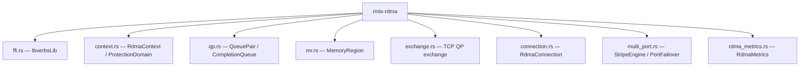
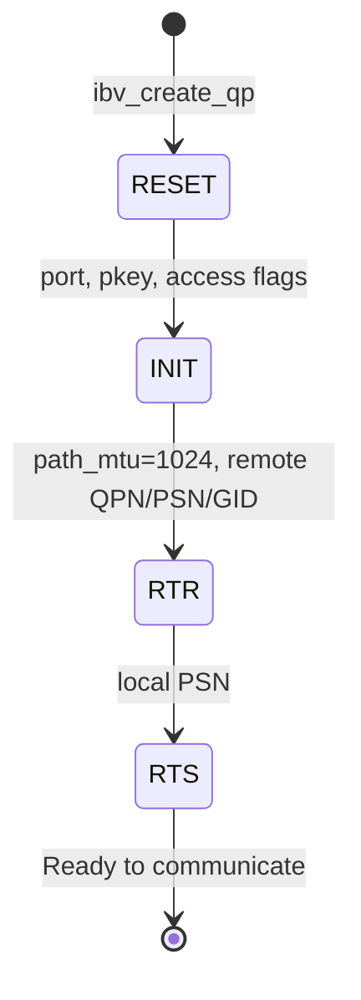
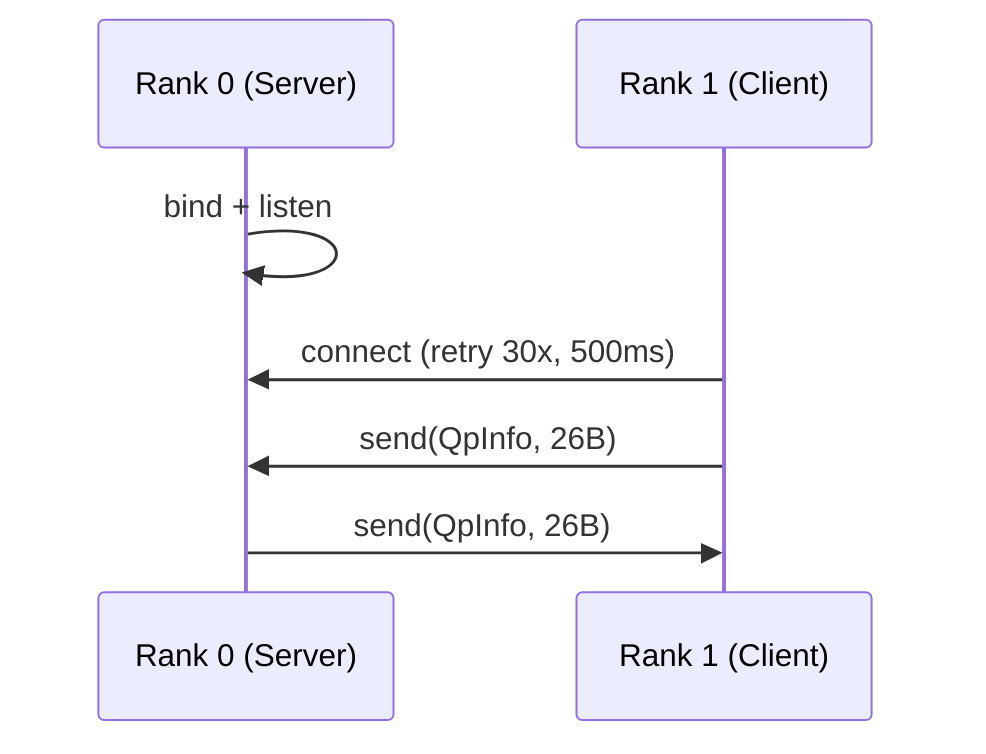
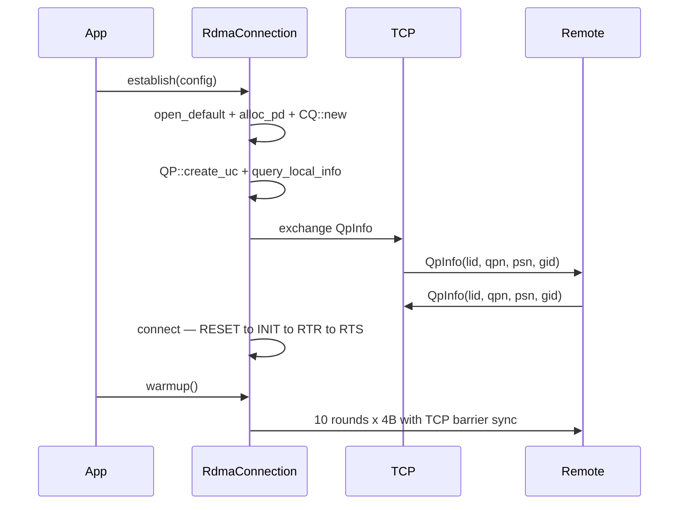

# rmlx-rdma — RDMA Communication Layer

## Overview

`rmlx-rdma` is the inter-node communication layer based on Thunderbolt 5 RDMA (ibverbs). It performs high-speed data transfer between Apple Silicon Macs via the TB5 interface. It dynamically loads `librdma.dylib` via `dlopen` to interface with the macOS TB5 RDMA driver and uses UC (Unreliable Connected) mode QPs.

> **Status:** Phase 1 implementation complete + Phase 0+1+2 audit remediation (items R1-R3). FFI bindings, context/PD/CQ management, UC QP lifecycle, MR registration, TCP-based QP exchange, connection management, warmup protocol, dual port striping, transfer metrics, **ring/allreduce/allgather collectives**, **connection manager**, and **coordinator** are all implemented.

---

## Module Structure



### `ffi.rs` — ibverbs Dynamic FFI Bindings

Uses `libloading` to dynamically load `librdma.dylib` at runtime. Cached via `OnceLock` so it is loaded only once. Defines `repr(C)` structs manually instead of using `bindgen`.

```rust
pub struct IbverbsLib {
    _lib: Library,
    // 18 function pointers total
    pub get_device_list: ...,
    pub free_device_list: ...,
    pub get_device_name: ...,
    pub open_device: ...,
    pub close_device: ...,
    pub alloc_pd: ...,
    pub dealloc_pd: ...,
    pub reg_mr: ...,
    pub dereg_mr: ...,
    pub create_cq: ...,
    pub destroy_cq: ...,
    pub poll_cq: ...,
    pub create_qp: ...,
    pub destroy_qp: ...,
    pub modify_qp: ...,
    pub query_port: ...,
    pub query_gid: ...,
    pub post_send: ...,
    pub post_recv: ...,
}
```

**Key FFI types:**

| Type | Description |
|------|-------------|
| `IbvContext`, `IbvPd`, `IbvCq`, `IbvDevice` | Opaque ibverbs handles |
| `IbvQp` | QP struct (`qp_num` field accessible, `_opaque` padding) |
| `IbvMr` | Memory region (`lkey`, `rkey`, `addr`, `length` accessible) |
| `IbvGid` | GID union (`raw: [u8; 16]` or `global: subnet_prefix + interface_id`) |
| `IbvSendWr` / `IbvRecvWr` | Send/receive work requests |
| `IbvSge` | Scatter/Gather entry (`addr`, `length`, `lkey`) |
| `IbvWc` | Work completion (`status`, `wr_id`, `byte_len`) |
| `IbvQpAttr` / `IbvQpInitAttr` / `IbvAhAttr` | QP and address handle attributes |
| `IbvPortAttr` | Port attributes |

**Constant modules:** `access_flags`, `wc_status`, `wr_opcode`, `send_flags`, `qp_state`, `qp_type`, `mtu`, `qp_attr_mask`

---

### `context.rs` — `RdmaContext`, `ProtectionDomain`

Manages the RDMA device context and protection domain. Both clean up resources in `Drop`. `Send` is manually implemented.

```rust
pub struct RdmaContext {
    ctx: *mut IbvContext,
    device_name: String,
    lib: &'static IbverbsLib,
}

pub struct ProtectionDomain {
    pd: *mut IbvPd,
    lib: &'static IbverbsLib,
}
```

| Method | Description |
|--------|-------------|
| `RdmaContext::open_default()` | Opens the first available RDMA device and returns the context |
| `RdmaContext::device_name()` | Returns the device name |
| `RdmaContext::alloc_pd()` | Allocates a protection domain |

---

### `qp.rs` — `CompletionQueue`, `QueuePair`

Manages UC (Unreliable Connected) Queue Pairs and Completion Queues. Both clean up resources in `Drop` with `Send` manually implemented.

> **Important:** Thunderbolt 5 RDMA does not support RC (Reliable Connection), so UC is used.

**TB5 constants:**

```rust
pub const IB_PORT: u8 = 1;
pub const GID_INDEX: c_int = 1;       // TB5 uses GID index 1 (not 0!)
pub const CQ_DEPTH: c_int = 8192;
pub const MAX_SEND_WR: u32 = 8192;
pub const MAX_RECV_WR: u32 = 8192;
pub const MAX_SEND_SGE: u32 = 1;
pub const MAX_RECV_SGE: u32 = 1;
```

**CompletionQueue:**

| Method | Description |
|--------|-------------|
| `new(ctx)` | Creates a completion queue with `CQ_DEPTH` (8192) entries |
| `poll(wc)` | Polls for completions (returns 0 if none yet) |

**QueuePair:**

```rust
pub struct QpInfo {
    pub lid: u16,
    pub qpn: u32,
    pub psn: u32,
    pub gid: [u8; 16],
}
```

| Method | Description |
|--------|-------------|
| `create_uc(pd, cq)` | Creates a UC QP in RESET state (`sq_sig_all=1`) |
| `query_local_info(ctx, rank)` | Queries port attributes and GID (PSN = `rank * 1000 + 42`) |
| `local_info()` | Returns local QP info for TCP exchange |
| `connect(remote)` | Performs the full state transition: RESET -> INIT -> RTR -> RTS |
| `post_send(wr)` | Posts a send work request |
| `post_recv(wr)` | Posts a receive work request |

**QP state transitions:**



| Attribute | RC (not supported) | UC (used) |
|-----------|-------------------|-----------|
| NACK support | Yes | No |
| Retransmission | Automatic | None |
| Packet loss | Auto-recovery | Handled by upper layer |

---

### `mr.rs` — `MemoryRegion`

Manages memory registration via `ibv_reg_mr`. Registers with `LOCAL_WRITE | REMOTE_WRITE` access permissions. Calls `ibv_dereg_mr` in `Drop`.

```rust
pub struct MemoryRegion {
    mr: *mut IbvMr,
    lib: &'static IbverbsLib,
}
```

| Method | Description |
|--------|-------------|
| `register(pd, ptr, size)` | Registers a memory region (`unsafe` — ptr validity is the caller's responsibility) |
| `lkey()` | Returns the local key |
| `rkey()` | Returns the remote key (typically 0 in UC mode) |
| `addr()` | Returns the registered address |
| `length()` | Returns the registered length |

---

### `exchange.rs` — TCP-Based QP Exchange

Exchanges QP information and performs barrier synchronization over TCP. Matches the protocol from the vllm-mlx PoC.

**Port constants:**

```rust
pub const TCP_EXCHANGE_PORT: u16 = 18515;  // QP info exchange
pub const TCP_SYNC_PORT: u16 = 18516;      // Barrier synchronization
```

**Wire format:** `lid(2) + qpn(4) + psn(4) + gid(16)` = fixed 26 bytes, little-endian

| Function | Description |
|----------|-------------|
| `exchange_server(local, port)` | Rank 0: listen -> accept -> recv -> send |
| `exchange_client(local, host, port)` | Rank 1+: connect -> send -> recv (30 retries, 500ms interval) |
| `tcp_barrier_server(port)` | Rank 0: 1-byte barrier sync (listen -> recv -> send) |
| `tcp_barrier_client(host, port)` | Rank 1+: 1-byte barrier sync (connect -> send -> recv, 30 retries, 100ms interval) |

**Exchange protocol:**



---

### `connection.rs` — `RdmaConnection`

A high-level interface that manages the full lifecycle of an RDMA connection. Handles everything from device open to warmup as a one-stop operation.

```rust
pub struct RdmaConfig {
    pub rank: u32,               // 0 = server, 1+ = client
    pub world_size: u32,
    pub peer_host: String,
    pub exchange_port: u16,      // default: 18515
    pub sync_port: u16,          // default: 18516
}

pub struct RdmaConnection {
    ctx: RdmaContext,
    _pd: ProtectionDomain,
    cq: CompletionQueue,
    qp: QueuePair,
    config: RdmaConfig,
}
```

| Method | Description |
|--------|-------------|
| `establish(config)` | Device open -> PD/CQ allocation -> UC QP creation -> TCP exchange -> connect |
| `register_mr(ptr, size)` | Registers a memory region (`unsafe`) |
| `post_send(mr, offset, length, wr_id)` | Posts `IBV_WR_SEND` + `SIGNALED` |
| `post_recv(mr, offset, length, wr_id)` | Posts a receive work request |
| `poll_cq(wc)` | Polls for completions |
| `wait_completions(n)` | Spin-waits for `n` successful completions (immediate error on non-success status) |
| `warmup()` | Warms up the path with 10 rounds x 4-byte dummy message exchanges |
| `rank()` / `world_size()` | Returns node information |
| `device_name()` | Returns the RDMA device name |

**Connection establishment flow:**



**Warmup protocol:**
- Rank 0: post_recv -> tcp_barrier_server -> wait_recv -> post_send -> wait_send
- Rank 1: post_recv -> tcp_barrier_client -> post_send -> wait_send -> wait_recv

---

### `rdma_metrics.rs` — `RdmaMetrics`

`AtomicU64`-based lock-free RDMA transfer performance counters. All counters use `Ordering::Relaxed` for minimal performance overhead.

```rust
pub struct RdmaMetrics {
    pub send_count: AtomicU64,
    pub recv_count: AtomicU64,
    pub send_bytes: AtomicU64,
    pub recv_bytes: AtomicU64,
    pub send_errors: AtomicU64,
    pub recv_errors: AtomicU64,
    pub cq_polls: AtomicU64,
    pub connection_resets: AtomicU64,
}
```

| Method | Description |
|--------|-------------|
| `new()` | Initializes all counters to 0 |
| `record_send(bytes)` | Records a successful send (count +1, bytes accumulated) |
| `record_recv(bytes)` | Records a successful receive (count +1, bytes accumulated) |
| `record_send_error()` | Records a send error |
| `record_recv_error()` | Records a receive error |
| `record_cq_poll()` | Records a CQ poll |
| `record_connection_reset()` | Records a connection reset |
| `snapshot()` | Returns an `RdmaMetricsSnapshot` of all counters |

```rust
#[derive(Debug, Clone)]
pub struct RdmaMetricsSnapshot {
    pub send_count: u64,
    pub recv_count: u64,
    pub send_bytes: u64,
    pub recv_bytes: u64,
    pub send_errors: u64,
    pub recv_errors: u64,
    pub cq_polls: u64,
    pub connection_resets: u64,
}
```

> The `Default` trait is implemented, so `RdmaMetrics::default()` can also be used for creation.

---

### `multi_port.rs` — Dual TB5 Port Striping and Failover

Uses two Thunderbolt 5 ports in parallel to expand bandwidth. Includes port configuration, round-robin chunk distribution, topology management, and failover.

**Port configuration:**

```rust
pub struct PortConfig {
    pub port_num: u8,        // 1-based (IB convention)
    pub gid_index: i32,
    pub interface: String,   // e.g., "en5", "en6"
    pub address: String,     // IP address
}

pub struct DualPortConfig {
    pub primary: PortConfig,
    pub secondary: Option<PortConfig>,
    pub stripe_threshold: usize,    // minimum chunks to enable striping (default: 8)
}
```

| Method | Description |
|--------|-------------|
| `DualPortConfig::single(port)` | Single port configuration (threshold=8) |
| `DualPortConfig::dual(primary, secondary, threshold)` | Dual port configuration |
| `DualPortConfig::has_dual()` | Returns whether a secondary port exists |

**Stripe engine:**

```rust
pub struct StripeEngine { config: DualPortConfig }
pub struct StripePlan {
    pub primary_chunks: Vec<ChunkAssignment>,
    pub secondary_chunks: Vec<ChunkAssignment>,
    pub total_bytes: usize,
}
pub struct ChunkAssignment {
    pub offset: usize,    // byte offset within source buffer
    pub length: usize,    // byte length
    pub seq: u32,         // sequence number for receiver-side reassembly
}
```

| Method | Description |
|--------|-------------|
| `StripeEngine::new(config)` | Creates a stripe engine |
| `StripeEngine::plan(total_bytes, chunk_size)` | Creates a plan dividing data into per-port chunks |

**Striping rules:** When chunk count >= `stripe_threshold` and a secondary port exists, even-numbered chunks go to primary and odd-numbered chunks go to secondary. Below the threshold, all chunks go to primary.

**Topology:**

```rust
pub enum Topology {
    Ring,                           // Ring (max 2 connections per node)
    Mesh,                           // Full mesh (all-to-all)
    Hybrid { group_size: usize },   // Mesh within groups + ring between groups
}
```

| Method | Description |
|--------|-------------|
| `connections_per_node(world_size)` | Computes connections per node |
| `peers(rank, world_size)` | Returns the peer list for a given rank |

**Port failover:**

```rust
pub enum PortState { Active, Failed, Recovering }

pub struct PortFailover {
    primary_state: PortState,
    secondary_state: PortState,
}
```

| Method | Description |
|--------|-------------|
| `new()` | Initializes both ports as `Active` |
| `mark_failed(is_primary)` | Marks a port as `Failed` |
| `mark_recovering(is_primary)` | Marks a port as `Recovering` |
| `mark_active(is_primary)` | Restores a port to `Active` |
| `is_dual_active()` | Checks whether both ports are Active |
| `has_active_port()` | Checks whether at least one port is active |

---

## Error Handling

```rust
#[derive(Debug)]
pub enum RdmaError {
    LibraryNotFound(String),       // librdma.dylib load failed
    NoDevices,                     // No RDMA devices found
    DeviceOpen(String),            // Device open failed
    PdAlloc,                       // PD allocation failed
    MrReg(String),                 // MR registration failed
    CqCreate,                      // CQ creation failed
    QpCreate(String),              // QP creation failed
    QpModify(String),              // QP state transition failed
    PostFailed(String),            // WR posting failed
    CqPoll(String),                // CQ poll error
    ConnectionFailed(String),      // Connection setup failed
    Unavailable(String),           // No RDMA hardware available
}
```

**Availability check:** `rmlx_rdma::is_available()` can be used to check whether `librdma.dylib` can be loaded.

---

## Dependencies

```toml
[dependencies]
rmlx-alloc = { path = "../rmlx-alloc" }
libc = "0.2"
libloading = "0.8"
```
