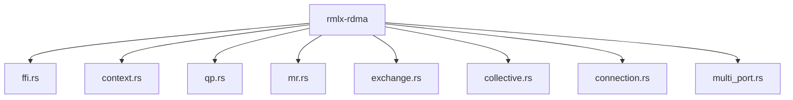
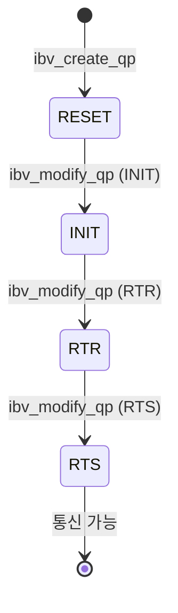
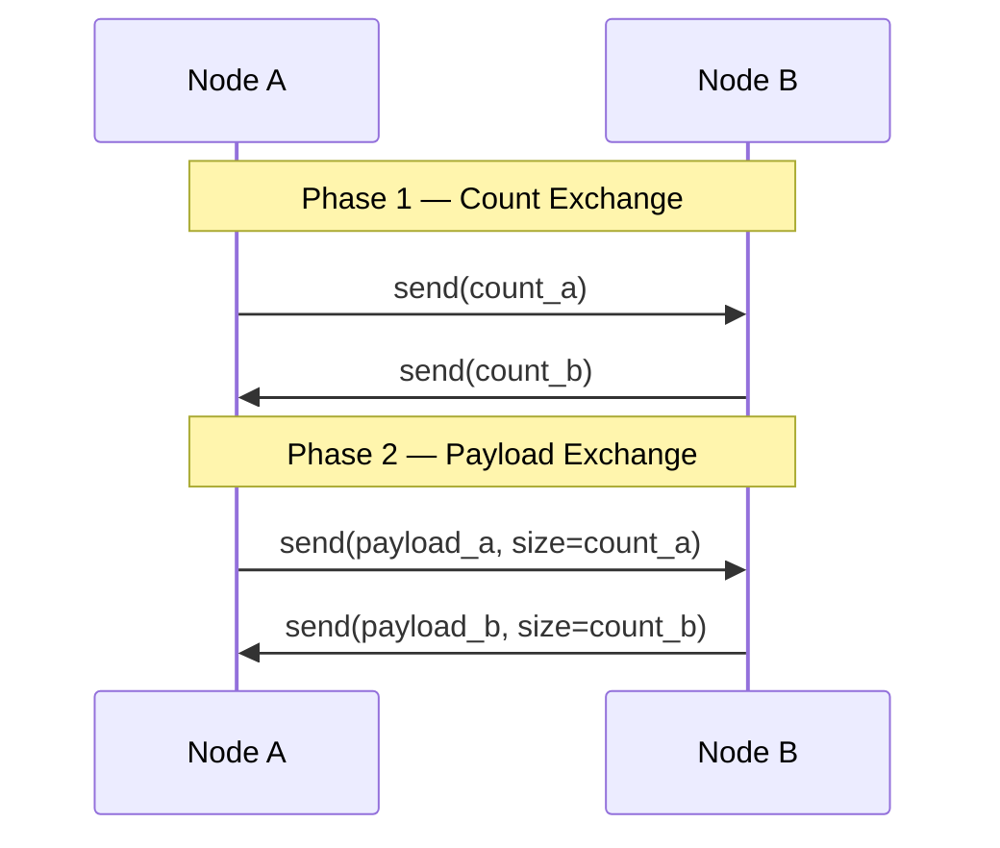

# rmlx-rdma — RDMA 통신 계층

## 개요

`rmlx-rdma`는 Thunderbolt 5 RDMA (ibverbs) 기반 노드 간 통신 계층입니다. Apple Silicon Mac 간에 TB5 인터페이스를 통해 고속 데이터 전송을 수행하며, 분산 추론에 필요한 집합 통신(collective communication) 프리미티브를 제공합니다.

> **상태:** 현재 스켈레톤 상태이며, Phase 1에서 구현 예정입니다.

---

## 계획된 모듈



### `ffi.rs` — ibverbs C FFI 바인딩 *계획됨 (Phase 1)*

`bindgen`을 사용하여 `libibverbs` C API에 대한 FFI 바인딩을 자동 생성합니다.

**주요 바인딩 대상:**
- `ibv_get_device_list()`, `ibv_open_device()`
- `ibv_alloc_pd()`, `ibv_create_cq()`
- `ibv_create_qp()`, `ibv_modify_qp()`
- `ibv_reg_mr()`, `ibv_dereg_mr()`
- `ibv_post_send()`, `ibv_post_recv()`, `ibv_poll_cq()`

---

### `context.rs` — ibv_context, PD, CQ 관리 *계획됨 (Phase 1)*

RDMA 컨텍스트의 생성 및 수명 관리를 담당합니다.

- **`ibv_context`** — RDMA 디바이스 컨텍스트
- **`PD` (Protection Domain)** — 메모리 보호 도메인
- **`CQ` (Completion Queue)** — 작업 완료 통지 큐

---

### `qp.rs` — UC QP 관리 *계획됨 (Phase 1)*

**UC (Unreliable Connection)** Queue Pair를 생성하고 관리합니다.

> **중요:** Thunderbolt 5 RDMA는 RC (Reliable Connection)를 지원하지 않으므로 UC를 사용합니다.

| 속성 | RC (미지원) | UC (사용) |
|------|------------|-----------|
| NACK 지원 | O | X |
| 재전송 | 자동 | 없음 |
| 패킷 유실 | 자동 복구 | 상위 계층에서 처리 |

**QP 상태 전이:**



---

### `mr.rs` — Memory Region 관리 *계획됨 (Phase 1)*

`ibv_reg_mr`을 통한 메모리 등록 및 이중 등록 버퍼 관리를 수행합니다.

- `rmlx-alloc`의 `ZeroCopyBuffer`와 연계하여 동일 물리 메모리에 Metal + RDMA 이중 등록을 수행합니다
- `LOCAL_WRITE | REMOTE_WRITE` 접근 권한으로 등록합니다

---

### `exchange.rs` — `blocking_exchange` *계획됨 (Phase 1)*

2-phase count→payload 프로토콜을 사용한 데이터 교환을 구현합니다.

**프로토콜 흐름:**



---

### `collective.rs` — 집합 통신 *계획됨 (Phase 1)*

분산 연산에 필요한 집합 통신 프리미티브를 구현합니다.

| 프리미티브 | 설명 |
|-----------|------|
| `all_to_all` | 모든 노드 간 데이터 교환 |
| `ring_allreduce` | 링 토폴로지 기반 AllReduce |

---

### `connection.rs` — 연결 관리 *계획됨 (Phase 1)*

- **`hosts.json` 파싱** — 클러스터 노드 정보를 JSON 파일에서 읽어옵니다
- **연결 수립** — QP 생성 → GID 교환 → QP 상태 전이
- **Warmup** — 연결 후 더미 데이터를 교환하여 경로를 워밍업합니다

**`hosts.json` 예시:**

```json
{
  "nodes": [
    { "hostname": "mac-0", "gid": "fe80::1", "port": 1 },
    { "hostname": "mac-1", "gid": "fe80::2", "port": 1 }
  ]
}
```

---

### `multi_port.rs` — 듀얼 TB5 포트 스트라이핑 *계획됨 (Phase 1)*

2개의 Thunderbolt 5 포트를 병렬로 사용하여 대역폭을 2배로 확장합니다.

- 각 포트에 독립적인 QP를 생성합니다
- 데이터를 청크 단위로 분할하여 두 포트에 번갈아 전송합니다
- 수신 측에서 청크를 원래 순서로 재조립합니다

---

## 핵심 개념

### UC QP (Unreliable Connection)

TB5 RDMA에서는 RC (Reliable Connection)가 지원되지 않으므로 UC를 사용합니다. UC의 특성상 NACK가 없어 패킷 유실이 발생할 수 있으며, 이에 대한 처리는 상위 계층에서 수행합니다.

### GID Discovery

노드 간 연결 수립 시 각 노드의 GID (Global Identifier)를 교환해야 합니다. `ibv_query_gid()`를 통해 로컬 GID를 조회하고, `hosts.json`을 통해 원격 GID를 얻습니다.

### Warmup Protocol

연결 수립 직후 첫 번째 데이터 전송은 지연이 높을 수 있습니다. 더미 데이터를 교환하는 워밍업 과정을 거쳐 안정적인 지연 시간을 확보합니다.

---

## 구현 시점

**Phase 1** — rmlx-alloc과 함께 구현을 시작합니다.

---

## 의존성

```toml
[dependencies]
rmlx-alloc = { path = "../rmlx-alloc" }
libc = "0.2"

[build-dependencies]
bindgen = "0.69"    # ibverbs FFI 바인딩 자동 생성
```
