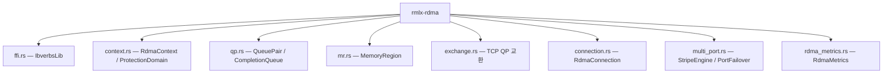
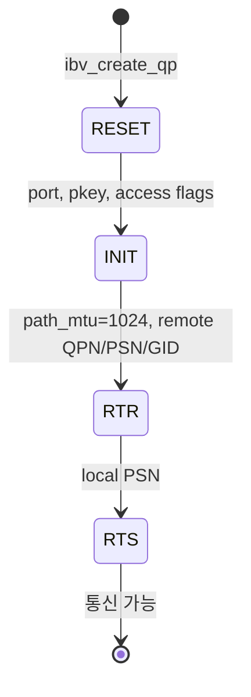
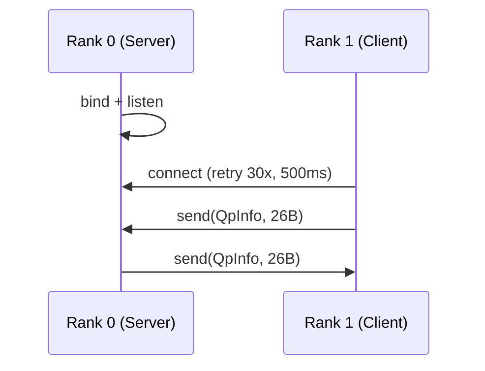
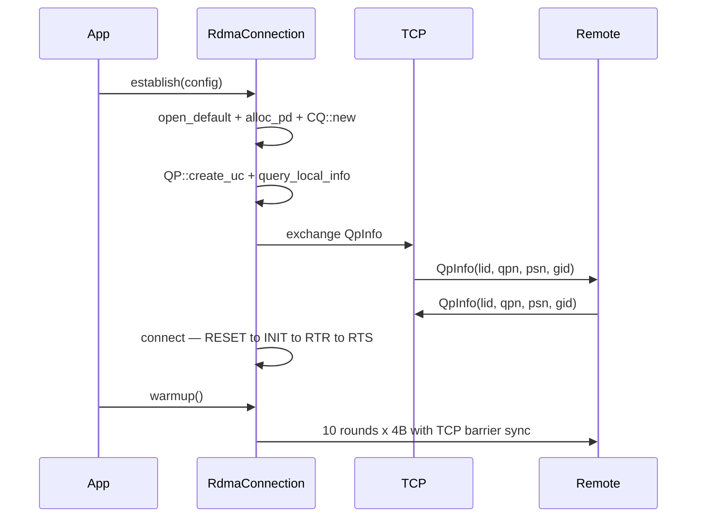

# rmlx-rdma — RDMA 통신 계층

## 개요

`rmlx-rdma`는 Thunderbolt 5 RDMA (ibverbs) 기반 노드 간 통신 계층입니다. Apple Silicon Mac 간에 TB5 인터페이스를 통해 고속 데이터 전송을 수행합니다. `librdma.dylib`를 `dlopen`으로 동적 로딩하여 macOS TB5 RDMA 드라이버와 연동하며, UC (Unreliable Connected) 모드의 QP를 사용합니다.

> **상태:** Phase 1 구현 완료. FFI 바인딩, 컨텍스트/PD/CQ 관리, UC QP 생명주기, MR 등록, TCP 기반 QP 교환, 연결 관리, warmup 프로토콜, 듀얼 포트 스트라이핑, 전송 메트릭 모두 구현되었습니다.

---

## 모듈 구조



### `ffi.rs` — ibverbs 동적 FFI 바인딩

`libloading`을 사용하여 `librdma.dylib`를 런타임에 동적 로딩합니다. `OnceLock`으로 캐시하여 한 번만 로드합니다. `bindgen` 대신 수동으로 `repr(C)` 구조체를 정의합니다.

```rust
pub struct IbverbsLib {
    _lib: Library,
    // 총 18개 함수 포인터
    pub get_device_list: ...,
    pub free_device_list: ...,
    pub get_device_name: ...,
    pub open_device: ...,
    pub close_device: ...,
    pub alloc_pd: ...,
    pub dealloc_pd: ...,
    pub reg_mr: ...,
    pub dereg_mr: ...,
    pub create_cq: ...,
    pub destroy_cq: ...,
    pub poll_cq: ...,
    pub create_qp: ...,
    pub destroy_qp: ...,
    pub modify_qp: ...,
    pub query_port: ...,
    pub query_gid: ...,
    pub post_send: ...,
    pub post_recv: ...,
}
```

**주요 FFI 타입:**

| 타입 | 설명 |
|------|------|
| `IbvContext`, `IbvPd`, `IbvCq`, `IbvDevice` | 불투명(opaque) ibverbs 핸들 |
| `IbvQp` | QP 구조체 (`qp_num` 필드 접근 가능, `_opaque` 패딩) |
| `IbvMr` | 메모리 리전 (`lkey`, `rkey`, `addr`, `length` 접근 가능) |
| `IbvGid` | GID union (`raw: [u8; 16]` 또는 `global: subnet_prefix + interface_id`) |
| `IbvSendWr` / `IbvRecvWr` | 송수신 작업 요청 |
| `IbvSge` | Scatter/Gather 엔트리 (`addr`, `length`, `lkey`) |
| `IbvWc` | 작업 완료 (`status`, `wr_id`, `byte_len`) |
| `IbvQpAttr` / `IbvQpInitAttr` / `IbvAhAttr` | QP 및 주소 핸들 속성 |
| `IbvPortAttr` | 포트 속성 |

**상수 모듈:** `access_flags`, `wc_status`, `wr_opcode`, `send_flags`, `qp_state`, `qp_type`, `mtu`, `qp_attr_mask`

---

### `context.rs` — `RdmaContext`, `ProtectionDomain`

RDMA 디바이스 컨텍스트와 보호 도메인을 관리합니다. 모두 `Drop`에서 자원을 정리합니다. `Send`가 수동 구현되어 있습니다.

```rust
pub struct RdmaContext {
    ctx: *mut IbvContext,
    device_name: String,
    lib: &'static IbverbsLib,
}

pub struct ProtectionDomain {
    pd: *mut IbvPd,
    lib: &'static IbverbsLib,
}
```

| 메서드 | 설명 |
|--------|------|
| `RdmaContext::open_default()` | 첫 번째 사용 가능한 RDMA 디바이스를 열고 컨텍스트를 반환합니다 |
| `RdmaContext::device_name()` | 디바이스 이름을 반환합니다 |
| `RdmaContext::alloc_pd()` | 보호 도메인을 할당합니다 |

---

### `qp.rs` — `CompletionQueue`, `QueuePair`

UC (Unreliable Connected) Queue Pair와 Completion Queue를 관리합니다. 모두 `Drop`에서 자원을 정리하며 `Send`가 수동 구현되어 있습니다.

> **중요:** Thunderbolt 5 RDMA는 RC (Reliable Connection)를 지원하지 않으므로 UC를 사용합니다.

**TB5 상수:**

```rust
pub const IB_PORT: u8 = 1;
pub const GID_INDEX: c_int = 1;       // TB5에서는 GID 인덱스 1 사용 (0이 아님!)
pub const CQ_DEPTH: c_int = 8192;
pub const MAX_SEND_WR: u32 = 8192;
pub const MAX_RECV_WR: u32 = 8192;
pub const MAX_SEND_SGE: u32 = 1;
pub const MAX_RECV_SGE: u32 = 1;
```

**CompletionQueue:**

| 메서드 | 설명 |
|--------|------|
| `new(ctx)` | `CQ_DEPTH`(8192) 크기의 완료 큐를 생성합니다 |
| `poll(wc)` | 완료를 폴링합니다 (반환값 0 = 아직 없음) |

**QueuePair:**

```rust
pub struct QpInfo {
    pub lid: u16,
    pub qpn: u32,
    pub psn: u32,
    pub gid: [u8; 16],
}
```

| 메서드 | 설명 |
|--------|------|
| `create_uc(pd, cq)` | UC QP를 RESET 상태로 생성합니다 (`sq_sig_all=1`) |
| `query_local_info(ctx, rank)` | 포트 속성과 GID를 조회합니다 (PSN = `rank * 1000 + 42`) |
| `local_info()` | TCP 교환을 위한 로컬 QP 정보를 반환합니다 |
| `connect(remote)` | RESET → INIT → RTR → RTS 전체 상태 전이를 수행합니다 |
| `post_send(wr)` | 전송 작업 요청을 포스팅합니다 |
| `post_recv(wr)` | 수신 작업 요청을 포스팅합니다 |

**QP 상태 전이:**



| 속성 | RC (미지원) | UC (사용) |
|------|------------|-----------|
| NACK 지원 | O | X |
| 재전송 | 자동 | 없음 |
| 패킷 유실 | 자동 복구 | 상위 계층에서 처리 |

---

### `mr.rs` — `MemoryRegion`

`ibv_reg_mr`을 통한 메모리 등록을 관리합니다. `LOCAL_WRITE | REMOTE_WRITE` 접근 권한으로 등록합니다. `Drop`에서 `ibv_dereg_mr`를 호출합니다.

```rust
pub struct MemoryRegion {
    mr: *mut IbvMr,
    lib: &'static IbverbsLib,
}
```

| 메서드 | 설명 |
|--------|------|
| `register(pd, ptr, size)` | 메모리 리전을 등록합니다 (`unsafe` — ptr 유효성은 호출자 책임) |
| `lkey()` | 로컬 키를 반환합니다 |
| `rkey()` | 원격 키를 반환합니다 (UC 모드에서는 일반적으로 0) |
| `addr()` | 등록된 주소를 반환합니다 |
| `length()` | 등록된 길이를 반환합니다 |

---

### `exchange.rs` — TCP 기반 QP 교환

TCP를 통해 QP 정보를 교환하고 배리어 동기화를 수행합니다. vllm-mlx PoC의 프로토콜과 일치합니다.

**포트 상수:**

```rust
pub const TCP_EXCHANGE_PORT: u16 = 18515;  // QP 정보 교환용
pub const TCP_SYNC_PORT: u16 = 18516;      // 배리어 동기화용
```

**와이어 포맷:** `lid(2) + qpn(4) + psn(4) + gid(16)` = 고정 26바이트, little-endian

| 함수 | 설명 |
|------|------|
| `exchange_server(local, port)` | Rank 0: listen → accept → recv → send |
| `exchange_client(local, host, port)` | Rank 1+: connect → send → recv (30회 재시도, 500ms 간격) |
| `tcp_barrier_server(port)` | Rank 0: 1바이트 배리어 동기화 (listen → recv → send) |
| `tcp_barrier_client(host, port)` | Rank 1+: 1바이트 배리어 동기화 (connect → send → recv, 30회 재시도, 100ms 간격) |

**교환 프로토콜:**



---

### `connection.rs` — `RdmaConnection`

RDMA 연결의 전체 생명주기를 관리하는 상위 수준 인터페이스입니다. 디바이스 오픈부터 warmup까지 원스톱으로 처리합니다.

```rust
pub struct RdmaConfig {
    pub rank: u32,               // 0 = server, 1+ = client
    pub world_size: u32,
    pub peer_host: String,
    pub exchange_port: u16,      // default: 18515
    pub sync_port: u16,          // default: 18516
}

pub struct RdmaConnection {
    ctx: RdmaContext,
    _pd: ProtectionDomain,
    cq: CompletionQueue,
    qp: QueuePair,
    config: RdmaConfig,
}
```

| 메서드 | 설명 |
|--------|------|
| `establish(config)` | 디바이스 오픈 → PD/CQ 할당 → UC QP 생성 → TCP 교환 → 연결 |
| `register_mr(ptr, size)` | 메모리 리전을 등록합니다 (`unsafe`) |
| `post_send(mr, offset, length, wr_id)` | `IBV_WR_SEND` + `SIGNALED`를 포스팅합니다 |
| `post_recv(mr, offset, length, wr_id)` | 수신 작업을 포스팅합니다 |
| `poll_cq(wc)` | 완료를 폴링합니다 |
| `wait_completions(n)` | `n`개의 성공 완료를 스핀 대기합니다 (비성공 상태 시 즉시 에러) |
| `warmup()` | 10라운드 x 4바이트 더미 메시지 교환으로 경로를 워밍업합니다 |
| `rank()` / `world_size()` | 노드 정보를 반환합니다 |
| `device_name()` | RDMA 디바이스 이름을 반환합니다 |

**연결 수립 흐름:**



**Warmup 프로토콜:**
- Rank 0: post_recv → tcp_barrier_server → wait_recv → post_send → wait_send
- Rank 1: post_recv → tcp_barrier_client → post_send → wait_send → wait_recv

---

### `rdma_metrics.rs` — `RdmaMetrics`

`AtomicU64` 기반의 lock-free RDMA 전송 성능 카운터입니다. 모든 카운터는 `Ordering::Relaxed`로 접근하여 성능 오버헤드를 최소화합니다.

```rust
pub struct RdmaMetrics {
    pub send_count: AtomicU64,
    pub recv_count: AtomicU64,
    pub send_bytes: AtomicU64,
    pub recv_bytes: AtomicU64,
    pub send_errors: AtomicU64,
    pub recv_errors: AtomicU64,
    pub cq_polls: AtomicU64,
    pub connection_resets: AtomicU64,
}
```

| 메서드 | 설명 |
|--------|------|
| `new()` | 모든 카운터를 0으로 초기화합니다 |
| `record_send(bytes)` | 성공적인 전송을 기록합니다 (count +1, bytes 누적) |
| `record_recv(bytes)` | 성공적인 수신을 기록합니다 (count +1, bytes 누적) |
| `record_send_error()` | 전송 에러를 기록합니다 |
| `record_recv_error()` | 수신 에러를 기록합니다 |
| `record_cq_poll()` | CQ 폴링을 기록합니다 |
| `record_connection_reset()` | 연결 리셋을 기록합니다 |
| `snapshot()` | 모든 카운터의 `RdmaMetricsSnapshot`을 반환합니다 |

```rust
#[derive(Debug, Clone)]
pub struct RdmaMetricsSnapshot {
    pub send_count: u64,
    pub recv_count: u64,
    pub send_bytes: u64,
    pub recv_bytes: u64,
    pub send_errors: u64,
    pub recv_errors: u64,
    pub cq_polls: u64,
    pub connection_resets: u64,
}
```

> `Default` 트레이트가 구현되어 있으므로 `RdmaMetrics::default()`로도 생성할 수 있습니다.

---

### `multi_port.rs` — 듀얼 TB5 포트 스트라이핑 및 페일오버

2개의 Thunderbolt 5 포트를 병렬로 사용하여 대역폭을 확장합니다. 포트 설정, 라운드 로빈 청크 분배, 토폴로지 관리, 페일오버를 포함합니다.

**포트 구성:**

```rust
pub struct PortConfig {
    pub port_num: u8,        // 1-based (IB 컨벤션)
    pub gid_index: i32,
    pub interface: String,   // 예: "en5", "en6"
    pub address: String,     // IP 주소
}

pub struct DualPortConfig {
    pub primary: PortConfig,
    pub secondary: Option<PortConfig>,
    pub stripe_threshold: usize,    // 스트라이핑 활성화 최소 청크 수 (기본: 8)
}
```

| 메서드 | 설명 |
|--------|------|
| `DualPortConfig::single(port)` | 단일 포트 구성 (threshold=8) |
| `DualPortConfig::dual(primary, secondary, threshold)` | 듀얼 포트 구성 |
| `DualPortConfig::has_dual()` | secondary 포트 존재 여부를 반환합니다 |

**스트라이핑 엔진:**

```rust
pub struct StripeEngine { config: DualPortConfig }
pub struct StripePlan {
    pub primary_chunks: Vec<ChunkAssignment>,
    pub secondary_chunks: Vec<ChunkAssignment>,
    pub total_bytes: usize,
}
pub struct ChunkAssignment {
    pub offset: usize,    // 소스 버퍼 내 바이트 오프셋
    pub length: usize,    // 바이트 길이
    pub seq: u32,         // 수신 측 재조립용 시퀀스 번호
}
```

| 메서드 | 설명 |
|--------|------|
| `StripeEngine::new(config)` | 스트라이핑 엔진을 생성합니다 |
| `StripeEngine::plan(total_bytes, chunk_size)` | 데이터를 포트별 청크로 분할하는 계획을 생성합니다 |

**스트라이핑 규칙:** 청크 수 >= `stripe_threshold`이고 secondary 포트가 있으면 짝수 청크는 primary, 홀수 청크는 secondary에 할당합니다. 임계값 미만이면 모든 청크를 primary에 할당합니다.

**토폴로지:**

```rust
pub enum Topology {
    Ring,                           // 링 (노드당 최대 2 연결)
    Mesh,                           // 풀 메시 (all-to-all)
    Hybrid { group_size: usize },   // 그룹 내 메시 + 그룹 간 링
}
```

| 메서드 | 설명 |
|--------|------|
| `connections_per_node(world_size)` | 노드당 연결 수를 계산합니다 |
| `peers(rank, world_size)` | 주어진 rank의 피어 목록을 반환합니다 |

**포트 페일오버:**

```rust
pub enum PortState { Active, Failed, Recovering }

pub struct PortFailover {
    primary_state: PortState,
    secondary_state: PortState,
}
```

| 메서드 | 설명 |
|--------|------|
| `new()` | 양쪽 포트 모두 `Active`로 초기화합니다 |
| `mark_failed(is_primary)` | 포트를 `Failed`로 표시합니다 |
| `mark_recovering(is_primary)` | 포트를 `Recovering`으로 표시합니다 |
| `mark_active(is_primary)` | 포트를 `Active`로 복구합니다 |
| `is_dual_active()` | 두 포트 모두 Active인지 확인합니다 |
| `has_active_port()` | 활성 포트가 하나라도 있는지 확인합니다 |

---

## 에러 처리

```rust
#[derive(Debug)]
pub enum RdmaError {
    LibraryNotFound(String),       // librdma.dylib 로드 실패
    NoDevices,                     // RDMA 디바이스 없음
    DeviceOpen(String),            // 디바이스 열기 실패
    PdAlloc,                       // PD 할당 실패
    MrReg(String),                 // MR 등록 실패
    CqCreate,                      // CQ 생성 실패
    QpCreate(String),              // QP 생성 실패
    QpModify(String),              // QP 상태 전이 실패
    PostFailed(String),            // WR 포스팅 실패
    CqPoll(String),                // CQ 폴 에러
    ConnectionFailed(String),      // 연결 설정 실패
    Unavailable(String),           // RDMA 하드웨어 없음
}
```

**가용성 체크:** `rmlx_rdma::is_available()`로 `librdma.dylib` 로드 가능 여부를 확인할 수 있습니다.

---

## 의존성

```toml
[dependencies]
rmlx-alloc = { path = "../rmlx-alloc" }
libc = "0.2"
libloading = "0.8"
```
