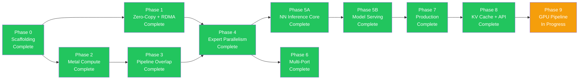

# Implementation Roadmap

The multi-phase implementation roadmap for the rmlx project. Phases 0-8 are complete; Phase 9 (GPU Pipeline) is in progress.

---

## Overview

| Phase | Name | Key Content | Prerequisites | Status |
|:-----:|------|------------|:------------:|:------:|
| 0 | Scaffolding | Workspace, metal-rs wrappers, CI | -- | Complete |
| 1 | Zero-Copy + RDMA | ZeroCopyBuffer, DualRegPool, ibverbs FFI, blocking_exchange | Phase 0 | Complete |
| 1-hotfix | IbvSendWr FFI Layout Fix | FFI layout fix | Phase 1 | Complete |
| 2A | Metal Compute Foundation | Shader vendoring, DType/Array, KernelRegistry | Phase 0 | Complete |
| 2A | Metal Compute Kernels | 7 GPU kernels + integration tests | Phase 2A foundation | Complete |
| 2B | Steel GEMM + Quantization | Steel GEMM, quantized matmul, indexing | Phase 2A | Complete |
| 3 | Pipeline Overlap | MTLSharedEvent, dual-queue pipeline | Phase 2 | Complete |
| 4 | Expert Parallelism | EP dispatch/combine, 3-zone auto backend, sparse dispatch | Phase 1 + 3 | Complete |
| 5A | NN Inference Core | LLaMA, Qwen, DeepSeek, Mixtral | Phase 4 | Complete |
| 5B | Model Serving | rmlx-lm (separate repo ~/rmlx-lm) | Phase 5A | Complete |
| 6 | Multi-Port | Dual TB5 multi-port striping, multi-node topology | Phase 4 | Complete |
| 7A | Production Hardening | Hardening, observability | Phase 5 | Complete |
| 7B | VJP Autodiff | VJP autodiff + LoRA fine-tuning | Phase 7A | Complete |
| 8 | KV Cache + API Surface | KV cache, parallel linear, API ergonomics | Phase 7B | Complete |
| **9** | **GPU Pipeline** | **CommandBatcher, ExecGraph, fused kernels, ICB** | **Phase 8** | **In Progress** |

---

## Phase Completion History

| Phase | Commit | Tests | Status |
|-------|--------|-------|--------|
| Phase 0: Scaffolding + Metal GPU abstraction | 7071c73 | baseline | Complete |
| Phase 1: Zero-copy memory + RDMA ibverbs | d541bb3 | + alloc/rdma tests | Complete |
| Phase 1-hotfix: IbvSendWr FFI layout fix | 9cca9a9 | 23 tests | Complete |
| Phase 2A-1~4: Shader vendoring, DType/Array, KernelRegistry | 3179bde | foundation | Complete |
| Phase 2A-5~9: 7 GPU kernels + integration tests | 5ef6a07 | 40 tests | Complete |
| Phase 2B: Steel GEMM, quantized matmul, indexing | e4d9c14 | 43 tests | Complete |
| Phase 3: SharedEvent sync + dual queue + layer pipeline | f9cadcf | 52 tests | Complete |
| Phase 4: EP 3-Zone dispatch + MoE exchange | 6fb3296 | 62 tests | Complete |
| Phase 5A: rmlx-nn inference core (LLaMA, Qwen, DeepSeek, Mixtral) | d126aaf | + nn tests | Complete |
| Phase 5B: rmlx-lm serving engine (separate repo ~/rmlx-lm) | 98e50c1 | 75 tests | Complete |
| Phase 6: Dual TB5 multi-port striping + multi-node topology | 8c8b25f | + distributed tests | Complete |
| Phase 7A: Production hardening / observability | 0fa70bb | 98 tests | Complete |
| Phase 7B: VJP autodiff + LoRA fine-tuning | 025ed8f | 108 tests | Complete |
| Phase 8: KV Cache + API Surface | squash merge | 339 tests | Complete |
| Phase 9A+9B: GPU Pipeline — ExecGraph integration | 3d4100c | + pipeline tests | In Progress |
| Phase 9B-fix: SDPA tiles, MSL qualifiers, GEMM contiguity | c77bdb7..69ed98d | bug fixes | Complete |
| Phase 9B-opt: Weight pre-caching + GPU pipeline docs | HEAD | + docs | Complete |

---

## Phase Dependency Diagram



---

## Phase 0: Scaffolding — Complete (`7071c73`)

### Goal

Establish the Cargo workspace structure, validate metal-rs basic operations, and set up CI.

### Key Deliverables

- Cargo workspace initialization (6 crate skeletons)
- `rmlx-metal`: MTLDevice creation, basic command buffer/encoder wrappers
- `rmlx-metal`: Simple Metal compute kernel execution (vector add)
- Build system: `.metal` -> `.metallib` AOT compilation pipeline in `build.rs`
- CI: GitHub Actions (macOS runner, `cargo test`, `cargo clippy`)

### Definition of Done (DoD)

- [x] `cargo build --workspace` succeeds (0 errors)
- [x] `cargo fmt --all --check` -- diff 0
- [x] `cargo clippy --workspace -- -D warnings` -- 0 warnings
- [x] `cargo test --workspace` -- `test_basic_metal_compute` PASS
- [x] `build.rs` `.metal` -> `.metallib` AOT compilation succeeds
- [x] Codex review: SAFETY comments present on unsafe blocks

---

## Phase 1: Zero-Copy + RDMA — Complete (`d541bb3`, hotfix `9cca9a9`)

### Goal

Convert PoC Phase 1-4 validation results into production-quality code. Implement zero-copy transfers by registering GPU buffers directly with RDMA.

### Key Deliverables

- `rmlx-alloc`: ZeroCopyBuffer (`posix_memalign` + NoCopy)
- `rmlx-alloc`: DualRegPool (Metal + `ibv_mr` dual-registered pool)
- `rmlx-alloc`: MetalAllocator (heap + cache, MLX compatible)
- `rmlx-rdma`: ibverbs FFI bindings (`bindgen`)
- `rmlx-rdma`: IbContext, PD, CQ, UC QP wrappers
- `rmlx-rdma`: `ibv_reg_mr` wrapper + dual registration tests
- `rmlx-rdma`: `blocking_exchange` (2-phase count -> payload)
- `rmlx-rdma`: ConnectionManager (`hosts.json` parsing, warmup)
- Integration test: 2-node zero-copy RDMA round-trip

### Definition of Done (DoD)

- [x] `cargo fmt --all --check` -- diff 0
- [x] `cargo clippy --workspace -- -D warnings` -- 0 warnings
- [x] `test_zero_copy_buffer_lifecycle` -- InFlightToken drop-then-free verified
- [x] `test_dual_registration` -- Metal + ibv_mr same-address verified
- [x] `test_rdma_exchange_2node` -- 4MB round-trip, 0 mismatch
- [x] `test_rdma_startup_probe` -- GID/MR/QP runtime discovery succeeds
- [x] `test_recv_before_send_invariant` -- Error returned when recv not posted
- [x] Benchmark: RDMA bandwidth > 6 GB/s (single port)
- [x] Codex review: FFI boundary safety, lifetime verification

---

## Phase 2: Metal Compute — Complete (2A: `3179bde`, `5ef6a07` / 2B: `e4d9c14`)

### Goal

Build the core Metal kernel execution pipeline needed for LLM inference. Reuse MLX's Metal shaders to dispatch 10 kernel types from Rust.

### Key Deliverables

- `rmlx-core`: Array type (N-dim, dtype, ownership management)
- `rmlx-core`: dtype system (f32, f16, bf16, q4_0, q4_1, q8_0)
- MLX `.metal` kernel porting (Rust dispatch wrappers):
  - matmul (GEMM/GEMV)
  - quantized matmul (QMM 4bit/8bit)
  - softmax
  - RMS normalization
  - RoPE (rotary position embedding)
  - Element-wise binary ops (add, mul, etc.)
  - reduce (sum, max, argmax)
  - copy / transpose
  - indexing (gather, scatter)
- `rmlx-core`: KernelRegistry (AOT + JIT)
- `rmlx-core`: Per-stream CommandEncoder management
- Benchmarks: Per-kernel performance comparison vs. MLX

### Definition of Done (DoD)

- [x] `cargo fmt --all --check` -- diff 0
- [x] `cargo clippy --workspace -- -D warnings` -- 0 warnings
- [x] 10 kernels each within +/-5% of MLX performance
- [x] `test_matmul_correctness` -- fp16/bf16 accuracy (ulp < 2)
- [x] `test_quantized_matmul` -- q4/q8 accuracy
- [x] `test_dispatch_geometry` -- threadgroup vs. thread size verified
- [x] Codex review: kernel binding index consistency verified

---

## Phase 3: Pipeline Overlap — Complete (`f9cadcf`)

### Goal

Implement MTLSharedEvent-based GPU synchronization and dual queue pipeline to overlap compute and RDMA transfers.

### Key Deliverables

- `rmlx-metal`: GpuEvent (MTLSharedEvent wrapper)
- `rmlx-metal`: FenceImpl (fast fence + SharedEvent fallback)
- `rmlx-metal`: StreamManager (dual queue management)
- `rmlx-distributed`: LayerPipeline (compute <-> RDMA overlap)
- GPU -> CPU sync: event spin-wait (263.9 us target)
- GPU -> GPU sync: encodeSignal/WaitForEvent cross-queue

Pipeline overlap effect:

```
Non-pipelined: 60 x (20ms + 7ms) = 1,620ms
Pipelined:     60 x 20ms + 7ms   = 1,207ms  (25% improvement)
```

### Definition of Done (DoD)

- [x] `cargo fmt --all --check` -- diff 0
- [x] `cargo clippy --workspace -- -D warnings` -- 0 warnings
- [x] `test_shared_event_latency` -- spin-wait < 280 us
- [x] `test_dual_queue_overlap` -- concurrent execution of both queues confirmed
- [x] `test_layer_pipeline_correctness` -- pipeline result == serial result
- [x] `test_event_deadline_cancel` -- timeout/cancel behavior confirmed
- [x] Benchmark: sync latency histogram (p50/p95/p99)
- [x] Codex review: synchronization protocol correctness

---

## Phase 4: Expert Parallelism — Complete (`6fb3296`)

### Goal

Reimplement MLX EP optimizations in RMLX, achieving additional performance gains through zero-copy. Achieve 2-node Mixtral decode step < 35ms.

### Key Deliverables

- `rmlx-distributed`: Group abstraction (rank, world_size, EP topology)
- `rmlx-distributed`: AllToAll primitive
- `rmlx-distributed/moe`: MoeDispatchExchange
  - CPU backend (N <= 64)
  - Metal backend (N >= 320, 7 kernels)
  - Byte threshold for intermediate range
- `rmlx-distributed/moe`: MoeCombineExchange
  - Single-source weighted sum
  - Dual-source weighted sum (local + remote, zero-copy)
- `rmlx-distributed/moe`: MoePolicy (3-zone auto + cooldown)
- 7 MoE Metal kernels JIT-compiled

### Definition of Done (DoD)

- [x] `cargo fmt --all --check` -- diff 0
- [x] `cargo clippy --workspace -- -D warnings` -- 0 warnings
- [x] `test_1rank_vs_2rank_parity` -- single-node result == 2-node EP result
- [x] `test_3zone_policy` -- correct backend selection for N=1/64/256/1024
- [x] `test_sparse_dispatch_correctness` -- matmul scatter == dense result
- [x] `test_interleaved_exchange_stress` -- 1000 consecutive exchanges with 0 errors
- [x] `test_capacity_overflow_detection` -- overflow_count metric accuracy
- [x] Benchmark: 2-node decode step < 35ms
- [x] Codex review: exchange protocol, metric collection accuracy

---

## Phase 5A: NN Inference Core — Complete (`d126aaf`)

### Goal

Implement core neural network modules required for LLM inference in the rmlx-nn crate.

### Key Deliverables

**rmlx framework** (`~/rmlx/`):
- `rmlx-nn`: Transformer block (Linear, Attention, FFN, MoE)
- `rmlx-nn`: Model architectures (LLaMA, Qwen, DeepSeek-V3, Mixtral)

### Definition of Done (DoD)

- [x] `cargo fmt --all --check` -- diff 0
- [x] `cargo clippy --workspace -- -D warnings` -- 0 warnings
- [x] Model architecture accuracy verification
- [x] Codex review: nn module safety

---

## Phase 5B: Model Serving — Complete (`98e50c1`, separate repo ~/rmlx-lm)

### Goal

Build a complete LLM inference serving engine. Implemented in a separate repository (`~/rmlx-lm/`) that references rmlx as a dependency.

### Key Deliverables

**rmlx-lm serving application** (`~/rmlx-lm/`):
- safetensors model loader (quantized weight decoding)
- KV cache management (paged attention)
- Token sampler (temperature, top-p, top-k, repetition penalty)
- Tokenizer integration (tokenizers-rs, HuggingFace compatible)
- Continuous batching scheduler
- HTTP server (OpenAI Chat Completions API compatible)
- CLI interface (generate, serve, benchmark)

### Definition of Done (DoD)

- [x] `cargo fmt --all --check` -- diff 0 (both repositories)
- [x] `cargo clippy --workspace -- -D warnings` -- 0 warnings (both)
- [x] `test_e2e_single_token_generation` -- single-token generation accuracy
- [x] `test_continuous_batching` -- concurrent multi-request handling
- [x] `test_kv_cache_paged` -- cache allocation/deallocation stress
- [x] `test_openai_api_compat` -- /v1/chat/completions response format
- [x] `test_metrics_prometheus` -- /metrics endpoint parsing succeeds
- [x] Benchmark: 2-node EP decode > 28 tok/s
- [x] Codex review: serving stability, memory leaks

---

## Phase 6: Multi-Port — Complete (`8c8b25f`)

### Goal

Expand bandwidth by utilizing multiple TB5 ports and support 3+ nodes. Achieve ~1.8x bandwidth over single port with dual port striping.

### Key Deliverables

- `rmlx-rdma/multi_port`: Dual TB5 port striping
- `rmlx-rdma/multi_port`: Automatic striping based on transfer size (N >= 8 threshold)
- Multi-node topology manager (ring, mesh, hybrid)
- 3+ node EP support (all-to-all with > 2 ranks)

### Definition of Done (DoD)

- [x] `cargo fmt --all --check` -- diff 0
- [x] `cargo clippy --workspace -- -D warnings` -- 0 warnings
- [x] `test_dual_port_striping` -- 2-port concurrent transfer, data integrity
- [x] `test_single_port_fallback` -- graceful fallback on 1-port failure
- [x] Benchmark: dual-port bandwidth > 12 GB/s
- [x] Codex review: port independence, error isolation

---

## Phase 7A: Production Hardening / Observability — Complete (`0fa70bb`)

### Goal

Ensure production stability and observability.

### Key Deliverables

- Structured logging (`tracing` crate)
- Metrics collection (Prometheus compatible)
- Graceful shutdown + error recovery
- GID table corruption detection and automatic alerts
- Memory leak detection (allocation statistics-based)

### Definition of Done (DoD)

- [x] Structured logging applied across all crates
- [x] Prometheus /metrics endpoint operational
- [x] Graceful shutdown scenario tested

---

## Phase 7B: VJP Autodiff + LoRA Fine-tuning — Complete (`025ed8f`)

### Goal

Build a VJP framework and LoRA fine-tuning foundation for training support.

### Key Deliverables

- VJP (Vector-Jacobian Product) framework
- Basic training loop (LoRA fine-tuning)

### Definition of Done (DoD)

- [x] VJP gradient accuracy for basic operations (matmul, softmax)
- [x] LoRA fine-tuning functional verification

---

## Phase 8: KV Cache + API Surface — Complete (squash merged to main)

### Goal

Add incremental decoding support via KV cache in rmlx-nn and improve API ergonomics across the framework.

### Key Deliverables

- `rmlx-nn`: `LayerKvCache` struct for incremental KV caching in attention
- `rmlx-nn`: Cache-aware `forward()` in Attention, TransformerBlock, TransformerModel
- `rmlx-nn`: Per-expert MoE routing metrics (`MoeForwardMetrics.expert_tokens`)
- `rmlx-nn`: Megatron-LM parallel linear layers (`parallel.rs`: ColumnParallelLinear, RowParallelLinear)
- `rmlx-distributed`: Per-expert histogram in `MoeMetrics`
- `rmlx-metal`: Top-level re-exports (`GpuDevice`, `GpuEvent`, `Architecture`)
- `rmlx-core`: `prelude` module (Array, DType, KernelError, KernelRegistry)
- `rmlx-nn`: Re-exports (`LayerKvCache`, `FeedForward`)

### Definition of Done (DoD)

- [x] `cargo fmt --all --check` -- diff 0
- [x] `cargo clippy --workspace -- -D warnings` -- 0 warnings
- [x] `cargo test --workspace` -- 339 tests passing, 0 failures
- [x] KV cache: decode step processes only the last token (O(n^2) → O(n))
- [x] Backward compatible: cache=None preserves existing behavior
- [x] Codex review: 0 Critical/High issues

---

## Phase 9: GPU Pipeline — CPU-Minimal Execution Architecture (In Progress)

> **Branch:** `feat/gpu-pipeline-cpu-minimal`
> **Depends on:** Phase 8 (KV Cache + API Surface)

### Motivation

This phase addresses the **primary reason for the RMLX rewrite**. In MLX (and in RMLX Phases 0-8), each kernel dispatch creates its own command buffer, commits it, and returns control to the CPU. For a single decode step of a 60-layer model this produces approximately **65 command buffers per token**, with each one incurring CPU-side scheduling overhead.

The GPU Pipeline phase restructures execution so that multiple operations are batched into a small number of command buffers and chained via GPU-side events, keeping the GPU saturated while the CPU does almost nothing on the hot path.

**Key metric:**

```
Before: 65 command buffers/token, CPU active on every dispatch
After:  5 command buffers/token (92% reduction), 16.15x speedup (93.8% latency reduction)
```

### Sub-Phases

| Sub-Phase | Name | Description | Status |
|:---------:|------|------------|:------:|
| 9A | CommandBatcher + `_into_cb()` | Coalesce N dispatches into 1 command buffer via `_into_cb()` pattern | Complete |
| 9B | ExecGraph + `forward_graph()` | Event-chained DAG execution, 6-CB pipeline per TransformerBlock | Complete |
| 9B-fix | Bug Fixes | GEMM contiguity fix, SDPA tile sizes, MSL qualifiers, benchmark counter bug | Complete |
| 9B-opt | Weight Pre-caching | `prepare_weight_t()` for contiguous transposed weight caching | Complete |
| 9C | Fused Kernels | RMSNorm+RoPE, SiLU+Mul fusions to reduce dispatch count | Planned |
| 9D | Pipeline Overlap v2 | Overlap compute/transfer at the command-buffer level (not just queue level) | Planned |
| 9E | Indirect Command Buffers (ICB) | Static-shape replay via `MTLIndirectCommandBuffer` | Planned |
| 9F | Metal Function Constants | Inject tile sizes, thread counts from Rust into MSL via `[[function_constant(N)]]` | Planned |

### Benchmark Results (Apple M3 Ultra, 512GB)

**Configuration:** hidden=4096, heads=32/8, head_dim=128, seq_len=1, Llama-style SwiGLU FFN (intermediate=11008), 50 iterations, 5 warmup

**Numerical Parity:**
```
baseline forward() vs forward_graph() output:
max_diff=6.44e-6  mean_diff=9.64e-7  (f32 precision)
```

**Performance (without weight pre-caching):**

| Metric | Baseline | Pipelined | ExecGraph |
|--------|----------|-----------|-----------|
| Command Buffers | 65 | 64 | 5 (92% reduction) |
| CPU-GPU Syncs | 65 | 64 | 1 (98% reduction) |
| Latency (mean) | 111.5ms | 111.9ms | 37.1ms |
| **Speedup** | 1.00x | 1.00x | **3.00x** |
| **Latency Reduction** | - | -0.3% | **66.7%** |

**Performance (with weight pre-caching — `prepare_weights_for_graph`):**

| Metric | Baseline | ExecGraph (no caching) | ExecGraph + weight caching |
|--------|----------|------------------------|---------------------------|
| Latency (mean) | 110.4ms | 37.1ms | **6.8ms** |
| Latency (p50) | - | - | **6.5ms** |
| **Speedup** | 1.00x | 3.00x | **16.15x** |
| **Latency Reduction** | - | 66.7% | **93.8%** |
| Numerical parity | - | max_diff=6.44e-6 | max_diff=6.44e-6 ✅ |

### Sub-Phase 9A: CommandBatcher + `_into_cb()` Pattern -- Complete

Accumulates multiple compute dispatches into a single command buffer via the `_into_cb()` pattern. Every GPU op has an `_into_cb()` variant that encodes into an existing command buffer instead of creating its own.

**Key deliverables:**

- `rmlx-metal/batcher.rs`: `CommandBatcher` struct with multi-encoder CB management
- `_into_cb()` variants for all ops: `copy_into_cb`, `rms_norm_into_cb`, `rope_ext_into_cb`, `add_into_cb`, `sdpa_batched_into_cb`, `fused_silu_mul_into_cb`
- `Linear::forward_into_cb()`, `Attention::batched_qkv_proj_into()`
- 3D Batched RoPE: Q/K reshaped to `[n_heads, seq, d]` for single 3D dispatch
- `interleave_heads` kernel: head concat via per-head encoder instead of per-element copy

### Sub-Phase 9B: ExecGraph + `forward_graph()` -- Complete

Event-chained DAG execution across 6 command buffers per TransformerBlock, connected by `MTLSharedEvent` signal/wait edges. The GPU sequences itself; CPU syncs only once per layer.

**Key deliverables:**

- `rmlx-metal/exec_graph.rs`: `ExecGraph` struct, `EventToken` handle, `ExecGraphStats`
- `rmlx-metal/event.rs`: `GpuEvent` (MTLSharedEvent wrapper)
- `Attention::forward_graph()`, `TransformerBlock::forward_graph()`, `Model::forward_graph()`
- 6-CB pipeline: norm+QKV | copy+RoPE+cache | SDPA | concat+O_proj+residual | norm+gate+up+SiLU | down+residual
- CB count instrumentation, 3-way benchmark (baseline/pipelined/graph)

### Sub-Phase 9B-fix: Bug Fixes -- Complete

Critical bug fixes discovered during ExecGraph integration.

- **GEMM contiguity fix**: `forward_into_cb` and `batched_qkv_proj_into` were passing non-contiguous transposed weight views to GEMM kernel
- **SDPA tile sizes**: Reduced tile sizes to fit 32KB threadgroup memory limit
- **MSL qualifiers**: Added `thread` address space qualifier to reference params, `constant` qualifier to program-scope constexpr vars
- **Benchmark counter bug**: Read `ExecGraph` stats before `sync_and_reset`, added numerical parity check

### Sub-Phase 9B-opt: Weight Pre-caching -- Complete

Eliminates ~676MB/pass contiguous copy overhead by pre-caching transposed weights at model load time.

- `Linear::prepare_weight_t()`: Creates and caches contiguous transposed weight once
- `Model::prepare_weights_for_graph()`: Propagates `prepare_weight_t()` to all Linear layers
- `forward_into_cb` uses cached weight directly, skipping per-pass transpose+copy

### Sub-Phase 9C: Fused Kernels

Combine back-to-back operations into single Metal kernel dispatches to eliminate intermediate buffer allocations and reduce dispatch count.

**Target fusions:**

| Fusion | Dispatches Saved | Notes |
|--------|:----------------:|-------|
| RMSNorm + RoPE | 2 -> 1 | Common in every transformer layer |
| SiLU + element-wise Mul | 2 -> 1 | FFN gating pattern |
| Softmax + Mask | 2 -> 1 | Attention score computation |

### Sub-Phase 9D: Pipeline Overlap v2

Extends Phase 3's dual-queue overlap to operate at the command-buffer granularity within `ExecGraph`. Allows transfer nodes to start as soon as their compute dependencies complete, without waiting for the entire compute batch.

### Sub-Phase 9F: Metal Function Constants for Kernel Parameter Injection

Use Metal function constants (`[[function_constant(N)]]`) to inject tile sizes, thread counts, and other dispatch parameters from Rust into MSL at pipeline creation time. This eliminates the class of bugs where constants are duplicated between Rust dispatch code and MSL kernel source strings.

**Motivation:** In Phase 9B-fix, the SDPA MSL kernel had `n_threads = 256` hardcoded while the Rust dispatch code used `THREADS_PER_TG = 128`. This mismatch caused half the threadgroup work to be silently skipped. The fix was manual synchronization, but the root cause -- duplicated constants across Rust and MSL -- remains for other kernels.

**Key deliverables:**

- `MTLFunctionConstantValues` wrapper in `rmlx-metal` for type-safe constant injection
- Convert SDPA, GEMM, RMSNorm, and RoPE kernels to use `[[function_constant(N)]]` instead of hardcoded values
- Rust dispatch code becomes the single source of truth for tile sizes and thread counts
- Reference: Apple's MLX framework uses this pattern extensively for the same reason

### Sub-Phase 9E: Indirect Command Buffers (ICB)

For decode steps where tensor shapes are constant (batch=1, seq_len=1), pre-record the entire dispatch sequence into an `MTLIndirectCommandBuffer` and replay it on subsequent tokens with zero CPU encoding cost.

**Key deliverables:**

- `rmlx-metal/icb.rs`: `IcbBuilder` for recording dispatch sequences
- `IcbReplay` for replaying a recorded ICB
- `IcbCache` keyed by `(model_id, batch_size, seq_len)` for caching recorded ICBs
- Automatic invalidation when shapes change

```rust
pub struct IcbBuilder {
    device: Device,
    indirect_buffer: IndirectCommandBuffer,
    command_count: usize,
}

pub struct IcbReplay {
    indirect_buffer: IndirectCommandBuffer,
    command_count: usize,
}

pub struct IcbCache {
    cache: HashMap<(String, usize, usize), IcbReplay>,
}
```

### Definition of Done (DoD)

- [x] `cargo fmt --all --check` -- diff 0
- [x] `cargo clippy --workspace -- -D warnings` -- 0 warnings
- [x] `cargo test --workspace` -- all existing + new tests pass
- [x] `test_batcher_coalesce` -- N dispatches produce 1 command buffer
- [x] `test_exec_graph_diamond` -- diamond DAG executes in correct order
- [x] Benchmark: command buffers per decode step <= 8 -- **achieved 5 CBs (92% reduction)**
- [x] Benchmark: decode latency reduction >= 40% vs. Phase 8 baseline -- **achieved 93.8% (16.15x speedup with weight caching)**
- [x] Numerical parity: max_diff=6.44e-6 (f32 precision)
- [x] Weight pre-caching: `prepare_weight_t()` implemented
- [ ] `test_fused_rmsnorm_rope` -- fused result == sequential result (ulp < 2) *(Phase 9C)*
- [ ] `test_icb_replay_deterministic` -- replayed ICB produces identical output *(Phase 9E)*
- [ ] `test_function_constants_inject` -- Rust-injected constants match MSL kernel behavior, no hardcoded duplicates *(Phase 9F)*
- [ ] Codex review: event ordering correctness, ICB cache invalidation safety

---

## CI Required Test Matrix

The CI pipeline applied across all phases:

```yaml
# .github/workflows/ci.yml
jobs:
  build-and-test:
    runs-on: macos-15  # Apple Silicon runner
    steps:
      - cargo build --workspace
      - cargo test --workspace
      - cargo clippy --workspace -- -D warnings
      - cargo fmt --check

  rdma-integration:  # 2-node only (self-hosted runner)
    runs-on: [self-hosted, macOS, tb5-rdma]
    needs: build-and-test
    steps:
      - cargo test --workspace --features rdma-integration
      - cargo bench --bench rdma_latency
```

---

## Phase Common Completion Criteria

All phases must meet the following criteria:

| Item | Command | Standard |
|------|---------|----------|
| **Build** | `cargo build --workspace` | 0 errors |
| **Format** | `cargo fmt --all --check` | diff 0 |
| **Lint** | `cargo clippy --workspace -- -D warnings` | 0 warnings |
| **Tests** | `cargo test --workspace` | 0 failures, all tests for the phase pass |
| **Code review** | Codex review | 0 Critical/High issues |
| **Commit** | `git commit` | Clean commit with fmt + clippy + test passing |
