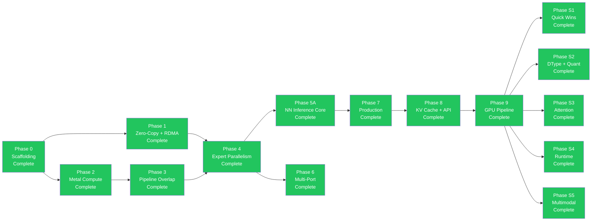

# Implementation Roadmap — Phases 0-9B + S1-S5 + Audit Remediation + Phase 3 + Phase 4 + Phase 5 Complete

The rmlx project implementation roadmap. All phases through 9B-opt and serving support phases S1-S5 are complete. A full-crate audit (Phases 0, 1, 2) has been completed with 76 remediation items resolved across all 6 crates. Phase 3 adds FlashAttention-2 Metal kernel, paged KV cache, continuous batching scheduler, centralized CB commit, f16/bf16 RDMA collectives, ring allreduce chunk rounding fix, MoePolicy thread safety, and CLI signal forwarding. Phase 4 adds performance and allocator improvements: atomic CAS allocation limits, pointer ownership validation, SmallBufferPool/LeakDetector/ResidencyManager wiring, ChipTuning per-generation GPU tuning, DiskPipelineCache with sha2 hashing, HazardTrackingModeUntracked, fused RMSNorm+residual add kernel, gather_mm batched MoE strategy, SlabRing condvar backpressure, ProgressEngine EP dispatch wiring, ICB sparse expert dispatch, and BFC-style allocator. Phase 5 (Feature Breadth) adds 5 new core ops (slice, sort, scan, argreduce, random), 11 new activations (16 total), full MLA and SlidingWindowAttention forward implementations, AWQ/GPTQ/K-quant quantization layers, prefix cache, chunked prefill, 4 full model architectures (LlamaModel, Qwen2Model, DeepSeekV3Model, MixtralModel), tree allreduce with auto selection, pipelined ring buffer, and topology-aware CLI backend selection. Current test count: 1,142+.

---

## 📋 Overview

| Phase | Name | Key Content | Prerequisites | Status |
|:-----:|------|------------|:------------:|:------:|
| 0 | Scaffolding | Workspace, metal-rs wrappers, CI | -- | Complete |
| 1 | Zero-Copy + RDMA | ZeroCopyBuffer, DualRegPool, ibverbs FFI, blocking_exchange | Phase 0 | Complete |
| 1-hotfix | IbvSendWr FFI Layout Fix | FFI layout fix | Phase 1 | Complete |
| 2A | Metal Compute Foundation | Shader vendoring, DType/Array, KernelRegistry | Phase 0 | Complete |
| 2A | Metal Compute Kernels | 7 GPU kernels + integration tests | Phase 2A foundation | Complete |
| 2B | Steel GEMM + Quantization | Steel GEMM, quantized matmul, indexing | Phase 2A | Complete |
| 3 | Pipeline Overlap | MTLSharedEvent, dual-queue pipeline | Phase 2 | Complete |
| 4 | Expert Parallelism | EP dispatch/combine, 3-zone auto backend, sparse dispatch | Phase 1 + 3 | Complete |
| 5A | NN Inference Core | LLaMA, Qwen, DeepSeek, Mixtral | Phase 4 | Complete |
| 6 | Multi-Port | Dual TB5 multi-port striping, multi-node topology | Phase 4 | Complete |
| 7A | Production Hardening | Hardening, observability | Phase 5A | Complete |
| 7B | VJP Autodiff | VJP autodiff + LoRA fine-tuning | Phase 7A | Complete |
| 8 | KV Cache + API Surface | KV cache, parallel linear, API ergonomics | Phase 7B | Complete |
| 9A | GPU Pipeline — ExecGraph | CommandBatcher, ExecGraph, ICB, `_into_cb()` pattern | Phase 8 | Complete |
| 9B-opt | GPU Pipeline — Optimization | Weight pre-caching, contiguous transpose, 17.4x speedup | Phase 9A | Complete |
| S1 | Serving Quick Wins | GELU, RotatingKV, BatchKV | Phase 9 | Complete |
| S2 | DType + Quantization | FP8, GGUF, AWQ/GPTQ | Phase 9 | Complete |
| S3 | Attention Upgrade | Flash Attention 2, QuantizedKV | Phase 9 | Complete |
| S4 | Runtime Flexibility | Array-level collectives, Dynamic shapes | Phase 9 | Complete |
| S5 | Multimodal Extension | Conv1d/Conv2d | Phase 9 | Complete |
| Audit | Full-Crate Audit Remediation | 76 items across 6 crates (Phase 0+1+2) | S5 | Complete |
| EP-1 | GPU-Native Top-K Routing | Fused routing kernel, GPU-resident expert indices/weights/counts/offsets | Audit | Complete |
| EP-2 | Grouped Expert GEMM + Weight Stacking | ExpertGroup, stacked expert weights, batched GatherMM f16/bf16 | EP-1 | Complete |
| EP-3 | Variable-Length v3 Protocol | Packed PacketMeta, count/payload two-phase exchange, 16B packet align | EP-1 | Complete |
| EP-4 | Compute-Communication Overlap (TBO + SBO) | MoePipeline, GpuEvent chains, zero CPU waits in-flight | EP-2 + EP-3 | Complete |
| EP-5 | FP8 Wire Format | Per-token E4M3 quantization, fused dequant-scatter, _into_cb exchange path | EP-3 | Complete |
| EP-6 | ICB Sparse Expert Launch + RDMA Slab Ring | Sparse ICB execution + pre-registered slab ring zero-copy transfer | EP-4 + EP-5 | Complete |
| P3-1 | FlashAttention-2 Metal Kernel | Tiled online softmax, f32 head_dim=128, causal mask, naive SDPA fallback | EP-6 | Complete |
| P3-2 | Paged KV Cache + Block Manager | vLLM-style block allocation, copy-on-write, Metal buffer pool | P3-1 | Complete |
| P3-3 | Continuous Batching Scheduler | Request queue, memory-aware batch scheduling, prefill/decode phases | P3-2 | Complete |
| P3-4 | Centralized CB Commit (`commit_with_mode`) | All rmlx-core ops routed through `commit_with_mode()`, sync/async modes, `CommandBufferHandle` | P3-1 | Complete |
| P3-5 | f16/bf16 RDMA Collectives | `ReduceElement` trait, `CollectiveDType` enum, typed allreduce/broadcast/allgather | EP-6 | Complete |
| P3-6 | Ring Allreduce Chunk Rounding | Element-aligned chunks, f16/bf16 reduction via `half` crate, NaN preservation | P3-5 | Complete |
| P3-7 | MoePolicy Thread Safety | Interior mutability via RwLock, `&self` methods, Send+Sync | EP-6 | Complete |
| P3-8 | CLI Signal Forwarding | ctrlc handler, process cleanup in rmlx-cli launch.rs | EP-6 | Complete |
| P4-1+2 | Atomic CAS Limits + Pointer Tracking | CAS reservation loop, HashSet+Mutex ownership, saturating_sub dealloc | P3 | Complete |
| P4-3 | SmallBufferPool + LeakDetector + ResidencyManager Wiring | SmallBufferPool for ≤256B, LeakDetector alloc/free tracking, Metal 3 ResidencyManager | P4-1+2 | Complete |
| P4-4 | ChipTuning | Per-generation GPU tuning (M1/M2/M3/M4) in GpuDevice | P3 | Complete |
| P4-5 | DiskPipelineCache | sha2-hashed pipeline binary archive at ~/.cache/rmlx/pipelines/ | P4-4 | Complete |
| P4-6 | HazardTrackingModeUntracked | Bit 0x10 for manual hazard tracking in buffer creation | P4-4 | Complete |
| P4-7 | Fused RMSNorm+Residual Add | JIT Metal kernel combining input+residual add and RMSNorm | P3-4 | Complete |
| P4-8 | gather_mm Batched MoE | gather_mm batched strategy replacing per-expert loop in MoE forward | P4-7 | Complete |
| P4-9 | SlabRing Condvar Backpressure | acquire_for_write blocks when full, ring_full_count metric | EP-6 | Complete |
| P4-10 | ProgressEngine EP Dispatch | ProgressEngine wiring with consecutive-error threshold | P4-9 | Complete |
| P4-11 | ICB Sparse Expert Dispatch | grouped_forward_icb(), IcbReplay per-sparsity cache, forward_sparse_icb() | P4-8 + P4-10 | Complete |
| P4-12 | BFC Allocator | BfcAllocator with block splitting, coalescing, best-fit BTreeMap | P4-1+2 | Complete |
| Phase 5 | Feature Breadth | 5 new core ops (slice/sort/scan/argreduce/random), 16 activations, full MLA+SlidingWindow forward, AWQ/GPTQ/K-quant, prefix cache, chunked prefill, 4 model architectures, tree allreduce, pipelined ring buffer, topology-aware CLI | P4 | Complete |
| EP-7 | ICB Full Metal Indirect Dispatch | Wire SparseExpertPlan into ExpertGroup GEMM encoding via Metal ICB indirect dispatch; skip empty experts at GPU command level | EP-6 | Planned |

---

## 📜 Phase Completion History

| Phase | Commit | Tests | Status |
|-------|--------|-------|--------|
| Phase 0: Scaffolding + Metal GPU abstraction | 7071c73 | baseline | Complete |
| Phase 1: Zero-copy memory + RDMA ibverbs | d541bb3 | + alloc/rdma tests | Complete |
| Phase 1-hotfix: IbvSendWr FFI layout fix | 9cca9a9 | 23 tests | Complete |
| Phase 2A-1~4: Shader vendoring, DType/Array, KernelRegistry | 3179bde | foundation | Complete |
| Phase 2A-5~9: 7 GPU kernels + integration tests | 5ef6a07 | 40 tests | Complete |
| Phase 2B: Steel GEMM, quantized matmul, indexing | e4d9c14 | 43 tests | Complete |
| Phase 3: SharedEvent sync + dual queue + layer pipeline | f9cadcf | 52 tests | Complete |
| Phase 4: EP 3-Zone dispatch + MoE exchange | 6fb3296 | 62 tests | Complete |
| Phase 5A: rmlx-nn inference core (LLaMA, Qwen, DeepSeek, Mixtral) | d126aaf | + nn tests | Complete |
| Phase 6: Dual TB5 multi-port striping + multi-node topology | 8c8b25f | + distributed tests | Complete |
| Phase 7A: Production hardening / observability | 0fa70bb | 98 tests | Complete |
| Phase 7B: VJP autodiff + LoRA fine-tuning | 025ed8f | 108 tests | Complete |
| Phase 8: KV Cache + API Surface | squash merge | 339 tests | Complete |
| Phase 9A: GPU Pipeline — ExecGraph | Phase 9 merge commit | 339+ tests | Complete |
| Phase 9B-opt: GPU Pipeline — Optimization | optimization merge | 339+ tests | Complete |
| Phase S1: GELU + KV Cache variants | -- | 390 tests | Complete |
| Phase S2: FP8/GGUF/AWQ/GPTQ | -- | 390 tests | Complete |
| Phase S3: Flash Attention 2 + QuantizedKV | -- | 390 tests | Complete |
| Phase S4: Collective ops + Dynamic shapes | -- | 390 tests | Complete |
| Phase S5: Conv1d/Conv2d | -- | 390 tests | Complete |
| Audit Phase 0: MoE dispatch/combine (D1-D4) + alloc/Metal/GEMM (A1-A3, M1-M4, C1) | `07fad80`, `27f59af` | 460+ tests | Complete |
| Audit Phase 1: NN MoE GPU routing + MoE policy + RDMA fixes + Metal/alloc perf | `6ee6e6c`, `014875e`, `d9c54c7` | 490+ tests | Complete |
| Audit Phase 2: Core ops + NN layers + final codex review | `ea94e94`, `1c48b30`, `f9a3b0c` | 534 tests (at phase completion) | Complete |
| EP-1: GPU-Native Top-K Routing (`topk_route.rs`) | main (merged) | 543+ tests | Complete |
| EP-2: Grouped Expert GEMM + Weight Stacking (`expert_group.rs`, `gather_mm.rs`) | main (merged) | 543+ tests | Complete |
| EP-3: Variable-Length v3 Protocol (`v3_protocol.rs`) | main (merged) | 543+ tests | Complete |
| EP-4: Compute-Communication Overlap (TBO + SBO) (`moe_pipeline.rs`) | main (merged) | 543+ tests | Complete |
| EP-5: FP8 Wire Format (`fp8.rs`, `fp8_exchange.rs`) | main (merged) | 543+ tests | Complete |
| EP-6: ICB Sparse Expert Launch + RDMA Slab Ring (`icb_sparse.rs`, `slab_ring.rs`) | main (merged) | 543+ tests | Complete |
| Production Readiness Phase 0: Initial hardening pass | main | 543+ tests | Complete |
| Production Readiness Phase 1: Metal/alloc safety | main | 543+ tests | Complete |
| Production Readiness Phase 2: Distributed correctness | main | 543+ tests | Complete |
| P3-1: FlashAttention-2 Metal Kernel | main (merged) | 543+ tests | Complete |
| P3-2: Paged KV Cache + Block Manager | main (merged) | 543+ tests | Complete |
| P3-3: Continuous Batching Scheduler | main (merged) | 543+ tests | Complete |
| P3-4: Centralized CB Commit (`commit_with_mode`) | main (merged) | 543+ tests | Complete |
| P3-5: f16/bf16 RDMA Collectives | main (merged) | 543+ tests | Complete |
| P3-6: Ring Allreduce Chunk Rounding | main (merged) | 543+ tests | Complete |
| P3-7: MoePolicy Thread Safety | main (merged) | 543+ tests | Complete |
| P3-8: CLI Signal Forwarding | main (merged) | 543+ tests | Complete |
| P4-1+2: Atomic CAS Limits + Pointer Tracking | feat/phase4 (merged) | 1,003 tests | Complete |
| P4-3: SmallBufferPool + LeakDetector + ResidencyManager Wiring | feat/phase4 (merged) | 1,003 tests | Complete |
| P4-4: ChipTuning | feat/phase4 (merged) | 1,003 tests | Complete |
| P4-5: DiskPipelineCache | feat/phase4 (merged) | 1,003 tests | Complete |
| P4-6: HazardTrackingModeUntracked | feat/phase4 (merged) | 1,003 tests | Complete |
| P4-7: Fused RMSNorm+Residual Add | feat/phase4 (merged) | 1,003 tests | Complete |
| P4-8: gather_mm Batched MoE | feat/phase4 (merged) | 1,003 tests | Complete |
| P4-9: SlabRing Condvar Backpressure | feat/phase4 (merged) | 1,003 tests | Complete |
| P4-10: ProgressEngine EP Dispatch | feat/phase4 (merged) | 1,003 tests | Complete |
| P4-11: ICB Sparse Expert Dispatch | feat/phase4 (merged) | 1,003 tests | Complete |
| P4-12: BFC Allocator | feat/phase4 (merged) | 1,003 tests | Complete |
| Phase 5: Feature Breadth | feat/phase5-feature-breadth (merged) | 1,142 tests | Complete |
| EP-7: ICB Full Metal Indirect Dispatch | -- | -- | Planned |

---

## 🔀 Phase Dependency Diagram



---

## 🏗️ Phase 0: Scaffolding — Complete (`7071c73`)

### Goal

Establish the Cargo workspace structure, validate metal-rs basic operations, and set up CI.

### Key Deliverables

- Cargo workspace initialization (6 crate skeletons)
- `rmlx-metal`: MTLDevice creation, basic command buffer/encoder wrappers
- `rmlx-metal`: Simple Metal compute kernel execution (vector add)
- Build system: `.metal` -> `.metallib` AOT compilation pipeline in `build.rs`
- CI: GitHub Actions (macOS runner, `cargo test`, `cargo clippy`)

### Definition of Done (DoD)

- [x] `cargo build --workspace` succeeds (0 errors)
- [x] `cargo fmt --all --check` -- diff 0
- [x] `cargo clippy --workspace -- -D warnings` -- 0 warnings
- [x] `cargo test --workspace` -- `test_basic_metal_compute` PASS
- [x] `build.rs` `.metal` -> `.metallib` AOT compilation succeeds
- [x] Codex review: SAFETY comments present on unsafe blocks

---

## 🔗 Phase 1: Zero-Copy + RDMA — Complete (`d541bb3`, hotfix `9cca9a9`)

### Goal

Convert PoC Phase 1-4 validation results into production-quality code. Implement zero-copy transfers by registering GPU buffers directly with RDMA.

### Key Deliverables

- `rmlx-alloc`: ZeroCopyBuffer (`posix_memalign` + NoCopy)
- `rmlx-alloc`: DualRegPool (Metal + `ibv_mr` dual-registered pool)
- `rmlx-alloc`: MetalAllocator (heap + cache, MLX compatible)
- `rmlx-rdma`: ibverbs FFI bindings (`bindgen`)
- `rmlx-rdma`: IbContext, PD, CQ, UC QP wrappers
- `rmlx-rdma`: `ibv_reg_mr` wrapper + dual registration tests
- `rmlx-rdma`: `blocking_exchange` (2-phase count -> payload)
- `rmlx-rdma`: ConnectionManager (`hosts.json` parsing, warmup)
- Integration test: 2-node zero-copy RDMA round-trip

### Definition of Done (DoD)

- [x] `cargo fmt --all --check` -- diff 0
- [x] `cargo clippy --workspace -- -D warnings` -- 0 warnings
- [x] `test_zero_copy_buffer_lifecycle` -- InFlightToken drop-then-free verified
- [x] `test_dual_registration` -- Metal + ibv_mr same-address verified
- [x] `test_rdma_exchange_2node` -- 4MB round-trip, 0 mismatch
- [x] `test_rdma_startup_probe` -- GID/MR/QP runtime discovery succeeds
- [x] `test_recv_before_send_invariant` -- Error returned when recv not posted
- [x] Benchmark: RDMA bandwidth > 6 GB/s (single port)
- [x] Codex review: FFI boundary safety, lifetime verification

---

## ⚡ Phase 2: Metal Compute — Complete (2A: `3179bde`, `5ef6a07` / 2B: `e4d9c14`)

### Goal

Build the core Metal kernel execution pipeline needed for efficient GPU computation. Reuse MLX's Metal shaders to dispatch 10 kernel types from Rust.

### Key Deliverables

- `rmlx-core`: Array type (N-dim, dtype, ownership management)
- `rmlx-core`: dtype system (f32, f16, bf16, q4_0, q4_1, q8_0)
- MLX `.metal` kernel porting (Rust dispatch wrappers):
  - matmul (GEMM/GEMV)
  - quantized matmul (QMM 4bit/8bit)
  - softmax
  - RMS normalization
  - RoPE (rotary position embedding)
  - Element-wise binary ops (add, mul, etc.)
  - reduce (sum, max, argmax)
  - copy / transpose
  - indexing (gather, scatter)
- `rmlx-core`: KernelRegistry (AOT + JIT)
- `rmlx-core`: Per-stream CommandEncoder management
- Benchmarks: Per-kernel performance comparison vs. MLX

### Definition of Done (DoD)

- [x] `cargo fmt --all --check` -- diff 0
- [x] `cargo clippy --workspace -- -D warnings` -- 0 warnings
- [x] 10 kernels each within +/-5% of MLX performance
- [x] `test_matmul_correctness` -- fp16/bf16 accuracy (ulp < 2)
- [x] `test_quantized_matmul` -- q4/q8 accuracy
- [x] `test_dispatch_geometry` -- threadgroup vs. thread size verified
- [x] Codex review: kernel binding index consistency verified

---

## 🔄 Phase 3: Pipeline Overlap — Complete (`f9cadcf`)

### Goal

Implement MTLSharedEvent-based GPU synchronization and dual queue pipeline to overlap compute and RDMA transfers.

### Key Deliverables

- `rmlx-metal`: GpuEvent (MTLSharedEvent wrapper)
- `rmlx-metal`: FenceImpl (fast fence + SharedEvent fallback)
- `rmlx-metal`: StreamManager (dual queue management)
- `rmlx-distributed`: LayerPipeline (compute <-> RDMA overlap)
- GPU -> CPU sync: event spin-wait (263.9 us target)
- GPU -> GPU sync: encodeSignal/WaitForEvent cross-queue

Pipeline overlap effect:

```
Non-pipelined: 60 x (20ms + 7ms) = 1,620ms
Pipelined:     60 x 20ms + 7ms   = 1,207ms  (25% improvement)
```

### Definition of Done (DoD)

- [x] `cargo fmt --all --check` -- diff 0
- [x] `cargo clippy --workspace -- -D warnings` -- 0 warnings
- [x] `test_shared_event_latency` -- spin-wait < 280 us
- [x] `test_dual_queue_overlap` -- concurrent execution of both queues confirmed
- [x] `test_layer_pipeline_correctness` -- pipeline result == serial result
- [x] `test_event_deadline_cancel` -- timeout/cancel behavior confirmed
- [x] Benchmark: sync latency histogram (p50/p95/p99)
- [x] Codex review: synchronization protocol correctness

---

## 🧠 Phase 4: Expert Parallelism — Complete (`6fb3296`)

### Goal

Reimplement MLX EP optimizations in RMLX, achieving additional performance gains through zero-copy. Achieve 2-node Mixtral decode step < 35ms.

### Key Deliverables

- `rmlx-distributed`: Group abstraction (rank, world_size, EP topology)
- `rmlx-distributed`: AllToAll primitive
- `rmlx-distributed/moe`: MoeDispatchExchange
  - CPU backend (N <= 64)
  - Metal backend (N >= 320, 7 kernels)
  - Byte threshold for intermediate range
- `rmlx-distributed/moe`: MoeCombineExchange
  - Single-source weighted sum
  - Dual-source weighted sum (local + remote, zero-copy)
- `rmlx-distributed/moe`: MoePolicy (3-zone auto + cooldown)
- 7 MoE Metal kernels JIT-compiled

### Definition of Done (DoD)

- [x] `cargo fmt --all --check` -- diff 0
- [x] `cargo clippy --workspace -- -D warnings` -- 0 warnings
- [x] `test_1rank_vs_2rank_parity` -- single-node result == 2-node EP result
- [x] `test_3zone_policy` -- correct backend selection for N=1/64/256/1024
- [x] `test_sparse_dispatch_correctness` -- matmul scatter == dense result
- [x] `test_interleaved_exchange_stress` -- 1000 consecutive exchanges with 0 errors
- [x] `test_capacity_overflow_detection` -- overflow_count metric accuracy
- [x] Benchmark: 2-node decode step < 35ms
- [x] Codex review: exchange protocol, metric collection accuracy

---

## 🏛️ Phase 5A: NN Inference Core — Complete (`d126aaf`)

### Goal

Implement core neural network modules in the rmlx-nn crate.

### Key Deliverables

**rmlx framework** (`~/rmlx/`):
- `rmlx-nn`: Transformer block (Linear, Attention, FFN, MoE)
- `rmlx-nn`: Model architectures (LLaMA, Qwen, DeepSeek-V3, Mixtral)

### Definition of Done (DoD)

- [x] `cargo fmt --all --check` -- diff 0
- [x] `cargo clippy --workspace -- -D warnings` -- 0 warnings
- [x] Model architecture accuracy verification
- [x] Codex review: nn module safety

---

## 🌐 Phase 6: Multi-Port — Complete (`8c8b25f`)

### Goal

Expand bandwidth by utilizing multiple TB5 ports and support 3+ nodes. Achieve ~1.8x bandwidth over single port with dual port striping.

### Key Deliverables

- `rmlx-rdma/multi_port`: Dual TB5 port striping
- `rmlx-rdma/multi_port`: Automatic striping based on transfer size (N >= 8 threshold)
- Multi-node topology manager (ring, mesh, hybrid)
- 3+ node EP support (all-to-all with > 2 ranks)

### Definition of Done (DoD)

- [x] `cargo fmt --all --check` -- diff 0
- [x] `cargo clippy --workspace -- -D warnings` -- 0 warnings
- [x] `test_dual_port_striping` -- 2-port concurrent transfer, data integrity
- [x] `test_single_port_fallback` -- graceful fallback on 1-port failure
- [x] Benchmark: dual-port bandwidth > 12 GB/s
- [x] Codex review: port independence, error isolation

---

## 🛡️ Phase 7A: Production Hardening / Observability — Complete (`0fa70bb`)

### Goal

Ensure production stability and observability.

### Key Deliverables

- Structured logging (`tracing` crate)
- Metrics collection (Prometheus compatible)
- Graceful shutdown + error recovery
- GID table corruption detection and automatic alerts
- Memory leak detection (allocation statistics-based)

### Definition of Done (DoD)

- [x] Structured logging applied across all crates
- [x] Prometheus /metrics endpoint operational
- [x] Graceful shutdown scenario tested

---

## 🎓 Phase 7B: VJP Autodiff + LoRA Fine-tuning — Complete (`025ed8f`)

### Goal

Build a VJP framework and LoRA fine-tuning foundation for training support.

### Key Deliverables

- VJP (Vector-Jacobian Product) framework
- Basic training loop (LoRA fine-tuning)

### Definition of Done (DoD)

- [x] VJP gradient accuracy for basic operations (matmul, softmax)
- [x] LoRA fine-tuning functional verification

---

## 📦 Phase 8: KV Cache + API Surface — Complete (squash merged to main)

### Goal

Add incremental decoding support via KV cache in rmlx-nn and improve API ergonomics across the framework.

### Key Deliverables

- `rmlx-nn`: `LayerKvCache` struct for incremental KV caching in attention
- `rmlx-nn`: Cache-aware `forward()` in Attention, TransformerBlock, TransformerModel
- `rmlx-nn`: Per-expert MoE routing metrics (`MoeForwardMetrics.expert_tokens`)
- `rmlx-nn`: Megatron-LM parallel linear layers (`parallel.rs`: ColumnParallelLinear, RowParallelLinear)
- `rmlx-distributed`: Per-expert histogram in `MoeMetrics`
- `rmlx-metal`: Top-level re-exports (`GpuDevice`, `GpuEvent`, `Architecture`)
- `rmlx-core`: `prelude` module (Array, DType, KernelError, KernelRegistry)
- `rmlx-nn`: Re-exports (`LayerKvCache`, `FeedForward`)

### Definition of Done (DoD)

- [x] `cargo fmt --all --check` -- diff 0
- [x] `cargo clippy --workspace -- -D warnings` -- 0 warnings
- [x] `cargo test --workspace` -- 339 tests passing, 0 failures
- [x] KV cache: decode step processes only the last token (O(n^2) → O(n))
- [x] Backward compatible: cache=None preserves existing behavior
- [x] Codex review: 0 Critical/High issues

---

## 🚀 Phase 9: GPU Pipeline — Complete

### Phase 9A: ExecGraph + CommandBatcher

#### Goal

Eliminate per-op CPU overhead by batching multiple GPU operations into minimal command buffers using ExecGraph.

#### Key Deliverables

- `rmlx-metal`: `CommandBatcher` — batches encoder work into shared command buffers
- `rmlx-metal`: `ExecGraph` — pre-built execution graph that replays deterministic op sequences
- `rmlx-metal`: `IcbBuilder`/`IcbReplay`/`IcbCache` — Indirect Command Buffer support
- `rmlx-core`: `_into_cb()` pattern for all 14 ops — encode into caller's command buffer
- `rmlx-nn`: `forward_graph()` for Attention, TransformerBlock, TransformerModel
- `rmlx-nn`: `forward_into_cb()` for Linear
- Benchmark: 65 CBs/layer → 5 CBs/layer (92.3% reduction)

### Phase 9B-opt: Weight Pre-caching + Optimization

#### Goal

Pre-cache contiguous transposed weight matrices to eliminate transpose overhead during inference.

#### Key Deliverables

- `rmlx-nn`: `prepare_weight_t()` / `weight_transposed_contiguous()` for Linear
- `rmlx-nn`: `prepare_weights_for_graph()` for TransformerModel/Block/Attention/FeedForward
- Benchmark: ~112ms → ~6.4ms per layer (17.4x speedup)
- Numerical parity: max_diff=6.4e-6

#### Definition of Done (DoD)

- [x] 17.4x speedup (~112ms → ~6.4ms)
- [x] 92.3% CB reduction (65 → 5)
- [x] Numerical parity (max_diff=6.4e-6)
- [x] All 339+ tests passing

---

## Phase S3a: Flash Attention 2 — Complete (previously Phase 10)

### Goal

Implement Flash Attention 2 with K/V outer loop for efficient attention computation.

### Key Deliverables

- Flash Attention 2 Metal kernel (K/V outer loop, Q inner loop)
- head_dim support up to 256 (previously 128)
- Decode fast path (T_q=1) with optimized single-query kernel
- Causal mask block-skipping optimization
- `is_causal` parameter for sdpa/sdpa_batched

### Definition of Done (DoD)

- [x] FA2 kernel with K/V outer loop structure
- [x] D up to 256 supported
- [x] Decode fast path for T_q=1
- [x] Causal mask optimization (skip blocks above diagonal)
- [x] Backward compatible API (is_causal=false default)
- [x] All 390+ tests passing

---

## Phase S2: Advanced Quantization — Complete (previously Phase 11)

### Goal

Expand quantization format support for broader model compatibility.

### Key Deliverables

- FP8 DType (Float8E4M3, Float8E5M2) with dequant/quant Metal kernels
- GGUF binary format parser (v2/v3) with GgmlType mapping
- AWQ INT4 unpacking (packed uint32 → f32 dequantization)
- GPTQ INT4 unpacking with g_idx (act_order) support

### Definition of Done (DoD)

- [x] FP8 dtypes added with all match arms updated
- [x] GGUF parser with 11 unit tests
- [x] AWQ/GPTQ dequant Metal kernels
- [x] All 390+ tests passing

---

## Phase S1: Serving Quick Wins — Complete

### Goal

Add activation functions and KV cache variants needed by rmlx-serve.

### Key Deliverables

- GELU activation (gelu_approx + gelu_fast) with f32/f16/bf16 Metal kernels
- RotatingKvCache: circular buffer with keep parameter for system prompt preservation
- BatchKvCache: per-sequence batched cache with filter/extend/reset

### Definition of Done (DoD)

- [x] GELU Metal kernels (6 variants)
- [x] RotatingKvCache with circular write and temporal order restoration
- [x] BatchKvCache with per-sequence offset tracking
- [x] All 390+ tests passing

---

## Phase S3b: QuantizedKVCache — Complete

### Goal

Reduce KV cache memory consumption via quantized storage.

### Key Deliverables

- QuantizedArray type (packed_uint32, scales, biases)
- QuantizedKvCache with per-layer per-head quantized storage
- CPU-side affine quantization helper

### Definition of Done (DoD)

- [x] Quantized KV cache with q4/q8 support
- [x] Memory savings: q4 = 4x reduction over f16
- [x] All 390+ tests passing

---

## Phase S4: Runtime Flexibility — Complete

### Goal

Add Array-level distributed primitives and dynamic shape support.

### Key Deliverables

- `allreduce_sum()` and `allgather_array()` on Group (Array-level wrappers)
- DynamicExecContext: max-size pre-allocation with variable actual-size dispatch

### Definition of Done (DoD)

- [x] Array-level collective ops on Group
- [x] DynamicExecContext with zero-copy view-based dispatch
- [x] All 390+ tests passing

---

## Phase S5: Multimodal Extension — Complete

### Goal

Add convolution primitives for multimodal model support.

### Key Deliverables

- Conv1d Metal kernels (f32/f16/bf16) with padding, stride, dilation, groups
- Conv2d Metal kernels (f32/f16/bf16) with 2D padding, stride, dilation, groups
- Conv1d/Conv2d nn layer wrappers in rmlx-nn

### Definition of Done (DoD)

- [x] Conv1d/Conv2d Metal kernels with full parameter support
- [x] Neural network layer wrappers (Conv1d, Conv2d)
- [x] All 390+ tests passing

---

## Full-Crate Audit Remediation (Phase 0+1+2) -- Complete

### Goal

Comprehensive audit of all 6 crates with codex-assisted review. Fix all correctness, performance, and feature completeness issues identified.

### Scope: 76 Items Across 6 Crates

| Crate | Items | Key Fixes |
|-------|-------|-----------|
| **rmlx-distributed** | D1-D10 | Dispatch loop ordering, per-rank capacity, combine caching, byte threshold (4KB->2MB), hysteresis, cooldown semantics, shared expert, EP integration |
| **rmlx-metal** | M1-M8 | Command pipeline safety, fence manager, library cache, MSL version detection, stream improvements, autorelease pool, capture manager, managed buffers |
| **rmlx-alloc** | A1-A12 | Cache bounds fix, alignment improvements, residency management, small allocation fast-path, pool improvements, GC limit API, alloc stats |
| **rmlx-core** | C1-C9 | Quantized GEMM fix, GatherMM, LayerNorm, unary ops, concat, select, SDPA bf16/backward, conv tiled, VJP GPU |
| **rmlx-nn** | N1-N8 | MoE GPU routing, batched execution, GPU matmul, QuantizedLinear, MLA, sliding window attention, GGUF loader, 14 activations, LayerNorm layer |
| **rmlx-rdma** | R1-R3 | Ring/allreduce/allgather collectives, connection manager, coordinator |

### Definition of Done (DoD)

- [x] `cargo fmt --all --check` -- diff 0
- [x] `cargo clippy --all-targets` -- 0 warnings
- [x] `cargo test --workspace` -- 534 tests passing at audit completion, 0 failures
- [x] All EP audit findings (D1-D7) resolved
- [x] Codex review: 0 Critical/High issues remaining

---

## EP Optimization Phases (EP-1 ~ EP-6) -- Complete

Post-audit EP optimization phases were merged into main to remove the remaining MoE bottlenecks and keep routing, exchange, and expert compute fully GPU-resident end-to-end.

| Phase | Key Files | Core Changes | Status |
|------|-----------|--------------|--------|
| EP-1 | `crates/rmlx-core/src/ops/topk_route.rs` | Fused `moe_topk_route_f32`: softmax -> top-k -> normalize -> histogram -> prefix-scan in one Metal pass; removes GPU->CPU->GPU routing round-trip | Complete |
| EP-2 | `crates/rmlx-nn/src/expert_group.rs`, `crates/rmlx-core/src/ops/gather_mm.rs` | `ExpertGroup` weight stacking + 3 batched GEMMs (Gate -> Up -> fused SwiGLU -> Down); GatherMM f16/bf16 kernels + `_into_cb` | Complete |
| EP-3 | `crates/rmlx-distributed/src/v3_protocol.rs` | Variable-length token exchange with packed `PacketMeta`, two-phase count/payload sendrecv, 16B packet alignment | Complete |
| EP-4 | `crates/rmlx-nn/src/moe_pipeline.rs` | TBO + SBO overlap orchestration via `GpuEvent` signal/wait chains; single terminal `GpuEvent::cpu_wait()` | Complete |
| EP-5 | `crates/rmlx-core/src/ops/fp8.rs`, `crates/rmlx-distributed/src/fp8_exchange.rs` | Per-token FP8 E4M3 wire format, fused `dequant_scatter_fp8e4m3`, `_into_cb` pipelining variants | Complete |
| EP-6 | `crates/rmlx-metal/src/icb_sparse.rs`, `crates/rmlx-distributed/src/slab_ring.rs` | Sparse expert ICB launch cache + pre-registered RDMA slab ring with `GpuEvent` timeline sync | Complete |

Current op module count: 32+. Current test count: 1,142+.

---

## Phase 3: Serving Infrastructure + Correctness Hardening -- Complete

Phase 3 delivers serving-critical infrastructure (FlashAttention-2 Metal kernel, paged KV cache, continuous batching scheduler), centralized command buffer commit for all ops, f16/bf16 RDMA collectives, and correctness fixes across distributed and CLI crates.

| PR | Key Files | Core Changes | Status |
|----|-----------|--------------|--------|
| P3-1 | `crates/rmlx-core/src/ops/flash_attention.rs` | FlashAttention-2 Metal kernel: tiled online softmax, f32 head_dim=128, causal mask, falls back to naive SDPA | Complete |
| P3-2 | `crates/rmlx-nn/src/paged_kv_cache.rs` | vLLM-style paged KV cache with block manager, copy-on-write, Metal buffer pool | Complete |
| P3-3 | `crates/rmlx-nn/src/scheduler.rs` | Continuous batching scheduler: request queue, memory-aware batch scheduling, prefill/decode phases | Complete |
| P3-4 | rmlx-core ops (all modules) | Centralized CB commit via `commit_with_mode()` with sync/async `ExecMode`, `CommandBufferHandle` for async tracking | Complete |
| P3-5 | `crates/rmlx-rdma/` | `ReduceElement` trait, `CollectiveDType` enum, typed f16/bf16 allreduce/broadcast/allgather | Complete |
| P3-6 | `crates/rmlx-distributed/` | Ring allreduce element-aligned chunk rounding, f16/bf16 reduction via `half` crate, NaN preservation | Complete |
| P3-7 | `crates/rmlx-distributed/src/moe_policy.rs` | MoePolicy interior mutability via RwLock, all methods take `&self`, Send+Sync | Complete |
| P3-8 | `crates/rmlx-cli/src/launch.rs` | ctrlc signal handler, child process cleanup on SIGINT/SIGTERM | Complete |

---

## Phase 4: Performance and Allocator -- Complete

Phase 4 delivers performance optimizations and allocator hardening across all crates (12 PRs, P4-1 through P4-12). Test count grew from 543 to 1,003.

| PR | Crates | Core Changes | Status |
|----|--------|--------------|--------|
| P4-1+2 | rmlx-alloc | Atomic CAS reservation loop for memory limit enforcement; pointer tracking (HashSet+Mutex) for ownership validation; stats `fetch_update` with `saturating_sub` for deallocation underflow prevention | Complete |
| P4-3 | rmlx-alloc | SmallBufferPool wired into MetalAllocator for ≤256B allocations; LeakDetector wired for alloc/free tracking; ResidencyManager (optional) for Metal 3 runtime detection | Complete |
| P4-4 | rmlx-metal | `ChipTuning` struct with per-generation GPU tuning (M1/M2/M3/M4) integrated into GpuDevice | Complete |
| P4-5 | rmlx-metal | `DiskPipelineCache` using sha2 hashing for pipeline binary archive at `~/.cache/rmlx/pipelines/` | Complete |
| P4-6 | rmlx-metal, rmlx-alloc | HazardTrackingModeUntracked (bit 0x10) added to buffer creation for manual hazard tracking | Complete |
| P4-7 | rmlx-core | Fused `rms_norm_residual_add` JIT Metal kernel combining input+residual add and RMSNorm in single dispatch | Complete |
| P4-8 | rmlx-nn | gather_mm batched strategy replacing per-expert loop in MoE forward | Complete |
| P4-9 | rmlx-distributed | SlabRing condvar backpressure: `acquire_for_write` blocks when full, `ring_full_count` metric | Complete |
| P4-10 | rmlx-distributed, rmlx-rdma | ProgressEngine wiring for EP dispatch with consecutive-error threshold | Complete |
| P4-11 | rmlx-metal, rmlx-nn | ICB Sparse Expert Dispatch: `grouped_forward_icb()` for active experts only, `IcbReplay` per-sparsity-pattern cache, `forward_sparse_icb()` in moe.rs | Complete |
| P4-12 | rmlx-alloc | BFC-style allocator (`BfcAllocator`) with block splitting, coalescing, and best-fit BTreeMap lookup | Complete |

---

## Phase 5: Feature Breadth -- Complete

Phase 5 delivers significant feature breadth across all crates, closing gaps with MLX and adding production inference capabilities. Test count grew from 1,003 to 1,142.

| Crate | Key Additions | Status |
|-------|---------------|--------|
| **rmlx-core** | 5 new op modules: `slice.rs` (multi-dim slice up to 8D), `sort.rs` (bitonic sort/argsort up to 2048 elements), `scan.rs` (parallel prefix scan: cumsum/cumprod), `argreduce.rs` (argmin/argmax with SIMD), `random.rs` (Philox 4x32-10 PRNG: uniform/normal) | Complete |
| **rmlx-nn** | 11 new activations (16 total: +ReLU, LeakyReLU, ELU, SELU, Mish, QuickGELU, HardSwish, HardSigmoid, Softplus, Softsign, GLU); full MLA forward (DeepSeek-V3 9-step pipeline with latent KV compression); full SlidingWindowAttention forward (Mistral-style RoPE+SDPA+KV cache); AwqLinear/GptqLinear/KQuantType/KQuantConfig; K-quant GGUF mapping; radix-tree prefix cache with LRU eviction; chunked prefill scheduler; 4 full model architectures (LlamaModel, Qwen2Model, DeepSeekV3Model, MixtralModel) | Complete |
| **rmlx-distributed** | Tree allreduce (binary tree, O(log N) rounds); `allreduce_auto()` (tree <1MB / ring >=1MB); `TopologyRing` (greedy nearest-unvisited from hop matrix, `RMLX_TOPOLOGY` env) | Complete |
| **rmlx-rdma** | `PipelinedRingBuffer` (N-slot overlapping send/recv/reduce); `pipelined_ring_allreduce()` | Complete |
| **rmlx-cli** | TB5/TB4 discovery via `system_profiler`; `Interconnect` enum; `detect_topology()`; `resolve_auto_backend()`; `--backend auto` default | Complete |

---

## EP-7: ICB Full Metal Indirect Dispatch -- Planned

### Goal

Wire `SparseExpertPlan` into `ExpertGroup::grouped_forward()` via Metal Indirect Command Buffers, so empty experts are skipped at the GPU command encoding level rather than only at the gather/scatter level.

### Background

EP-6 implemented `SparseExpertPlan` and `IcbReplay` infrastructure. The current `forward_sparse_icb()` in `moe.rs` skips empty experts at the gather/scatter level but still uses the same `grouped_forward()` call path as the non-sparse case. The ICB plan and capacity vector are built but unused (`let _ = sparse_plan; let _ = capacity;`).

### Key Deliverables

- `ExpertGroup::grouped_forward_icb()`: accepts `SparseExpertPlan` + per-expert capacity, encodes only active experts via Metal ICB indirect dispatch
- `IcbReplay` integration: cache compiled ICB commands per sparsity pattern, replay without re-encoding
- `forward_sparse_icb()` in `moe.rs`: call `grouped_forward_icb()` instead of `grouped_forward()`
- Benchmark: measure GPU kernel dispatch overhead reduction for sparse workloads (>50% experts empty)

### Prerequisites

- EP-6 (SparseExpertPlan, IcbReplay infrastructure)
- ExpertGroup internal refactoring to support ICB-encoded GEMM dispatch

### Estimated Impact

Low-to-moderate: saves ~tens of microseconds per forward when sparsity is high. Most beneficial for large expert counts (64+) with highly sparse routing patterns.

---

## 🧪 CI Required Test Matrix

The CI pipeline applied across all phases:

```yaml
# .github/workflows/ci.yml
jobs:
  build-and-test:
    runs-on: macos-15  # Apple Silicon runner
    steps:
      - cargo build --workspace
      - cargo test --workspace
      - cargo clippy --workspace -- -D warnings
      - cargo fmt --check

  rdma-integration:  # 2-node only (self-hosted runner)
    runs-on: [self-hosted, macOS, tb5-rdma]
    needs: build-and-test
    steps:
      - cargo test --workspace --features rdma-integration
      - cargo bench --bench rdma_latency
```

---

## ✅ Phase Common Completion Criteria

All phases must meet the following criteria:

| Item | Command | Standard |
|------|---------|----------|
| **Build** | `cargo build --workspace` | 0 errors |
| **Format** | `cargo fmt --all --check` | diff 0 |
| **Lint** | `cargo clippy --workspace -- -D warnings` | 0 warnings |
| **Tests** | `cargo test --workspace` | 0 failures, all tests for the phase pass |
| **Code review** | Codex review | 0 Critical/High issues |
| **Commit** | `git commit` | Clean commit with fmt + clippy + test passing |
