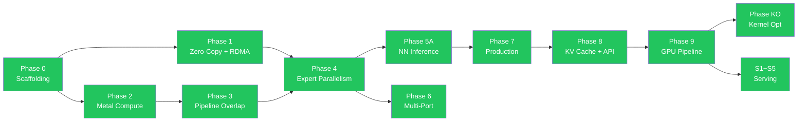

# RMLX Implementation Roadmap

> 17일 만에 Naive 110ms → Fused 703μs (156×). MLX 대비 decode 12.1×, prefill parity, RDMA TP=2 5.0×.
> 1,298+ tests across 6 crates. FP16 GEMM 24.05T (MLX +0.3%), QMM Q4 17.43T (+28% vs MLX).
> EP 30–178× vs MLX per-expert, MoE grouped_forward 68× improvement via buffer pooling.

---

## 🎯 Current Focus

| Phase | Description | Status |
|-------|-------------|--------|
| KO-2 | Decode Scratch Allocator — pre-allocated workspace, bump alloc | 📋 Planned |
| KO-3 | ICB Decode Replay — record/replay 9-dispatch via Metal ICB | 📋 Planned |
| EP-7 | ICB Full Metal Indirect Dispatch — skip empty experts at GPU level | 📋 Planned |
| J-3c | ICB Decode Replay wiring into icb.rs | 📋 Pending |
| J-8 | MoE Fused Kernels (index_gather + scatter_weighted_add) | 🔬 In Review |
| P-TP1 | Prefill TP=1 regression fix — -23% vs MLX at M=128 | 📋 Planned |
| P-RG | Router/Gate CPU sync overhead — ~1400μs gate latency | 📋 Planned |
| P-SDPA | SDPA prefill large-M kernel — no dedicated kernel for large seq | 📋 Planned |

---

## 📋 Phase Overview

### Era 1: Foundation (02-28) — Workspace, Metal, Kernels, EP, NN, RDMA

| Phase | Name | Key Result | Status |
|-------|------|------------|--------|
| 0 | Scaffolding | Workspace, objc2-metal, CI | ✅ |
| 1 | Zero-Copy + RDMA | ZeroCopyBuffer, DualRegPool, ibverbs FFI | ✅ |
| 1-hotfix | IbvSendWr FFI Fix | FFI layout correction | ✅ |
| 2A | Metal Compute | DType/Array, KernelRegistry, 7 GPU kernels | ✅ |
| 2B | Steel GEMM + Quant | Steel GEMM, quantized matmul, indexing | ✅ |
| 3 | Pipeline Overlap | MTLSharedEvent, dual-queue pipeline | ✅ |
| 4 | Expert Parallelism | EP dispatch/combine, 3-zone auto backend | ✅ |
| 5A | NN Inference Core | Qwen, DeepSeek, Mixtral, Kimi architectures | ✅ |
| 6 | Multi-Port | Dual TB5 striping, multi-node topology | ✅ |
| 7A | Production Hardening | Logging, metrics, graceful shutdown | ✅ |
| 7B | VJP Autodiff | VJP framework + LoRA fine-tuning | ✅ |
| 8 | KV Cache + API | LayerKvCache, parallel linear, API ergonomics | ✅ |
| 9A | GPU Pipeline — ExecGraph | CommandBatcher, ExecGraph, ICB, `_into_cb()` | ✅ |
| 9B-opt | GPU Pipeline — Optimization | Weight pre-caching, 17.4× speedup | ✅ |

### Era 2: Production Hardening (03-01 ~ 03-06) — Audit, Quality, EP, Serving Infra

| Phase | Name | Key Result | Status |
|-------|------|------------|--------|
| S1 | Serving Quick Wins | GELU, RotatingKV, BatchKV | ✅ |
| S2 | DType + Quantization | FP8, GGUF, AWQ/GPTQ | ✅ |
| S3 | Attention Upgrade | Flash Attention 2, QuantizedKV | ✅ |
| S4 | Runtime Flexibility | Array-level collectives, dynamic shapes | ✅ |
| S5 | Multimodal Extension | Conv1d/Conv2d | ✅ |
| Audit | Full-Crate Audit | 76 items across 6 crates | ✅ |
| EP-1 | GPU-Native Top-K Routing | Fused routing kernel, GPU-resident indices | ✅ |
| EP-2 | Grouped Expert GEMM | ExpertGroup, stacked weights, GatherMM | ✅ |
| EP-3 | Variable-Length v3 Protocol | Packed PacketMeta, two-phase exchange | ✅ |
| EP-4 | Compute-Comm Overlap | MoePipeline, GpuEvent chains, zero CPU waits | ✅ |
| EP-5 | FP8 Wire Format | Per-token E4M3, fused dequant-scatter | ✅ |
| EP-6 | ICB Sparse + Slab Ring | Sparse ICB execution, RDMA slab ring | ✅ |
| P3-1~8 | Serving Infrastructure | FlashAttn-2, paged KV, scheduler, CB commit, f16/bf16 RDMA, MoePolicy safety, CLI signals | ✅ |
| P4-1~12 | Performance + Allocator | CAS limits, SmallBufferPool, ChipTuning, DiskPipelineCache, fused RMSNorm, BFC allocator (12 PRs, 1,003 tests) | ✅ |
| Phase 5 | Feature Breadth | 5 ops, 16 activations, MLA, 4 model archs, tree allreduce (1,142 tests) | ✅ |

### Era 3: Decode Optimization (03-07) — From 110ms to 703μs

| Phase | Name | Key Result | Status |
|-------|------|------------|--------|
| KO | Kernel Optimization | 9-dispatch decode, 64× speedup, 6.34× vs MLX | ✅ |
| 8c | Serial Decode Opts | CachedDecode, 2-encoder, GEMV BM8 — 714 us/L | ✅ |
| 9 | f16 Default + Framework | f16 default, single-encoder, direct KV append | ✅ |
| 10 | Kernel Fusion | fused_rms_gemv + fused_swiglu_down — 9→7 dispatch, **699.3 us/L** | ✅ |
| 11 | GEMV Experiments | Col-major, interleaved, SRAM — all failed; 705 us/L is practical floor | ✅ |

### Era 4: GEMM & Prefill (03-08 ~ 03-13) — GEMM 24.05T, Prefill MLX Parity

| Phase | Name | Key Result | Status |
|-------|------|------------|--------|
| A | Prefill Optimization | Single-CB (54→1 sync), GQA slab SDPA (32→1) | ✅ |
| B | GEMM Config Sweep | 27 variants, bk32_2x4 optimal, 21.54T (-10.1% MLX) | ✅ |
| C | GEMM Kernel-Level | wide_load + SG=2x4, 21.21T (-11.5% MLX) | ✅ |
| D2 | MLX-Arch Kernel | **24.05T** (+0.3% vs MLX), BK=16, 2SG, 64 threads | ✅ |
| F-1 | Dispatch Overhead Bench | 176us/CB, 12.4% of layer time | ✅ |
| F-2 | DiskPipelineCache | SHA-256 disk pipeline cache in KernelRegistry | ✅ |
| F-3 | GatherMM MMA | Scalar→simdgroup MMA, 4-12× MoE improvement | ✅ |
| G-1 | QMM MMA Q4 | Simdgroup MMA (BM=32, BN=32, BK=32) | ✅ |
| G-2 | QMV qdot Q4/Q8 | MLX qdot pattern, uchar4 vectorized loads | ✅ |
| G-3 | Q8 QMM + CPU Removal | Q8 simdgroup MMA, CPU fallback fully removed | ✅ |
| H-2 | GEMM+Residual Fusion | Function constant 202, 5-12% for large N | ✅ |
| I-1 | Distributed TP | DistributedTransformerModel, shard_for_tp, TP=2 1.94× | ✅ |
| J | Quantized Parity + Infra | QMM +73%, QMV +37%, FusionCompiler, Split-K, forward_auto() | ✅ |
| DQ | Dual-Queue MoE Overlap | Metal 2-queue Attn∥MoE, 1.6-34.6% reduction | 🔬 |
| PR#77 | Prefill SDPA Parity | QMM Q4 M=512 **17.43T** (+28% vs MLX) | ✅ |
| PR#78 | NAX GEMM + SDPA 4D | NAX 64×128, prefill dispatch 12→9 | ✅ |
| PR#79 | Rust Dispatch Optimization | P0-P6 opts, ArrayPool, FP16 GEMM **24.05T** | ✅ |
| PR#80 | Speculative Decoding | Draft/verify/accept framework, tree attention | ✅ |

### Era 5: Metal Migration (03-13 ~ 03-14) — objc2-metal, Metal 4

| Phase | Name | Key Result | Status |
|-------|------|------------|--------|
| M-1 | objc2-metal Migration | metal-rs → objc2-metal ecosystem | ✅ |
| M-2 | Metal 4 API Integration | Feature-gated Metal 4, mesh shaders, raytracing stubs | ✅ |

### Era 6: RDMA Production (03-14 ~ 03-15) — Transport Fix, Split-CB TP

| Phase | Name | Key Result | Status |
|-------|------|------------|--------|
| RDMA-7 | Transport Fix + Split-CB TP | CQ over-posting fix, Split-CB 46×, TP=2 5.0× vs MLX | ✅ |

### Era 6.5: EP + Buffer Pooling (03-15 ~ 03-16) — EP 30–178× vs MLX

| Phase | Name | Key Result | Status |
|-------|------|------------|--------|
| Phase 8 | EP Buffer Pooling + TP Bench | grouped_forward 68× (14ms→359μs), EP-2 e2e 54× (12.5ms→233μs), TP decode 12.1×/5.0× vs MLX | ✅ |

### Era 7: Next Steps

| Phase | Name | Key Result | Status |
|-------|------|------------|--------|
| KO-2 | Decode Scratch Allocator | Pre-allocated workspace, bump alloc, ~8us/step saving | 📋 |
| KO-3 | ICB Decode Replay | Record/replay 9-dispatch, <100us CPU overhead | 📋 |
| EP-7 | ICB Full Metal Indirect Dispatch | Skip empty experts at GPU command level | 📋 |

### Future Phases (Not Scheduled)

| Phase | Name | Description | Status |
|-------|------|-------------|--------|
| 12 | GEMM Optimization (seq_len=N) | Autotuning, Split-K, small-batch GEMM, fused GEMM+bias+activation | 📋 |
| 13 | Paged Attention + Speculative Decode | Paged SDPA, tree attention, batch verify/sampling kernels | 📋 |
| 14 | SDPA / Attention Optimization | Split-K SDPA, GQA decode, sliding window, MLA kernel | 📋 |
| 15 | Multi-Node RDMA Optimization | Compute-comm overlap, fused allreduce+residual, pipeline parallelism | 📋 |
| 16 | Memory Efficiency | KV cache quantization, dynamic pool, weight dedup, activation checkpointing | 📋 |

---

## 📜 Phase Completion History

| Phase | Commit | Tests | Status |
|-------|--------|-------|--------|
| Phase 0: Scaffolding | 7071c73 | baseline | ✅ |
| Phase 1: Zero-copy + RDMA | d541bb3 | + alloc/rdma | ✅ |
| Phase 1-hotfix: FFI layout fix | 9cca9a9 | 23 | ✅ |
| Phase 2A-1~4: Foundation | 3179bde | foundation | ✅ |
| Phase 2A-5~9: GPU kernels | 5ef6a07 | 40 | ✅ |
| Phase 2B: Steel GEMM | e4d9c14 | 43 | ✅ |
| Phase 3: Pipeline overlap | f9cadcf | 52 | ✅ |
| Phase 4: EP dispatch | 6fb3296 | 62 | ✅ |
| Phase 5A: NN inference | d126aaf | + nn | ✅ |
| Phase 6: Multi-port | 8c8b25f | + distributed | ✅ |
| Phase 7A: Hardening | 0fa70bb | 98 | ✅ |
| Phase 7B: Autodiff | 025ed8f | 108 | ✅ |
| Phase 8: KV Cache + API | squash merge | 339 | ✅ |
| Phase 9A: ExecGraph | merge commit | 339+ | ✅ |
| Phase 9B-opt: Optimization | optimization merge | 339+ | ✅ |
| Phase S1~S5: Serving | -- | 390 | ✅ |
| Audit Phase 0~2 | 07fad80..f9a3b0c | 534 | ✅ |
| EP-1~EP-6 | main (merged) | 543+ | ✅ |
| P3-1~P3-8: Serving infra | main (merged) | 543+ | ✅ |
| P4-1~P4-12: Perf + alloc | feat/phase4 (merged) | 1,003 | ✅ |
| Phase 5: Feature breadth | feat/phase5 (merged) | 1,142 | ✅ |
| Phase KO: Kernel optimization | main | 1,142+ | ✅ |
| Phase 8c: Serial decode opts | phase8c branch | 1,298 | ✅ |
| Phase 9: f16 default | main | 1,298 | ✅ |
| Phase 10: Kernel fusion | phase10 branch | 1,151 | ✅ |
| Phase 11: GEMV experiments | main | 1,151 | ✅ (concluded) |
| Phase A: Prefill optimization | main | 1,298 | ✅ |
| Phase B: GEMM sweep | gemm-sweep | 1,298 | ✅ |
| Phase C: GEMM kernel-level | main | 1,298 | ✅ |
| Phase D2: MLX-arch kernel (24.05T) | gemm-kernel-d2 | 1,298+ | ✅ |
| Phase F-1~F-3: Infrastructure | main (PR #65) | 1,298+ | ✅ |
| Phase G-1~G-3: Quantized kernels | main (PR #66) | 1,298+ | ✅ |
| Phase H-2: GEMM+Residual fusion | main (PR #67) | 1,298+ | ✅ |
| Phase I-1: Distributed TP | main (PR #68) | 1,298+ | ✅ |
| Phase J: Quantized parity + infra | main | 1,298+ | ✅ |
| PR#77: Prefill SDPA parity | main (PR #77) | 1,298+ | ✅ |
| PR#78: NAX GEMM + SDPA 4D | main (PR #78) | 1,298+ | ✅ |
| PR#79: Rust dispatch optimization | main (PR #79) | 1,298+ | ✅ |
| PR#80: Speculative decoding | main (PR #80) | 1,298+ | ✅ |
| M-1: objc2-metal migration | feat/objc2-metal | 1,298+ | ✅ |
| M-2: Metal 4 API | feat/objc2-metal | 1,298+ | ✅ |
| RDMA-7: Transport fix + Split-CB TP | 9d7b7dc | 1,298+ | ✅ |
| Phase 8: EP buffer pooling + TP bench | 8db4c21 | 1,298+ | ✅ |

---

## 🔀 Phase Dependency Diagram



---

<details>
<summary><h2>📖 Detailed Phase Descriptions</h2></summary>

### Phase 0: Scaffolding

Cargo workspace (6 crate skeletons), `rmlx-metal` MTLDevice/command buffer wrappers, `.metal` → `.metallib` AOT compilation in `build.rs`, GitHub Actions CI.

### Phase 1: Zero-Copy + RDMA

ZeroCopyBuffer (`posix_memalign` + NoCopy), DualRegPool (Metal + `ibv_mr`), MetalAllocator, ibverbs FFI via bindgen, IbContext/PD/CQ/UC QP wrappers, `blocking_exchange` (2-phase count→payload), ConnectionManager. Benchmark: RDMA bandwidth >6 GB/s single port.

### Phase 2: Metal Compute

Array type (N-dim, dtype, ownership), dtype system (f32/f16/bf16/q4/q8), 10 MLX Metal kernels ported (matmul, QMM, softmax, RMSNorm, RoPE, binary ops, reduce, copy/transpose, indexing), KernelRegistry (AOT + JIT).

### Phase 3: Pipeline Overlap

GpuEvent (MTLSharedEvent), FenceImpl (fast fence + SharedEvent fallback), StreamManager (dual queue), LayerPipeline (compute↔RDMA overlap). Non-pipelined 1,620ms → pipelined 1,207ms (25%).

### Phase 4: Expert Parallelism

Group abstraction, AllToAll, MoeDispatchExchange (CPU/Metal/byte-threshold backends), MoeCombineExchange (single/dual-source weighted sum), MoePolicy (3-zone auto + cooldown), 7 MoE Metal kernels JIT. Target: 2-node decode <35ms.

### Phase 5A: NN Inference Core

Transformer block (Linear, Attention, FFN, MoE), 4 model architectures (Qwen 3.5, DeepSeek-V3, Mixtral, Kimi K2.5).

### Phase 6: Multi-Port

Dual TB5 port striping with automatic N>=8 threshold, multi-node topology manager (ring, mesh, hybrid), 3+ node EP. Benchmark: >12 GB/s dual-port.

### Phase 7A–7B: Production + Autodiff

7A: Structured logging (tracing), Prometheus metrics, graceful shutdown, GID corruption detection, memory leak detection.
7B: VJP framework, basic LoRA fine-tuning.

### Phase 8: KV Cache + API Surface

LayerKvCache for incremental decoding, cache-aware forward(), per-expert MoE routing metrics, Megatron-LM parallel linear (ColumnParallel/RowParallel), prelude modules. 339 tests.

### Phase 9: GPU Pipeline

**9A**: CommandBatcher, ExecGraph, IcbBuilder/IcbReplay/IcbCache, `_into_cb()` for all 14 ops, forward_graph(), 65→5 CBs (92.3%).
**9B-opt**: Weight pre-caching, contiguous transpose, ~112ms→~6.4ms (17.4×).

### Serving Phases (S1–S5)

S1: GELU, RotatingKV, BatchKV. S2: FP8, GGUF, AWQ/GPTQ. S3: Flash Attention 2, QuantizedKV. S4: Array-level collectives, DynamicExecContext. S5: Conv1d/Conv2d.

### Audit + EP-1~6

76-item audit across 6 crates (534 tests). Then EP-1 (GPU top-k routing), EP-2 (grouped expert GEMM), EP-3 (v3 protocol), EP-4 (TBO+SBO overlap), EP-5 (FP8 wire format), EP-6 (ICB sparse + slab ring).

### P3 (Serving Infra) + P4 (Perf/Alloc) + Phase 5 (Feature Breadth)

P3-1~8: FlashAttn-2, paged KV cache, continuous batching, centralized CB commit, f16/bf16 RDMA, MoePolicy thread safety, CLI signals.
P4-1~12: Atomic CAS, SmallBufferPool, LeakDetector, ResidencyManager, ChipTuning, DiskPipelineCache, HazardTracking, fused RMSNorm+residual, gather_mm MoE, SlabRing backpressure, ProgressEngine, ICB sparse expert, BFC allocator. (1,003 tests)
Phase 5: 5 new ops, 16 activations, MLA, SlidingWindow, AWQ/GPTQ/K-quant, prefix cache, chunked prefill, 4 models, tree allreduce, pipelined ring. (1,142 tests)

### Phase KO: Kernel Optimization

Track 1 (dispatch reduction): Baseline 109,215us → ExecGraph 2,735us (40×) → Single-CB 2,049us (53×) → 9-dispatch 1,739us (64×). 6.34× faster than MLX at 60L.
Track 2 (per-kernel): GEMV BM=8, SIMD group MMA matmul, register-cached RMSNorm, single-pass LayerNorm, vectorized softmax.

### Phase 8c + 9 + 10 + 11: Decode Pipeline

8c: CachedDecode (pre-resolved PSOs + scratch), 2-encoder, GEMV BM8 → 714 us/L.
9: f16 default, single-encoder, direct KV append.
10: fused_rms_gemv + fused_swiglu_down → 9→7 dispatch, **699.3 us/L**.
11: Col-major (+84%), interleaved (+2.2%), SRAM+f16+funcconst (+3.6%) — all failed. 705 us/L is practical floor (73.6% BW efficiency).

### Phase A–D: Prefill + GEMM

A: Single-CB (54→1 sync), GQA slab SDPA (32→1), GEMM swizzle, 3.5-7.3× speedup.
B: 27 kernel sweep, bk32_2x4 optimal, 21.54T (-10.1% MLX).
C: wide_load + SG=2x4, 21.21T (-11.5% MLX).
D2: MLX-arch kernel — **24.05T** (+0.3% vs MLX). BK=16, 2 SG, 64 threads, 4×half4 wide loads, direct store, serpentine MMA.

### Phase F–J: Infrastructure, Quantized, TP

F: Dispatch overhead bench (176us/CB), DiskPipelineCache, GatherMM MMA (4-12×).
G: QMM MMA Q4/Q8, QMV qdot, CPU fallback removed.
H-2: GEMM+residual epilogue fusion (function constant 202, 5-12%).
I-1: DistributedTransformerModel, shard_for_tp, TP=2 1.94×.
J: QMM +73%, QMV +37% (MLX 1.15×), ExecGraph 32→0 stalls, FusionCompiler, RMSNorm+GEMM fusion, Split-K, MoE fuse, forward_auto().

### DQ: Dual-Queue MoE Overlap Research

Metal 2-queue Attn∥MoE concurrent dispatch. Best results: MiniMax-M1 34.6%, Qwen3 24.8%, Llama-4 13.2%. MLA-heavy models benefit less. No prior implementations exist for single-GPU Attn∥MoE overlap.

### PR#77–80: Prefill Parity + Speculative Decoding

PR#77: QMM Q4 M=512 **17.43T** (+28% vs MLX), Q4 QMM/QMV to 94% MLX throughput.
PR#78: NAX 64×128 GEMM, SDPA strided 4D, prefill dispatch 12→9.
PR#79: P0-P6 dispatch opts, ArrayPool, fused norm fallback, FP16 GEMM **24.05T**.
PR#80: Draft/verify/accept speculative decoding, tree attention, multi-candidate scoring.

### M-1 + M-2: Metal Migration

M-1: metal-rs → objc2-metal ecosystem, minimize unsafe/msg_send.
M-2: Feature-gated Metal 4 API (`metal4` flag), mesh shaders, raytracing stubs.

### RDMA-7: Transport Fix + Split-CB TP

Fixed chunked_recv/chunked_sendrecv over-posting bug, nocopy send guard, removed TB5 workarounds. Split-CB TP: per-op 18,193us → 378us (48×). Fair bench: TP=1 12.1× vs MLX, TP=2 5.0× vs MLX. RDMA allreduce 14μs vs JACCL 87μs (6.2×).

### Phase 8: EP Buffer Pooling + TP Bench

**EP grouped_forward buffer pooling**: 32 per-expert allocations → 4 bulk allocations (14ms → 359μs, 39×). `commandBufferWithUnretainedReferences` removes CB retain/release overhead.

**TP Decode** (Qwen 3.5 MoE A22B, f16, single-layer, 2-node TB5 RDMA):

| Config | RMLX | MLX | Speedup |
|--------|------|-----|---------|
| TP=1 single-CB | 182 μs | 2,197 μs (mx.compile) | 12.1× |
| TP=2 Split-CB | 378 μs | 1,880 μs (JACCL) | 5.0× |
| RDMA allreduce (1×) | 14 μs | 87 μs (JACCL 2×) | 6.2× |

**TP Prefill** (Split-CB, 2-node TB5 RDMA):

| Config | M=128 | M=512 |
|--------|-------|-------|
| RMLX TP=1 | 5,048 μs | 12,616 μs |
| RMLX TP=2 Split-CB | 1,925 μs | 5,466 μs |
| MLX TP=1 | 3,890 μs | 11,795 μs |
| MLX TP=2 JACCL | 3,700 μs | 8,049 μs |

**EP** (Expert Parallelism):

| Config | RMLX | MLX (mx.compile) | Speedup |
|--------|------|-------------------|---------|
| Single expert FFN (M=1..512) | 42–54 μs | 1,338–9,609 μs | 30–178× |
| MoE grouped seq=4 (8 experts) | 359 μs | — | 68× vs pre-pooling |
| MoE grouped seq=32 | 665 μs | — | — |
| MoE grouped seq=128 | 1,658 μs | — | — |

**EP-2 E2E** (4 experts/rank + RDMA):

| Seq | RMLX EP-2 | MLX EP-2 (JACCL) | Speedup |
|-----|-----------|-------------------|---------|
| seq=4 | 233 μs | 6,895 μs | 30× |
| seq=32 | 429 μs | — | — |
| seq=64 | 672 μs | — | — |

**RDMA vs JACCL Transport**: 28KB 12μs vs 79μs (6.6×), 896KB 97μs vs 308μs (3.2×).

**Optimizations**: EP grouped_forward buffer pooling, commandBufferWithUnretainedReferences, TP Prefill Split-CB (`forward_prefill_with_group_split_cb()`), prefill bench measurement fix (commandBuffer() for proper GPU timing).

**Known gaps**: Prefill TP=1 regression vs MLX (-23% at M=128), Router/Gate CPU sync overhead (~1400μs), SDPA prefill no dedicated large-M kernel, Q4/Q8 full-model pipeline incomplete, MLA v_head_dim != head_dim TODO.

### KO-2: Decode Scratch Allocator (Planned)

DecodeWorkspace: pre-allocated ~512KB Metal buffer with bump allocator, O(1) alloc, reset per step. Eliminates ~8us/step allocation overhead. Ring variant for pipelined decode.

### KO-3: ICB Decode Replay (Planned)

Record deterministic 9-dispatch sequence into Metal ICB. Dynamic setBytes for rope offset, SDPA seq_len, KV position. Single executeCommandsInBuffer replaces 9 encoder cycles. Target: <100us CPU overhead.

### EP-7: ICB Full Metal Indirect Dispatch (Planned)

Wire SparseExpertPlan into ExpertGroup GEMM encoding via Metal ICB. Cache compiled ICB per sparsity pattern via IcbReplay. Skip empty experts at GPU command level for 64+ expert counts.

### Phase 12–16: Future (Not Scheduled)

12: GEMM autotuning, Split-K, small-batch GEMM (seq_len=3~8), fused GEMM+bias+activation.
13: Paged SDPA, variable-length KV append, tree attention, batch verify/sampling kernels.
14: Split-K SDPA (S>2048), GQA decode, sliding window, MLA kernel.
15: TP compute-comm overlap, fused allreduce+residual, EP coalescing, pipeline parallelism.
16: KV cache quantization, dynamic memory pool, weight dedup, activation checkpointing.

</details>

---

## 🧪 CI Required Test Matrix

```yaml
jobs:
  build-and-test:
    runs-on: macos-15
    steps:
      - cargo build --workspace
      - cargo test --workspace
      - cargo clippy --workspace -- -D warnings
      - cargo fmt --check

  rdma-integration:
    runs-on: [self-hosted, macOS, tb5-rdma]
    needs: build-and-test
    steps:
      - cargo test --workspace --features rdma-integration
      - cargo bench --bench rdma_latency
```

## ✅ Common Completion Criteria

| Item | Command | Standard |
|------|---------|----------|
| Build | `cargo build --workspace` | 0 errors |
| Format | `cargo fmt --all --check` | diff 0 |
| Lint | `cargo clippy --workspace -- -D warnings` | 0 warnings |
| Tests | `cargo test --workspace` | 0 failures |
| Review | Codex review | 0 Critical/High |
