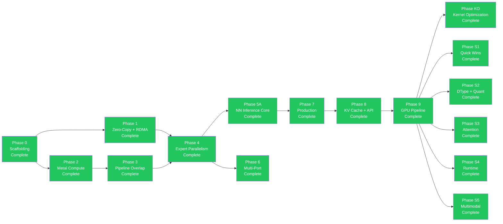

# Implementation Roadmap — Phases 0-9B + S1-S5 + Audit Remediation + Phase 3 + Phase 4 + Phase 5 Complete + Phase KO + Phase 8c + Phase 9 + Phase 10 + Phase 11 + Phase A + Phase B + Phase C + Phase D + Phase F + Phase G + Phase H + Phase I + Phase J

The rmlx project implementation roadmap. All phases through 9B-opt and serving support phases S1-S5 are complete. A full-crate audit (Phases 0, 1, 2) has been completed with 76 remediation items resolved across all 6 crates. Phase 3 adds FlashAttention-2 Metal kernel, paged KV cache, continuous batching scheduler, centralized CB commit, f16/bf16 RDMA collectives, ring allreduce chunk rounding fix, MoePolicy thread safety, and CLI signal forwarding. Phase 4 adds performance and allocator improvements: atomic CAS allocation limits, pointer ownership validation, SmallBufferPool/LeakDetector/ResidencyManager wiring, ChipTuning per-generation GPU tuning, DiskPipelineCache with sha2 hashing, HazardTrackingModeUntracked, fused RMSNorm+residual add kernel, gather_mm batched MoE strategy, SlabRing condvar backpressure, ProgressEngine EP dispatch wiring, ICB sparse expert dispatch, and BFC-style allocator. Phase 5 (Feature Breadth) adds 5 new core ops (slice, sort, scan, argreduce, random), 11 new activations (16 total), full MLA and SlidingWindowAttention forward implementations, AWQ/GPTQ/K-quant quantization layers, prefix cache, chunked prefill, 4 full model architectures (LlamaModel, Qwen2Model, DeepSeekV3Model, MixtralModel), tree allreduce with auto selection, pipelined ring buffer, and topology-aware CLI backend selection. Current test count: 1,142+. Phase 8c adds CachedDecode with pre-resolved PSOs and pre-allocated scratch buffers, 2-encoder decode path, `_preresolved_into_encoder` pattern, and GEMV BM8 optimizations (barrier removal + widened f32 loads), achieving 714 us/layer at 60L depth (f16, 6x lower variance). Phase 10 (Kernel Fusion) adds fused_rms_gemv and fused_swiglu_down kernels, reducing the decode pipeline from 9 to 7 dispatches, achieving 703.4 us/layer. Phase 11 (GEMV Kernel Optimization Experiments) concluded that all kernel-level optimization attempts failed (col-major +84%, interleaved +2.2%, SRAM+f16+funcconst +3.6%); row-major BM8 GEMV with f32 accumulation at 705 us/layer is the practical floor for f16 decode on Apple Silicon (73.6% bandwidth efficiency). Phase A (Prefill Optimization) adds single-CB prefill pipeline (54 sync points to 1), GQA slab SDPA (32 per-head dispatches to 1), GEMM threadgroup swizzle, new ops matmul_into_cb and silu_into_cb, achieving 3.5-7.3x speedup over baseline with MLX parity within 1.2-3.4x. Current test count: 1,298. Phase B (GEMM Config Sweep) systematically tests 27 kernel variants across 3 sweeps, confirming bk32_2x4 (BM=64, BN=64, BK=32, SG=2x4, 256 threads) as optimal — 21.54T TFLOPS vs MLX 23.97T (-10.1% gap). Phase C (GEMM Kernel-Level Optimization) applies wide_load and SG=2x4 layout to production kernels, reaching 21.21T (-11.5% gap). Phase D2 (MLX-Architecture Kernel) achieves **23.82T TFLOPS** (MLX gap: -0.6%) via BK=16, 2 SG, 64 threads, single buffer, 4xhalf4 wide loads, direct store, serpentine MMA. Phase F (Infrastructure Optimization) adds dispatch overhead benchmark (176us/CB, 12.4%), DiskPipelineCache wiring, and GatherMM MMA upgrade (4-12x for MoE). Phase G (Quantized Kernel Optimization) upgrades QMM to MMA (Q4/Q8), QMV to qdot pattern, and removes CPU fallback. Phase H-2 (GEMM+Residual Epilogue Fusion) achieves 5-12% improvement for large N via function constant 202. Phase I-1 (Distributed TP) adds DistributedTransformerModel with forward_with_group and shard_for_tp, achieving 1.94x estimated speedup at TP=2. Phase J (Quantized Parity + Infrastructure) closes QMM gap from 4.78x to 2.55x (+73%), QMV gap to 1.15x (+37%), removes 32 ExecGraph inter-layer stalls, adds FusionCompiler (lazy.rs -> FusionAnalyzer -> codegen -> Metal JIT), RMSNorm+GEMM fusion (function constant 203, -40.5%), Split-K QMM, MoE fused kernels, and forward_auto() for eager+lazy hybrid dispatch.

---

## 📋 Overview

| Phase | Name | Key Content | Prerequisites | Status |
|:-----:|------|------------|:------------:|:------:|
| 0 | Scaffolding | Workspace, metal-rs wrappers, CI | -- | Complete |
| 1 | Zero-Copy + RDMA | ZeroCopyBuffer, DualRegPool, ibverbs FFI, blocking_exchange | Phase 0 | Complete |
| 1-hotfix | IbvSendWr FFI Layout Fix | FFI layout fix | Phase 1 | Complete |
| 2A | Metal Compute Foundation | Shader vendoring, DType/Array, KernelRegistry | Phase 0 | Complete |
| 2A | Metal Compute Kernels | 7 GPU kernels + integration tests | Phase 2A foundation | Complete |
| 2B | Steel GEMM + Quantization | Steel GEMM, quantized matmul, indexing | Phase 2A | Complete |
| 3 | Pipeline Overlap | MTLSharedEvent, dual-queue pipeline | Phase 2 | Complete |
| 4 | Expert Parallelism | EP dispatch/combine, 3-zone auto backend, sparse dispatch | Phase 1 + 3 | Complete |
| 5A | NN Inference Core | LLaMA, Qwen, DeepSeek, Mixtral | Phase 4 | Complete |
| 6 | Multi-Port | Dual TB5 multi-port striping, multi-node topology | Phase 4 | Complete |
| 7A | Production Hardening | Hardening, observability | Phase 5A | Complete |
| 7B | VJP Autodiff | VJP autodiff + LoRA fine-tuning | Phase 7A | Complete |
| 8 | KV Cache + API Surface | KV cache, parallel linear, API ergonomics | Phase 7B | Complete |
| 9A | GPU Pipeline — ExecGraph | CommandBatcher, ExecGraph, ICB, `_into_cb()` pattern | Phase 8 | Complete |
| 9B-opt | GPU Pipeline — Optimization | Weight pre-caching, contiguous transpose, 17.4x speedup | Phase 9A | Complete |
| S1 | Serving Quick Wins | GELU, RotatingKV, BatchKV | Phase 9 | Complete |
| S2 | DType + Quantization | FP8, GGUF, AWQ/GPTQ | Phase 9 | Complete |
| S3 | Attention Upgrade | Flash Attention 2, QuantizedKV | Phase 9 | Complete |
| S4 | Runtime Flexibility | Array-level collectives, Dynamic shapes | Phase 9 | Complete |
| S5 | Multimodal Extension | Conv1d/Conv2d | Phase 9 | Complete |
| Audit | Full-Crate Audit Remediation | 76 items across 6 crates (Phase 0+1+2) | S5 | Complete |
| EP-1 | GPU-Native Top-K Routing | Fused routing kernel, GPU-resident expert indices/weights/counts/offsets | Audit | Complete |
| EP-2 | Grouped Expert GEMM + Weight Stacking | ExpertGroup, stacked expert weights, batched GatherMM f16/bf16 | EP-1 | Complete |
| EP-3 | Variable-Length v3 Protocol | Packed PacketMeta, count/payload two-phase exchange, 16B packet align | EP-1 | Complete |
| EP-4 | Compute-Communication Overlap (TBO + SBO) | MoePipeline, GpuEvent chains, zero CPU waits in-flight | EP-2 + EP-3 | Complete |
| EP-5 | FP8 Wire Format | Per-token E4M3 quantization, fused dequant-scatter, _into_cb exchange path | EP-3 | Complete |
| EP-6 | ICB Sparse Expert Launch + RDMA Slab Ring | Sparse ICB execution + pre-registered slab ring zero-copy transfer | EP-4 + EP-5 | Complete |
| P3-1 | FlashAttention-2 Metal Kernel | Tiled online softmax, f32 head_dim=128, causal mask, naive SDPA fallback | EP-6 | Complete |
| P3-2 | Paged KV Cache + Block Manager | vLLM-style block allocation, copy-on-write, Metal buffer pool | P3-1 | Complete |
| P3-3 | Continuous Batching Scheduler | Request queue, memory-aware batch scheduling, prefill/decode phases | P3-2 | Complete |
| P3-4 | Centralized CB Commit (`commit_with_mode`) | All rmlx-core ops routed through `commit_with_mode()`, sync/async modes, `CommandBufferHandle` | P3-1 | Complete |
| P3-5 | f16/bf16 RDMA Collectives | `ReduceElement` trait, `CollectiveDType` enum, typed allreduce/broadcast/allgather | EP-6 | Complete |
| P3-6 | Ring Allreduce Chunk Rounding | Element-aligned chunks, f16/bf16 reduction via `half` crate, NaN preservation | P3-5 | Complete |
| P3-7 | MoePolicy Thread Safety | Interior mutability via RwLock, `&self` methods, Send+Sync | EP-6 | Complete |
| P3-8 | CLI Signal Forwarding | ctrlc handler, process cleanup in rmlx-cli launch.rs | EP-6 | Complete |
| P4-1+2 | Atomic CAS Limits + Pointer Tracking | CAS reservation loop, HashSet+Mutex ownership, saturating_sub dealloc | P3 | Complete |
| P4-3 | SmallBufferPool + LeakDetector + ResidencyManager Wiring | SmallBufferPool for ≤256B, LeakDetector alloc/free tracking, Metal 3 ResidencyManager | P4-1+2 | Complete |
| P4-4 | ChipTuning | Per-generation GPU tuning (M1/M2/M3/M4) in GpuDevice | P3 | Complete |
| P4-5 | DiskPipelineCache | sha2-hashed pipeline binary archive at ~/.cache/rmlx/pipelines/ | P4-4 | Complete |
| P4-6 | HazardTrackingModeUntracked | Bit 0x10 for manual hazard tracking in buffer creation | P4-4 | Complete |
| P4-7 | Fused RMSNorm+Residual Add | JIT Metal kernel combining input+residual add and RMSNorm | P3-4 | Complete |
| P4-8 | gather_mm Batched MoE | gather_mm batched strategy replacing per-expert loop in MoE forward | P4-7 | Complete |
| P4-9 | SlabRing Condvar Backpressure | acquire_for_write blocks when full, ring_full_count metric | EP-6 | Complete |
| P4-10 | ProgressEngine EP Dispatch | ProgressEngine wiring with consecutive-error threshold | P4-9 | Complete |
| P4-11 | ICB Sparse Expert Dispatch | grouped_forward_icb(), IcbReplay per-sparsity cache, forward_sparse_icb() | P4-8 + P4-10 | Complete |
| P4-12 | BFC Allocator | BfcAllocator with block splitting, coalescing, best-fit BTreeMap | P4-1+2 | Complete |
| Phase 5 | Feature Breadth | 5 new core ops (slice/sort/scan/argreduce/random), 16 activations, full MLA+SlidingWindow forward, AWQ/GPTQ/K-quant, prefix cache, chunked prefill, 4 model architectures, tree allreduce, pipelined ring buffer, topology-aware CLI | P4 | Complete |
| KO | Kernel Optimization | 9-dispatch decode, per-kernel efficiency, 64x speedup, 6.34x faster than MLX | Phase 6 (Infra) | Track 1 mostly complete, Track 2 partial |
| 8c | Serial Decode Opts B-E | CachedDecode (pre-resolved PSOs + scratch buffers), 2-encoder decode, _preresolved pattern, GEMV BM8 barrier removal + f32 4×float4 loads | KO | Complete |
| 9 | f16 Default + Framework Optimization | f16 default dtype, single-encoder decode, direct KV append, pre-cached threadgroup sizes | 8c | Complete |
| 10 | Kernel Fusion | fused_rms_gemv (Fusion A), fused_swiglu_down (Fusion B), 9→7 dispatch pipeline, auto fallback — **703.4 us/layer** | 9 | Complete |
| 11 | GEMV Kernel Optimization Experiments | Col-major GEMV (+84%), interleaved GEMV (+2.2%), SRAM prefetch + f16 acc + function constants (+3.6%) — all failed; 705 us/layer practical floor confirmed | 10 | Complete (concluded) |
| A | Prefill Optimization | Single-CB pipeline (54→1 sync), GQA slab SDPA (32→1), GEMM swizzle, matmul_into_cb, silu_into_cb | 11 | Complete |
| B | GEMM Config Sweep | bk32_2x4 optimal config, 27 kernel variants, 21.54T TFLOPS (MLX -10.1%) | A | Complete |
| C | GEMM Kernel-Level Optimization | wide_load + SG=2x4 production, 21.21T TFLOPS (MLX -11.5%) | B | Complete |
| D | GEMM Kernel Architecture | D2: MLX-arch kernel — **23.82T** (MLX -0.6%), D3: function constants, D5: bf16 barrier fix | C | D2 Complete |
| F-1 | Dispatch Overhead Bench | 176us/CB, 12.4% of layer time | D | Complete |
| F-2 | DiskPipelineCache | SHA-256 disk pipeline cache wired into KernelRegistry | D | Complete |
| F-3 | Grouped GEMM MMA | GatherMM scalar→simdgroup MMA, 4-12x MoE improvement | D | Complete |
| G-1 | QMM MMA Q4 | Q4 quantized matmul simdgroup MMA (BM=32, BN=32, BK=32) | F | Complete |
| G-2 | QMV qdot Q4/Q8 | MLX qdot pattern (mask multiply + uchar4 vectorized loads) | F | Complete |
| G-3 | Q8 QMM MMA + CPU Fallback Removal | Q8 simdgroup MMA, CPU fallback path fully removed | G-1 | Complete |
| H-2 | GEMM+Residual Epilogue Fusion | Function constant 202 (has_residual), 5-12% for large N | G | Complete |
| I-1 | Distributed TP | DistributedTransformerModel, forward_with_group, shard_for_tp, TP=2 1.94x | H | Complete |
| J | Quantized Parity + Infra | QMM +73%, QMV +37% (MLX 1.15x), ExecGraph stall removal, lazy.rs FusionCompiler, RMSNorm+GEMM fusion, Split-K, MoE fuse, forward_auto() | I | Complete (J-3c/J-8 pending) |
| DQ | Dual-Queue MoE Overlap Research | Metal 2-queue Attn∥MoE concurrent dispatch, benchmark validation | J | 🔬 Research Complete |
| KO-2 | Decode Scratch Allocator | Pre-allocated workspace, bump alloc, StorageModePrivate | KO | Planned |
| KO-3 | ICB Decode Replay | Record/replay 9-dispatch via Metal ICB, dynamic setBytes | KO + KO-2 | Planned |
| A | Prefill Optimization | Single-CB pipeline (54 sync→1), GQA slab SDPA (32→1), GEMM swizzle, matmul_into_cb, silu_into_cb | 10 | Complete |
| B | GEMM Config Sweep | bk32_2x4 optimal config, 27 kernel variants, 21.54T TFLOPS (-10.1% vs MLX) | A | Complete |
| EP-7 | ICB Full Metal Indirect Dispatch | Wire SparseExpertPlan into ExpertGroup GEMM encoding via Metal ICB indirect dispatch; skip empty experts at GPU command level | EP-6 | Planned |

---

## 📜 Phase Completion History

| Phase | Commit | Tests | Status |
|-------|--------|-------|--------|
| Phase 0: Scaffolding + Metal GPU abstraction | 7071c73 | baseline | Complete |
| Phase 1: Zero-copy memory + RDMA ibverbs | d541bb3 | + alloc/rdma tests | Complete |
| Phase 1-hotfix: IbvSendWr FFI layout fix | 9cca9a9 | 23 tests | Complete |
| Phase 2A-1~4: Shader vendoring, DType/Array, KernelRegistry | 3179bde | foundation | Complete |
| Phase 2A-5~9: 7 GPU kernels + integration tests | 5ef6a07 | 40 tests | Complete |
| Phase 2B: Steel GEMM, quantized matmul, indexing | e4d9c14 | 43 tests | Complete |
| Phase 3: SharedEvent sync + dual queue + layer pipeline | f9cadcf | 52 tests | Complete |
| Phase 4: EP 3-Zone dispatch + MoE exchange | 6fb3296 | 62 tests | Complete |
| Phase 5A: rmlx-nn inference core (LLaMA, Qwen, DeepSeek, Mixtral) | d126aaf | + nn tests | Complete |
| Phase 6: Dual TB5 multi-port striping + multi-node topology | 8c8b25f | + distributed tests | Complete |
| Phase 7A: Production hardening / observability | 0fa70bb | 98 tests | Complete |
| Phase 7B: VJP autodiff + LoRA fine-tuning | 025ed8f | 108 tests | Complete |
| Phase 8: KV Cache + API Surface | squash merge | 339 tests | Complete |
| Phase 9A: GPU Pipeline — ExecGraph | Phase 9 merge commit | 339+ tests | Complete |
| Phase 9B-opt: GPU Pipeline — Optimization | optimization merge | 339+ tests | Complete |
| Phase S1: GELU + KV Cache variants | -- | 390 tests | Complete |
| Phase S2: FP8/GGUF/AWQ/GPTQ | -- | 390 tests | Complete |
| Phase S3: Flash Attention 2 + QuantizedKV | -- | 390 tests | Complete |
| Phase S4: Collective ops + Dynamic shapes | -- | 390 tests | Complete |
| Phase S5: Conv1d/Conv2d | -- | 390 tests | Complete |
| Audit Phase 0: MoE dispatch/combine (D1-D4) + alloc/Metal/GEMM (A1-A3, M1-M4, C1) | `07fad80`, `27f59af` | 460+ tests | Complete |
| Audit Phase 1: NN MoE GPU routing + MoE policy + RDMA fixes + Metal/alloc perf | `6ee6e6c`, `014875e`, `d9c54c7` | 490+ tests | Complete |
| Audit Phase 2: Core ops + NN layers + final codex review | `ea94e94`, `1c48b30`, `f9a3b0c` | 534 tests (at phase completion) | Complete |
| EP-1: GPU-Native Top-K Routing (`topk_route.rs`) | main (merged) | 543+ tests | Complete |
| EP-2: Grouped Expert GEMM + Weight Stacking (`expert_group.rs`, `gather_mm.rs`) | main (merged) | 543+ tests | Complete |
| EP-3: Variable-Length v3 Protocol (`v3_protocol.rs`) | main (merged) | 543+ tests | Complete |
| EP-4: Compute-Communication Overlap (TBO + SBO) (`moe_pipeline.rs`) | main (merged) | 543+ tests | Complete |
| EP-5: FP8 Wire Format (`fp8.rs`, `fp8_exchange.rs`) | main (merged) | 543+ tests | Complete |
| EP-6: ICB Sparse Expert Launch + RDMA Slab Ring (`icb_sparse.rs`, `slab_ring.rs`) | main (merged) | 543+ tests | Complete |
| Production Readiness Phase 0: Initial hardening pass | main | 543+ tests | Complete |
| Production Readiness Phase 1: Metal/alloc safety | main | 543+ tests | Complete |
| Production Readiness Phase 2: Distributed correctness | main | 543+ tests | Complete |
| P3-1: FlashAttention-2 Metal Kernel | main (merged) | 543+ tests | Complete |
| P3-2: Paged KV Cache + Block Manager | main (merged) | 543+ tests | Complete |
| P3-3: Continuous Batching Scheduler | main (merged) | 543+ tests | Complete |
| P3-4: Centralized CB Commit (`commit_with_mode`) | main (merged) | 543+ tests | Complete |
| P3-5: f16/bf16 RDMA Collectives | main (merged) | 543+ tests | Complete |
| P3-6: Ring Allreduce Chunk Rounding | main (merged) | 543+ tests | Complete |
| P3-7: MoePolicy Thread Safety | main (merged) | 543+ tests | Complete |
| P3-8: CLI Signal Forwarding | main (merged) | 543+ tests | Complete |
| P4-1+2: Atomic CAS Limits + Pointer Tracking | feat/phase4 (merged) | 1,003 tests | Complete |
| P4-3: SmallBufferPool + LeakDetector + ResidencyManager Wiring | feat/phase4 (merged) | 1,003 tests | Complete |
| P4-4: ChipTuning | feat/phase4 (merged) | 1,003 tests | Complete |
| P4-5: DiskPipelineCache | feat/phase4 (merged) | 1,003 tests | Complete |
| P4-6: HazardTrackingModeUntracked | feat/phase4 (merged) | 1,003 tests | Complete |
| P4-7: Fused RMSNorm+Residual Add | feat/phase4 (merged) | 1,003 tests | Complete |
| P4-8: gather_mm Batched MoE | feat/phase4 (merged) | 1,003 tests | Complete |
| P4-9: SlabRing Condvar Backpressure | feat/phase4 (merged) | 1,003 tests | Complete |
| P4-10: ProgressEngine EP Dispatch | feat/phase4 (merged) | 1,003 tests | Complete |
| P4-11: ICB Sparse Expert Dispatch | feat/phase4 (merged) | 1,003 tests | Complete |
| P4-12: BFC Allocator | feat/phase4 (merged) | 1,003 tests | Complete |
| Phase 5: Feature Breadth | feat/phase5-feature-breadth (merged) | 1,142 tests | Complete |
| Phase KO: Kernel Optimization (Track 1) | main | 1,142+ tests | In Progress |
| Phase 8c: Serial Decode Optimizations B-E | phase8c/serial-decode-opts-bce | 1,298 tests | Complete |
| Phase 9: f16 Default + Framework Optimization | main | 1,298 tests | Complete |
| Phase 10: Kernel Fusion | phase10/kernel-fusion | 1,151 tests | Complete |
| Phase 11: GEMV Kernel Optimization Experiments | main | 1,151 tests | Complete (concluded — no improvement) |
| Phase A: Prefill Optimization | main | 1,298 tests | Complete |
| Phase B: GEMM Config Sweep | gemm-sweep | 1,298 tests | Complete |
| Phase C: GEMM Kernel-Level Optimization (21.21T, -11.5% vs MLX) | main | 1,298 tests | Complete |
| Phase D2: MLX-Architecture Kernel (23.82T, -0.6% vs MLX) | gemm-kernel-d2 | 1,298+ tests | Complete |
| Phase F-1: Dispatch Overhead Bench (176us/CB, 12.4%) | main (PR #65) | 1,298+ tests | Complete |
| Phase F-2: DiskPipelineCache Wiring | main (PR #65) | 1,298+ tests | Complete |
| Phase F-3: GatherMM MMA (4-12x MoE) | main (PR #65) | 1,298+ tests | Complete |
| Phase G-1: QMM MMA Q4 | main (PR #66) | 1,298+ tests | Complete |
| Phase G-2: QMV qdot Q4/Q8 | main (PR #66) | 1,298+ tests | Complete |
| Phase G-3: Q8 QMM MMA + CPU Fallback Removal | main (PR #66) | 1,298+ tests | Complete |
| Phase H-2: GEMM+Residual Epilogue Fusion | main (PR #67) | 1,298+ tests | Complete |
| Phase I-1: Distributed TP (DistributedTransformerModel) | main (PR #68) | 1,298+ tests | Complete |
| Phase J-1: QMM MMA 4SG/128-thread (+73% TFLOPS) | main | 1,298+ tests | Complete |
| Phase J-2: QMV qdot load_vector + multi-row TG (+37%) | main | 1,298+ tests | Complete |
| Phase J-3: ExecGraph inter-layer stall removal (32→0) | main | 1,298+ tests | Complete |
| Phase J-4: lazy.rs FusionCompiler + eval_fused | main | 1,298+ tests | Complete |
| Phase J-4e: forward_auto() in TransformerModel | main | 1,298+ tests | Complete |
| Phase J-5: RMSNorm+GEMM fusion (function constant 203) | main | 1,298+ tests | Complete |
| Phase J-6: Split-K QMM (+20% at M=128) | main | 1,298+ tests | Complete |
| Phase J-7: Distributed bench RDMA 2-node | main | 1,298+ tests | Complete |
| Phase J-8: MoE fused kernels | -- | -- | In Review |
| Phase KO-2: Decode Scratch Allocator | -- | -- | Planned |
| Phase KO-3: ICB Decode Replay | -- | -- | Planned |
| EP-7: ICB Full Metal Indirect Dispatch | -- | -- | Planned |

---

## 🔀 Phase Dependency Diagram



---

## 🏗️ Phase 0: Scaffolding — Complete (`7071c73`)

### Goal

Establish the Cargo workspace structure, validate metal-rs basic operations, and set up CI.

### Key Deliverables

- Cargo workspace initialization (6 crate skeletons)
- `rmlx-metal`: MTLDevice creation, basic command buffer/encoder wrappers
- `rmlx-metal`: Simple Metal compute kernel execution (vector add)
- Build system: `.metal` -> `.metallib` AOT compilation pipeline in `build.rs`
- CI: GitHub Actions (macOS runner, `cargo test`, `cargo clippy`)

### Definition of Done (DoD)

- [x] `cargo build --workspace` succeeds (0 errors)
- [x] `cargo fmt --all --check` -- diff 0
- [x] `cargo clippy --workspace -- -D warnings` -- 0 warnings
- [x] `cargo test --workspace` -- `test_basic_metal_compute` PASS
- [x] `build.rs` `.metal` -> `.metallib` AOT compilation succeeds
- [x] Codex review: SAFETY comments present on unsafe blocks

---

## 🔗 Phase 1: Zero-Copy + RDMA — Complete (`d541bb3`, hotfix `9cca9a9`)

### Goal

Convert PoC Phase 1-4 validation results into production-quality code. Implement zero-copy transfers by registering GPU buffers directly with RDMA.

### Key Deliverables

- `rmlx-alloc`: ZeroCopyBuffer (`posix_memalign` + NoCopy)
- `rmlx-alloc`: DualRegPool (Metal + `ibv_mr` dual-registered pool)
- `rmlx-alloc`: MetalAllocator (heap + cache, MLX compatible)
- `rmlx-rdma`: ibverbs FFI bindings (`bindgen`)
- `rmlx-rdma`: IbContext, PD, CQ, UC QP wrappers
- `rmlx-rdma`: `ibv_reg_mr` wrapper + dual registration tests
- `rmlx-rdma`: `blocking_exchange` (2-phase count -> payload)
- `rmlx-rdma`: ConnectionManager (`hosts.json` parsing, warmup)
- Integration test: 2-node zero-copy RDMA round-trip

### Definition of Done (DoD)

- [x] `cargo fmt --all --check` -- diff 0
- [x] `cargo clippy --workspace -- -D warnings` -- 0 warnings
- [x] `test_zero_copy_buffer_lifecycle` -- InFlightToken drop-then-free verified
- [x] `test_dual_registration` -- Metal + ibv_mr same-address verified
- [x] `test_rdma_exchange_2node` -- 4MB round-trip, 0 mismatch
- [x] `test_rdma_startup_probe` -- GID/MR/QP runtime discovery succeeds
- [x] `test_recv_before_send_invariant` -- Error returned when recv not posted
- [x] Benchmark: RDMA bandwidth > 6 GB/s (single port)
- [x] Codex review: FFI boundary safety, lifetime verification

---

## ⚡ Phase 2: Metal Compute — Complete (2A: `3179bde`, `5ef6a07` / 2B: `e4d9c14`)

### Goal

Build the core Metal kernel execution pipeline needed for efficient GPU computation. Reuse MLX's Metal shaders to dispatch 10 kernel types from Rust.

### Key Deliverables

- `rmlx-core`: Array type (N-dim, dtype, ownership management)
- `rmlx-core`: dtype system (f32, f16, bf16, q4_0, q4_1, q8_0)
- MLX `.metal` kernel porting (Rust dispatch wrappers):
  - matmul (GEMM/GEMV)
  - quantized matmul (QMM 4bit/8bit)
  - softmax
  - RMS normalization
  - RoPE (rotary position embedding)
  - Element-wise binary ops (add, mul, etc.)
  - reduce (sum, max, argmax)
  - copy / transpose
  - indexing (gather, scatter)
- `rmlx-core`: KernelRegistry (AOT + JIT)
- `rmlx-core`: Per-stream CommandEncoder management
- Benchmarks: Per-kernel performance comparison vs. MLX

### Definition of Done (DoD)

- [x] `cargo fmt --all --check` -- diff 0
- [x] `cargo clippy --workspace -- -D warnings` -- 0 warnings
- [x] 10 kernels each within +/-5% of MLX performance
- [x] `test_matmul_correctness` -- fp16/bf16 accuracy (ulp < 2)
- [x] `test_quantized_matmul` -- q4/q8 accuracy
- [x] `test_dispatch_geometry` -- threadgroup vs. thread size verified
- [x] Codex review: kernel binding index consistency verified

---

## 🔄 Phase 3: Pipeline Overlap — Complete (`f9cadcf`)

### Goal

Implement MTLSharedEvent-based GPU synchronization and dual queue pipeline to overlap compute and RDMA transfers.

### Key Deliverables

- `rmlx-metal`: GpuEvent (MTLSharedEvent wrapper)
- `rmlx-metal`: FenceImpl (fast fence + SharedEvent fallback)
- `rmlx-metal`: StreamManager (dual queue management)
- `rmlx-distributed`: LayerPipeline (compute <-> RDMA overlap)
- GPU -> CPU sync: event spin-wait (263.9 us target)
- GPU -> GPU sync: encodeSignal/WaitForEvent cross-queue

Pipeline overlap effect:

```
Non-pipelined: 60 x (20ms + 7ms) = 1,620ms
Pipelined:     60 x 20ms + 7ms   = 1,207ms  (25% improvement)
```

### Definition of Done (DoD)

- [x] `cargo fmt --all --check` -- diff 0
- [x] `cargo clippy --workspace -- -D warnings` -- 0 warnings
- [x] `test_shared_event_latency` -- spin-wait < 280 us
- [x] `test_dual_queue_overlap` -- concurrent execution of both queues confirmed
- [x] `test_layer_pipeline_correctness` -- pipeline result == serial result
- [x] `test_event_deadline_cancel` -- timeout/cancel behavior confirmed
- [x] Benchmark: sync latency histogram (p50/p95/p99)
- [x] Codex review: synchronization protocol correctness

---

## 🧠 Phase 4: Expert Parallelism — Complete (`6fb3296`)

### Goal

Reimplement MLX EP optimizations in RMLX, achieving additional performance gains through zero-copy. Achieve 2-node Mixtral decode step < 35ms.

### Key Deliverables

- `rmlx-distributed`: Group abstraction (rank, world_size, EP topology)
- `rmlx-distributed`: AllToAll primitive
- `rmlx-distributed/moe`: MoeDispatchExchange
  - CPU backend (N <= 64)
  - Metal backend (N >= 320, 7 kernels)
  - Byte threshold for intermediate range
- `rmlx-distributed/moe`: MoeCombineExchange
  - Single-source weighted sum
  - Dual-source weighted sum (local + remote, zero-copy)
- `rmlx-distributed/moe`: MoePolicy (3-zone auto + cooldown)
- 7 MoE Metal kernels JIT-compiled

### Definition of Done (DoD)

- [x] `cargo fmt --all --check` -- diff 0
- [x] `cargo clippy --workspace -- -D warnings` -- 0 warnings
- [x] `test_1rank_vs_2rank_parity` -- single-node result == 2-node EP result
- [x] `test_3zone_policy` -- correct backend selection for N=1/64/256/1024
- [x] `test_sparse_dispatch_correctness` -- matmul scatter == dense result
- [x] `test_interleaved_exchange_stress` -- 1000 consecutive exchanges with 0 errors
- [x] `test_capacity_overflow_detection` -- overflow_count metric accuracy
- [x] Benchmark: 2-node decode step < 35ms
- [x] Codex review: exchange protocol, metric collection accuracy

---

## 🏛️ Phase 5A: NN Inference Core — Complete (`d126aaf`)

### Goal

Implement core neural network modules in the rmlx-nn crate.

### Key Deliverables

**rmlx framework** (`~/rmlx/`):
- `rmlx-nn`: Transformer block (Linear, Attention, FFN, MoE)
- `rmlx-nn`: Model architectures (LLaMA, Qwen, DeepSeek-V3, Mixtral)

### Definition of Done (DoD)

- [x] `cargo fmt --all --check` -- diff 0
- [x] `cargo clippy --workspace -- -D warnings` -- 0 warnings
- [x] Model architecture accuracy verification
- [x] Codex review: nn module safety

---

## 🌐 Phase 6: Multi-Port — Complete (`8c8b25f`)

### Goal

Expand bandwidth by utilizing multiple TB5 ports and support 3+ nodes. Achieve ~1.8x bandwidth over single port with dual port striping.

### Key Deliverables

- `rmlx-rdma/multi_port`: Dual TB5 port striping
- `rmlx-rdma/multi_port`: Automatic striping based on transfer size (N >= 8 threshold)
- Multi-node topology manager (ring, mesh, hybrid)
- 3+ node EP support (all-to-all with > 2 ranks)

### Definition of Done (DoD)

- [x] `cargo fmt --all --check` -- diff 0
- [x] `cargo clippy --workspace -- -D warnings` -- 0 warnings
- [x] `test_dual_port_striping` -- 2-port concurrent transfer, data integrity
- [x] `test_single_port_fallback` -- graceful fallback on 1-port failure
- [x] Benchmark: dual-port bandwidth > 12 GB/s
- [x] Codex review: port independence, error isolation

---

## 🛡️ Phase 7A: Production Hardening / Observability — Complete (`0fa70bb`)

### Goal

Ensure production stability and observability.

### Key Deliverables

- Structured logging (`tracing` crate)
- Metrics collection (Prometheus compatible)
- Graceful shutdown + error recovery
- GID table corruption detection and automatic alerts
- Memory leak detection (allocation statistics-based)

### Definition of Done (DoD)

- [x] Structured logging applied across all crates
- [x] Prometheus /metrics endpoint operational
- [x] Graceful shutdown scenario tested

---

## 🎓 Phase 7B: VJP Autodiff + LoRA Fine-tuning — Complete (`025ed8f`)

### Goal

Build a VJP framework and LoRA fine-tuning foundation for training support.

### Key Deliverables

- VJP (Vector-Jacobian Product) framework
- Basic training loop (LoRA fine-tuning)

### Definition of Done (DoD)

- [x] VJP gradient accuracy for basic operations (matmul, softmax)
- [x] LoRA fine-tuning functional verification

---

## 📦 Phase 8: KV Cache + API Surface — Complete (squash merged to main)

### Goal

Add incremental decoding support via KV cache in rmlx-nn and improve API ergonomics across the framework.

### Key Deliverables

- `rmlx-nn`: `LayerKvCache` struct for incremental KV caching in attention
- `rmlx-nn`: Cache-aware `forward()` in Attention, TransformerBlock, TransformerModel
- `rmlx-nn`: Per-expert MoE routing metrics (`MoeForwardMetrics.expert_tokens`)
- `rmlx-nn`: Megatron-LM parallel linear layers (`parallel.rs`: ColumnParallelLinear, RowParallelLinear)
- `rmlx-distributed`: Per-expert histogram in `MoeMetrics`
- `rmlx-metal`: Top-level re-exports (`GpuDevice`, `GpuEvent`, `Architecture`)
- `rmlx-core`: `prelude` module (Array, DType, KernelError, KernelRegistry)
- `rmlx-nn`: Re-exports (`LayerKvCache`, `FeedForward`)

### Definition of Done (DoD)

- [x] `cargo fmt --all --check` -- diff 0
- [x] `cargo clippy --workspace -- -D warnings` -- 0 warnings
- [x] `cargo test --workspace` -- 339 tests passing, 0 failures
- [x] KV cache: decode step processes only the last token (O(n^2) → O(n))
- [x] Backward compatible: cache=None preserves existing behavior
- [x] Codex review: 0 Critical/High issues

---

## 🚀 Phase 9: GPU Pipeline — Complete

### Phase 9A: ExecGraph + CommandBatcher

#### Goal

Eliminate per-op CPU overhead by batching multiple GPU operations into minimal command buffers using ExecGraph.

#### Key Deliverables

- `rmlx-metal`: `CommandBatcher` — batches encoder work into shared command buffers
- `rmlx-metal`: `ExecGraph` — pre-built execution graph that replays deterministic op sequences
- `rmlx-metal`: `IcbBuilder`/`IcbReplay`/`IcbCache` — Indirect Command Buffer support
- `rmlx-core`: `_into_cb()` pattern for all 14 ops — encode into caller's command buffer
- `rmlx-nn`: `forward_graph()` for Attention, TransformerBlock, TransformerModel
- `rmlx-nn`: `forward_into_cb()` for Linear
- Benchmark: 65 CBs/layer → 5 CBs/layer (92.3% reduction)

### Phase 9B-opt: Weight Pre-caching + Optimization

#### Goal

Pre-cache contiguous transposed weight matrices to eliminate transpose overhead during inference.

#### Key Deliverables

- `rmlx-nn`: `prepare_weight_t()` / `weight_transposed_contiguous()` for Linear
- `rmlx-nn`: `prepare_weights_for_graph()` for TransformerModel/Block/Attention/FeedForward
- Benchmark: ~112ms → ~6.4ms per layer (17.4x speedup)
- Numerical parity: max_diff=6.4e-6

#### Definition of Done (DoD)

- [x] 17.4x speedup (~112ms → ~6.4ms)
- [x] 92.3% CB reduction (65 → 5)
- [x] Numerical parity (max_diff=6.4e-6)
- [x] All 339+ tests passing

---

## Phase KO: Kernel Optimization -- Track 1 Mostly Complete, Track 2 Partial

### Goal

Close the per-layer decode performance gap with MLX. Reduce decode latency from 109,215us (per-op sync baseline) to faster than MLX (multi-layer MLX reference: 4,525 us/L at 60L).

### Track 1: Dispatch Reduction (109,215us to 1,411us)

| Step | Technique | Latency (us) | Speedup |
|------|-----------|-------------|---------|
| Baseline | Per-op sync (65 CBs) | 109,215 | 1x |
| KO-1a | ExecGraph multi-CB batching (5 CBs) | 2,735 | 40x |
| KO-1b | Single-CB path (44 encoders) | 2,049 | 53x |
| KO-1c | 9-dispatch decode path (merged QKV/gate_up, batched RoPE/SDPA, fused gemv_bias) | 1,739 | 64x |
| KO-1d | Single encoder + memory barriers (9 enc to 4 enc) | 1,739 | 64x |
| MLX | Multi-layer compiled path (60L) | 4,525 us/L | -- |
| Result | | 6.34x faster than MLX at 60-layer depth | |

Additional optimizations in Track 1:
- KV cache reuse: pre-allocate slab layout once, reset seq_len per iteration
- StorageModePrivate for static weights (GPU-only, no CPU-side page table overhead)
- Array::uninit for GPU output buffers (skip memset zero-fill)
- Unretained command buffer on Metal 3+ (M2+) hardware

### Track 2: Per-Kernel Efficiency (Partial)

| Kernel | Optimization | Status |
|--------|-------------|--------|
| GEMV | BM=8 variant: 8 simdgroups handle 32 rows independently, auto-selected when M >= 256 | Complete |
| matmul | SIMD group MMA: TileVariant::Simd with simdgroup_float8x8 for large matrices | Complete |
| rms_norm | Register caching: N_READS=4 + cached[MAX_PER_THREAD] | Complete |
| layer_norm | Single-pass: E[x^2]-E[x]^2 formula + register caching (3 reads to 1) | Complete |
| softmax | N_READS coalescing: float4 vectorized loads in looped variant | Complete |
| Kernel fusion | Prefill-only; not beneficial for decode (cross-threadgroup reduction incompatible with row-parallel GEMV) | Deferred |

### Future Work

- **KO-2: Scratch Allocator** -- Arena-based scratch memory for intermediate buffers within the 9-dispatch path
- **KO-3: ICB Decode Replay** -- Metal Indirect Command Buffer capture-replay for the 9-dispatch decode path

### Benchmark Results (M3 Ultra, f16, Llama-2 7B shapes)

```text
Baseline (per-op sync):  109,215us  1x
ExecGraph (5 CB):          2,735us  40x
Single-CB (44 enc):        2,049us  53x
9-Dispatch (9->4 enc):     1,739us  64x
MLX compiled (60L):        4,525us/L  --
vs MLX:                    6.34x faster than MLX at 60-layer depth
```

---

## Phase 9: f16 Default + Framework Optimization -- Complete

### Goal

Establish f16 as the default inference dtype (the industry standard for LLM inference on Apple Silicon) and optimize the decode framework for minimum per-layer latency.

### Key Changes

- **f16 as default inference dtype**: f16 is the natural precision for LLM inference — 1.93x bandwidth reduction over f32 with negligible quality loss. All benchmarks and documentation reflect f16 as the standard dtype.
- **Single-encoder decode path**: Memory barriers replace encoder boundaries, reducing encoder transitions to 1
- **Direct KV append**: Zero-copy buffer refs replace Vec<Array> allocation for KV cache updates
- **Pre-cached threadgroup sizes**: CachedDecode stores dispatch geometries at init, eliminating per-token computation

### Results

| Metric | Before (Phase 8c, f32) | After (Phase 9, f16) |
|--------|----------------------:|---------------------:|
| CachedDecode latency (60L) | 1,367 us/L | **714 us/L** |
| Bandwidth per GEMV | 128B/element | 64B/element (1.93x reduction) |
| Encoder transitions | 2 | 1 |
| Per-token dynamic allocation | 0 (maintained) | 0 (maintained) |

### Future Work

- Kernel fusion (rms_norm+gemv, silu_mul+gemv)
- True Metal ICB capture-replay
- Argument Buffers for batch buffer binding

---

## Phase 10: Kernel Fusion -- Complete

### Goal

Reduce inter-kernel dispatch overhead by fusing adjacent operations in the decode pipeline, lowering the dispatch count from 9 to 7.

### Key Deliverables

- **Fusion A — `fused_rms_gemv`**: Single Metal kernel combining RMS normalization with the subsequent GEMV. Used for both pre-attention and pre-FFN norm+projection stages.
- **Fusion B — `fused_swiglu_down`**: Single Metal kernel combining SiLU activation, element-wise gate multiply, and down projection GEMV. Eliminates intermediate scratch buffer.
- **7-dispatch decode pipeline**: 9 dispatches reduced to 7 (22% fewer GPU dispatches)
- **Automatic fallback**: If fused PSOs fail to compile, CachedDecode falls back to the 9-dispatch path transparently

### Results

| Metric | Before (Phase 9) | After (Phase 10) |
|--------|------------------:|------------------:|
| Dispatches per layer | 9 | **7** |
| Actual latency (60L) | 714 us/L | **703.4 us/L** (M3 Ultra, f16, 60L) |
| Tests | 1,142 | **1,151** |

### Definition of Done (DoD)

- [x] fused_rms_gemv kernel compiles and passes correctness tests
- [x] fused_swiglu_down kernel compiles and passes correctness tests
- [x] 7-dispatch pipeline end-to-end decode test passes
- [x] Automatic fallback to 9-dispatch verified
- [x] 1,151 tests passing

---

## Phase 12: GEMM Optimization (seq_len=N) — Planned

### Goal

Optimize the GEMM (General Matrix Multiply) path for seq_len > 1 workloads — prefill, prompt processing, and speculative decode verification. Phase 11 concluded seq_len=1 (GEMV) optimization; this phase targets the compute-bound regime.

### Framework (rmlx-core / rmlx-nn) Deliverables

- **GEMM autotuning**: Systematic tile-size search (TM/TN/TK) per GPU generation and matrix dimensions. Offline profiling → lookup table at init.
- **Split-K parallel reduction**: Partition K dimension across threadgroups for better GPU utilization on small-M, large-K shapes (seq_len=4~64).
- **Small-batch GEMM (seq_len=3~8)**: Optimized path for speculative decode verification — neither GEMV nor full tiled GEMM. Candidate: persistent threadgroup with warp-level accumulation.
- **Fused GEMM+bias+activation**: Combine projection + bias + SiLU/GELU in a single kernel for FFN prefill.

### Serving Layer (rmlx-serve) Responsibility

- Chunked prefill scheduling (split long prompts into chunks for interleaving with decode)
- Prefill/decode phase management and priority arbitration

### Definition of Done (DoD)

- [ ] GEMM autotuning framework with per-GPU-generation presets
- [ ] Split-K GEMM kernel for small-M shapes
- [ ] Small-batch GEMM path (seq_len=3~8) benchmarked against baseline
- [ ] Prefill throughput (tokens/sec) measured and documented

---

## Phase 13: Paged Attention + Speculative Decode Kernels — Planned

### Goal

Provide GPU kernel primitives required by paged memory management and speculative decoding. These are **framework-level building blocks** that the serving layer orchestrates.

### Framework (rmlx-core / rmlx-nn) Deliverables

- **Paged SDPA kernel**: Attention kernel that reads KV via block page table (indirect indexing into non-contiguous KV blocks). Replaces contiguous-slab assumption in current SDPA decode kernel.
- **Variable-length KV cache append**: Append K tokens (K=1~8) to KV cache in a single dispatch, supporting both contiguous slab and paged layouts.
- **Tree attention kernel**: Causal mask from tree structure (for tree-based speculative decoding). Supports variable-depth draft trees.
- **Batch verify kernel**: Given K draft logits and K target logits, compute acceptance probabilities and rejection sampling in a single GPU dispatch.
- **Batch sampling kernel**: Top-k / top-p / temperature sampling across multiple positions simultaneously.

### Serving Layer (rmlx-serve) Responsibility

- Page block allocator (alloc/free/eviction policy, copy-on-write)
- Draft model selection and speculation depth policy
- Rejection sampling orchestration and token acceptance logic
- Request-level KV cache lifecycle management

### Definition of Done (DoD)

- [ ] Paged SDPA decode kernel with block table indirection
- [ ] Variable-length KV append (1~8 tokens per call)
- [ ] Tree attention with arbitrary tree mask
- [ ] Batch verify + rejection sampling kernel
- [ ] Correctness tests against non-paged / single-token baselines

---

## Phase 14: SDPA / Attention Optimization — Planned

### Goal

Improve attention kernel performance for diverse sequence lengths and model architectures.

### Framework (rmlx-core / rmlx-nn) Deliverables

- **Split-K SDPA for long sequences**: Partition KV sequence across threadgroups for S > 2048. Current single-threadgroup decode kernel saturates at ~4K tokens.
- **GQA-optimized decode kernel**: Specialized kernel for grouped-query attention (num_kv_heads << num_heads) — avoid redundant KV reads by broadcasting across Q head groups.
- **Sliding window attention kernel**: Efficient attention with fixed window size (e.g., Mistral's 4096-window). Skip KV entries outside window at block granularity.
- **MLA (Multi-head Latent Attention) kernel**: Optimized kernel for DeepSeek-style latent attention with compressed KV.

### Serving Layer (rmlx-serve) Responsibility

- Context length management and truncation policy
- Dynamic window size configuration per model

### Definition of Done (DoD)

- [ ] Split-K SDPA benchmarked at S=2048, 4096, 8192, 16384
- [ ] GQA kernel with measured KV bandwidth reduction
- [ ] Sliding window kernel with block-skip verification
- [ ] MLA kernel matching DeepSeek reference output

---

## Phase 15: Multi-Node RDMA Optimization — Planned

### Goal

Optimize the existing RDMA/TB5 infrastructure for production-grade distributed inference. TP (Tensor Parallelism) and EP (Expert Parallelism) end-to-end latency.

### Framework (rmlx-core / rmlx-distributed) Deliverables

- **Compute-communication overlap**: Pipeline GEMM computation with allreduce for TP — overlap current layer's allreduce with next layer's GEMM.
- **Fused allreduce + residual add**: Combine RDMA receive completion with residual connection in a single kernel, avoiding extra memory round-trip.
- **EP dispatch coalescing**: Batch multiple expert dispatches into fewer RDMA operations. Reduce per-expert overhead for sparse MoE.
- **Pipeline parallelism**: Layer-level pipeline across nodes for models that exceed single-node memory.
- **Multi-path striping**: Utilize dual TB5 links for 2x bandwidth (infrastructure exists in Phase 6, needs optimization).

### Serving Layer (rmlx-serve) Responsibility

- Node health monitoring and failover
- Load balancing across nodes
- Model placement strategy (which layers on which nodes)

### Definition of Done (DoD)

- [ ] TP allreduce overlapped with compute (measured overlap %)
- [ ] EP dispatch latency reduced vs Phase 4 baseline
- [ ] Pipeline parallelism with 2+ node verified
- [ ] Dual-TB5 bandwidth utilization measured

---

## Phase 16: Memory Efficiency — Planned

### Goal

Reduce GPU memory footprint to enable larger models and longer contexts on fixed hardware.

### Framework (rmlx-core / rmlx-nn) Deliverables

- **KV cache quantization**: Store KV cache in f8/int8 with per-head or per-block scales. Dequantize on-the-fly in SDPA kernel. 2-4x KV memory reduction.
- **Dynamic memory pool**: Replace fixed StorageModePrivate allocations with a BFC-style pool that grows/shrinks based on actual usage. Reduce peak memory waste.
- **Weight deduplication**: Shared layers (e.g., tied embeddings) reference same buffer. Eliminate redundant copies.
- **Activation checkpointing**: For prefill, trade compute for memory by recomputing activations instead of storing all intermediate results.

### Serving Layer (rmlx-serve) Responsibility

- Memory budget enforcement per request
- KV cache eviction policy (LRU, priority-based)
- OOM handling and graceful degradation

### Definition of Done (DoD)

- [ ] KV cache f8 quantization with SDPA integration
- [ ] Dynamic memory pool with measured peak reduction
- [ ] Weight dedup for tied embeddings
- [ ] Memory usage profiled across model sizes (7B, 13B, 70B)

---

## Phase S3a: Flash Attention 2 — Complete (previously Phase 10)

### Goal

Implement Flash Attention 2 with K/V outer loop for efficient attention computation.

### Key Deliverables

- Flash Attention 2 Metal kernel (K/V outer loop, Q inner loop)
- head_dim support up to 256 (previously 128)
- Decode fast path (T_q=1) with optimized single-query kernel
- Causal mask block-skipping optimization
- `is_causal` parameter for sdpa/sdpa_batched

### Definition of Done (DoD)

- [x] FA2 kernel with K/V outer loop structure
- [x] D up to 256 supported
- [x] Decode fast path for T_q=1
- [x] Causal mask optimization (skip blocks above diagonal)
- [x] Backward compatible API (is_causal=false default)
- [x] All 390+ tests passing

---

## Phase S2: Advanced Quantization — Complete (previously Phase 11)

### Goal

Expand quantization format support for broader model compatibility.

### Key Deliverables

- FP8 DType (Float8E4M3, Float8E5M2) with dequant/quant Metal kernels
- GGUF binary format parser (v2/v3) with GgmlType mapping
- AWQ INT4 unpacking (packed uint32 → f32 dequantization)
- GPTQ INT4 unpacking with g_idx (act_order) support

### Definition of Done (DoD)

- [x] FP8 dtypes added with all match arms updated
- [x] GGUF parser with 11 unit tests
- [x] AWQ/GPTQ dequant Metal kernels
- [x] All 390+ tests passing

---

## Phase S1: Serving Quick Wins — Complete

### Goal

Add activation functions and KV cache variants needed by rmlx-serve.

### Key Deliverables

- GELU activation (gelu_approx + gelu_fast) with f32/f16/bf16 Metal kernels
- RotatingKvCache: circular buffer with keep parameter for system prompt preservation
- BatchKvCache: per-sequence batched cache with filter/extend/reset

### Definition of Done (DoD)

- [x] GELU Metal kernels (6 variants)
- [x] RotatingKvCache with circular write and temporal order restoration
- [x] BatchKvCache with per-sequence offset tracking
- [x] All 390+ tests passing

---

## Phase S3b: QuantizedKVCache — Complete

### Goal

Reduce KV cache memory consumption via quantized storage.

### Key Deliverables

- QuantizedArray type (packed_uint32, scales, biases)
- QuantizedKvCache with per-layer per-head quantized storage
- CPU-side affine quantization helper

### Definition of Done (DoD)

- [x] Quantized KV cache with q4/q8 support
- [x] Memory savings: q4 = 4x reduction over f16
- [x] All 390+ tests passing

---

## Phase S4: Runtime Flexibility — Complete

### Goal

Add Array-level distributed primitives and dynamic shape support.

### Key Deliverables

- `allreduce_sum()` and `allgather_array()` on Group (Array-level wrappers)
- DynamicExecContext: max-size pre-allocation with variable actual-size dispatch

### Definition of Done (DoD)

- [x] Array-level collective ops on Group
- [x] DynamicExecContext with zero-copy view-based dispatch
- [x] All 390+ tests passing

---

## Phase S5: Multimodal Extension — Complete

### Goal

Add convolution primitives for multimodal model support.

### Key Deliverables

- Conv1d Metal kernels (f32/f16/bf16) with padding, stride, dilation, groups
- Conv2d Metal kernels (f32/f16/bf16) with 2D padding, stride, dilation, groups
- Conv1d/Conv2d nn layer wrappers in rmlx-nn

### Definition of Done (DoD)

- [x] Conv1d/Conv2d Metal kernels with full parameter support
- [x] Neural network layer wrappers (Conv1d, Conv2d)
- [x] All 390+ tests passing

---

## Full-Crate Audit Remediation (Phase 0+1+2) -- Complete

### Goal

Comprehensive audit of all 6 crates with codex-assisted review. Fix all correctness, performance, and feature completeness issues identified.

### Scope: 76 Items Across 6 Crates

| Crate | Items | Key Fixes |
|-------|-------|-----------|
| **rmlx-distributed** | D1-D10 | Dispatch loop ordering, per-rank capacity, combine caching, byte threshold (4KB->2MB), hysteresis, cooldown semantics, shared expert, EP integration |
| **rmlx-metal** | M1-M8 | Command pipeline safety, fence manager, library cache, MSL version detection, stream improvements, autorelease pool, capture manager, managed buffers |
| **rmlx-alloc** | A1-A12 | Cache bounds fix, alignment improvements, residency management, small allocation fast-path, pool improvements, GC limit API, alloc stats |
| **rmlx-core** | C1-C9 | Quantized GEMM fix, GatherMM, LayerNorm, unary ops, concat, select, SDPA bf16/backward, conv tiled, VJP GPU |
| **rmlx-nn** | N1-N8 | MoE GPU routing, batched execution, GPU matmul, QuantizedLinear, MLA, sliding window attention, GGUF loader, 14 activations, LayerNorm layer |
| **rmlx-rdma** | R1-R3 | Ring/allreduce/allgather collectives, connection manager, coordinator |

### Definition of Done (DoD)

- [x] `cargo fmt --all --check` -- diff 0
- [x] `cargo clippy --all-targets` -- 0 warnings
- [x] `cargo test --workspace` -- 534 tests passing at audit completion, 0 failures
- [x] All EP audit findings (D1-D7) resolved
- [x] Codex review: 0 Critical/High issues remaining

---

## EP Optimization Phases (EP-1 ~ EP-6) -- Complete

Post-audit EP optimization phases were merged into main to remove the remaining MoE bottlenecks and keep routing, exchange, and expert compute fully GPU-resident end-to-end.

| Phase | Key Files | Core Changes | Status |
|------|-----------|--------------|--------|
| EP-1 | `crates/rmlx-core/src/ops/topk_route.rs` | Fused `moe_topk_route_f32`: softmax -> top-k -> normalize -> histogram -> prefix-scan in one Metal pass; removes GPU->CPU->GPU routing round-trip | Complete |
| EP-2 | `crates/rmlx-nn/src/expert_group.rs`, `crates/rmlx-core/src/ops/gather_mm.rs` | `ExpertGroup` weight stacking + 3 batched GEMMs (Gate -> Up -> fused SwiGLU -> Down); GatherMM f16/bf16 kernels + `_into_cb` | Complete |
| EP-3 | `crates/rmlx-distributed/src/v3_protocol.rs` | Variable-length token exchange with packed `PacketMeta`, two-phase count/payload sendrecv, 16B packet alignment | Complete |
| EP-4 | `crates/rmlx-nn/src/moe_pipeline.rs` | TBO + SBO overlap orchestration via `GpuEvent` signal/wait chains; single terminal `GpuEvent::cpu_wait()` | Complete |
| EP-5 | `crates/rmlx-core/src/ops/fp8.rs`, `crates/rmlx-distributed/src/fp8_exchange.rs` | Per-token FP8 E4M3 wire format, fused `dequant_scatter_fp8e4m3`, `_into_cb` pipelining variants | Complete |
| EP-6 | `crates/rmlx-metal/src/icb_sparse.rs`, `crates/rmlx-distributed/src/slab_ring.rs` | Sparse expert ICB launch cache + pre-registered RDMA slab ring with `GpuEvent` timeline sync | Complete |

Current op module count: 32+. Current test count: 1,298+.

---

## Phase 3: Serving Infrastructure + Correctness Hardening -- Complete

Phase 3 delivers serving-critical infrastructure (paged KV cache, continuous batching scheduler), centralized command buffer commit for all ops, f16/bf16 RDMA collectives, and correctness fixes across distributed and CLI crates.

| PR | Key Files | Core Changes | Status |
|----|-----------|--------------|--------|
| P3-1 | _(removed)_ | FlashAttention-2 legacy kernel — superseded by `sdpa.rs` FA2 implementation; deleted in Phase E | Complete |
| P3-2 | `crates/rmlx-nn/src/paged_kv_cache.rs` | vLLM-style paged KV cache with block manager, copy-on-write, Metal buffer pool | Complete |
| P3-3 | `crates/rmlx-nn/src/scheduler.rs` | Continuous batching scheduler: request queue, memory-aware batch scheduling, prefill/decode phases | Complete |
| P3-4 | rmlx-core ops (all modules) | Centralized CB commit via `commit_with_mode()` with sync/async `ExecMode`, `CommandBufferHandle` for async tracking | Complete |
| P3-5 | `crates/rmlx-rdma/` | `ReduceElement` trait, `CollectiveDType` enum, typed f16/bf16 allreduce/broadcast/allgather | Complete |
| P3-6 | `crates/rmlx-distributed/` | Ring allreduce element-aligned chunk rounding, f16/bf16 reduction via `half` crate, NaN preservation | Complete |
| P3-7 | `crates/rmlx-distributed/src/moe_policy.rs` | MoePolicy interior mutability via RwLock, all methods take `&self`, Send+Sync | Complete |
| P3-8 | `crates/rmlx-cli/src/launch.rs` | ctrlc signal handler, child process cleanup on SIGINT/SIGTERM | Complete |

---

## Phase 4: Performance and Allocator -- Complete

Phase 4 delivers performance optimizations and allocator hardening across all crates (12 PRs, P4-1 through P4-12). Test count grew from 543 to 1,003.

| PR | Crates | Core Changes | Status |
|----|--------|--------------|--------|
| P4-1+2 | rmlx-alloc | Atomic CAS reservation loop for memory limit enforcement; pointer tracking (HashSet+Mutex) for ownership validation; stats `fetch_update` with `saturating_sub` for deallocation underflow prevention | Complete |
| P4-3 | rmlx-alloc | SmallBufferPool wired into MetalAllocator for ≤256B allocations; LeakDetector wired for alloc/free tracking; ResidencyManager (optional) for Metal 3 runtime detection | Complete |
| P4-4 | rmlx-metal | `ChipTuning` struct with per-generation GPU tuning (M1/M2/M3/M4) integrated into GpuDevice | Complete |
| P4-5 | rmlx-metal | `DiskPipelineCache` using sha2 hashing for pipeline binary archive at `~/.cache/rmlx/pipelines/` | Complete |
| P4-6 | rmlx-metal, rmlx-alloc | HazardTrackingModeUntracked (bit 0x10) added to buffer creation for manual hazard tracking | Complete |
| P4-7 | rmlx-core | Fused `rms_norm_residual_add` JIT Metal kernel combining input+residual add and RMSNorm in single dispatch | Complete |
| P4-8 | rmlx-nn | gather_mm batched strategy replacing per-expert loop in MoE forward | Complete |
| P4-9 | rmlx-distributed | SlabRing condvar backpressure: `acquire_for_write` blocks when full, `ring_full_count` metric | Complete |
| P4-10 | rmlx-distributed, rmlx-rdma | ProgressEngine wiring for EP dispatch with consecutive-error threshold | Complete |
| P4-11 | rmlx-metal, rmlx-nn | ICB Sparse Expert Dispatch: `grouped_forward_icb()` for active experts only, `IcbReplay` per-sparsity-pattern cache, `forward_sparse_icb()` in moe.rs | Complete |
| P4-12 | rmlx-alloc | BFC-style allocator (`BfcAllocator`) with block splitting, coalescing, and best-fit BTreeMap lookup | Complete |

---

## Phase 5: Feature Breadth -- Complete

Phase 5 delivers significant feature breadth across all crates, closing gaps with MLX and adding production inference capabilities. Test count grew from 1,003 to 1,142.

| Crate | Key Additions | Status |
|-------|---------------|--------|
| **rmlx-core** | 5 new op modules: `slice.rs` (multi-dim slice up to 8D), `sort.rs` (bitonic sort/argsort up to 2048 elements), `scan.rs` (parallel prefix scan: cumsum/cumprod), `argreduce.rs` (argmin/argmax with SIMD), `random.rs` (Philox 4x32-10 PRNG: uniform/normal) | Complete |
| **rmlx-nn** | 11 new activations (16 total: +ReLU, LeakyReLU, ELU, SELU, Mish, QuickGELU, HardSwish, HardSigmoid, Softplus, Softsign, GLU); full MLA forward (DeepSeek-V3 9-step pipeline with latent KV compression); full SlidingWindowAttention forward (Mistral-style RoPE+SDPA+KV cache); AwqLinear/GptqLinear/KQuantType/KQuantConfig; K-quant GGUF mapping; radix-tree prefix cache with LRU eviction; chunked prefill scheduler; 4 full model architectures (LlamaModel, Qwen2Model, DeepSeekV3Model, MixtralModel) | Complete |
| **rmlx-distributed** | Tree allreduce (binary tree, O(log N) rounds); `allreduce_auto()` (tree <1MB / ring >=1MB); `TopologyRing` (greedy nearest-unvisited from hop matrix, `RMLX_TOPOLOGY` env) | Complete |
| **rmlx-rdma** | `PipelinedRingBuffer` (N-slot overlapping send/recv/reduce); `pipelined_ring_allreduce()` | Complete |
| **rmlx-cli** | TB5/TB4 discovery via `system_profiler`; `Interconnect` enum; `detect_topology()`; `resolve_auto_backend()`; `--backend auto` default | Complete |

---

## EP-7: ICB Full Metal Indirect Dispatch -- Planned

### Goal

Wire `SparseExpertPlan` into `ExpertGroup::grouped_forward()` via Metal Indirect Command Buffers, so empty experts are skipped at the GPU command encoding level rather than only at the gather/scatter level.

### Background

EP-6 implemented `SparseExpertPlan` and `IcbReplay` infrastructure. The current `forward_sparse_icb()` in `moe.rs` skips empty experts at the gather/scatter level but still uses the same `grouped_forward()` call path as the non-sparse case. The ICB plan and capacity vector are built but unused (`let _ = sparse_plan; let _ = capacity;`).

### Key Deliverables

- `ExpertGroup::grouped_forward_icb()`: accepts `SparseExpertPlan` + per-expert capacity, encodes only active experts via Metal ICB indirect dispatch
- `IcbReplay` integration: cache compiled ICB commands per sparsity pattern, replay without re-encoding
- `forward_sparse_icb()` in `moe.rs`: call `grouped_forward_icb()` instead of `grouped_forward()`
- Benchmark: measure GPU kernel dispatch overhead reduction for sparse workloads (>50% experts empty)

### Prerequisites

- EP-6 (SparseExpertPlan, IcbReplay infrastructure)
- ExpertGroup internal refactoring to support ICB-encoded GEMM dispatch

### Estimated Impact

Low-to-moderate: saves ~tens of microseconds per forward when sparsity is high. Most beneficial for large expert counts (64+) with highly sparse routing patterns.

---

## Phase KO-2: Decode Scratch Allocator — Planned

### Goal

Eliminate per-token Metal buffer allocation overhead by pre-allocating a reusable workspace for decode intermediates.

### Background

Each decode step currently allocates ~8 intermediate Metal buffers (~240KB total: QKV output, RoPE output, SDPA output, norm output, gate_up output, silu_mul output, etc.). While `Array::uninit` removed the CPU memset cost, `device.new_buffer()` still incurs kernel-side allocation and page table overhead (~1us per call, ~8us total per decode step).

### Key Deliverables

- `DecodeWorkspace` struct: pre-allocated contiguous Metal buffer (~512KB) with bump allocator
- `alloc(bytes) -> (Buffer, offset)`: O(1) bump allocation from workspace
- `reset()`: resets bump pointer to 0 at start of each decode step
- Integration: all `_into_cb` functions accept optional workspace for output allocation
- Ring variant: N-slot rotation for pipelined decode (workspace[i % N])

### Expected Impact

- Eliminates ~8us/step allocation overhead (meaningful at 1000us target)
- Reduces Metal resource tracking pressure (fewer buffer objects)
- Enables `StorageModePrivate` for intermediates (GPU-only, no CPU mapping)

### Prerequisites

- Phase KO (9-dispatch path stabilized)

---

## Phase KO-3: ICB Decode Replay — Planned

### Goal

Use Metal Indirect Command Buffers (ICBs) to record and replay the static 9-dispatch decode sequence, eliminating per-step CPU command encoding overhead entirely.

### Background

After Phase KO reduces to 9 dispatches, the dispatch sequence becomes deterministic for a given model architecture (same kernels, same threadgroup sizes, same buffer bindings). Only the KV cache offset and position change per step. This makes ICBs viable: record once, replay N times, changing only the dynamic parameters via `setBytes`.

### Key Deliverables

- `DecodeIcb` struct: records the 9-dispatch sequence into a Metal ICB
- Dynamic parameter update: per-step `setBytes` for rope offset, SDPA seq_len, KV cache position
- `replay(cb)`: executes the pre-recorded ICB in a single `executeCommandsInBuffer` call
- Cache invalidation: re-record when model config or sequence length class changes
- Benchmark: measure CPU-side encoding time savings (target: <100us total CPU overhead per decode step)

### Expected Impact

- Reduces CPU command encoding from ~100us to ~10us per decode step
- Single `executeCommandsInBuffer` call replaces 9 separate encoder create/dispatch/end cycles
- Most beneficial for high-throughput serving (many concurrent sequences)

### Prerequisites

- Phase KO (9-dispatch path complete and benchmarked)
- Phase KO-2 (scratch allocator for stable buffer addresses)

---

## Phase A: Prefill Optimization -- Complete

### Goal

Optimize the prefill (seq_len=N) single-layer path. While decode (seq_len=1) is GEMV memory-bandwidth-bound and already 6.34x faster than MLX, prefill involves large GEMM operations where throughput is the bottleneck.

### Key Deliverables

- **Single-CB pipeline**: Consolidates the entire prefill layer from 54 CPU-GPU sync points to 1 by encoding all operations into a single command buffer.
- **GQA slab SDPA**: Replaces 32 per-head SDPA dispatches with a single slab-layout dispatch that processes all GQA heads at once.
- **GEMM threadgroup swizzle**: Enables swizzle pattern for improved L2 cache locality during large matrix multiplications.
- **New ops**: `matmul_into_cb` and `silu_into_cb` — GEMM and SiLU operations that encode into a caller-provided command buffer.
- **Benchmarks**: `prefill_bench.rs` (single-layer prefill comparison), `gemm_bench.rs` (GEMM throughput measurement)

### Results

| Metric | Value |
|--------|-------|
| CPU-GPU sync reduction | 54 → 1 (98.1%) |
| SDPA dispatch reduction (GQA) | 32 → 1 (96.9%) |
| Single-layer speedup vs baseline | 3.5-7.3x (sequence-length dependent) |
| vs MLX (single-layer prefill) | within 1.2-3.4x |
| GEMM TFLOPS | rmlx 21.54T vs MLX 23.97T (Phase B) |
| Tests | 1,298 |

### Completion Criteria (DoD)

- [x] Single-CB prefill pipeline functional
- [x] GQA slab SDPA kernel passing correctness tests
- [x] GEMM threadgroup swizzle enabled
- [x] matmul_into_cb and silu_into_cb ops implemented
- [x] prefill_bench.rs and gemm_bench.rs benchmarks added
- [x] 1,298 tests passing

---

## Phase B: GEMM Config Sweep — Complete

### Objective

Systematically find the optimal GEMM kernel configuration to close the TFLOPS gap identified in Phase A. Three benchmark sweeps tested 27 kernel variants across M={64..2048} and N={4096,14336}.

### Key Deliverables

- **Sweep benchmarks**: `gemm_sweep.rs` (7 configs), `gemm_sweep2.rs` (9 configs), `gemm_opt.rs` (11 configs)
- **Optimal config**: bk32_2x4 (BM=64, BN=64, BK=32, SG=2x4, 256 threads, double-buffered)
- **TFLOPS improvement**: 13T (Phase A) to 21.54T (Phase B) — MLX 23.97T (-10.1% gap)

### Results

| Metric | Value |
|--------|-------|
| Kernel variants tested | 27 |
| Optimal config | bk32_2x4 |
| TFLOPS (M=2048, N=14336) | 21.54T |
| vs MLX | -10.1% (23.97T) |
| Small M (<=128) vs MLX | rmlx leads (14.73T vs 14.46T) |

### Key Findings

1. SG layout 2x4 > 4x2 (N-direction coalescing for B matrix [K,N])
2. Threadgroup padding hurts M3 Ultra occupancy (-7%)
3. MLX uses BK=16, 2 SG, single buffer for high occupancy
4. Remaining ~10% gap is kernel-level (load pattern, store path)
5. M3 Ultra FP16 peak: 65.54 TFLOPS; current utilization ~33%

### Completion Criteria (DoD)

- [x] 3 sweep benchmarks implemented (27 total kernel variants)
- [x] bk32_2x4 confirmed optimal across M/N combinations
- [x] MLX comparison on node0 hardware
- [x] 1,298 tests pass

---

## Phase C: GEMM Kernel-Level Optimization — Complete

### Objective

Following Phase B's config sweep, optimize the GEMM kernel internals to further close the TFLOPS gap with MLX. Three kernel-level optimizations tested via a 6-variant ablation benchmark.

### Key Deliverables

- **Ablation benchmark**: `gemm_kernel_opt.rs` (6 variants)
- **Production integration**: SG=2x4 layout applied to `matmul.rs` kernels (f32/f16/bf16)
- **Bench infrastructure fix**: `gemm_bench.rs` updated to direct kernel dispatch with pre-allocated buffers
- **TFLOPS improvement**: 15.73T (baseline) to 21.21T (+34.8%) — MLX 23.97T (~11.5% gap)

### Optimization Results

| Optimization | Description | Result |
|-------------|-------------|--------|
| direct_store | simdgroup register → device memory (no scratch buffer/barriers) | Correct, ~1-2% slower (per-lane scatter writes don't coalesce) |
| **wide_load** | 2×half4 per iteration (8 elements vs 4), loop iterations/memory requests halved | **Winner: +5% improvement** |
| aligned | Bounds check removal for tile-aligned dimensions | Correct on small matrices, performance collapse on large M + N=14336 |

### Results

| Metric | Value |
|--------|-------|
| Kernel variants tested | 6 |
| TFLOPS (M=2048, K=4096, N=14336) | 21.21T |
| vs MLX | ~11.5% gap (23.97T) |
| Improvement from baseline | +34.8% (from 15.73T) |

### Key Findings

1. Direct store (bypassing scratch buffer) hurts coalescing — threadgroup-mediated writes remain superior on M3
2. Wide loads (2×half4) effectively halve loop iterations and memory requests → consistent +5% gain
3. Aligned (bounds-check-free) path collapses at large dimensions; not viable as default
4. SG=2x4 layout confirmed optimal (Phase B finding) and integrated into production kernels

### Completion Criteria (DoD)

- [x] 6-variant ablation benchmark implemented (`gemm_kernel_opt.rs`)
- [x] Wide load optimization applied to production kernels
- [x] SG=2x4 layout integrated into `matmul.rs` (f32/f16/bf16)
- [x] `gemm_bench.rs` fixed for direct kernel dispatch
- [x] MLX comparison on node0 hardware

---

## Phase D: GEMM Kernel Architecture — In Progress

### Goal

Close the remaining ~11.5% GEMM throughput gap vs MLX through kernel architecture changes (occupancy, store path, alignment specialization).

### Sub-phases

#### D1: HiPerf Kernel Activation — Failed

Activated the existing `gemm_hiperf_f16` kernel (BK=16, 4 SG, 128 threads, double-buffered). Result: **-39% regression** (12.88T vs 21.21T). Root causes:

1. **Scalar loads**: 2 bytes/transaction vs Full kernel's 16 bytes (2×half4) — 8x less efficient
2. **2x K-iterations**: BK=16 doubles loop count and barrier overhead vs BK=32
3. **2x store barriers**: acc[4][4] = 16 store rounds (32 barriers) vs Full's acc[4][2] = 8 rounds (16 barriers)

3x occupancy gain could not compensate for these inefficiencies. The HiPerf kernel was unoptimized dead code. **Reverted.**

#### D2: MLX-Architecture Kernel — In Progress

Write a new kernel matching MLX's M3 legacy architecture: BK=16, 2 SG (WM=1, WN=2), 64 threads, single buffer, ReadVector-style wide loads (4×half4 = 16 elements/thread), direct register-to-device store (no scratch buffer), serpentine MMA ordering.

- **Expected impact**: +15-25% (5-6 TG/core, 0 store barriers, wide loads)
- **Effort**: High (new kernel design, benchmark in gemm_kernel_opt.rs first)

#### D3: Function Constants for Alignment

Use Metal function constants (`align_M`, `align_N`, `align_K`) instead of runtime branching for bounds checks. Compiler eliminates dead code at pipeline creation time.

- **Expected impact**: +2-5% for aligned dimensions
- **Effort**: Low-medium (JIT pipeline modification)

#### D4: Store Path Batching (Full Kernel)

Reduce store-phase barriers from 16 to 2 by batching all 8 accumulator tiles into a single scratch→device write pass.

- **Expected impact**: +3-5%
- **Effort**: Medium (superseded if D2 is adopted)

#### D5: bf16 Kernel Barrier Fix

Fix the bf16 kernel's per-fragment barrier explosion (24 extra barriers per K-loop iteration from bf16→f32 conversion). Move conversion to fragment load time.

- **Expected impact**: +30-50% for bf16 path
- **Effort**: Medium

### Definition of Done (DoD)

- [x] ~~D1: HiPerf kernel activation~~ — Failed (-39% regression), reverted
- [ ] D2: MLX-arch kernel benchmarked, promoted to production if superior
- [ ] D3: Function constants applied, aligned path verified branch-free
- [ ] D4: Store barriers reduced (or superseded by D2)
- [ ] D5: bf16 barrier count matches f16 kernel

---

## Phase F: Infrastructure Optimization -- Complete

### Goal

Optimize dispatch infrastructure and upgrade core compute primitives for MoE workloads.

### Key Deliverables

- **F-1: Dispatch Overhead Benchmark** — Measured 176us/CB dispatch overhead (12.4% of layer time). Validates investment in CB batching and fused kernels.
- **F-2: DiskPipelineCache** — Wired into KernelRegistry with SHA-256 hashing. Pipeline states persist to disk, avoiding recompilation across process restarts.
- **F-3: GatherMM MMA** — Upgraded GatherMM from scalar multiplication to simdgroup MMA (simdgroup_float8x8), providing 4-12x improvement for MoE expert compute. Critical for Mixtral and DeepSeek-V3.

### Completion Criteria (DoD)

- [x] F-1: dispatch_overhead bench measures 176us/CB
- [x] F-2: DiskPipelineCache integrated into KernelRegistry
- [x] F-3: GatherMM uses simdgroup MMA, 64 threads
- [x] PR #65 merged

---

## Phase G: Quantized Kernel Optimization -- Complete

### Goal

Upgrade quantized matmul and matvec kernels to use simdgroup MMA and MLX qdot patterns, closing the gap with MLX for quantized inference.

### Key Deliverables

- **G-1: QMM MMA Q4** — Quantized matrix multiply (Q4) upgraded to simdgroup MMA with BM=32, BN=32, BK=32 tile size and dequant-in-loader pattern.
- **G-2: QMV qdot Q4/Q8** — Quantized matrix-vector product using MLX qdot pattern with mask multiplication and uchar4 vectorized loads.
- **G-3: Q8 QMM MMA + CPU Fallback Removal** — Q8 quantized matrix multiply upgraded to simdgroup MMA. CPU fallback path fully removed — all quantized operations now run on GPU.

### MLX Comparison

| Kernel | Gap vs MLX |
|--------|-----------|
| QMV (Q4, M=1) | 1.58x |
| QMM (Q4, large M) | 4.78x |

### Completion Criteria (DoD)

- [x] G-1: QMM Q4 uses simdgroup MMA
- [x] G-2: QMV uses MLX qdot pattern
- [x] G-3: Q8 QMM uses simdgroup MMA, CPU fallback removed
- [x] PR #66 merged

---

## Phase H-2: GEMM + Residual Epilogue Fusion -- Complete

### Goal

Fuse residual addition into the GEMM epilogue to eliminate a separate dispatch and memory round-trip.

### Key Deliverables

- **Function constant 202** (`has_residual`) enables compile-time dead code elimination
- Residual buffer passed as `[[buffer(10)]]` in kernel signature
- 5-12% improvement for large N (>=4096), 0-2% for small N

### Metal Shader Fixes Discovered

- `using namespace metal::simdgroup;` is INVALID — must use `using namespace metal;`
- Function constants must be declared in ALL shader sources that reference them
- `residual [[buffer(10)]]` must be in kernel signature even when `has_residual=false`

### Completion Criteria (DoD)

- [x] GEMM kernel supports residual epilogue via function constant
- [x] 5-12% improvement verified for large N
- [x] PR #67 merged

---

## Phase I-1: Distributed Tensor Parallelism -- Complete

### Goal

Add distributed tensor-parallel inference support with automatic model sharding.

### Key Deliverables

- **DistributedTransformerModel** — Wraps TransformerModel with tensor-parallel forward
- **`forward_with_group()`** — Forward pass using ColumnParallelLinear and RowParallelLinear (Megatron-LM pattern) with allreduce synchronization
- **`shard_for_tp()`** — Automatic weight partitioning across TP ranks

### Results

| Metric | Value |
|--------|------:|
| TP=2 estimated speedup | 1.94x |

### Completion Criteria (DoD)

- [x] DistributedTransformerModel implemented
- [x] forward_with_group functional with Group abstraction
- [x] shard_for_tp partitions weights correctly
- [x] PR #68 merged

---

## Phase J: Quantized Kernel Parity + Infrastructure -- Complete (J-3c/J-8 pending)

### Goal

Close the QMM/QMV MLX gap identified in Phase G benchmarks, remove ExecGraph inter-layer stalls, activate lazy.rs fusion pipeline, add RMSNorm+GEMM fusion, and integrate FusionCompiler into TransformerModel via forward_auto().

### Sub-phases

| Task | Description | Result | Status |
|------|-------------|--------|--------|
| J-1 | QMM MMA redesign (4SG, 128 threads) | 3.09T -> 4.79T (+55%) | Complete |
| J-1b | Vectorized dequant + half input | 4.79T -> 5.34T (+12%) | Complete |
| J-2 | QMV qdot (load_vector + multi-row TG) | 0.26T -> 0.36T (+37%), MLX 1.15x | Complete |
| J-3 | ExecGraph inter-layer stall removal | 32 stalls -> 0 (Metal FIFO) | Complete |
| J-3c | ICB decode replay | Stub exists, needs icb.rs wiring | Pending |
| J-4 | lazy.rs FusionCompiler + eval_fused | FusionAnalyzer + FusionCompiler + EvalContext | Complete |
| J-4e | forward_auto() in TransformerModel | Eager+lazy hybrid dispatch (auto mode selection) | Complete |
| J-5 | RMSNorm+GEMM fusion | Function constant 203, 2-pass inv_rms | Complete |
| J-6 | Split-K QMM | +20% at M=128 (low-tile-count path) | Complete |
| J-7 | Distributed bench RDMA 2-node | Real RDMA communication wired | Complete |
| J-8 | MoE fused kernels (index_gather + scatter_weighted_add) | Scatter N x 3 sync -> 1 sync | In review |

### Benchmark Results (node0, M3 Ultra 80-core)

**QMM Q4 (Prefill)**

| Config | Phase G | Phase J | vs MLX (13.6T) |
|--------|--------:|--------:|---------------:|
| M=128 K=4096 N=4096 | -- | 4.59T | 3.0x slower |
| M=256 K=4096 N=4096 | 3.09T | **5.34T** (+73%) | 2.55x slower |

**QMV (Decode M=1)**

| Config | Phase G | Phase J | vs MLX |
|--------|--------:|--------:|-------:|
| Q4 K=4096 N=14336 | 0.26T | **0.36T** (+37%) | 1.15x slower |
| Q8 K=4096 N=14336 | 0.29T | **0.39T** (+36%) | 1.08x slower |

**Fused Kernels**

| Fusion | Saving |
|--------|-------:|
| fused_swiglu_down | -38.8% |
| fused_rms_gemv QKV | -40.5% |
| fused_rms_gemv gate_up | -34.6% |

### Key Changes

- **quantized.rs**: Multi-row TG (8 rows/TG), load_vector preprocessing, K-striding, 4SG/128-thread QMM, vectorized dequant, Split-K path
- **matmul.rs**: Function constant 203 (has_norm), buffer(11) norm_weight, buffer(12) inv_rms, `matmul_norm_gemm_into_cb()`
- **rms_norm.rs**: `inv_rms_f32/f16/bf16` kernels, `compute_inv_rms()` API
- **transformer.rs**: Inter-layer wait_for removed, Metal FIFO ordering; `forward_auto()` added (eager+lazy hybrid)
- **attention.rs**: EventToken decoupled from forward_graph return
- **fusion/analyzer.rs**: LazyGraph -> Fused/Standalone segment partitioning
- **fusion/compiler.rs**: FusionGraph -> Metal JIT -> dispatch
- **lazy.rs**: EvalContext struct, eval_fused() method

### Known Issues

- Q8 M=32 regression (-26%) from vectorized dequant — fixed (J-27)
- EP geomean 19.9x gap vs MLX — kernel parity achieved but MoE framework overhead dominates

### Completion Criteria (DoD)

- [x] J-1: QMM 4SG kernel (+73% TFLOPS)
- [x] J-2: QMV qdot near MLX parity (1.15x)
- [x] J-3: ExecGraph stalls eliminated
- [x] J-4: FusionCompiler connected to ExecGraph
- [x] J-4e: forward_auto() in TransformerModel (eager+lazy hybrid)
- [x] J-5: RMSNorm+GEMM fusion via function constant 203
- [x] J-6: Split-K QMM for low-M
- [x] J-7: RDMA 2-node bench wired
- [ ] J-3c: ICB decode replay
- [ ] J-8: MoE fused kernels (in review)

---

## 🔬 Phase DQ: Dual-Queue MoE Overlap Research — Research Complete

### Goal

Validate whether pipeline-level optimization can address low GPU utilization during MoE prefill where per-expert M drops to 4~32. Test Metal dual-queue concurrent dispatch to overlap bandwidth-bound MoE expert GEMM with compute-bound attention projection for wall-time reduction.

### Background

During MoE prefill (M=512, E=64~384, top_k=1~8), per-expert effective M drops to 4~32. In this range, QMM/QMV becomes bandwidth-bound, leaving most GPU compute units idle. Meanwhile, attention projection at M=256 is compute-bound and saturates the GPU. The complementary resource usage patterns make this an ideal candidate for concurrent dispatch.

### Benchmark Results (M3 Ultra 80-core, Q4 expert vs FP16 attention)

| Model | Expert (BW-bound) | Attention (Compute-bound) | Sequential | Concurrent | Reduction | Expert Hidden |
|-------|-------------------|---------------------------|-----------|------------|-----------|---------------|
| DeepSeek-V3 (E=256, top8) | 419μs (M=16, K=7168, N=2048) | 5141μs (M=256, K=7168, N=24576) | 5321μs | 5234μs | **1.6%** | 21% |
| Llama-4-Maverick (E=128, top1) | 304μs (M=4, K=5120, N=8192) | 1352μs (M=256, K=5120, N=5120) | 1646μs | 1428μs | **13.2%** | 72% |
| Qwen3-235B (E=128, top8) | 726μs (M=32, K=4096, N=1536) | 1374μs (M=256, K=4096, N=8192) | 2089μs | 1572μs | **24.8%** | 71% |
| Kimi-K2 (E=384, top8) | 364μs (M=11, K=7168, N=2048) | 2803μs (M=256, K=7168, N=12288) | 3106μs | 2988μs | **3.8%** | 32% |
| GLM-5 (E=256, top8) | 385μs (M=16, K=6144, N=2048) | 3087μs (M=256, K=6144, N=16384) | 3410μs | 3338μs | **2.1%** | 19% |
| MiniMax-M1 (E=32, top2) | 1409μs (M=32, K=6144, N=9216) | 1916μs (M=256, K=6144, N=8192) | 3338μs | 2183μs | **34.6%** | 82% |
| MiniMax-M2.5 (E=256, top8) | 251μs (M=16, K=3072, N=1536) | 971μs (M=256, K=3072, N=6144) | 1236μs | 1108μs | **10.4%** | 51% |

### Key Findings

1. **BW-bound ∥ compute-bound overlap works on Metal 2-queue** — despite Apple's "rare case" statement, this combination is effective
2. **Most effective when Attn/Expert time ratio is 1:1~1:3** — MiniMax-M1 (34.6%), Qwen3 (24.8%), Llama 4 (13.2%) show strong results
3. **MLA-heavy models (DeepSeek, Kimi, GLM) benefit less** — attention dominates so much that expert overlap contribution is marginal
4. **No prior implementations exist** — DeepSeek DualPipe, FoldMoE, COMET all address multi-GPU communication overlap; single-GPU Attn∥MoE overlap is unexplored
5. **Implementation direction**: Micro-batch pipeline — split prefill sequence into 2+ micro-batches, interleave Layer N MoE (Queue A) with Layer N Attn for next micro-batch (Queue B)

### Key Deliverables

- `rmlx-core/benches/dual_queue_bench.rs`: Dual-queue overlap benchmark with 7 model profiles (DeepSeek V3, Llama 4, Qwen3, Kimi K2, GLM-5, MiniMax-M1, MiniMax-M2.5)

### Future Work

- [ ] Implement micro-batch pipeline in TransformerModel (forward_pipelined_dual_queue)
- [ ] Measure end-to-end overlap effect across real 32-layer transformer
- [ ] Search for optimal micro-batch count (MB size reduction vs pipeline fill rate trade-off)

---

## 🧪 CI Required Test Matrix

The CI pipeline applied across all phases:

```yaml
# .github/workflows/ci.yml
jobs:
  build-and-test:
    runs-on: macos-15  # Apple Silicon runner
    steps:
      - cargo build --workspace
      - cargo test --workspace
      - cargo clippy --workspace -- -D warnings
      - cargo fmt --check

  rdma-integration:  # 2-node only (self-hosted runner)
    runs-on: [self-hosted, macOS, tb5-rdma]
    needs: build-and-test
    steps:
      - cargo test --workspace --features rdma-integration
      - cargo bench --bench rdma_latency
```

---

## ✅ Phase Common Completion Criteria

All phases must meet the following criteria:

| Item | Command | Standard |
|------|---------|----------|
| **Build** | `cargo build --workspace` | 0 errors |
| **Format** | `cargo fmt --all --check` | diff 0 |
| **Lint** | `cargo clippy --workspace -- -D warnings` | 0 warnings |
| **Tests** | `cargo test --workspace` | 0 failures, all tests for the phase pass |
| **Code review** | Codex review | 0 Critical/High issues |
| **Commit** | `git commit` | Clean commit with fmt + clippy + test passing |
