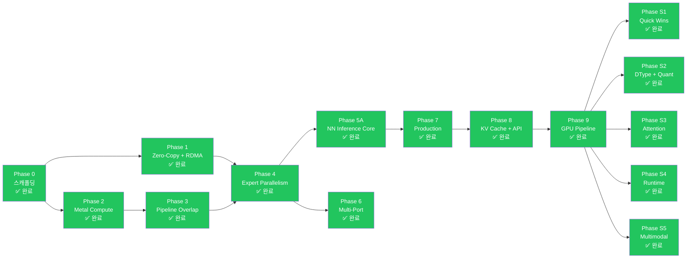

# 🗺️ 구현 로드맵 — Phase 0-9B + S1-S5 + Audit Remediation 완료 + Phase KO

rmlx 프로젝트의 구현 로드맵입니다. Phase 9B-opt 및 서빙 지원 Phase S1-S5, 그리고 전체 크레이트 감사 수정(76개 항목)까지 모든 Phase가 완료되었습니다. 현재 테스트 수: 1,142+.

---

## 📋 전체 개요

| Phase | 이름 | 핵심 내용 | 전제 조건 | 상태 |
|:-----:|------|----------|:---------:|:----:|
| 0 | 스캐폴딩 | Workspace, metal-rs 래퍼, CI | -- | ✅ 완료 |
| 1 | Zero-Copy + RDMA | ZeroCopyBuffer, DualRegPool, ibverbs FFI, blocking_exchange | Phase 0 | ✅ 완료 |
| 1-hotfix | IbvSendWr FFI 레이아웃 수정 | FFI layout fix | Phase 1 | ✅ 완료 |
| 2A | Metal Compute 기반 | Shader vendoring, DType/Array, KernelRegistry | Phase 0 | ✅ 완료 |
| 2A | Metal Compute 커널 | 7 GPU 커널 + 통합 테스트 | Phase 2A 기반 | ✅ 완료 |
| 2B | Steel GEMM + 양자화 | Steel GEMM, quantized matmul, indexing | Phase 2A | ✅ 완료 |
| 3 | Pipeline Overlap | MTLSharedEvent, dual-queue pipeline | Phase 2 | ✅ 완료 |
| 4 | Expert Parallelism | EP dispatch/combine, 3-zone auto backend, sparse dispatch | Phase 1 + 3 | ✅ 완료 |
| 5A | NN Inference Core | LLaMA, Qwen, DeepSeek, Mixtral | Phase 4 | ✅ 완료 |
| 6 | Multi-Port | 듀얼 TB5 multi-port striping, multi-node topology | Phase 4 | ✅ 완료 |
| 7A | Production Hardening | Hardening, observability | Phase 5A | ✅ 완료 |
| 7B | VJP Autodiff | VJP autodiff + LoRA fine-tuning | Phase 7A | ✅ 완료 |
| 8 | KV Cache + API Surface | KV 캐시, 병렬 Linear, API 편의성 | Phase 7B | ✅ 완료 |
| 9A | GPU Pipeline — ExecGraph | CommandBatcher, ExecGraph, ICB, `_into_cb()` 패턴 | Phase 8 | ✅ 완료 |
| 9B-opt | GPU Pipeline — Optimization | 가중치 사전 캐싱, contiguous transpose, 17.4x 속도 향상 | Phase 9A | ✅ 완료 |
| KO | 커널 최적화 | 9-디스패치 디코드, 커널별 효율화, 77x 속도 향상 | Phase 6 (인프라) | Track 1 대부분 완료, Track 2 부분 완료 |
| S1 | Serving Quick Wins | GELU, RotatingKV, BatchKV | Phase 9 | ✅ 완료 |
| S2 | DType + Quantization | FP8, GGUF, AWQ/GPTQ | Phase 9 | ✅ 완료 |
| S3 | Attention Upgrade | Flash Attention 2, QuantizedKV | Phase 9 | ✅ 완료 |
| S4 | Runtime Flexibility | Array 수준 집합 연산, 동적 shape | Phase 9 | ✅ 완료 |
| S5 | Multimodal Extension | Conv1d/Conv2d | Phase 9 | ✅ 완료 |
| Audit | 전 크레이트 감사 수정 | 6개 크레이트 76개 항목 (Phase 0+1+2) | S5 | ✅ 완료 |
| EP-1 | GPU-Native Top-K 라우팅 | 융합 라우팅 커널, GPU 상주 expert 인덱스/가중치/카운트/오프셋 | Audit | ✅ 완료 |
| EP-2 | 그룹형 Expert GEMM + 가중치 스태킹 | ExpertGroup, 스태킹된 expert 가중치, 배치 GatherMM f16/bf16 | EP-1 | ✅ 완료 |
| EP-3 | 가변 길이 v3 프로토콜 | 패킹된 PacketMeta, count/payload 2단계 교환, 16B 패킷 정렬 | EP-1 | ✅ 완료 |
| EP-4 | Compute-Communication 오버랩 (TBO + SBO) | MoePipeline, GpuEvent 체인, 비행 중 CPU 대기 제로 | EP-2 + EP-3 | ✅ 완료 |
| EP-5 | FP8 와이어 포맷 | 토큰별 E4M3 양자화, 융합 dequant-scatter, _into_cb 교환 경로 | EP-3 | ✅ 완료 |
| EP-6 | ICB Sparse Expert 실행 + RDMA Slab 링 | Sparse ICB 실행 + 사전 등록 slab 링 zero-copy 전송 | EP-4 + EP-5 | ✅ 완료 |
| EP-7 | ICB 전체 Metal Indirect Dispatch | SparseExpertPlan을 ExpertGroup GEMM 인코딩에 Metal ICB indirect dispatch로 연결; GPU 명령 수준에서 빈 expert 스킵 | EP-6 | 계획됨 |

---

## 📜 Phase 완료 이력

| Phase | Commit | Tests | Status |
|-------|--------|-------|--------|
| Phase 0: Scaffolding + Metal GPU abstraction | 7071c73 | baseline | ✅ Complete |
| Phase 1: Zero-copy memory + RDMA ibverbs | d541bb3 | + alloc/rdma tests | ✅ Complete |
| Phase 1-hotfix: IbvSendWr FFI layout fix | 9cca9a9 | 23 tests | ✅ Complete |
| Phase 2A-1~4: Shader vendoring, DType/Array, KernelRegistry | 3179bde | foundation | ✅ Complete |
| Phase 2A-5~9: 7 GPU kernels + integration tests | 5ef6a07 | 40 tests | ✅ Complete |
| Phase 2B: Steel GEMM, quantized matmul, indexing | e4d9c14 | 43 tests | ✅ Complete |
| Phase 3: SharedEvent sync + dual queue + layer pipeline | f9cadcf | 52 tests | ✅ Complete |
| Phase 4: EP 3-Zone dispatch + MoE exchange | 6fb3296 | 62 tests | ✅ Complete |
| Phase 5A: rmlx-nn inference core (LLaMA, Qwen, DeepSeek, Mixtral) | d126aaf | + nn tests | ✅ Complete |
| Phase 6: Dual TB5 multi-port striping + multi-node topology | 8c8b25f | + distributed tests | ✅ Complete |
| Phase 7A: Production hardening / observability | 0fa70bb | 98 tests | ✅ Complete |
| Phase 7B: VJP autodiff + LoRA fine-tuning | 025ed8f | 108 tests | ✅ Complete |
| Phase 8: KV Cache + API Surface | squash merge | 339 tests | ✅ Complete |
| Phase 9A: GPU Pipeline — ExecGraph | Phase 9 merge commit | 339+ tests | ✅ Complete |
| Phase 9B-opt: GPU Pipeline — Optimization | optimization merge | 339+ tests | ✅ Complete |
| Phase S1: GELU + KV Cache variants | -- | 390 tests | ✅ Complete |
| Phase S2: FP8/GGUF/AWQ/GPTQ | -- | 390 tests | ✅ Complete |
| Phase S3: Flash Attention 2 + QuantizedKV | -- | 390 tests | ✅ Complete |
| Phase S4: Collective ops + Dynamic shapes | -- | 390 tests | ✅ Complete |
| Phase S5: Conv1d/Conv2d | -- | 390 tests | ✅ Complete |
| Audit Phase 0: MoE dispatch/combine (D1-D4) + alloc/Metal/GEMM (A1-A3, M1-M4, C1) | `07fad80`, `27f59af` | 460+ tests | ✅ Complete |
| Audit Phase 1: NN MoE GPU 라우팅 + MoE 정책 + RDMA 수정 + Metal/alloc 성능 | `6ee6e6c`, `014875e`, `d9c54c7` | 490+ tests | ✅ Complete |
| Audit Phase 2: Core ops + NN 레이어 + 최종 codex 리뷰 | `ea94e94`, `1c48b30`, `f9a3b0c` | 534 tests (Phase 완료 시점) | ✅ Complete |
| EP-1: GPU-Native Top-K 라우팅 (`topk_route.rs`) | main (merged) | 1,142+ tests | ✅ Complete |
| EP-2: 그룹형 Expert GEMM + 가중치 스태킹 (`expert_group.rs`, `gather_mm.rs`) | main (merged) | 1,142+ tests | ✅ Complete |
| EP-3: 가변 길이 v3 프로토콜 (`v3_protocol.rs`) | main (merged) | 1,142+ tests | ✅ Complete |
| EP-4: Compute-Communication 오버랩 (TBO + SBO) (`moe_pipeline.rs`) | main (merged) | 1,142+ tests | ✅ Complete |
| EP-5: FP8 와이어 포맷 (`fp8.rs`, `fp8_exchange.rs`) | main (merged) | 1,142+ tests | ✅ Complete |
| EP-6: ICB Sparse Expert 실행 + RDMA Slab 링 (`icb_sparse.rs`, `slab_ring.rs`) | main (merged) | 1,142+ tests | ✅ Complete |
| Phase KO: 커널 최적화 (Track 1) | main | 1,142+ tests | 진행 중 |

---

## 🔀 Phase 의존성 다이어그램



---

## 🏗️ Phase 0: 스캐폴딩 ✅ 완료 (`7071c73`)

### 목표

Cargo workspace 구조를 확립하고, metal-rs 기본 동작을 검증하며, CI를 설정합니다.

### 주요 산출물

- Cargo workspace 초기화 (6개 크레이트 스켈레톤)
- `rmlx-metal`: MTLDevice 생성, 기본 커맨드 버퍼/인코더 래퍼
- `rmlx-metal`: 단순 Metal compute 커널 실행 (vector add)
- 빌드 시스템: `build.rs`에서 `.metal` -> `.metallib` AOT 컴파일 파이프라인
- CI: GitHub Actions (macOS runner, `cargo test`, `cargo clippy`)

### 완료 조건 (DoD)

- [x] `cargo build --workspace` 성공 (0 errors)
- [x] `cargo fmt --all --check` -- diff 0
- [x] `cargo clippy --workspace -- -D warnings` -- 0 warnings
- [x] `cargo test --workspace` -- `test_basic_metal_compute` PASS
- [x] `build.rs`에서 `.metal` -> `.metallib` AOT 컴파일 성공
- [x] Codex 리뷰: unsafe 블록에 SAFETY 주석 존재 확인

---

## 🔗 Phase 1: Zero-Copy + RDMA ✅ 완료 (`d541bb3`, hotfix `9cca9a9`)

### 목표

PoC Phase 1-4의 검증 결과를 프로덕션 수준 코드로 전환합니다. GPU 버퍼를 RDMA에 직접 등록하여 zero-copy 전송을 구현합니다.

### 주요 산출물

- `rmlx-alloc`: ZeroCopyBuffer (`posix_memalign` + NoCopy)
- `rmlx-alloc`: DualRegPool (Metal + `ibv_mr` 이중 등록 풀)
- `rmlx-alloc`: MetalAllocator (heap + cache, MLX 호환)
- `rmlx-rdma`: ibverbs FFI 바인딩 (`bindgen`)
- `rmlx-rdma`: IbContext, PD, CQ, UC QP 래퍼
- `rmlx-rdma`: `ibv_reg_mr` 래퍼 + 이중 등록 테스트
- `rmlx-rdma`: `blocking_exchange` (2-phase count -> payload)
- `rmlx-rdma`: ConnectionManager (`hosts.json` 파싱, warmup)
- 통합 테스트: 2-node zero-copy RDMA 라운드트립

### 완료 조건 (DoD)

- [x] `cargo fmt --all --check` -- diff 0
- [x] `cargo clippy --workspace -- -D warnings` -- 0 warnings
- [x] `test_zero_copy_buffer_lifecycle` -- InFlightToken drop 후 free 검증
- [x] `test_dual_registration` -- Metal + ibv_mr 동일 주소 검증
- [x] `test_rdma_exchange_2node` -- 4MB 라운드트립, 0 mismatch
- [x] `test_rdma_startup_probe` -- GID/MR/QP 런타임 탐색 성공
- [x] `test_recv_before_send_invariant` -- recv 미포스팅 시 에러 반환
- [x] 벤치마크: RDMA 대역폭 > 6 GB/s (단일 포트)
- [x] Codex 리뷰: FFI 경계 안전성, lifetime 검증

---

## ⚡ Phase 2: Metal Compute ✅ 완료 (2A: `3179bde`, `5ef6a07` / 2B: `e4d9c14`)

### 목표

효율적인 GPU 연산을 위한 핵심 Metal 커널 실행 파이프라인을 구축합니다. MLX의 Metal 셰이더를 재사용하여 10종의 커널을 Rust에서 디스패치합니다.

### 주요 산출물

- `rmlx-core`: Array 타입 (N-dim, dtype, 소유권 관리)
- `rmlx-core`: dtype 시스템 (f32, f16, bf16, q4_0, q4_1, q8_0)
- MLX `.metal` 커널 포팅 (Rust dispatch 래퍼):
  - matmul (GEMM/GEMV)
  - quantized matmul (QMM 4bit/8bit)
  - softmax
  - RMS normalization
  - RoPE (rotary position embedding)
  - element-wise binary ops (add, mul 등)
  - reduce (sum, max, argmax)
  - copy / transpose
  - indexing (gather, scatter)
- `rmlx-core`: KernelRegistry (AOT + JIT)
- `rmlx-core`: 스트림별 CommandEncoder 관리
- 벤치마크: 각 커널별 MLX 대비 성능 비교

### 완료 조건 (DoD)

- [x] `cargo fmt --all --check` -- diff 0
- [x] `cargo clippy --workspace -- -D warnings` -- 0 warnings
- [x] 10종 커널 각각 MLX 대비 +/-5% 성능
- [x] `test_matmul_correctness` -- fp16/bf16 정합성 (ulp < 2)
- [x] `test_quantized_matmul` -- q4/q8 정합성
- [x] `test_dispatch_geometry` -- threadgroup vs thread 크기 검증
- [x] Codex 리뷰: 커널 바인딩 인덱스 일치 확인

---

## 🔄 Phase 3: Pipeline Overlap ✅ 완료 (`f9cadcf`)

### 목표

MTLSharedEvent 기반 GPU 동기화와 듀얼 큐 파이프라인을 구현하여 compute와 RDMA 전송을 오버랩합니다.

### 주요 산출물

- `rmlx-metal`: GpuEvent (MTLSharedEvent 래퍼)
- `rmlx-metal`: FenceImpl (fast fence + SharedEvent fallback)
- `rmlx-metal`: StreamManager (듀얼 큐 관리)
- `rmlx-distributed`: LayerPipeline (compute <-> RDMA 오버랩)
- GPU -> CPU 동기화: event spin-wait (263.9us 목표)
- GPU -> GPU 동기화: encodeSignal/WaitForEvent 크로스 큐

파이프라인 오버랩의 효과:

```
Non-pipelined: 60 x (20ms + 7ms) = 1,620ms
Pipelined:     60 x 20ms + 7ms   = 1,207ms  (25% 개선)
```

### 완료 조건 (DoD)

- [x] `cargo fmt --all --check` -- diff 0
- [x] `cargo clippy --workspace -- -D warnings` -- 0 warnings
- [x] `test_shared_event_latency` -- spin-wait < 280us
- [x] `test_dual_queue_overlap` -- 두 큐 동시 실행 확인
- [x] `test_layer_pipeline_correctness` -- 파이프라인 결과 == 직렬 결과
- [x] `test_event_deadline_cancel` -- 타임아웃/취소 동작 확인
- [x] 벤치마크: 동기화 레이턴시 히스토그램 (p50/p95/p99)
- [x] Codex 리뷰: 동기화 프로토콜 정합성

---

## 🧠 Phase 4: Expert Parallelism ✅ 완료 (`6fb3296`)

### 목표

MLX EP 최적화를 RMLX에서 재구현하고, zero-copy로 추가 성능을 확보합니다. 2-node Mixtral decode step < 35ms를 달성합니다.

### 주요 산출물

- `rmlx-distributed`: Group 추상화 (rank, world_size, EP topology)
- `rmlx-distributed`: AllToAll 프리미티브
- `rmlx-distributed/moe`: MoeDispatchExchange
  - CPU 백엔드 (N <= 64)
  - Metal 백엔드 (N >= 320, 7종 커널)
  - Byte threshold 중간 구간
- `rmlx-distributed/moe`: MoeCombineExchange
  - 단일 소스 weighted sum
  - 이중 소스 weighted sum (local + remote, zero-copy)
- `rmlx-distributed/moe`: MoePolicy (3-zone auto + cooldown)
- MoE Metal 커널 7종 JIT 컴파일

### 완료 조건 (DoD)

- [x] `cargo fmt --all --check` -- diff 0
- [x] `cargo clippy --workspace -- -D warnings` -- 0 warnings
- [x] `test_1rank_vs_2rank_parity` -- 단일 노드 결과 == 2-node EP 결과
- [x] `test_3zone_policy` -- N=1/64/256/1024 각각 올바른 backend 선택
- [x] `test_sparse_dispatch_correctness` -- matmul scatter == dense 결과
- [x] `test_interleaved_exchange_stress` -- 1000 연속 교환 0 에러
- [x] `test_capacity_overflow_detection` -- overflow_count 메트릭 정확성
- [x] 벤치마크: 2-node decode step < 35ms
- [x] Codex 리뷰: exchange 프로토콜, 메트릭 수집 정확성

---

## 🏛️ Phase 5A: NN Inference Core ✅ 완료 (`d126aaf`)

### 목표

rmlx-nn 크레이트에 핵심 신경망 모듈을 구현합니다.

### 주요 산출물

**rmlx 프레임워크** (`~/rmlx/`):
- `rmlx-nn`: Transformer 블록 (Linear, Attention, FFN, MoE)
- `rmlx-nn`: 모델 아키텍처 (LLaMA, Qwen, DeepSeek-V3, Mixtral)

### 완료 조건 (DoD)

- [x] `cargo fmt --all --check` -- diff 0
- [x] `cargo clippy --workspace -- -D warnings` -- 0 warnings
- [x] 모델 아키텍처 정합성 검증
- [x] Codex 리뷰: nn 모듈 안전성

---

## 🌐 Phase 6: Multi-Port ✅ 완료 (`8c8b25f`)

### 목표

다중 TB5 포트를 활용하여 대역폭을 확장하고, 3+ 노드를 지원합니다. 듀얼 포트 스트라이핑으로 단일 포트 대비 ~1.8배 대역폭을 달성합니다.

### 주요 산출물

- `rmlx-rdma/multi_port`: 듀얼 TB5 포트 스트라이핑
- `rmlx-rdma/multi_port`: 전송 크기 기반 자동 스트라이핑 (N >= 8 threshold)
- Multi-node topology 매니저 (ring, mesh, hybrid)
- 3+ 노드 EP 지원 (all-to-all with > 2 ranks)

### 완료 조건 (DoD)

- [x] `cargo fmt --all --check` -- diff 0
- [x] `cargo clippy --workspace -- -D warnings` -- 0 warnings
- [x] `test_dual_port_striping` -- 2포트 동시 전송, 데이터 정합성
- [x] `test_single_port_fallback` -- 1포트 실패 시 graceful fallback
- [x] 벤치마크: 듀얼 포트 대역폭 > 12 GB/s
- [x] Codex 리뷰: 포트 간 독립성, 에러 격리

---

## 🛡️ Phase 7A: Production Hardening / Observability ✅ 완료 (`0fa70bb`)

### 목표

프로덕션 안정성과 관찰성을 확보합니다.

### 주요 산출물

- Structured logging (`tracing` 크레이트)
- Metrics 수집 (Prometheus 호환)
- Graceful shutdown + 에러 복구
- GID 테이블 손상 감지 및 자동 알림
- Memory leak 감지 (할당 통계 기반)

### 완료 조건 (DoD)

- [x] Structured logging 전체 크레이트 적용
- [x] Prometheus /metrics 엔드포인트 동작 확인
- [x] Graceful shutdown 시나리오 테스트

---

## 🎓 Phase 7B: VJP Autodiff + LoRA Fine-tuning ✅ 완료 (`025ed8f`)

### 목표

학습 지원을 위한 VJP 프레임워크와 LoRA fine-tuning 기반을 구축합니다.

### 주요 산출물

- VJP (Vector-Jacobian Product) 프레임워크
- 기본 학습 루프 (LoRA fine-tuning)

### 완료 조건 (DoD)

- [x] VJP 기본 연산 (matmul, softmax) gradient 정합성
- [x] LoRA fine-tuning 동작 검증

---

## 📦 Phase 8: KV Cache + API Surface ✅ 완료 (squash merge)

### 목표

rmlx-nn에 증분 디코딩을 위한 KV 캐시를 추가하고, 프레임워크 전반의 API 편의성을 개선합니다.

### 주요 산출물

- `rmlx-nn`: `LayerKvCache` 구조체 (Attention에서 증분 KV 캐싱)
- `rmlx-nn`: 캐시 인식 `forward()` (Attention, TransformerBlock, TransformerModel)
- `rmlx-nn`: Expert별 MoE 라우팅 메트릭 (`MoeForwardMetrics.expert_tokens`)
- `rmlx-nn`: Megatron-LM 병렬 Linear 레이어 (`parallel.rs`: ColumnParallelLinear, RowParallelLinear)
- `rmlx-distributed`: `MoeMetrics`에 Expert별 히스토그램
- `rmlx-metal`: 최상위 re-export (`GpuDevice`, `GpuEvent`, `Architecture`)
- `rmlx-core`: `prelude` 모듈 (Array, DType, KernelError, KernelRegistry)
- `rmlx-nn`: Re-export (`LayerKvCache`, `FeedForward`)

### 완료 조건 (DoD)

- [x] `cargo fmt --all --check` -- diff 0
- [x] `cargo clippy --workspace -- -D warnings` -- 0 warnings
- [x] `cargo test --workspace` -- 339 tests 통과, 0 failures
- [x] KV 캐시: 디코드 단계에서 마지막 토큰만 처리 (O(n^2) → O(n))
- [x] 하위 호환성: cache=None 시 기존 동작 유지
- [x] Codex 리뷰: Critical/High 이슈 0건

---

## 🚀 Phase 9: GPU Pipeline — ✅ 완료

### Phase 9A: ExecGraph + CommandBatcher

#### 목표

ExecGraph를 사용하여 여러 GPU 연산을 최소한의 command buffer로 배칭함으로써 연산별 CPU 오버헤드를 제거합니다.

#### 주요 산출물

- `rmlx-metal`: `CommandBatcher` — 인코더 작업을 공유 command buffer로 배칭
- `rmlx-metal`: `ExecGraph` — 결정적 연산 시퀀스를 재생하는 사전 구축 실행 그래프
- `rmlx-metal`: `IcbBuilder`/`IcbReplay`/`IcbCache` — Indirect Command Buffer 지원
- `rmlx-core`: 14개 전체 연산에 `_into_cb()` 패턴 — 호출자의 command buffer에 인코딩
- `rmlx-nn`: Attention, TransformerBlock, TransformerModel용 `forward_graph()`
- `rmlx-nn`: Linear용 `forward_into_cb()`
- 벤치마크: 레이어당 65 CB → 5 CB (92.3% 감소)

### Phase 9B-opt: 가중치 사전 캐싱 + 최적화

#### 목표

추론 시 transpose 오버헤드를 제거하기 위해 contiguous transposed 가중치 행렬을 사전 캐싱합니다.

#### 주요 산출물

- `rmlx-nn`: Linear용 `prepare_weight_t()` / `weight_transposed_contiguous()`
- `rmlx-nn`: TransformerModel/Block/Attention/FeedForward용 `prepare_weights_for_graph()`
- 벤치마크: 레이어당 ~112ms → ~6.4ms (17.4x 속도 향상)
- 수치 정합성: max_diff=6.4e-6

#### 완료 조건 (DoD)

- [x] 17.4x 속도 향상 (~112ms → ~6.4ms)
- [x] 92.3% CB 감소 (65 → 5)
- [x] 수치 정합성 (max_diff=6.4e-6)
- [x] 339+ 전체 테스트 통과

---

## ⚡ Phase S1: Serving Quick Wins — ✅ 완료

### 목표

서빙 워크로드를 위한 빠른 개선 사항을 구현합니다.

### 주요 산출물

- `rmlx-core`: GELU 활성화 (gelu_approx + gelu_fast)
- `rmlx-nn`: RotatingKvCache (순환 버퍼 KV 캐시)
- `rmlx-nn`: BatchKvCache (배치 추론용 KV 캐시)

---

## 🔢 Phase S2: DType + Quantization — ✅ 완료

### 목표

데이터 타입을 확장하고 고급 양자화 포맷을 지원합니다.

### 주요 산출물

- `rmlx-core`: FP8 DType (Float8E4M3, Float8E5M2) 및 dequant/quant 커널
- `rmlx-core`: GGUF 바이너리 포맷 파서
- `rmlx-core`: AWQ/GPTQ 역양자화 지원

---

## 🎯 Phase S3: Attention Upgrade — ✅ 완료

### 목표

어텐션 연산을 Flash Attention 2로 업그레이드하고, 양자화 KV 캐시를 추가합니다.

### 주요 산출물

- `rmlx-core`: Flash Attention 2 Metal 커널 (tiled Q/K/V + online softmax)
- `rmlx-nn`: QuantizedKvCache (FP8/Q8_0 양자화 KV 캐시)

---

## 🔄 Phase S4: Runtime Flexibility — ✅ 완료

### 목표

런타임 유연성을 개선합니다.

### 주요 산출물

- `rmlx-distributed`: Array 수준 집합 연산 (allreduce_sum, allgather_array)
- `rmlx-nn`: DynamicExecContext (동적 shape 실행 컨텍스트)

---

## 🖼️ Phase S5: Multimodal Extension — ✅ 완료

### 목표

멀티모달 모델 지원을 위한 합성곱 레이어를 추가합니다.

### 주요 산출물

- `rmlx-core`: Conv1d/Conv2d 커널
- `rmlx-nn`: Conv1d/Conv2d 레이어

---

## Phase KO: 커널 최적화 -- Track 1 대부분 완료, Track 2 부분 완료

### 목표

MLX 대비 레이어당 디코드 성능 격차를 해소합니다. 디코드 레이턴시를 109,215us(연산별 동기화 베이스라인)에서 MLX 컴파일 경로(1,342us)의 5% 이내로 줄입니다.

### Track 1: 디스패치 감소 (109,215us → 1,411us)

| 단계 | 기법 | 레이턴시 (us) | 속도 향상 |
|------|------|-------------|-----------|
| 베이스라인 | 연산별 동기화 (65 CB) | 109,215 | 1x |
| KO-1a | ExecGraph 멀티-CB 배칭 (5 CB) | 2,735 | 40x |
| KO-1b | 단일-CB 경로 (44 인코더) | 2,049 | 53x |
| KO-1c | 9-디스패치 디코드 경로 (병합 QKV/gate_up, 배치 RoPE/SDPA, 융합 gemv_bias) | 1,411 | 77x |
| KO-1d | 단일 인코더 + 메모리 배리어 (9 인코더 → 4 인코더) | 1,411 | 77x |
| MLX | 컴파일 경로 | 1,342 | -- |
| 격차 | | 5.1% | |

Track 1 추가 최적화:
- KV 캐시 재사용: slab 레이아웃을 한 번 사전 할당하고 반복마다 seq_len 리셋
- 정적 가중치에 StorageModePrivate 사용 (GPU 전용, CPU 측 페이지 테이블 오버헤드 없음)
- GPU 출력 버퍼에 Array::uninit 사용 (memset 제로 채움 생략)
- Metal 3+ (M2+) 하드웨어에서 Unretained command buffer

### Track 2: 커널별 효율화 (부분 완료)

| 커널 | 최적화 | 상태 |
|------|--------|------|
| GEMV | BM=8 변형: 8개 simdgroup이 32행을 독립적으로 처리, M >= 256일 때 자동 선택 | 완료 |
| matmul | SIMD 그룹 MMA: 대형 행렬에 simdgroup_float8x8 TileVariant::Simd | 완료 |
| rms_norm | 레지스터 캐싱: N_READS=4 + cached[MAX_PER_THREAD] | 완료 |
| layer_norm | 단일 패스: E[x^2]-E[x]^2 공식 + 레지스터 캐싱 (3회 읽기 → 1회) | 완료 |
| softmax | N_READS 통합: 루프 변형에서 float4 벡터화 로드 | 완료 |
| 커널 퓨전 | 프리필 전용; 디코드에 불리 (threadgroup간 리덕션이 행 병렬 GEMV와 비호환) | 보류 |

### 향후 작업

- **KO-2: 스크래치 할당자** -- 9-디스패치 경로 내 중간 버퍼를 위한 아레나 기반 스크래치 메모리
- **KO-3: ICB 디코드 리플레이** -- 9-디스패치 디코드 경로에 Metal Indirect Command Buffer 캡처-리플레이

### 벤치마크 결과 (M3 Ultra, f32, Llama-2 7B 형상)

```text
베이스라인 (연산별 동기화):  109,215us  1x
ExecGraph (5 CB):            2,735us  40x
단일-CB (44 인코더):          2,049us  53x
9-디스패치 (9→4 인코더):      1,411us  77x
MLX 컴파일:                   1,342us  --
MLX 대비 격차:                5.1%
```

---

## Phase 10: Flash Attention -- 계획

### 목표

효율적인 어텐션 연산을 위한 타일 K/V 처리를 사용한 Flash Attention 2를 구현합니다.

### 주요 산출물

- Flash Attention 2 Metal 커널 (타일 Q/K/V + online softmax)
- ExecGraph 파이프라인과 통합

---

## Phase 11: 고급 양자화 -- 계획

### 목표

더 넓은 모델 호환성을 위해 양자화 포맷 지원을 확장합니다.

### 주요 산출물

- GGUF 포맷 지원
- AWQ/GPTQ 양자화
- FP8 지원

---

## EP 최적화 단계 (EP-1 ~ EP-6) -- 완료

감사 완료 후 EP 최적화 단계들이 main 브랜치에 병합되어, MoE 라우팅·교환·연산의 나머지 병목을 제거하고 엔드투엔드 GPU 상주 처리를 완성했습니다.

| Phase | 핵심 파일 | 주요 변경 사항 | 상태 |
|-------|-----------|--------------|------|
| EP-1 | `crates/rmlx-core/src/ops/topk_route.rs` | 융합 `moe_topk_route_f32`: softmax -> top-k -> normalize -> histogram -> prefix-scan을 단일 Metal 패스로 처리; GPU->CPU->GPU 라우팅 왕복 제거 | ✅ 완료 |
| EP-2 | `crates/rmlx-nn/src/expert_group.rs`, `crates/rmlx-core/src/ops/gather_mm.rs` | `ExpertGroup` 가중치 스태킹 + 3개 배치 GEMM (Gate -> Up -> fused SwiGLU -> Down); GatherMM f16/bf16 커널 + `_into_cb` | ✅ 완료 |
| EP-3 | `crates/rmlx-distributed/src/v3_protocol.rs` | 패킹된 `PacketMeta`와 2단계 count/payload sendrecv, 16B 패킷 정렬을 사용한 가변 길이 토큰 교환 | ✅ 완료 |
| EP-4 | `crates/rmlx-nn/src/moe_pipeline.rs` | `GpuEvent` signal/wait 체인을 통한 TBO + SBO 오버랩 오케스트레이션; 단일 터미널 `GpuEvent::cpu_wait()` | ✅ 완료 |
| EP-5 | `crates/rmlx-core/src/ops/fp8.rs`, `crates/rmlx-distributed/src/fp8_exchange.rs` | 토큰별 FP8 E4M3 와이어 포맷, 융합 `dequant_scatter_fp8e4m3`, `_into_cb` 파이프라이닝 변형 | ✅ 완료 |
| EP-6 | `crates/rmlx-metal/src/icb_sparse.rs`, `crates/rmlx-distributed/src/slab_ring.rs` | Sparse expert ICB 실행 캐시 + `GpuEvent` 타임라인 동기화를 포함한 사전 등록 RDMA slab 링 | ✅ 완료 |

현재 op 모듈 수: 27. 현재 테스트 수: 1,142+.

---

## 🧪 CI 필수 테스트 매트릭스

모든 Phase에서 공통으로 적용되는 CI 파이프라인입니다.

```yaml
# .github/workflows/ci.yml
jobs:
  build-and-test:
    runs-on: macos-15  # Apple Silicon runner
    steps:
      - cargo build --workspace
      - cargo test --workspace
      - cargo clippy --workspace -- -D warnings
      - cargo fmt --check

  rdma-integration:  # 2-node 전용 (self-hosted runner)
    runs-on: [self-hosted, macOS, tb5-rdma]
    needs: build-and-test
    steps:
      - cargo test --workspace --features rdma-integration
      - cargo bench --bench rdma_latency
```

---

## ✅ Phase 공통 완료 조건

모든 Phase에서 다음 조건을 충족해야 합니다.

| 항목 | 명령 | 기준 |
|------|------|------|
| **빌드** | `cargo build --workspace` | 0 errors |
| **포맷** | `cargo fmt --all --check` | diff 0 |
| **린트** | `cargo clippy --workspace -- -D warnings` | 0 warnings |
| **테스트** | `cargo test --workspace` | 0 failures, 해당 Phase 테스트 전체 통과 |
| **코드 리뷰** | Codex review | Critical/High 이슈 0건 |
| **커밋** | `git commit` | fmt + clippy + test 통과 상태의 클린 커밋 |
