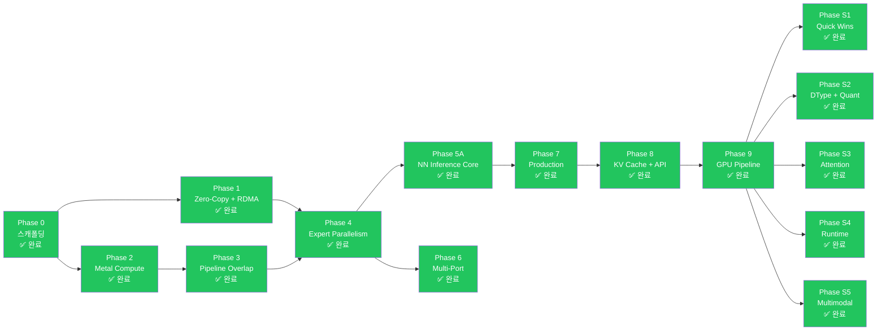

# 🗺️ 구현 로드맵 — Phase 0-9B + S1-S5 + Audit Remediation 완료 + Phase KO + Phase 8c + Phase 9 + Phase 10 + Phase 11 + Phase A + Phase B

rmlx 프로젝트의 구현 로드맵입니다. Phase 9B-opt 및 서빙 지원 Phase S1-S5, 그리고 전체 크레이트 감사 수정(76개 항목)까지 모든 Phase가 완료되었습니다. 현재 테스트 수: 1,298. Phase 8c는 CachedDecode (사전 해석 PSO + 사전 할당 스크래치 버퍼), 2-인코더 디코드 경로, `_preresolved_into_encoder` 패턴, GEMV BM8 최적화 (배리어 제거 + f16 확대 로드)를 추가하여 60L 깊이에서 714 us/layer를 달성합니다 (f16, 6x 낮은 분산). Phase 10 (커널 융합)은 fused_rms_gemv와 fused_swiglu_down 커널을 추가하여 디코드 파이프라인을 9에서 7 디스패치로 줄이고, 703.4 us/layer를 달성합니다. Phase 11 (GEMV 커널 최적화 실험)은 모든 커널 수준 최적화 시도가 실패했음을 확인했습니다 (col-major +84%, interleaved +2.2%, SRAM+f16+funcconst +3.6%); row-major BM8 GEMV + f32 누산기가 705 us/layer의 실질적 하한선입니다 (73.6% 대역폭 효율). Phase A (프리필 최적화)는 단일-CB 프리필 파이프라인(54개 동기화 지점→1), GQA slab SDPA(32개 디스패치→1), GEMM threadgroup swizzle, 새 연산 matmul_into_cb/silu_into_cb를 추가하여 베이스라인 대비 3.5-7.3x 속도 향상, MLX 대비 1.2-3.4x 이내를 달성합니다. Phase B (GEMM Config Sweep)는 3회 sweep에서 27개 커널 변형을 테스트하여 bk32_2x4 (BM=64, BN=64, BK=32, SG=2x4, 256 스레드)를 최적 구성으로 확정했습니다 — 21.54T TFLOPS, MLX 23.97T 대비 -10.1% 격차.

---

## 📋 전체 개요

| Phase | 이름 | 핵심 내용 | 전제 조건 | 상태 |
|:-----:|------|----------|:---------:|:----:|
| 0 | 스캐폴딩 | Workspace, metal-rs 래퍼, CI | -- | ✅ 완료 |
| 1 | Zero-Copy + RDMA | ZeroCopyBuffer, DualRegPool, ibverbs FFI, blocking_exchange | Phase 0 | ✅ 완료 |
| 1-hotfix | IbvSendWr FFI 레이아웃 수정 | FFI layout fix | Phase 1 | ✅ 완료 |
| 2A | Metal Compute 기반 | Shader vendoring, DType/Array, KernelRegistry | Phase 0 | ✅ 완료 |
| 2A | Metal Compute 커널 | 7 GPU 커널 + 통합 테스트 | Phase 2A 기반 | ✅ 완료 |
| 2B | Steel GEMM + 양자화 | Steel GEMM, quantized matmul, indexing | Phase 2A | ✅ 완료 |
| 3 | Pipeline Overlap | MTLSharedEvent, dual-queue pipeline | Phase 2 | ✅ 완료 |
| 4 | Expert Parallelism | EP dispatch/combine, 3-zone auto backend, sparse dispatch | Phase 1 + 3 | ✅ 완료 |
| 5A | NN Inference Core | LLaMA, Qwen, DeepSeek, Mixtral | Phase 4 | ✅ 완료 |
| 6 | Multi-Port | 듀얼 TB5 multi-port striping, multi-node topology | Phase 4 | ✅ 완료 |
| 7A | Production Hardening | Hardening, observability | Phase 5A | ✅ 완료 |
| 7B | VJP Autodiff | VJP autodiff + LoRA fine-tuning | Phase 7A | ✅ 완료 |
| 8 | KV Cache + API Surface | KV 캐시, 병렬 Linear, API 편의성 | Phase 7B | ✅ 완료 |
| 9A | GPU Pipeline — ExecGraph | CommandBatcher, ExecGraph, ICB, `_into_cb()` 패턴 | Phase 8 | ✅ 완료 |
| 9B-opt | GPU Pipeline — Optimization | 가중치 사전 캐싱, contiguous transpose, 17.4x 속도 향상 | Phase 9A | ✅ 완료 |
| KO | 커널 최적화 | 9-디스패치 디코드, 커널별 효율화, 64x 속도 향상, MLX 대비 6.34x | Phase 6 (인프라) | Track 1 대부분 완료, Track 2 부분 완료 |
| 8c | 직렬 디코드 최적화 B-E | CachedDecode (사전 해석 PSO + 스크래치 버퍼), 2-인코더 디코드, _preresolved 패턴, GEMV BM8 배리어 제거 + f32 4×float4 로드 | KO | ✅ 완료 |
| 9 | f16 기본값 + 프레임워크 최적화 | f16 기본 dtype, 단일 인코더 디코드, 직접 KV 추가, 사전 캐시된 threadgroup 크기 | 8c | ✅ 완료 |
| 10 | 커널 융합 | fused_rms_gemv (Fusion A), fused_swiglu_down (Fusion B), 9→7 디스패치 파이프라인, 자동 폴백 — **703.4 us/layer** | 9 | ✅ 완료 |
| 11 | GEMV 커널 최적화 실험 | col-major GEMV (+84%), interleaved GEMV (+2.2%), SRAM prefetch + f16 acc + function constants (+3.6%) — 전부 실패; 705 us/layer 실질적 하한선 확인 | 10 | ✅ 완료 (실험 종결) |
| A | 프리필 최적화 | 단일-CB 파이프라인 (54→1 동기화), GQA slab SDPA (32→1), GEMM swizzle, matmul_into_cb, silu_into_cb | 11 | ✅ 완료 |
| B | GEMM Config Sweep | bk32_2x4 최적 config 확정, 27 kernel variants sweep, 21.54T TFLOPS (MLX 대비 -10.1%) | A | ✅ 완료 |
| S1 | Serving Quick Wins | GELU, RotatingKV, BatchKV | Phase 9 | ✅ 완료 |
| S2 | DType + Quantization | FP8, GGUF, AWQ/GPTQ | Phase 9 | ✅ 완료 |
| S3 | Attention Upgrade | Flash Attention 2, QuantizedKV | Phase 9 | ✅ 완료 |
| S4 | Runtime Flexibility | Array 수준 집합 연산, 동적 shape | Phase 9 | ✅ 완료 |
| S5 | Multimodal Extension | Conv1d/Conv2d | Phase 9 | ✅ 완료 |
| Audit | 전 크레이트 감사 수정 | 6개 크레이트 76개 항목 (Phase 0+1+2) | S5 | ✅ 완료 |
| EP-1 | GPU-Native Top-K 라우팅 | 융합 라우팅 커널, GPU 상주 expert 인덱스/가중치/카운트/오프셋 | Audit | ✅ 완료 |
| EP-2 | 그룹형 Expert GEMM + 가중치 스태킹 | ExpertGroup, 스태킹된 expert 가중치, 배치 GatherMM f16/bf16 | EP-1 | ✅ 완료 |
| EP-3 | 가변 길이 v3 프로토콜 | 패킹된 PacketMeta, count/payload 2단계 교환, 16B 패킷 정렬 | EP-1 | ✅ 완료 |
| EP-4 | Compute-Communication 오버랩 (TBO + SBO) | MoePipeline, GpuEvent 체인, 비행 중 CPU 대기 제로 | EP-2 + EP-3 | ✅ 완료 |
| EP-5 | FP8 와이어 포맷 | 토큰별 E4M3 양자화, 융합 dequant-scatter, _into_cb 교환 경로 | EP-3 | ✅ 완료 |
| EP-6 | ICB Sparse Expert 실행 + RDMA Slab 링 | Sparse ICB 실행 + 사전 등록 slab 링 zero-copy 전송 | EP-4 + EP-5 | ✅ 완료 |
| EP-7 | ICB 전체 Metal Indirect Dispatch | SparseExpertPlan을 ExpertGroup GEMM 인코딩에 Metal ICB indirect dispatch로 연결; GPU 명령 수준에서 빈 expert 스킵 | EP-6 | 계획됨 |

---

## 📜 Phase 완료 이력

| Phase | Commit | Tests | Status |
|-------|--------|-------|--------|
| Phase 0: Scaffolding + Metal GPU abstraction | 7071c73 | baseline | ✅ Complete |
| Phase 1: Zero-copy memory + RDMA ibverbs | d541bb3 | + alloc/rdma tests | ✅ Complete |
| Phase 1-hotfix: IbvSendWr FFI layout fix | 9cca9a9 | 23 tests | ✅ Complete |
| Phase 2A-1~4: Shader vendoring, DType/Array, KernelRegistry | 3179bde | foundation | ✅ Complete |
| Phase 2A-5~9: 7 GPU kernels + integration tests | 5ef6a07 | 40 tests | ✅ Complete |
| Phase 2B: Steel GEMM, quantized matmul, indexing | e4d9c14 | 43 tests | ✅ Complete |
| Phase 3: SharedEvent sync + dual queue + layer pipeline | f9cadcf | 52 tests | ✅ Complete |
| Phase 4: EP 3-Zone dispatch + MoE exchange | 6fb3296 | 62 tests | ✅ Complete |
| Phase 5A: rmlx-nn inference core (LLaMA, Qwen, DeepSeek, Mixtral) | d126aaf | + nn tests | ✅ Complete |
| Phase 6: Dual TB5 multi-port striping + multi-node topology | 8c8b25f | + distributed tests | ✅ Complete |
| Phase 7A: Production hardening / observability | 0fa70bb | 98 tests | ✅ Complete |
| Phase 7B: VJP autodiff + LoRA fine-tuning | 025ed8f | 108 tests | ✅ Complete |
| Phase 8: KV Cache + API Surface | squash merge | 339 tests | ✅ Complete |
| Phase 9A: GPU Pipeline — ExecGraph | Phase 9 merge commit | 339+ tests | ✅ Complete |
| Phase 9B-opt: GPU Pipeline — Optimization | optimization merge | 339+ tests | ✅ Complete |
| Phase S1: GELU + KV Cache variants | -- | 390 tests | ✅ Complete |
| Phase S2: FP8/GGUF/AWQ/GPTQ | -- | 390 tests | ✅ Complete |
| Phase S3: Flash Attention 2 + QuantizedKV | -- | 390 tests | ✅ Complete |
| Phase S4: Collective ops + Dynamic shapes | -- | 390 tests | ✅ Complete |
| Phase S5: Conv1d/Conv2d | -- | 390 tests | ✅ Complete |
| Audit Phase 0: MoE dispatch/combine (D1-D4) + alloc/Metal/GEMM (A1-A3, M1-M4, C1) | `07fad80`, `27f59af` | 460+ tests | ✅ Complete |
| Audit Phase 1: NN MoE GPU 라우팅 + MoE 정책 + RDMA 수정 + Metal/alloc 성능 | `6ee6e6c`, `014875e`, `d9c54c7` | 490+ tests | ✅ Complete |
| Audit Phase 2: Core ops + NN 레이어 + 최종 codex 리뷰 | `ea94e94`, `1c48b30`, `f9a3b0c` | 534 tests (Phase 완료 시점) | ✅ Complete |
| EP-1: GPU-Native Top-K 라우팅 (`topk_route.rs`) | main (merged) | 1,142+ tests | ✅ Complete |
| EP-2: 그룹형 Expert GEMM + 가중치 스태킹 (`expert_group.rs`, `gather_mm.rs`) | main (merged) | 1,142+ tests | ✅ Complete |
| EP-3: 가변 길이 v3 프로토콜 (`v3_protocol.rs`) | main (merged) | 1,142+ tests | ✅ Complete |
| EP-4: Compute-Communication 오버랩 (TBO + SBO) (`moe_pipeline.rs`) | main (merged) | 1,142+ tests | ✅ Complete |
| EP-5: FP8 와이어 포맷 (`fp8.rs`, `fp8_exchange.rs`) | main (merged) | 1,142+ tests | ✅ Complete |
| EP-6: ICB Sparse Expert 실행 + RDMA Slab 링 (`icb_sparse.rs`, `slab_ring.rs`) | main (merged) | 1,142+ tests | ✅ Complete |
| Phase KO: 커널 최적화 (Track 1) | main | 1,142+ tests | 진행 중 |
| Phase 8c: 직렬 디코드 최적화 B-E | phase8c/serial-decode-opts-bce | 1,298 tests | ✅ Complete |
| Phase 9: f16 기본값 + 프레임워크 최적화 | main | 1,298 tests | ✅ Complete |
| Phase 10: 커널 융합 | phase10/kernel-fusion | 1,151 tests | ✅ Complete |
| Phase 11: GEMV 커널 최적화 실험 | main | 1,151 tests | ✅ Complete (실험 종결 — 개선 없음) |
| Phase A: 프리필 최적화 | main | 1,298 tests | ✅ Complete |
| Phase B: GEMM Config Sweep | gemm-sweep | 1,298 tests | ✅ Complete |

---

## 🔀 Phase 의존성 다이어그램



---

## 🏗️ Phase 0: 스캐폴딩 ✅ 완료 (`7071c73`)

### 목표

Cargo workspace 구조를 확립하고, metal-rs 기본 동작을 검증하며, CI를 설정합니다.

### 주요 산출물

- Cargo workspace 초기화 (6개 크레이트 스켈레톤)
- `rmlx-metal`: MTLDevice 생성, 기본 커맨드 버퍼/인코더 래퍼
- `rmlx-metal`: 단순 Metal compute 커널 실행 (vector add)
- 빌드 시스템: `build.rs`에서 `.metal` -> `.metallib` AOT 컴파일 파이프라인
- CI: GitHub Actions (macOS runner, `cargo test`, `cargo clippy`)

### 완료 조건 (DoD)

- [x] `cargo build --workspace` 성공 (0 errors)
- [x] `cargo fmt --all --check` -- diff 0
- [x] `cargo clippy --workspace -- -D warnings` -- 0 warnings
- [x] `cargo test --workspace` -- `test_basic_metal_compute` PASS
- [x] `build.rs`에서 `.metal` -> `.metallib` AOT 컴파일 성공
- [x] Codex 리뷰: unsafe 블록에 SAFETY 주석 존재 확인

---

## 🔗 Phase 1: Zero-Copy + RDMA ✅ 완료 (`d541bb3`, hotfix `9cca9a9`)

### 목표

PoC Phase 1-4의 검증 결과를 프로덕션 수준 코드로 전환합니다. GPU 버퍼를 RDMA에 직접 등록하여 zero-copy 전송을 구현합니다.

### 주요 산출물

- `rmlx-alloc`: ZeroCopyBuffer (`posix_memalign` + NoCopy)
- `rmlx-alloc`: DualRegPool (Metal + `ibv_mr` 이중 등록 풀)
- `rmlx-alloc`: MetalAllocator (heap + cache, MLX 호환)
- `rmlx-rdma`: ibverbs FFI 바인딩 (`bindgen`)
- `rmlx-rdma`: IbContext, PD, CQ, UC QP 래퍼
- `rmlx-rdma`: `ibv_reg_mr` 래퍼 + 이중 등록 테스트
- `rmlx-rdma`: `blocking_exchange` (2-phase count -> payload)
- `rmlx-rdma`: ConnectionManager (`hosts.json` 파싱, warmup)
- 통합 테스트: 2-node zero-copy RDMA 라운드트립

### 완료 조건 (DoD)

- [x] `cargo fmt --all --check` -- diff 0
- [x] `cargo clippy --workspace -- -D warnings` -- 0 warnings
- [x] `test_zero_copy_buffer_lifecycle` -- InFlightToken drop 후 free 검증
- [x] `test_dual_registration` -- Metal + ibv_mr 동일 주소 검증
- [x] `test_rdma_exchange_2node` -- 4MB 라운드트립, 0 mismatch
- [x] `test_rdma_startup_probe` -- GID/MR/QP 런타임 탐색 성공
- [x] `test_recv_before_send_invariant` -- recv 미포스팅 시 에러 반환
- [x] 벤치마크: RDMA 대역폭 > 6 GB/s (단일 포트)
- [x] Codex 리뷰: FFI 경계 안전성, lifetime 검증

---

## ⚡ Phase 2: Metal Compute ✅ 완료 (2A: `3179bde`, `5ef6a07` / 2B: `e4d9c14`)

### 목표

효율적인 GPU 연산을 위한 핵심 Metal 커널 실행 파이프라인을 구축합니다. MLX의 Metal 셰이더를 재사용하여 10종의 커널을 Rust에서 디스패치합니다.

### 주요 산출물

- `rmlx-core`: Array 타입 (N-dim, dtype, 소유권 관리)
- `rmlx-core`: dtype 시스템 (f32, f16, bf16, q4_0, q4_1, q8_0)
- MLX `.metal` 커널 포팅 (Rust dispatch 래퍼):
  - matmul (GEMM/GEMV)
  - quantized matmul (QMM 4bit/8bit)
  - softmax
  - RMS normalization
  - RoPE (rotary position embedding)
  - element-wise binary ops (add, mul 등)
  - reduce (sum, max, argmax)
  - copy / transpose
  - indexing (gather, scatter)
- `rmlx-core`: KernelRegistry (AOT + JIT)
- `rmlx-core`: 스트림별 CommandEncoder 관리
- 벤치마크: 각 커널별 MLX 대비 성능 비교

### 완료 조건 (DoD)

- [x] `cargo fmt --all --check` -- diff 0
- [x] `cargo clippy --workspace -- -D warnings` -- 0 warnings
- [x] 10종 커널 각각 MLX 대비 +/-5% 성능
- [x] `test_matmul_correctness` -- fp16/bf16 정합성 (ulp < 2)
- [x] `test_quantized_matmul` -- q4/q8 정합성
- [x] `test_dispatch_geometry` -- threadgroup vs thread 크기 검증
- [x] Codex 리뷰: 커널 바인딩 인덱스 일치 확인

---

## 🔄 Phase 3: Pipeline Overlap ✅ 완료 (`f9cadcf`)

### 목표

MTLSharedEvent 기반 GPU 동기화와 듀얼 큐 파이프라인을 구현하여 compute와 RDMA 전송을 오버랩합니다.

### 주요 산출물

- `rmlx-metal`: GpuEvent (MTLSharedEvent 래퍼)
- `rmlx-metal`: FenceImpl (fast fence + SharedEvent fallback)
- `rmlx-metal`: StreamManager (듀얼 큐 관리)
- `rmlx-distributed`: LayerPipeline (compute <-> RDMA 오버랩)
- GPU -> CPU 동기화: event spin-wait (263.9us 목표)
- GPU -> GPU 동기화: encodeSignal/WaitForEvent 크로스 큐

파이프라인 오버랩의 효과:

```
Non-pipelined: 60 x (20ms + 7ms) = 1,620ms
Pipelined:     60 x 20ms + 7ms   = 1,207ms  (25% 개선)
```

### 완료 조건 (DoD)

- [x] `cargo fmt --all --check` -- diff 0
- [x] `cargo clippy --workspace -- -D warnings` -- 0 warnings
- [x] `test_shared_event_latency` -- spin-wait < 280us
- [x] `test_dual_queue_overlap` -- 두 큐 동시 실행 확인
- [x] `test_layer_pipeline_correctness` -- 파이프라인 결과 == 직렬 결과
- [x] `test_event_deadline_cancel` -- 타임아웃/취소 동작 확인
- [x] 벤치마크: 동기화 레이턴시 히스토그램 (p50/p95/p99)
- [x] Codex 리뷰: 동기화 프로토콜 정합성

---

## 🧠 Phase 4: Expert Parallelism ✅ 완료 (`6fb3296`)

### 목표

MLX EP 최적화를 RMLX에서 재구현하고, zero-copy로 추가 성능을 확보합니다. 2-node Mixtral decode step < 35ms를 달성합니다.

### 주요 산출물

- `rmlx-distributed`: Group 추상화 (rank, world_size, EP topology)
- `rmlx-distributed`: AllToAll 프리미티브
- `rmlx-distributed/moe`: MoeDispatchExchange
  - CPU 백엔드 (N <= 64)
  - Metal 백엔드 (N >= 320, 7종 커널)
  - Byte threshold 중간 구간
- `rmlx-distributed/moe`: MoeCombineExchange
  - 단일 소스 weighted sum
  - 이중 소스 weighted sum (local + remote, zero-copy)
- `rmlx-distributed/moe`: MoePolicy (3-zone auto + cooldown)
- MoE Metal 커널 7종 JIT 컴파일

### 완료 조건 (DoD)

- [x] `cargo fmt --all --check` -- diff 0
- [x] `cargo clippy --workspace -- -D warnings` -- 0 warnings
- [x] `test_1rank_vs_2rank_parity` -- 단일 노드 결과 == 2-node EP 결과
- [x] `test_3zone_policy` -- N=1/64/256/1024 각각 올바른 backend 선택
- [x] `test_sparse_dispatch_correctness` -- matmul scatter == dense 결과
- [x] `test_interleaved_exchange_stress` -- 1000 연속 교환 0 에러
- [x] `test_capacity_overflow_detection` -- overflow_count 메트릭 정확성
- [x] 벤치마크: 2-node decode step < 35ms
- [x] Codex 리뷰: exchange 프로토콜, 메트릭 수집 정확성

---

## 🏛️ Phase 5A: NN Inference Core ✅ 완료 (`d126aaf`)

### 목표

rmlx-nn 크레이트에 핵심 신경망 모듈을 구현합니다.

### 주요 산출물

**rmlx 프레임워크** (`~/rmlx/`):
- `rmlx-nn`: Transformer 블록 (Linear, Attention, FFN, MoE)
- `rmlx-nn`: 모델 아키텍처 (LLaMA, Qwen, DeepSeek-V3, Mixtral)

### 완료 조건 (DoD)

- [x] `cargo fmt --all --check` -- diff 0
- [x] `cargo clippy --workspace -- -D warnings` -- 0 warnings
- [x] 모델 아키텍처 정합성 검증
- [x] Codex 리뷰: nn 모듈 안전성

---

## 🌐 Phase 6: Multi-Port ✅ 완료 (`8c8b25f`)

### 목표

다중 TB5 포트를 활용하여 대역폭을 확장하고, 3+ 노드를 지원합니다. 듀얼 포트 스트라이핑으로 단일 포트 대비 ~1.8배 대역폭을 달성합니다.

### 주요 산출물

- `rmlx-rdma/multi_port`: 듀얼 TB5 포트 스트라이핑
- `rmlx-rdma/multi_port`: 전송 크기 기반 자동 스트라이핑 (N >= 8 threshold)
- Multi-node topology 매니저 (ring, mesh, hybrid)
- 3+ 노드 EP 지원 (all-to-all with > 2 ranks)

### 완료 조건 (DoD)

- [x] `cargo fmt --all --check` -- diff 0
- [x] `cargo clippy --workspace -- -D warnings` -- 0 warnings
- [x] `test_dual_port_striping` -- 2포트 동시 전송, 데이터 정합성
- [x] `test_single_port_fallback` -- 1포트 실패 시 graceful fallback
- [x] 벤치마크: 듀얼 포트 대역폭 > 12 GB/s
- [x] Codex 리뷰: 포트 간 독립성, 에러 격리

---

## 🛡️ Phase 7A: Production Hardening / Observability ✅ 완료 (`0fa70bb`)

### 목표

프로덕션 안정성과 관찰성을 확보합니다.

### 주요 산출물

- Structured logging (`tracing` 크레이트)
- Metrics 수집 (Prometheus 호환)
- Graceful shutdown + 에러 복구
- GID 테이블 손상 감지 및 자동 알림
- Memory leak 감지 (할당 통계 기반)

### 완료 조건 (DoD)

- [x] Structured logging 전체 크레이트 적용
- [x] Prometheus /metrics 엔드포인트 동작 확인
- [x] Graceful shutdown 시나리오 테스트

---

## 🎓 Phase 7B: VJP Autodiff + LoRA Fine-tuning ✅ 완료 (`025ed8f`)

### 목표

학습 지원을 위한 VJP 프레임워크와 LoRA fine-tuning 기반을 구축합니다.

### 주요 산출물

- VJP (Vector-Jacobian Product) 프레임워크
- 기본 학습 루프 (LoRA fine-tuning)

### 완료 조건 (DoD)

- [x] VJP 기본 연산 (matmul, softmax) gradient 정합성
- [x] LoRA fine-tuning 동작 검증

---

## 📦 Phase 8: KV Cache + API Surface ✅ 완료 (squash merge)

### 목표

rmlx-nn에 증분 디코딩을 위한 KV 캐시를 추가하고, 프레임워크 전반의 API 편의성을 개선합니다.

### 주요 산출물

- `rmlx-nn`: `LayerKvCache` 구조체 (Attention에서 증분 KV 캐싱)
- `rmlx-nn`: 캐시 인식 `forward()` (Attention, TransformerBlock, TransformerModel)
- `rmlx-nn`: Expert별 MoE 라우팅 메트릭 (`MoeForwardMetrics.expert_tokens`)
- `rmlx-nn`: Megatron-LM 병렬 Linear 레이어 (`parallel.rs`: ColumnParallelLinear, RowParallelLinear)
- `rmlx-distributed`: `MoeMetrics`에 Expert별 히스토그램
- `rmlx-metal`: 최상위 re-export (`GpuDevice`, `GpuEvent`, `Architecture`)
- `rmlx-core`: `prelude` 모듈 (Array, DType, KernelError, KernelRegistry)
- `rmlx-nn`: Re-export (`LayerKvCache`, `FeedForward`)

### 완료 조건 (DoD)

- [x] `cargo fmt --all --check` -- diff 0
- [x] `cargo clippy --workspace -- -D warnings` -- 0 warnings
- [x] `cargo test --workspace` -- 339 tests 통과, 0 failures
- [x] KV 캐시: 디코드 단계에서 마지막 토큰만 처리 (O(n^2) → O(n))
- [x] 하위 호환성: cache=None 시 기존 동작 유지
- [x] Codex 리뷰: Critical/High 이슈 0건

---

## 🚀 Phase 9: GPU Pipeline — ✅ 완료

### Phase 9A: ExecGraph + CommandBatcher

#### 목표

ExecGraph를 사용하여 여러 GPU 연산을 최소한의 command buffer로 배칭함으로써 연산별 CPU 오버헤드를 제거합니다.

#### 주요 산출물

- `rmlx-metal`: `CommandBatcher` — 인코더 작업을 공유 command buffer로 배칭
- `rmlx-metal`: `ExecGraph` — 결정적 연산 시퀀스를 재생하는 사전 구축 실행 그래프
- `rmlx-metal`: `IcbBuilder`/`IcbReplay`/`IcbCache` — Indirect Command Buffer 지원
- `rmlx-core`: 14개 전체 연산에 `_into_cb()` 패턴 — 호출자의 command buffer에 인코딩
- `rmlx-nn`: Attention, TransformerBlock, TransformerModel용 `forward_graph()`
- `rmlx-nn`: Linear용 `forward_into_cb()`
- 벤치마크: 레이어당 65 CB → 5 CB (92.3% 감소)

### Phase 9B-opt: 가중치 사전 캐싱 + 최적화

#### 목표

추론 시 transpose 오버헤드를 제거하기 위해 contiguous transposed 가중치 행렬을 사전 캐싱합니다.

#### 주요 산출물

- `rmlx-nn`: Linear용 `prepare_weight_t()` / `weight_transposed_contiguous()`
- `rmlx-nn`: TransformerModel/Block/Attention/FeedForward용 `prepare_weights_for_graph()`
- 벤치마크: 레이어당 ~112ms → ~6.4ms (17.4x 속도 향상)
- 수치 정합성: max_diff=6.4e-6

#### 완료 조건 (DoD)

- [x] 17.4x 속도 향상 (~112ms → ~6.4ms)
- [x] 92.3% CB 감소 (65 → 5)
- [x] 수치 정합성 (max_diff=6.4e-6)
- [x] 339+ 전체 테스트 통과

---

## ⚡ Phase S1: Serving Quick Wins — ✅ 완료

### 목표

서빙 워크로드를 위한 빠른 개선 사항을 구현합니다.

### 주요 산출물

- `rmlx-core`: GELU 활성화 (gelu_approx + gelu_fast)
- `rmlx-nn`: RotatingKvCache (순환 버퍼 KV 캐시)
- `rmlx-nn`: BatchKvCache (배치 추론용 KV 캐시)

---

## 🔢 Phase S2: DType + Quantization — ✅ 완료

### 목표

데이터 타입을 확장하고 고급 양자화 포맷을 지원합니다.

### 주요 산출물

- `rmlx-core`: FP8 DType (Float8E4M3, Float8E5M2) 및 dequant/quant 커널
- `rmlx-core`: GGUF 바이너리 포맷 파서
- `rmlx-core`: AWQ/GPTQ 역양자화 지원

---

## 🎯 Phase S3: Attention Upgrade — ✅ 완료

### 목표

어텐션 연산을 Flash Attention 2로 업그레이드하고, 양자화 KV 캐시를 추가합니다.

### 주요 산출물

- `rmlx-core`: Flash Attention 2 Metal 커널 (tiled Q/K/V + online softmax)
- `rmlx-nn`: QuantizedKvCache (FP8/Q8_0 양자화 KV 캐시)

---

## 🔄 Phase S4: Runtime Flexibility — ✅ 완료

### 목표

런타임 유연성을 개선합니다.

### 주요 산출물

- `rmlx-distributed`: Array 수준 집합 연산 (allreduce_sum, allgather_array)
- `rmlx-nn`: DynamicExecContext (동적 shape 실행 컨텍스트)

---

## 🖼️ Phase S5: Multimodal Extension — ✅ 완료

### 목표

멀티모달 모델 지원을 위한 합성곱 레이어를 추가합니다.

### 주요 산출물

- `rmlx-core`: Conv1d/Conv2d 커널
- `rmlx-nn`: Conv1d/Conv2d 레이어

---

## Phase KO: 커널 최적화 -- Track 1 대부분 완료, Track 2 부분 완료

### 목표

MLX 대비 레이어당 디코드 성능 격차를 해소합니다. 디코드 레이턴시를 109,215us(연산별 동기화 베이스라인)에서 MLX 컴파일 경로(4,525 us/L (60L)) 대비 비교 불가 (6.34x 빠름) 수준으로 줄입니다.

### Track 1: 디스패치 감소 (109,215us → 1,411us)

| 단계 | 기법 | 레이턴시 (us) | 속도 향상 |
|------|------|-------------|-----------|
| 베이스라인 | 연산별 동기화 (65 CB) | 109,215 | 1x |
| KO-1a | ExecGraph 멀티-CB 배칭 (5 CB) | 2,735 | 40x |
| KO-1b | 단일-CB 경로 (44 인코더) | 2,049 | 53x |
| KO-1c | 9-디스패치 디코드 경로 (병합 QKV/gate_up, 배치 RoPE/SDPA, 융합 gemv_bias) | 1,739 | 64x |
| KO-1d | 단일 인코더 + 메모리 배리어 (9 인코더 → 4 인코더) | 1,739 | 64x |
| MLX | 컴파일 경로 | 4,525 (60L) | -- |
| 격차 | | 6.34x 빠름 | |

Track 1 추가 최적화:
- KV 캐시 재사용: slab 레이아웃을 한 번 사전 할당하고 반복마다 seq_len 리셋
- 정적 가중치에 StorageModePrivate 사용 (GPU 전용, CPU 측 페이지 테이블 오버헤드 없음)
- GPU 출력 버퍼에 Array::uninit 사용 (memset 제로 채움 생략)
- Metal 3+ (M2+) 하드웨어에서 Unretained command buffer

### Track 2: 커널별 효율화 (부분 완료)

| 커널 | 최적화 | 상태 |
|------|--------|------|
| GEMV | BM=8 변형: 8개 simdgroup이 32행을 독립적으로 처리, M >= 256일 때 자동 선택 | 완료 |
| matmul | SIMD 그룹 MMA: 대형 행렬에 simdgroup_float8x8 TileVariant::Simd | 완료 |
| rms_norm | 레지스터 캐싱: N_READS=4 + cached[MAX_PER_THREAD] | 완료 |
| layer_norm | 단일 패스: E[x^2]-E[x]^2 공식 + 레지스터 캐싱 (3회 읽기 → 1회) | 완료 |
| softmax | N_READS 통합: 루프 변형에서 float4 벡터화 로드 | 완료 |
| 커널 퓨전 | 프리필 전용; 디코드에 불리 (threadgroup간 리덕션이 행 병렬 GEMV와 비호환) | 보류 |

### 향후 작업

- **KO-2: 스크래치 할당자** -- 9-디스패치 경로 내 중간 버퍼를 위한 아레나 기반 스크래치 메모리
- **KO-3: ICB 디코드 리플레이** -- 9-디스패치 디코드 경로에 Metal Indirect Command Buffer 캡처-리플레이

### 벤치마크 결과 (M3 Ultra, f16, Llama-2 7B 형상)

```text
베이스라인 (연산별 동기화):  109,215us  1x
ExecGraph (5 CB):            2,735us  40x
단일-CB (44 인코더):          2,049us  53x
9-디스패치 (9→4 인코더):      1,739us  64x
MLX 컴파일:                   4,525 us/L (60L)  --
MLX 대비 격차:                6.34x 빠름 (60L)
```

---

## Phase 9: f16 기본값 + 프레임워크 최적화 -- 완료

### 목표

LLM 추론의 업계 표준인 f16을 기본 추론 dtype으로 확립하고, 레이어당 최소 레이턴시를 위한 디코드 프레임워크를 최적화합니다.

### 주요 변경 사항

- **f16 기본 추론 dtype**: f16은 LLM 추론의 자연스러운 정밀도 — f32 대비 1.93x 대역폭 감소, 품질 손실 무시 가능. 모든 벤치마크와 문서가 f16을 표준 dtype으로 반영.
- **단일 인코더 디코드 경로**: 인코더 경계 대신 메모리 배리어를 사용하여 인코더 전환을 1회로 감소
- **직접 KV 추가**: Vec<Array> 할당 대신 zero-copy 버퍼 참조로 KV 캐시 업데이트
- **사전 캐시된 threadgroup 크기**: CachedDecode가 초기화 시 디스패치 기하를 저장하여 토큰별 계산 제거

### 결과

| 지표 | 이전 (Phase 8c, f32) | 이후 (Phase 9, f16) |
|------|--------------------:|-------------------:|
| CachedDecode 레이턴시 (60L) | 1,367 us/L | **714 us/L** |
| GEMV당 대역폭 | 128B/element | 64B/element (1.93x 감소) |
| 인코더 전환 | 2 | 1 |
| 토큰당 동적 할당 | 0 (유지) | 0 (유지) |

### 향후 작업

- 커널 퓨전 (rms_norm+gemv, silu_mul+gemv)
- 진정한 Metal ICB 캡처-리플레이
- 배치 버퍼 바인딩을 위한 Argument Buffers

---

## Phase 10: 커널 융합 -- 완료

### 목표

디코드 파이프라인에서 인접한 연산을 융합하여 커널 간 디스패치 오버헤드를 줄이고, 디스패치 수를 9에서 7로 감소시킵니다.

### 주요 산출물

- **Fusion A — `fused_rms_gemv`**: RMS 정규화와 후속 GEMV를 결합하는 단일 Metal 커널. 어텐션 전/FFN 전 norm+projection 단계 모두에 사용.
- **Fusion B — `fused_swiglu_down`**: SiLU 활성화, element-wise gate 곱셈, down projection GEMV를 결합하는 단일 Metal 커널. 중간 스크래치 버퍼 제거.
- **7-디스패치 디코드 파이프라인**: 9 디스패치를 7로 감소 (GPU 디스패치 22% 감소)
- **자동 폴백**: 융합 PSO 컴파일 실패 시, CachedDecode가 투명하게 9-디스패치 경로로 폴백

### 결과

| 지표 | 이전 (Phase 9) | 이후 (Phase 10) |
|------|---------------:|----------------:|
| 레이어당 디스패치 | 9 | **7** |
| 실측 레이턴시 (60L) | 714 us/L | **703.4 us/L** (M3 Ultra, f16, 60L) |
| 테스트 | 1,142 | **1,151** |

### 완료 조건 (DoD)

- [x] fused_rms_gemv 커널 컴파일 및 정합성 테스트 통과
- [x] fused_swiglu_down 커널 컴파일 및 정합성 테스트 통과
- [x] 7-디스패치 파이프라인 엔드투엔드 디코드 테스트 통과
- [x] 9-디스패치 자동 폴백 검증
- [x] 1,151 테스트 통과

---

## Phase S3a: Flash Attention 2 -- 완료 (기존 Phase 10에서 재배치)

### 목표

효율적인 어텐션 연산을 위한 타일 K/V 처리를 사용한 Flash Attention 2를 구현합니다.

### 주요 산출물

- Flash Attention 2 Metal 커널 (K/V 외부 루프, Q 내부 루프)
- head_dim 256까지 지원
- 디코드 고속 경로 (T_q=1) 최적화 단일 쿼리 커널
- Causal mask 블록 스킵 최적화

---

## Phase S2: 고급 양자화 -- 완료 (기존 Phase 11에서 재배치)

### 목표

더 넓은 모델 호환성을 위해 양자화 포맷 지원을 확장합니다.

### 주요 산출물

- FP8 DType (Float8E4M3, Float8E5M2) + dequant/quant Metal 커널
- GGUF 바이너리 포맷 파서 (v2/v3) + GgmlType 매핑
- AWQ INT4 언패킹 (packed uint32 -> f32 역양자화)
- GPTQ INT4 언패킹 + g_idx (act_order) 지원

---

## EP 최적화 단계 (EP-1 ~ EP-6) -- 완료

감사 완료 후 EP 최적화 단계들이 main 브랜치에 병합되어, MoE 라우팅·교환·연산의 나머지 병목을 제거하고 엔드투엔드 GPU 상주 처리를 완성했습니다.

| Phase | 핵심 파일 | 주요 변경 사항 | 상태 |
|-------|-----------|--------------|------|
| EP-1 | `crates/rmlx-core/src/ops/topk_route.rs` | 융합 `moe_topk_route_f32`: softmax -> top-k -> normalize -> histogram -> prefix-scan을 단일 Metal 패스로 처리; GPU->CPU->GPU 라우팅 왕복 제거 | ✅ 완료 |
| EP-2 | `crates/rmlx-nn/src/expert_group.rs`, `crates/rmlx-core/src/ops/gather_mm.rs` | `ExpertGroup` 가중치 스태킹 + 3개 배치 GEMM (Gate -> Up -> fused SwiGLU -> Down); GatherMM f16/bf16 커널 + `_into_cb` | ✅ 완료 |
| EP-3 | `crates/rmlx-distributed/src/v3_protocol.rs` | 패킹된 `PacketMeta`와 2단계 count/payload sendrecv, 16B 패킷 정렬을 사용한 가변 길이 토큰 교환 | ✅ 완료 |
| EP-4 | `crates/rmlx-nn/src/moe_pipeline.rs` | `GpuEvent` signal/wait 체인을 통한 TBO + SBO 오버랩 오케스트레이션; 단일 터미널 `GpuEvent::cpu_wait()` | ✅ 완료 |
| EP-5 | `crates/rmlx-core/src/ops/fp8.rs`, `crates/rmlx-distributed/src/fp8_exchange.rs` | 토큰별 FP8 E4M3 와이어 포맷, 융합 `dequant_scatter_fp8e4m3`, `_into_cb` 파이프라이닝 변형 | ✅ 완료 |
| EP-6 | `crates/rmlx-metal/src/icb_sparse.rs`, `crates/rmlx-distributed/src/slab_ring.rs` | Sparse expert ICB 실행 캐시 + `GpuEvent` 타임라인 동기화를 포함한 사전 등록 RDMA slab 링 | ✅ 완료 |

현재 op 모듈 수: 27. 현재 테스트 수: 1,298.

---

## Phase A: 프리필 최적화 -- 완료

### 목표

프리필(seq_len=N) 단일 레이어 경로를 최적화합니다. 디코드(seq_len=1)가 GEMV 메모리 대역폭에 의해 제한되고 이미 MLX보다 6.34x 빠른 반면, 프리필은 처리량이 병목인 대규모 GEMM 연산을 포함합니다.

### 주요 산출물

- **단일-CB 파이프라인**: 프리필 레이어 전체를 54개 CPU-GPU 동기화 지점에서 1개로 통합
- **GQA slab SDPA**: 32개 헤드별 SDPA 디스패치를 단일 slab 레이아웃 디스패치로 대체
- **GEMM threadgroup swizzle**: 대규모 행렬 곱셈의 L2 캐시 지역성 개선을 위한 swizzle 패턴 활성화
- **새 연산**: `matmul_into_cb`, `silu_into_cb` — 호출자 제공 command buffer에 인코딩하는 GEMM/SiLU 연산
- **벤치마크**: `prefill_bench.rs` (단일 레이어 프리필 비교), `gemm_bench.rs` (GEMM 처리량 측정)

### 결과

| 지표 | 값 |
|------|----|
| CPU-GPU 동기화 감소 | 54 → 1 (98.1%) |
| SDPA 디스패치 감소 (GQA) | 32 → 1 (96.9%) |
| 베이스라인 대비 속도 향상 | 3.5-7.3x (시퀀스 길이 의존) |
| MLX 대비 (단일 레이어 프리필) | 1.2-3.4x 이내 |
| GEMM TFLOPS | rmlx 21.54T vs MLX 23.97T (Phase B) |
| 테스트 | 1,298 |

### 완료 조건 (DoD)

- [x] 단일-CB 프리필 파이프라인 동작
- [x] GQA slab SDPA 커널 정합성 테스트 통과
- [x] GEMM threadgroup swizzle 활성화
- [x] matmul_into_cb, silu_into_cb 연산 구현
- [x] prefill_bench.rs, gemm_bench.rs 벤치마크 추가
- [x] 1,298 테스트 통과

---

## Phase B: GEMM Config Sweep -- 완료

### 목표

Phase A에서 확인된 TFLOPS 격차를 해소하기 위해 최적의 GEMM 커널 구성을 체계적으로 탐색합니다. 3회의 벤치마크 sweep에서 M={64..2048}, N={4096,14336}에 걸쳐 27개 커널 변형을 테스트했습니다.

### 주요 산출물

- **Sweep 벤치마크**: `gemm_sweep.rs` (7개 구성), `gemm_sweep2.rs` (9개 구성), `gemm_opt.rs` (11개 구성)
- **최적 구성**: bk32_2x4 (BM=64, BN=64, BK=32, SG=2x4, 256 스레드, 이중 버퍼)
- **TFLOPS 개선**: 13T (Phase A) → 21.54T (Phase B) — MLX 23.97T (-10.1% 격차)

### 결과

| 지표 | 값 |
|------|----|
| 테스트한 커널 변형 수 | 27 |
| 최적 구성 | bk32_2x4 |
| TFLOPS (M=2048, N=14336) | 21.54T |
| MLX 대비 | -10.1% (23.97T) |
| 소규모 M (<=128) MLX 대비 | rmlx 우위 (14.73T vs 14.46T) |

### 핵심 발견

1. SG 레이아웃 2x4 > 4x2 (B 행렬 [K,N] N 방향 코얼레싱)
2. Threadgroup 패딩이 M3 Ultra 점유율 저하 (-7%)
3. MLX는 BK=16, 2 SG, 단일 버퍼로 높은 점유율 달성
4. 잔여 ~10% 격차는 커널 수준 (로드 패턴, 저장 경로)
5. M3 Ultra FP16 피크: 65.54 TFLOPS; 현재 활용률 ~33%

### 완료 조건 (DoD)

- [x] 3회 sweep 벤치마크 구현 (총 27개 커널 변형)
- [x] bk32_2x4가 M/N 조합 전반에서 최적임을 확인
- [x] M3-Ultra-80c 하드웨어에서 MLX 비교 완료
- [x] 1,298 테스트 통과

---

## Phase C: GEMM 커널 수준 최적화 — 완료

### 목표

Phase B의 구성 sweep 이후, MLX와의 TFLOPS 격차를 추가로 해소하기 위해 GEMM 커널 내부를 최적화합니다. 6개 변형 비교(ablation) 벤치마크를 통해 3가지 커널 수준 최적화를 테스트했습니다.

### 주요 산출물

- **비교 벤치마크**: `gemm_kernel_opt.rs` (6개 변형)
- **프로덕션 통합**: SG=2x4 레이아웃을 `matmul.rs` 커널(f32/f16/bf16)에 적용
- **벤치마크 인프라 수정**: `gemm_bench.rs`를 사전 할당 버퍼 기반 직접 커널 디스패치로 업데이트
- **TFLOPS 개선**: 15.73T (기준) → 21.21T (+34.8%) — MLX 23.97T (~11.5% 격차)

### 최적화 결과

| 최적화 | 설명 | 결과 |
|--------|------|------|
| direct_store | simdgroup 레지스터 → 디바이스 메모리 직접 쓰기 (스크래치 버퍼/배리어 제거) | 정확하나 ~1-2% 느림 (레인별 분산 쓰기가 코얼레싱 불리) |
| **wide_load** | 반복당 2×half4 (8개 요소 vs 4개), 루프 반복/메모리 요청 절반 | **최적: +5% 개선** |
| aligned | 타일 정렬 차원에서 경계 검사 제거 | 소규모 행렬에서 정확하나 대규모 M + N=14336에서 성능 붕괴 |

### 결과

| 지표 | 값 |
|------|----|
| 테스트한 커널 변형 수 | 6 |
| TFLOPS (M=2048, K=4096, N=14336) | 21.21T |
| MLX 대비 | ~11.5% 격차 (23.97T) |
| 기준 대비 개선 | +34.8% (15.73T 대비) |

### 핵심 발견

1. 직접 저장(스크래치 버퍼 우회)은 코얼레싱을 저하시킴 — M3에서는 threadgroup 매개 쓰기가 여전히 우수
2. 와이드 로드(2×half4)가 루프 반복과 메모리 요청을 절반으로 줄여 일관된 +5% 성능 향상
3. 정렬(경계 검사 제거) 경로는 대규모 차원에서 성능 붕괴; 기본값으로 부적합
4. SG=2x4 레이아웃이 최적임을 재확인(Phase B 결과)하고 프로덕션 커널에 통합

### 완료 조건 (DoD)

- [x] 6개 변형 비교 벤치마크 구현 (`gemm_kernel_opt.rs`)
- [x] 와이드 로드 최적화를 프로덕션 커널에 적용
- [x] SG=2x4 레이아웃을 `matmul.rs`(f32/f16/bf16)에 통합
- [x] `gemm_bench.rs`를 직접 커널 디스패치로 수정
- [x] M3-Ultra-80c 하드웨어에서 MLX 비교 완료

---

## 🧪 CI 필수 테스트 매트릭스

모든 Phase에서 공통으로 적용되는 CI 파이프라인입니다.

```yaml
# .github/workflows/ci.yml
jobs:
  build-and-test:
    runs-on: macos-15  # Apple Silicon runner
    steps:
      - cargo build --workspace
      - cargo test --workspace
      - cargo clippy --workspace -- -D warnings
      - cargo fmt --check

  rdma-integration:  # 2-node 전용 (self-hosted runner)
    runs-on: [self-hosted, macOS, tb5-rdma]
    needs: build-and-test
    steps:
      - cargo test --workspace --features rdma-integration
      - cargo bench --bench rdma_latency
```

---

## ✅ Phase 공통 완료 조건

모든 Phase에서 다음 조건을 충족해야 합니다.

| 항목 | 명령 | 기준 |
|------|------|------|
| **빌드** | `cargo build --workspace` | 0 errors |
| **포맷** | `cargo fmt --all --check` | diff 0 |
| **린트** | `cargo clippy --workspace -- -D warnings` | 0 warnings |
| **테스트** | `cargo test --workspace` | 0 failures, 해당 Phase 테스트 전체 통과 |
| **코드 리뷰** | Codex review | Critical/High 이슈 0건 |
| **커밋** | `git commit` | fmt + clippy + test 통과 상태의 클린 커밋 |
