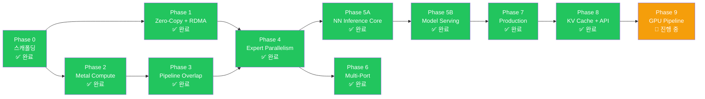

# 구현 로드맵

rmlx 프로젝트의 구현 로드맵입니다. Phase 0-8 완료, **Phase 9 (GPU Pipeline) 진행 중**입니다.

---

## 전체 개요

| Phase | 이름 | 핵심 내용 | 전제 조건 | 상태 |
|:-----:|------|----------|:---------:|:----:|
| 0 | 스캐폴딩 | Workspace, metal-rs 래퍼, CI | -- | ✅ 완료 |
| 1 | Zero-Copy + RDMA | ZeroCopyBuffer, DualRegPool, ibverbs FFI, blocking_exchange | Phase 0 | ✅ 완료 |
| 1-hotfix | IbvSendWr FFI 레이아웃 수정 | FFI layout fix | Phase 1 | ✅ 완료 |
| 2A | Metal Compute 기반 | Shader vendoring, DType/Array, KernelRegistry | Phase 0 | ✅ 완료 |
| 2A | Metal Compute 커널 | 7 GPU 커널 + 통합 테스트 | Phase 2A 기반 | ✅ 완료 |
| 2B | Steel GEMM + 양자화 | Steel GEMM, quantized matmul, indexing | Phase 2A | ✅ 완료 |
| 3 | Pipeline Overlap | MTLSharedEvent, dual-queue pipeline | Phase 2 | ✅ 완료 |
| 4 | Expert Parallelism | EP dispatch/combine, 3-zone auto backend, sparse dispatch | Phase 1 + 3 | ✅ 완료 |
| 5A | NN Inference Core | LLaMA, Qwen, DeepSeek, Mixtral | Phase 4 | ✅ 완료 |
| 5B | Model Serving | rmlx-lm (별도 리포 ~/rmlx-lm) | Phase 5A | ✅ 완료 |
| 6 | Multi-Port | 듀얼 TB5 multi-port striping, multi-node topology | Phase 4 | ✅ 완료 |
| 7A | Production Hardening | Hardening, observability | Phase 5 | ✅ 완료 |
| 7B | VJP Autodiff | VJP autodiff + LoRA fine-tuning | Phase 7A | ✅ 완료 |
| 8 | KV Cache + API Surface | KV 캐시, 병렬 Linear, API 정리 | Phase 7B | ✅ 완료 |
| **9** | **GPU Pipeline** | **CommandBatcher, ExecGraph, fused 커널, ICB** | **Phase 8** | **🔧 진행 중** |

---

## Phase 완료 이력

| Phase | Commit | Tests | Status |
|-------|--------|-------|--------|
| Phase 0: Scaffolding + Metal GPU abstraction | 7071c73 | baseline | ✅ Complete |
| Phase 1: Zero-copy memory + RDMA ibverbs | d541bb3 | + alloc/rdma tests | ✅ Complete |
| Phase 1-hotfix: IbvSendWr FFI layout fix | 9cca9a9 | 23 tests | ✅ Complete |
| Phase 2A-1~4: Shader vendoring, DType/Array, KernelRegistry | 3179bde | foundation | ✅ Complete |
| Phase 2A-5~9: 7 GPU kernels + integration tests | 5ef6a07 | 40 tests | ✅ Complete |
| Phase 2B: Steel GEMM, quantized matmul, indexing | e4d9c14 | 43 tests | ✅ Complete |
| Phase 3: SharedEvent sync + dual queue + layer pipeline | f9cadcf | 52 tests | ✅ Complete |
| Phase 4: EP 3-Zone dispatch + MoE exchange | 6fb3296 | 62 tests | ✅ Complete |
| Phase 5A: rmlx-nn inference core (LLaMA, Qwen, DeepSeek, Mixtral) | d126aaf | + nn tests | ✅ Complete |
| Phase 5B: rmlx-lm serving engine (separate repo ~/rmlx-lm) | 98e50c1 | 75 tests | ✅ Complete |
| Phase 6: Dual TB5 multi-port striping + multi-node topology | 8c8b25f | + distributed tests | ✅ Complete |
| Phase 7A: Production hardening / observability | 0fa70bb | 98 tests | ✅ Complete |
| Phase 7B: VJP autodiff + LoRA fine-tuning | 025ed8f | 108 tests | ✅ Complete |
| Phase 8: KV Cache + API Surface | squash merge | 339 tests | ✅ Complete |
| Phase 9A+9B: GPU Pipeline — ExecGraph 통합 | 3d4100c | + pipeline tests | 🔧 진행 중 |
| Phase 9B-fix: SDPA 타일, MSL 한정자, GEMM 연속성 | c77bdb7..69ed98d | 버그 수정 | ✅ Complete |
| Phase 9B-opt: Weight 사전 캐싱 + GPU pipeline 문서 | HEAD | + docs | ✅ Complete |

---

## Phase 의존성 다이어그램



---

## Phase 0: 스캐폴딩 ✅ 완료 (`7071c73`)

### 목표

Cargo workspace 구조를 확립하고, metal-rs 기본 동작을 검증하며, CI를 설정합니다.

### 주요 산출물

- Cargo workspace 초기화 (6개 크레이트 스켈레톤)
- `rmlx-metal`: MTLDevice 생성, 기본 커맨드 버퍼/인코더 래퍼
- `rmlx-metal`: 단순 Metal compute 커널 실행 (vector add)
- 빌드 시스템: `build.rs`에서 `.metal` -> `.metallib` AOT 컴파일 파이프라인
- CI: GitHub Actions (macOS runner, `cargo test`, `cargo clippy`)

### 완료 조건 (DoD)

- [x] `cargo build --workspace` 성공 (0 errors)
- [x] `cargo fmt --all --check` -- diff 0
- [x] `cargo clippy --workspace -- -D warnings` -- 0 warnings
- [x] `cargo test --workspace` -- `test_basic_metal_compute` PASS
- [x] `build.rs`에서 `.metal` -> `.metallib` AOT 컴파일 성공
- [x] Codex 리뷰: unsafe 블록에 SAFETY 주석 존재 확인

---

## Phase 1: Zero-Copy + RDMA ✅ 완료 (`d541bb3`, hotfix `9cca9a9`)

### 목표

PoC Phase 1-4의 검증 결과를 프로덕션 수준 코드로 전환합니다. GPU 버퍼를 RDMA에 직접 등록하여 zero-copy 전송을 구현합니다.

### 주요 산출물

- `rmlx-alloc`: ZeroCopyBuffer (`posix_memalign` + NoCopy)
- `rmlx-alloc`: DualRegPool (Metal + `ibv_mr` 이중 등록 풀)
- `rmlx-alloc`: MetalAllocator (heap + cache, MLX 호환)
- `rmlx-rdma`: ibverbs FFI 바인딩 (`bindgen`)
- `rmlx-rdma`: IbContext, PD, CQ, UC QP 래퍼
- `rmlx-rdma`: `ibv_reg_mr` 래퍼 + 이중 등록 테스트
- `rmlx-rdma`: `blocking_exchange` (2-phase count -> payload)
- `rmlx-rdma`: ConnectionManager (`hosts.json` 파싱, warmup)
- 통합 테스트: 2-node zero-copy RDMA 라운드트립

### 완료 조건 (DoD)

- [x] `cargo fmt --all --check` -- diff 0
- [x] `cargo clippy --workspace -- -D warnings` -- 0 warnings
- [x] `test_zero_copy_buffer_lifecycle` -- InFlightToken drop 후 free 검증
- [x] `test_dual_registration` -- Metal + ibv_mr 동일 주소 검증
- [x] `test_rdma_exchange_2node` -- 4MB 라운드트립, 0 mismatch
- [x] `test_rdma_startup_probe` -- GID/MR/QP 런타임 탐색 성공
- [x] `test_recv_before_send_invariant` -- recv 미포스팅 시 에러 반환
- [x] 벤치마크: RDMA 대역폭 > 6 GB/s (단일 포트)
- [x] Codex 리뷰: FFI 경계 안전성, lifetime 검증

---

## Phase 2: Metal Compute ✅ 완료 (2A: `3179bde`, `5ef6a07` / 2B: `e4d9c14`)

### 목표

LLM 추론에 필요한 핵심 Metal 커널 실행 파이프라인을 구축합니다. MLX의 Metal 셰이더를 재사용하여 10종의 커널을 Rust에서 디스패치합니다.

### 주요 산출물

- `rmlx-core`: Array 타입 (N-dim, dtype, 소유권 관리)
- `rmlx-core`: dtype 시스템 (f32, f16, bf16, q4_0, q4_1, q8_0)
- MLX `.metal` 커널 포팅 (Rust dispatch 래퍼):
  - matmul (GEMM/GEMV)
  - quantized matmul (QMM 4bit/8bit)
  - softmax
  - RMS normalization
  - RoPE (rotary position embedding)
  - element-wise binary ops (add, mul 등)
  - reduce (sum, max, argmax)
  - copy / transpose
  - indexing (gather, scatter)
- `rmlx-core`: KernelRegistry (AOT + JIT)
- `rmlx-core`: 스트림별 CommandEncoder 관리
- 벤치마크: 각 커널별 MLX 대비 성능 비교

### 완료 조건 (DoD)

- [x] `cargo fmt --all --check` -- diff 0
- [x] `cargo clippy --workspace -- -D warnings` -- 0 warnings
- [x] 10종 커널 각각 MLX 대비 +/-5% 성능
- [x] `test_matmul_correctness` -- fp16/bf16 정합성 (ulp < 2)
- [x] `test_quantized_matmul` -- q4/q8 정합성
- [x] `test_dispatch_geometry` -- threadgroup vs thread 크기 검증
- [x] Codex 리뷰: 커널 바인딩 인덱스 일치 확인

---

## Phase 3: Pipeline Overlap ✅ 완료 (`f9cadcf`)

### 목표

MTLSharedEvent 기반 GPU 동기화와 듀얼 큐 파이프라인을 구현하여 compute와 RDMA 전송을 오버랩합니다.

### 주요 산출물

- `rmlx-metal`: GpuEvent (MTLSharedEvent 래퍼)
- `rmlx-metal`: FenceImpl (fast fence + SharedEvent fallback)
- `rmlx-metal`: StreamManager (듀얼 큐 관리)
- `rmlx-distributed`: LayerPipeline (compute <-> RDMA 오버랩)
- GPU -> CPU 동기화: event spin-wait (263.9us 목표)
- GPU -> GPU 동기화: encodeSignal/WaitForEvent 크로스 큐

파이프라인 오버랩의 효과:

```
Non-pipelined: 60 x (20ms + 7ms) = 1,620ms
Pipelined:     60 x 20ms + 7ms   = 1,207ms  (25% 개선)
```

### 완료 조건 (DoD)

- [x] `cargo fmt --all --check` -- diff 0
- [x] `cargo clippy --workspace -- -D warnings` -- 0 warnings
- [x] `test_shared_event_latency` -- spin-wait < 280us
- [x] `test_dual_queue_overlap` -- 두 큐 동시 실행 확인
- [x] `test_layer_pipeline_correctness` -- 파이프라인 결과 == 직렬 결과
- [x] `test_event_deadline_cancel` -- 타임아웃/취소 동작 확인
- [x] 벤치마크: 동기화 레이턴시 히스토그램 (p50/p95/p99)
- [x] Codex 리뷰: 동기화 프로토콜 정합성

---

## Phase 4: Expert Parallelism ✅ 완료 (`6fb3296`)

### 목표

MLX EP 최적화를 RMLX에서 재구현하고, zero-copy로 추가 성능을 확보합니다. 2-node Mixtral decode step < 35ms를 달성합니다.

### 주요 산출물

- `rmlx-distributed`: Group 추상화 (rank, world_size, EP topology)
- `rmlx-distributed`: AllToAll 프리미티브
- `rmlx-distributed/moe`: MoeDispatchExchange
  - CPU 백엔드 (N <= 64)
  - Metal 백엔드 (N >= 320, 7종 커널)
  - Byte threshold 중간 구간
- `rmlx-distributed/moe`: MoeCombineExchange
  - 단일 소스 weighted sum
  - 이중 소스 weighted sum (local + remote, zero-copy)
- `rmlx-distributed/moe`: MoePolicy (3-zone auto + cooldown)
- MoE Metal 커널 7종 JIT 컴파일

### 완료 조건 (DoD)

- [x] `cargo fmt --all --check` -- diff 0
- [x] `cargo clippy --workspace -- -D warnings` -- 0 warnings
- [x] `test_1rank_vs_2rank_parity` -- 단일 노드 결과 == 2-node EP 결과
- [x] `test_3zone_policy` -- N=1/64/256/1024 각각 올바른 backend 선택
- [x] `test_sparse_dispatch_correctness` -- matmul scatter == dense 결과
- [x] `test_interleaved_exchange_stress` -- 1000 연속 교환 0 에러
- [x] `test_capacity_overflow_detection` -- overflow_count 메트릭 정확성
- [x] 벤치마크: 2-node decode step < 35ms
- [x] Codex 리뷰: exchange 프로토콜, 메트릭 수집 정확성

---

## Phase 5A: NN Inference Core ✅ 완료 (`d126aaf`)

### 목표

rmlx-nn 크레이트에 LLM 추론에 필요한 핵심 신경망 모듈을 구현합니다.

### 주요 산출물

**rmlx 프레임워크** (`~/rmlx/`):
- `rmlx-nn`: Transformer 블록 (Linear, Attention, FFN, MoE)
- `rmlx-nn`: 모델 아키텍처 (LLaMA, Qwen, DeepSeek-V3, Mixtral)

### 완료 조건 (DoD)

- [x] `cargo fmt --all --check` -- diff 0
- [x] `cargo clippy --workspace -- -D warnings` -- 0 warnings
- [x] 모델 아키텍처 정합성 검증
- [x] Codex 리뷰: nn 모듈 안전성

---

## Phase 5B: Model Serving ✅ 완료 (`98e50c1`, 별도 리포 ~/rmlx-lm)

### 목표

완전한 LLM 추론 서빙 엔진을 구축합니다. 별도 리포지토리(`~/rmlx-lm/`)에서 rmlx를 dependency로 참조하여 구현합니다.

### 주요 산출물

**rmlx-lm 서빙 애플리케이션** (`~/rmlx-lm/`):
- safetensors 모델 로더 (양자화 가중치 디코딩)
- KV 캐시 관리 (paged attention)
- 토큰 샘플러 (temperature, top-p, top-k, repetition penalty)
- Tokenizer 통합 (tokenizers-rs, HuggingFace 호환)
- Continuous batching 스케줄러
- HTTP 서버 (OpenAI Chat Completions API 호환)
- CLI 인터페이스 (generate, serve, benchmark)

### 완료 조건 (DoD)

- [x] `cargo fmt --all --check` -- diff 0 (양쪽 리포지토리)
- [x] `cargo clippy --workspace -- -D warnings` -- 0 warnings (양쪽)
- [x] `test_e2e_single_token_generation` -- 단일 토큰 생성 정합성
- [x] `test_continuous_batching` -- 다중 요청 동시 처리
- [x] `test_kv_cache_paged` -- 캐시 할당/해제 stress
- [x] `test_openai_api_compat` -- /v1/chat/completions 응답 포맷
- [x] `test_metrics_prometheus` -- /metrics 엔드포인트 파싱 성공
- [x] 벤치마크: 2-node EP decode > 28 tok/s
- [x] Codex 리뷰: 서빙 안정성, 메모리 누수

---

## Phase 6: Multi-Port ✅ 완료 (`8c8b25f`)

### 목표

다중 TB5 포트를 활용하여 대역폭을 확장하고, 3+ 노드를 지원합니다. 듀얼 포트 스트라이핑으로 단일 포트 대비 ~1.8배 대역폭을 달성합니다.

### 주요 산출물

- `rmlx-rdma/multi_port`: 듀얼 TB5 포트 스트라이핑
- `rmlx-rdma/multi_port`: 전송 크기 기반 자동 스트라이핑 (N >= 8 threshold)
- Multi-node topology 매니저 (ring, mesh, hybrid)
- 3+ 노드 EP 지원 (all-to-all with > 2 ranks)

### 완료 조건 (DoD)

- [x] `cargo fmt --all --check` -- diff 0
- [x] `cargo clippy --workspace -- -D warnings` -- 0 warnings
- [x] `test_dual_port_striping` -- 2포트 동시 전송, 데이터 정합성
- [x] `test_single_port_fallback` -- 1포트 실패 시 graceful fallback
- [x] 벤치마크: 듀얼 포트 대역폭 > 12 GB/s
- [x] Codex 리뷰: 포트 간 독립성, 에러 격리

---

## Phase 7A: Production Hardening / Observability ✅ 완료 (`0fa70bb`)

### 목표

프로덕션 안정성과 관찰성을 확보합니다.

### 주요 산출물

- Structured logging (`tracing` 크레이트)
- Metrics 수집 (Prometheus 호환)
- Graceful shutdown + 에러 복구
- GID 테이블 손상 감지 및 자동 알림
- Memory leak 감지 (할당 통계 기반)

### 완료 조건 (DoD)

- [x] Structured logging 전체 크레이트 적용
- [x] Prometheus /metrics 엔드포인트 동작 확인
- [x] Graceful shutdown 시나리오 테스트

---

## Phase 7B: VJP Autodiff + LoRA Fine-tuning ✅ 완료 (`025ed8f`)

### 목표

학습 지원을 위한 VJP 프레임워크와 LoRA fine-tuning 기반을 구축합니다.

### 주요 산출물

- VJP (Vector-Jacobian Product) 프레임워크
- 기본 학습 루프 (LoRA fine-tuning)

### 완료 조건 (DoD)

- [x] VJP 기본 연산 (matmul, softmax) gradient 정합성
- [x] LoRA fine-tuning 동작 검증

---

## Phase 8: KV Cache + API Surface ✅ 완료 (squash merge)

### 목표

rmlx-nn에 증분 디코딩을 위한 KV 캐시를 추가하고, 프레임워크 전반의 API 사용성을 개선합니다.

### 주요 산출물

- `rmlx-nn`: `LayerKvCache` 구조체 (Attention 증분 KV 캐싱)
- `rmlx-nn`: 캐시 인식 `forward()` (Attention, TransformerBlock, TransformerModel)
- `rmlx-nn`: Expert별 MoE 라우팅 메트릭 (`MoeForwardMetrics.expert_tokens`)
- `rmlx-nn`: Megatron-LM 병렬 Linear (ColumnParallelLinear, RowParallelLinear)
- `rmlx-metal`: 최상위 re-export (`GpuDevice`, `GpuEvent`, `Architecture`)
- `rmlx-core`: `prelude` 모듈 (Array, DType, KernelError, KernelRegistry)

### 완료 조건 (DoD)

- [x] `cargo test --workspace` -- 339 tests 통과, 0 failures
- [x] KV 캐시: 디코드 단계에서 마지막 토큰만 처리 (O(n^2) -> O(n))
- [x] 하위 호환: cache=None 시 기존 동작 유지

---

## Phase 9: GPU Pipeline -- CPU-Minimal Execution Architecture (진행 중)

> **브랜치:** `feat/gpu-pipeline-cpu-minimal`
> **전제 조건:** Phase 8 (KV Cache + API Surface)

### 동기

이 Phase는 **RMLX 재작성의 핵심 이유**입니다. MLX (및 RMLX Phase 0-8)에서는 각 커널 디스패치가 자체 command buffer를 생성하고 commit하며 CPU에 제어를 반환합니다. 60-layer 모델의 단일 디코드 단계에서 토큰당 약 **65개의 command buffer**가 생성되며, 각각 CPU 측 스케줄링 오버헤드가 발생합니다.

GPU Pipeline Phase는 실행을 재구조화하여 여러 연산을 소수의 command buffer로 배치하고 GPU-side 이벤트로 체이닝하여, hot path에서 CPU가 거의 아무것도 하지 않는 상태로 GPU를 포화 상태로 유지합니다.

### Sub-Phase

| Sub-Phase | 이름 | 설명 | 상태 |
|:---------:|------|-----|:----:|
| 9A | CommandBatcher + `_into_cb()` | `_into_cb()` 패턴으로 N개 디스패치를 1개 CB로 통합 | ✅ 완료 |
| 9B | ExecGraph + `forward_graph()` | 이벤트 체이닝 DAG 실행, TransformerBlock당 6-CB 파이프라인 | ✅ 완료 |
| 9B-fix | 버그 수정 | GEMM 연속성, SDPA 타일 크기, MSL 한정자, 벤치마크 카운터 | ✅ 완료 |
| 9B-opt | Weight 사전 캐싱 | `prepare_weight_t()`로 전치 가중치 사전 캐싱 | ✅ 완료 |
| 9C | Fused 커널 | RMSNorm+RoPE, SiLU+Mul 퓨전으로 디스패치 수 감소 | 계획됨 |
| 9D | Pipeline Overlap v2 | CB 수준에서 compute/transfer 오버랩 | 계획됨 |
| 9E | Indirect Command Buffers (ICB) | `MTLIndirectCommandBuffer`로 정적 shape 리플레이 | 계획됨 |
| 9F | Metal Function Constants | `[[function_constant(N)]]`으로 Rust에서 MSL로 타일 크기, 스레드 수 주입 | 계획됨 |

### 벤치마크 결과 (Apple M3 Ultra, 512GB)

**설정:** hidden=4096, heads=32/8, head_dim=128, seq_len=1, Llama-style SwiGLU FFN (intermediate=11008), 50회 반복, 5회 워밍업

**수치 정확도:**
```
baseline forward() vs forward_graph() 출력:
max_diff=6.44e-6  mean_diff=9.64e-7  (f32 정밀도)
```

**성능 (weight 사전 캐싱 미적용):**

| 지표 | Baseline | Pipelined | ExecGraph |
|------|----------|-----------|-----------|
| Command Buffers | 65 | 64 | 5 (92% 감소) |
| CPU-GPU 동기화 | 65 | 64 | 1 (98% 감소) |
| 지연 시간 (평균) | 111.5ms | 111.9ms | 37.1ms |
| **속도 향상** | 1.00x | 1.00x | **3.00x** |
| **지연 시간 감소** | - | -0.3% | **66.7%** |

**성능 (weight 사전 캐싱 적용 — `prepare_weights_for_graph`):**

| 지표 | Baseline | ExecGraph (캐싱 미적용) | ExecGraph + weight 캐싱 |
|------|----------|------------------------|------------------------|
| 지연 시간 (평균) | 110.4ms | 37.1ms | **6.8ms** |
| 지연 시간 (p50) | - | - | **6.5ms** |
| **속도 향상** | 1.00x | 3.00x | **16.15x** |
| **지연 시간 감소** | - | 66.7% | **93.8%** |
| 수치 정확도 | - | max_diff=6.44e-6 | max_diff=6.44e-6 ✅ |

### 핵심 구현 사항

1. **`_into_cb()` 패턴**: 모든 GPU op에 기존 CB에 인코딩하는 변형 추가
2. **3D Batched RoPE**: Q/K를 `[n_heads, seq, d]`로 reshape 후 단일 3D 디스패치
3. **Interleave Heads 커널**: head concat을 head당 1 encoder로 처리
4. **MTLSharedEvent GPU-side chaining**: `signal(N)` -> `wait(N)`으로 CB 간 의존성 표현
5. **Weight 사전 캐싱**: `prepare_weight_t()`로 contiguous 전치 가중치 한 번만 생성

### 완료 조건 (DoD)

- [x] `cargo fmt --all --check` -- diff 0
- [x] `cargo clippy --workspace -- -D warnings` -- 0 warnings
- [x] `cargo test --workspace` -- 기존 + 신규 테스트 전체 통과
- [x] 벤치마크: 디코드 단계당 command buffers <= 8 -- **5 CBs 달성 (92% 감소)**
- [x] 벤치마크: 디코드 지연 시간 40% 이상 감소 -- **93.8% 달성 (16.15x 속도 향상, weight 캐싱 적용)**
- [x] 수치 정합성: max_diff=6.44e-6 (f32 정밀도)
- [x] Weight 사전 캐싱: `prepare_weight_t()` 구현 완료
- [ ] `test_fused_rmsnorm_rope` -- 퓨전 결과 == 순차 결과 (ulp < 2) *(Phase 9C)*
- [ ] `test_icb_replay_deterministic` -- 리플레이 ICB 동일 출력 *(Phase 9E)*
- [ ] `test_function_constants_inject` -- Rust에서 주입한 상수가 MSL 커널 동작과 일치, 하드코딩 중복 없음 *(Phase 9F)*

---

## CI 필수 테스트 매트릭스

모든 Phase에서 공통으로 적용되는 CI 파이프라인입니다.

```yaml
# .github/workflows/ci.yml
jobs:
  build-and-test:
    runs-on: macos-15  # Apple Silicon runner
    steps:
      - cargo build --workspace
      - cargo test --workspace
      - cargo clippy --workspace -- -D warnings
      - cargo fmt --check

  rdma-integration:  # 2-node 전용 (self-hosted runner)
    runs-on: [self-hosted, macOS, tb5-rdma]
    needs: build-and-test
    steps:
      - cargo test --workspace --features rdma-integration
      - cargo bench --bench rdma_latency
```

---

## Phase 공통 완료 조건

모든 Phase에서 다음 조건을 충족해야 합니다.

| 항목 | 명령 | 기준 |
|------|------|------|
| **빌드** | `cargo build --workspace` | 0 errors |
| **포맷** | `cargo fmt --all --check` | diff 0 |
| **린트** | `cargo clippy --workspace -- -D warnings` | 0 warnings |
| **테스트** | `cargo test --workspace` | 0 failures, 해당 Phase 테스트 전체 통과 |
| **코드 리뷰** | Codex review | Critical/High 이슈 0건 |
| **커밋** | `git commit` | fmt + clippy + test 통과 상태의 클린 커밋 |
